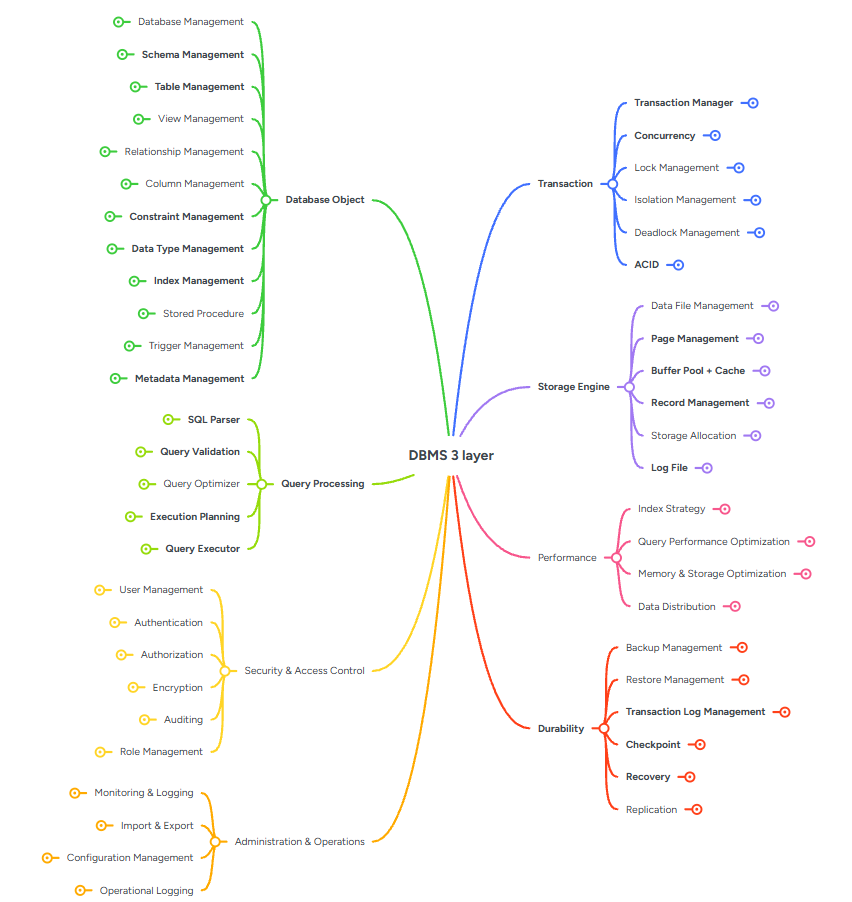

# DBMS

Python DBMS architecture project. The repository is currently at the class-design stage: selected core classes define their initial attributes and method stubs, while business logic has not been implemented yet.

---

## System Architecture & Design

### 1. Mindmap (Level 2 Overview)

The high-level visual representation of the subsystems within the Mini DBMS:



---

### 2. Class Diagram Overview

The architectural components and how they interact conceptually:

```mermaid
classDiagram
    direction TB

    class DatabaseServer {
        +server_id: str
        +version: str
        +status: str
        +start() bool
        +stop() bool
        +restart() bool
    }

    class DatabaseManager {
        +database_factory: DatabaseFactoryProtocol
        +storage: DatabaseStorageProtocol
        +databases: dict
        +create_database(name: str) Database
        +get_database(name: str) Database
        +drop_database(name: str) bool
        +rename_database(old_name: str, new_name: str) bool
    }

    class Database {
        +database_id: str
        +name: str
        +owner: str
        +status: str
        +page_size: int
        +encoding: str
        +storage_location: str
        +default_schema: str
        +storage: DatabaseStorageProtocol
        +backup_service: DatabaseBackupProtocol
        +schemas: dict
        +open() bool
        +close() bool
        +backup() bool
        +restore() bool
        +create_schema(schema: Schema) bool
        +get_schema(name: str) Schema
        +rename_schema(old_name: str, new_name: str) bool
        +drop_schema(name: str) bool
    }

    class CatalogManager {
        +metadata_cache: MetadataCacheProtocol
        +register_object(name: str, descriptor: object) bool
        +remove_object(name: str) bool
        +lookup_object(name: str) object
    }

    class Schema {
        +schema_id: str
        +name: str
        +owner: str
        +tables: dict
        +views: dict
        +stored_procedures: dict
        +create_table(table: Table) bool
        +get_table(name: str) Table
        +rename_table(old_name: str, new_name: str) bool
        +drop_table(name: str) bool
        +create_view(view: View) bool
        +get_view(name: str) View
        +drop_view(name: str) bool
        +create_stored_procedure(procedure: StoredProcedure) bool
        +get_stored_procedure(name: str) StoredProcedure
        +drop_stored_procedure(name: str) bool
    }

    class Table {
        +table_id: str
        +name: str
        +columns: list
        +row_count: int
        +rows: dict
        +constraints: list
        +indexes: list
        +partitions: list
        +insert(row: Row) bool
        +update(row_id: str, new_values: dict) bool
        +delete(row_id: str) bool
        +truncate() bool
        +check_key_exists(key: object) bool
        +add_column(column: Column) bool
        +get_column(name: str) Column
        +rename_column(old_name: str, new_name: str) bool
        +drop_column(name: str) bool
        +add_constraint(constraint: Constraint) bool
        +drop_constraint(name: str) bool
        +add_index(index: Index) bool
        +get_index(name: str) Index
        +drop_index(name: str) bool
        +add_partition(partition: Partition) bool
        +get_partition(name: str) Partition
        +drop_partition(name: str) bool
    }

    class Column {
        +column_id: str
        +name: str
        +data_type: DataType
        +nullable: bool
        +validate(value: object) bool
    }

    class Row {
        +row_id: str
        +values: list or dict
        +version: str
        +read() list or dict
        +update(new_values: list or dict) bool
    }

    class Constraint {
        +constraint_id: str
        +name: str
        +constraint_type: str
        +validation_rule: object
        +validate_row(row: Row) bool
    }

    class ForeignKey {
        +constraint_id: str
        +reference_table: Table
        +reference_column: str
        +on_delete: str
        +on_update: str
        +validate_reference(value: object) bool
    }

    class Index {
        +index_id: str
        +name: str
        +type: str
        +unique: bool
        +entries: dict
        +search(key: object) list
        +insert_key(key: object, rid: str) bool
        +delete_key(key: object, rid: str) bool
    }

    class Partition {
        +partition_id: str
        +name: str
        +range: object
        +storage_allocator: StorageAllocatorProtocol
        +allocate_space() bool
        +release_space() bool
    }

    class View {
        +view_id: str
        +name: str
        +query_definition: str
        +query_executor: QueryExecutorProtocol
        +cached_results: object
        +refresh() bool
    }

    class StoredProcedure {
        +procedure_id: str
        +name: str
        +query_plan: object
        +query_executor: QueryExecutorProtocol
        +execute() object
    }

    class DataType {
        +name: str
        +validator: Callable
        +converter: Callable
        +validate(value: object) bool
        +convert(value: object) object
    }

    class DataTypeManager {
        +data_types: dict
        +register_data_type(name: str, data_type: DataType) bool
        +validate_value(value: object, data_type_name: str) bool
        +convert_value(value: object, data_type_name: str) object
        +resolve_data_type(name: str) DataType
    }

    class Trigger {
        +name: str
        +event: str
        +table_name: str
        +callback: Callable
        +fire(row: object) bool
    }

    class TriggerManager {
        +triggers: dict
        +create_trigger(name: str, event: str, table_name: str, callback: Callable) Trigger
        +drop_trigger(name: str) bool
        +bind_event(event: str, callback: Callable) bool
        +execute_triggers(event: str, row: object) bool
    }

    class MetadataCacheProtocol {
        <<Protocol>>
        +set(name: str, descriptor: object) None
        +remove(name: str) None
        +get(name: str) object or None
    }

    class DatabaseStorageProtocol {
        <<Protocol>>
        +load_schema_metadata(database: object) object
        +flush_dirty_pages(database: object) None
        +delete_database_files(name: str) None
    }

    class DatabaseBackupProtocol {
        <<Protocol>>
        +create_backup(database: object) object
        +restore_backup(database: object) object
    }

    class StorageAllocatorProtocol {
        <<Protocol>>
        +allocate_space(partition: object) object
        +release_space(partition: object) None
    }

    class QueryExecutorProtocol {
        <<Protocol>>
        +execute(query_or_plan: object) object
    }

    class DatabaseFactoryProtocol {
        <<Protocol>>
        +create(name: str) Database
    }

    class DuplicateDatabaseError
    class UnknownDatabaseError
    class TriggerError
    class DuplicateTriggerError

    class StorageEngine {
        +page_size: int
        +initialize() bool
        +read_page(page_id: int) Page
        +write_page(page: Page) bool
    }

    class FileManager {
        +root_path: str
        +create_file(path: str) bool
        +read(file: object) bytes
        +write(file: object, data: bytes) bool
    }

    class Page {
        +page_id: int
        +checksum: int
        +read_tuple() object
        +write_tuple(tuple: object) bool
    }

    class BufferPool {
        +capacity: int
        +pin_page(page_id: int) Page
        +cache_page(page: Page) bool
        +flush_page(page_id: int) bool
        +flush_all_pages() bool
    }

    class TransactionManager {
        +begin_transaction() Transaction
        +commit(tx: Transaction) bool
        +rollback(tx: Transaction) bool
    }

    class Transaction {
        +transaction_id: str
        +isolation_level: str
        +state: str
    }

    class LockManager {
        +acquire_lock(tx: Transaction, resource: str, mode: str) bool
        +release_lock(tx: Transaction, resource: str) bool
    }

    class MVCCManager {
        +create_snapshot() object
        +read_visible_version(row: Row, tx: Transaction) Row
    }

    class WALManager {
        +current_lsn: int
        +append(record: object) bool
        +flush() bool
    }

    class RecoveryManager {
        +recover() bool
        +redo() bool
        +undo() bool
    }

    class SQLParser {
        +lexer: Lexer
        +parse(sql: str) object
    }

    class Lexer {
        +input_text: str
        +tokenize() list
    }

    class AST {
        +root_node: object
        +traverse() list
    }

    class QueryOptimizer {
        +rules: list
        +optimize(plan: LogicalPlan) PhysicalPlan
        +estimate_cost(plan: LogicalPlan) float
    }

    class LogicalPlan {
        +operators: list
        +build() bool
    }

    class PhysicalPlan {
        +operators: list
        +generate() bool
    }

    class QueryExecutor {
        +execution_plan: PhysicalPlan
        +execute(plan: PhysicalPlan) object
        +fetch() list
    }

    class StatisticsManager {
        +statistics: dict
        +collect() bool
        +update_histogram() bool
        +estimate_cardinality() float
    }

    class SecurityManager {
        +users: list
        +roles: list
        +authenticate() bool
        +authorize() bool
    }

    class User {
        +username: str
        +password_hash: str
        +verify_password(password: str) bool
    }

    class Role {
        +role_name: str
        +permissions: list
        +grant(permission: Permission) bool
        +revoke(permission: Permission) bool
    }

    class Permission {
        +resource: str
        +action: str
        +matches(other_resource: str, other_action: str) bool
    }

    class ReplicationManager {
        +replication_mode: str
        +replicas: list
        +replicate() bool
        +synchronize() bool
    }

    class ClusterNode {
        +node_id: str
        +address: str
        +ping() bool
    }

    class BackupManager {
        +backup_jobs: list
        +full_backup() bool
    }

    class MonitoringManager {
        +metrics: dict
        +collect_metrics() object
    }

    %% Relationships
    DatabaseServer *-- DatabaseManager
    DatabaseServer *-- TransactionManager
    DatabaseServer *-- StorageEngine
    DatabaseServer *-- CatalogManager
    DatabaseServer *-- SecurityManager
    DatabaseServer *-- SQLParser
    DatabaseServer *-- QueryOptimizer
    DatabaseServer *-- QueryExecutor
    DatabaseServer *-- RecoveryManager
    DatabaseServer *-- ReplicationManager
    DatabaseServer *-- BackupManager
    DatabaseServer *-- StatisticsManager
    DatabaseServer *-- MonitoringManager

    DatabaseManager o-- Database
    DatabaseManager --> DatabaseFactoryProtocol
    DatabaseManager --> DatabaseStorageProtocol
    Database --> DatabaseStorageProtocol
    Database --> DatabaseBackupProtocol
    Database *-- Schema
    Schema *-- Table
    Schema *-- View
    Schema *-- StoredProcedure
    Table *-- Column
    Table *-- Constraint
    Table *-- Index
    Table *-- Partition
    Column --> DataType
    DataTypeManager o-- DataType
    ForeignKey --|> Constraint
    ForeignKey --> Table
    CatalogManager --> MetadataCacheProtocol
    Partition --> StorageAllocatorProtocol
    StoredProcedure --> QueryExecutorProtocol
    View --> QueryExecutorProtocol
    TriggerManager o-- Trigger

    StorageEngine *-- BufferPool
    StorageEngine *-- FileManager
    BufferPool o-- Page
    
    TransactionManager *-- LockManager
    TransactionManager *-- MVCCManager
    TransactionManager *-- WALManager
    TransactionManager o-- Transaction
    WALManager <-- RecoveryManager

    SQLParser --> Lexer
    SQLParser --> AST
    AST --> LogicalPlan
    QueryOptimizer --> LogicalPlan
    QueryOptimizer --> PhysicalPlan
    QueryExecutor --> PhysicalPlan

    SecurityManager o-- User
    SecurityManager o-- Role
    Role o-- Permission

    ReplicationManager o-- ClusterNode
```



---

### 3. Core Classes

Below is the list of the main core classes designed for this system:

*   **Database Management**: `DatabaseServer`, `DatabaseManager`, `Database`
*   **Schema, Table & Column Metadata**: `CatalogManager`, `Schema`, `Table`, `Column`, `Row`, `Partition`, `View`, `StoredProcedure`, `DataType`, `Trigger`
*   **Constraints & Indexes**: `Constraint`, `ForeignKey`, `Index`
*   **Storage Engine**: `StorageEngine`, `FileManager`, `Page`, `BufferPool`
*   **Query Processing**: `SQLParser`, `Lexer`, `AST`, `QueryOptimizer`, `LogicalPlan`, `PhysicalPlan`, `QueryExecutor`
*   **Transactions & Concurrency (ACID)**: `TransactionManager`, `Transaction`, `LockManager`, `MVCCManager`
*   **Logging & Recovery (Durability)**: `WALManager`, `RecoveryManager`, `ReplicationManager`, `ClusterNode`, `BackupManager`
*   **Security & Access Control**: `SecurityManager`, `User`, `Role`, `Permission`
*   **Performance & Operations**: `StatisticsManager`, `MonitoringManager`

### 4. Architecture Boundary Rules

*   An **entity** stores its own state and implements behavior local to that object.
    For example, `Database` owns `open()`, `close()`, `backup()`, and `restore()`.
*   A **manager** owns a collection or coordinates the lifecycle of multiple objects.
    For example, `DatabaseManager` owns `create_database()`, `get_database()`,
    `rename_database()`, and `drop_database()`.
*   A manager must not repeat the local behavior of its entity. Entity/manager pairs
    from the previous Database Object architecture were removed when the core entity
    already owns that responsibility.
*   Lower-level helpers are retained only when they represent a separate layer, such
    as `PageManager` managing page allocation while `Page` represents one page.

Supporting classes used by the core architecture:

*   **Database Object**: `DataTypeManager`, `TriggerManager`
*   **Database Object dependency contracts**: `MetadataCacheProtocol`, `DatabaseStorageProtocol`, `DatabaseBackupProtocol`, `StorageAllocatorProtocol`, `QueryExecutorProtocol`, `DatabaseFactoryProtocol`
*   **Database Object errors**: `DuplicateDatabaseError`, `UnknownDatabaseError`, `TriggerError`, `DuplicateTriggerError`
*   **Storage Engine**: `PageManager`, `Record`, `RecordManager`, `StorageAllocator`, `LogFileManager`
*   **Query Processing**: `QueryProcessor`, `QueryValidator`, `ExecutionPlanner`, `Statement`, `SelectStatement`, `Token`, `TokenType`
*   **Transactions**: `IsolationManager`, `DeadlockManager`, `TransactionStatus`
*   **Durability**: `CheckpointManager`, `RestoreManager`, `LogRecord`
*   **Security & Access Control**: `UserManager`, `RoleManager`, `AuthenticationService`, `AuthorizationService`, `EncryptionService`, `AuditLogger`
*   **Administration & Operations**: `ConfigurationManager`, `ImportExportManager`, `OperationalLogger`

---

## Unit Tests by Core Component

Our testing strategy organizes unit tests around the core capabilities of the DBMS. The following lists the comprehensive suite of unit tests implemented so far:

### 1. Database Object (Schema, Metadata, & Management)
- `test_catalog_manager.py`
- `test_column.py`
- `test_constraint.py`
- `test_database.py`
- `test_database_manager.py`
- `test_database_server.py`
- `test_data_type.py`
- `test_data_type_manager.py`
- `test_dependencies.py`
- `test_exceptions.py`
- `test_foreign_key.py`
- `test_index.py`
- `test_partition.py`
- `test_row.py`
- `test_schema.py`
- `test_stored_procedure.py`
- `test_table.py`
- `test_trigger.py`
- `test_trigger_manager.py`
- `test_view.py`

### 2. Storage Engine
- `test_buffer_pool.py`
- `test_dependencies.py`
- `test_file_manager.py`
- `test_log_file_manager.py`
- `test_page.py`
- `test_page_manager.py`
- `test_record.py`
- `test_record_manager.py`
- `test_storage_allocator.py`
- `test_storage_engine.py`

### 3. Query Processing
- `test_ast.py`
- `test_execution_planner.py`
- `test_lexer.py`
- `test_logical_plan.py`
- `test_physical_plan.py`
- `test_query_executor.py`
- `test_query_optimizer.py`
- `test_query_processor.py`
- `test_query_validator.py`
- `test_select_statement.py`
- `test_sql_parser.py`
- `test_statement.py`
- `test_token.py`
- `test_token_type.py`

### 4. Transactions & Concurrency
- `test_deadlock_manager.py`
- `test_dependencies.py`
- `test_errors.py`
- `test_isolation_manager.py`
- `test_lock_manager.py`
- `test_mvcc_manager.py`
- `test_transaction.py`
- `test_transaction_manager.py`
- `test_transaction_status.py`

### 5. Durability (Logging & Recovery)
- `test_backup_manager.py`
- `test_checkpoint_manager.py`
- `test_cluster_node.py`
- `test_log_record.py`
- `test_recovery_manager.py`
- `test_replication_manager.py`
- `test_restore_manager.py`
- `test_wal_manager.py`

### 6. Security & Access Control
- `test_audit_logger.py`
- `test_authentication_service.py`
- `test_authorization_service.py`
- `test_encryption_service.py`
- `test_permission.py`
- `test_role.py`
- `test_role_manager.py`
- `test_security_manager.py`
- `test_user.py`
- `test_user_manager.py`

### 7. Performance
- `test_statistics_manager.py`

### 8. Administration & Operations
- `test_configuration_manager.py`
- `test_import_export_manager.py`
- `test_monitoring_manager.py`
- `test_operational_logger.py`

---

## Implementation Roadmap (Descending Order of Importance)

The development roadmap aligns with the top-down architecture design, starting from the core database management interfaces and metadata structures before diving into the lower-level execution and storage mechanics.

### Priority 1: Database Management Layer
*The entry point of the DBMS that manages the lifecycle of databases and server states.*
- `DatabaseServer` initialization and state management.
- `DatabaseManager` logic for creating, dropping, and retrieving databases.

### Priority 2: Schema, Table & Column Metadata (Data Dictionary)
*Defines the logical boundaries and structures of the data to be stored.*
- System catalogs and `CatalogManager` implementation.
- DDL logic for `Database`, `Schema`, `Table`, and `Column`.
- Data types handling (`DataTypeManager`) and triggers setup.

### Priority 3: Constraints & Indexes
*Maintains data integrity and optimizes access paths.*
- Primary, unique, and foreign key `Constraint` validations.
- `Index` structures for efficient record lookups.

### Priority 4: Storage Engine
*The physical storage layer responsible for translating logical data into bytes on disk.*
- Disk I/O management and `FileManager`.
- `Page` layout and `BufferPool` caching.
- Space allocation, `Record` and page management.

### Priority 5: Query Processing
*Allows users to interact with the database using SQL, processing requests and translating them into executable plans.*
- SQL parsing and AST construction (`SQLParser`, `Lexer`).
- Logical and physical plan generation (`QueryOptimizer`).
- Execution engine linking plans to the Storage layer (`QueryExecutor`).

### Priority 6: Transactions & Concurrency (ACID - Consistency & Isolation)
*Ensures that multiple concurrent operations do not corrupt data and maintain a consistent state.*
- `TransactionManager` and transaction lifecycle (Begin, Commit, Rollback).
- Concurrency control mechanisms (`LockManager`, `MVCCManager`).
- Deadlock detection and resolution.

### Priority 7: Logging & Recovery (Durability)
*Guarantees that committed data survives crashes and failures.*
- Write-Ahead Logging (`WALManager`) implementation.
- Checkpointing logic and crash recovery (`RecoveryManager`).
- Clustering and node replication (`ReplicationManager`).

### Priority 8: Security & Access Control
*Protects the data from unauthorized access.*
- User authentication and role-based access control (`SecurityManager`, `Role`).
- Granular permission validation for DML/DDL operations.

### Priority 9: Performance & Operations
*Optimizes the system and provides administrative tools.*
- Query cost estimation and `StatisticsManager`.
- Performance metric collection (`MonitoringManager`).
- Administrative and configuration operations.

---

## Installation & Running Tests

Ensure you have Python 3.10+ installed.

### 1. Install Dependencies

```bash
python -m pip install -r requirements-dev.txt
```

### 2. Run Tests

Run the current core class design tests:
```bash
python -m pytest -q
```
