# DBMS

Python DBMS architecture project. The repository is currently at the class-design stage: selected core classes define their initial attributes and method stubs, while business logic has not been implemented yet.

---

## 🧠 System Architecture & Design

### 1. Mindmap (Level 2 Overview)

The high-level visual representation of the subsystems within the Mini DBMS:


---

### 2. Class Diagram Overview

The architectural components and how they interact conceptually:

```mermaid
classDiagram
    direction TB

    class DatabaseServer {
        +server_id: str
        +version: str
        +status: str
        +start() bool
        +stop() bool
        +restart() bool
    }

    class DatabaseManager {
        +databases: dict
        +create_database(name: str) Database
        +get_database(name: str) Database
        +drop_database(name: str) bool
        +rename_database(old_name: str, new_name: str) bool
    }

    class Database {
        +database_id: str
        +name: str
        +owner: str
        +status: str
        +page_size: int
        +encoding: str
        +storage_location: str
        +default_schema: str
        +open() bool
        +close() bool
        +backup() bool
        +restore() bool
    }

    class CatalogManager {
        +metadata_cache: object
        +register_object(name: str, desc: object) bool
        +remove_object(name: str) bool
        +lookup_object(name: str) object
    }

    class Schema {
        +schema_id: str
        +name: str
        +owner: str
        +create_table(name: str) Table
        +drop_table(name: str) bool
    }

    class Table {
        +table_id: str
        +name: str
        +columns: list
        +row_count: int
        +insert(row: Row) bool
        +update(row_id: str, new_values: dict) bool
        +delete(row_id: str) bool
        +truncate() bool
    }

    class Column {
        +column_id: str
        +name: str
        +data_type: object
        +nullable: bool
        +validate(value: object) bool
    }

    class Row {
        +row_id: str
        +values: list
        +version: str
        +read() list
        +update(new_values: list) bool
    }

    class Constraint {
        +constraint_id: str
        +name: str
        +constraint_type: str
        +validate_row(row: Row) bool
    }

    class ForeignKey {
        +reference_table: Table
        +on_delete: str
        +on_update: str
        +validate_reference() bool
    }

    class Index {
        +index_id: str
        +name: str
        +type: str
        +unique: bool
        +search(key: object) list
        +insert_key(key: object, rid: str) bool
        +delete_key(key: object, rid: str) bool
    }

    class Partition {
        +partition_id: str
        +name: str
        +range: object
        +allocate_space() bool
        +release_space() bool
    }

    class View {
        +view_id: str
        +name: str
        +query_definition: str
        +create_view() bool
        +refresh() bool
    }

    class StoredProcedure {
        +procedure_id: str
        +name: str
        +execute() object
    }

    class StorageEngine {
        +page_size: int
        +initialize() bool
        +read_page(page_id: int) Page
        +write_page(page: Page) bool
    }

    class FileManager {
        +root_path: str
        +create_file(path: str) bool
        +read(file: object) bytes
        +write(file: object, data: bytes) bool
    }

    class Page {
        +page_id: int
        +checksum: int
        +read_tuple() object
        +write_tuple(tuple: object) bool
    }

    class BufferPool {
        +capacity: int
        +pin_page(page_id: int) Page
        +cache_page(page: Page) bool
        +flush_page(page_id: int) bool
        +flush_all_pages() bool
    }

    class TransactionManager {
        +begin_transaction() Transaction
        +commit(tx: Transaction) bool
        +rollback(tx: Transaction) bool
    }

    class Transaction {
        +transaction_id: str
        +isolation_level: str
        +state: str
    }

    class LockManager {
        +acquire_lock(tx: Transaction, resource: str, mode: str) bool
        +release_lock(tx: Transaction, resource: str) bool
    }

    class MVCCManager {
        +create_snapshot() object
        +read_visible_version(row: Row, tx: Transaction) Row
    }

    class WALManager {
        +current_lsn: int
        +append(record: object) bool
        +flush() bool
    }

    class RecoveryManager {
        +recover() bool
        +redo() bool
        +undo() bool
    }

    class SQLParser {
        +lexer: Lexer
        +parse(sql: str) object
    }

    class Lexer {
        +input_text: str
        +tokenize() list
    }

    class AST {
        +root_node: object
        +traverse() list
    }

    class QueryOptimizer {
        +rules: list
        +optimize(plan: LogicalPlan) PhysicalPlan
        +estimate_cost(plan: LogicalPlan) float
    }

    class LogicalPlan {
        +operators: list
        +build() bool
    }

    class PhysicalPlan {
        +operators: list
        +generate() bool
    }

    class QueryExecutor {
        +execution_plan: PhysicalPlan
        +execute(plan: PhysicalPlan) object
        +fetch() list
    }

    class StatisticsManager {
        +statistics: dict
        +collect() bool
        +update_histogram() bool
        +estimate_cardinality() float
    }

    class SecurityManager {
        +users: list
        +roles: list
        +authenticate() bool
        +authorize() bool
    }

    class User {
        +username: str
        +password_hash: str
        +verify_password(password: str) bool
    }

    class Role {
        +role_name: str
        +permissions: list
        +grant(permission: Permission) bool
        +revoke(permission: Permission) bool
    }

    class Permission {
        +resource: str
        +action: str
        +matches(other_resource: str, other_action: str) bool
    }

    class ReplicationManager {
        +replication_mode: str
        +replicas: list
        +replicate() bool
        +synchronize() bool
    }

    class ClusterNode {
        +node_id: str
        +address: str
        +ping() bool
    }

    class BackupManager {
        +backup_jobs: list
        +full_backup() bool
    }

    class MonitoringManager {
        +metrics: dict
        +collect_metrics() object
    }

    %% Relationships
    DatabaseServer *-- DatabaseManager
    DatabaseServer *-- TransactionManager
    DatabaseServer *-- StorageEngine
    DatabaseServer *-- CatalogManager
    DatabaseServer *-- SecurityManager
    DatabaseServer *-- SQLParser
    DatabaseServer *-- QueryOptimizer
    DatabaseServer *-- QueryExecutor
    DatabaseServer *-- RecoveryManager
    DatabaseServer *-- ReplicationManager
    DatabaseServer *-- BackupManager
    DatabaseServer *-- StatisticsManager
    DatabaseServer *-- MonitoringManager

    DatabaseManager o-- Database
    Database *-- Schema
    Schema *-- Table
    Schema *-- View
    Schema *-- StoredProcedure
    Table *-- Column
    Table *-- Constraint
    Table *-- Index
    Table *-- Partition
    ForeignKey --|> Constraint
    ForeignKey --> Table

    StorageEngine *-- BufferPool
    StorageEngine *-- FileManager
    BufferPool o-- Page
    
    TransactionManager *-- LockManager
    TransactionManager *-- MVCCManager
    TransactionManager *-- WALManager
    TransactionManager o-- Transaction
    WALManager <-- RecoveryManager

    SQLParser --> Lexer
    SQLParser --> AST
    AST --> LogicalPlan
    QueryOptimizer --> LogicalPlan
    QueryOptimizer --> PhysicalPlan
    QueryExecutor --> PhysicalPlan

    SecurityManager o-- User
    SecurityManager o-- Role
    Role o-- Permission

    ReplicationManager o-- ClusterNode
```



---

### 3. Core Classes

Below is the list of the 40 main core classes designed for this system:

*   **Database Management**: `DatabaseServer`, `DatabaseManager`, `Database`
*   **Schema, Table & Column Metadata**: `CatalogManager`, `Schema`, `Table`, `Column`, `Row`, `Partition`, `View`, `StoredProcedure`
*   **Constraints & Indexes**: `Constraint`, `ForeignKey`, `Index`
*   **Storage Engine**: `StorageEngine`, `FileManager`, `Page`, `BufferPool`
*   **Query Processing**: `SQLParser`, `Lexer`, `AST`, `QueryOptimizer`, `LogicalPlan`, `PhysicalPlan`, `QueryExecutor`
*   **Transactions & Concurrency (ACID)**: `TransactionManager`, `Transaction`, `LockManager`, `MVCCManager`
*   **Logging & Recovery (Durability)**: `WALManager`, `RecoveryManager`, `ReplicationManager`, `ClusterNode`, `BackupManager`
*   **Security & Access Control**: `SecurityManager`, `User`, `Role`, `Permission`
*   **Performance & Operations**: `StatisticsManager`, `MonitoringManager`

### 4. Architecture Boundary Rules

*   An **entity** stores its own state and implements behavior local to that object.
    For example, `Database` owns `open()`, `close()`, `backup()`, and `restore()`.
*   A **manager** owns a collection or coordinates the lifecycle of multiple objects.
    For example, `DatabaseManager` owns `create_database()`, `get_database()`,
    `rename_database()`, and `drop_database()`.
*   A manager must not repeat the local behavior of its entity. Entity/manager pairs
    from the previous Database Object architecture were removed when the core entity
    already owns that responsibility.
*   Lower-level helpers are retained only when they represent a separate layer, such
    as `PageManager` managing page allocation while `Page` represents one page.

Supporting classes used by the core architecture:

*   **Database Object**: `DataTypeManager`, `TriggerManager`
*   **Storage Engine**: `PageManager`, `Record`, `RecordManager`, `StorageAllocator`, `LogFileManager`
*   **Query Processing**: `QueryProcessor`, `QueryValidator`, `ExecutionPlanner`, `Statement`, `SelectStatement`, `Token`, `TokenType`
*   **Transactions**: `IsolationManager`, `DeadlockManager`, `TransactionStatus`
*   **Durability**: `CheckpointManager`, `RestoreManager`, `LogRecord`
*   **Security & Access Control**: `UserManager`, `RoleManager`, `AuthenticationService`, `AuthorizationService`, `EncryptionService`, `AuditLogger`
*   **Administration & Operations**: `ConfigurationManager`, `ImportExportManager`, `OperationalLogger`

---

## 🛠️ Installation & Running Tests

Ensure you have Python 3.10+ installed.

### 1. Install Dependencies

```bash
python -m pip install -r requirements-dev.txt
```

### 2. Run Tests

Run the current core class design tests:
```bash
python -m pytest -q
```
