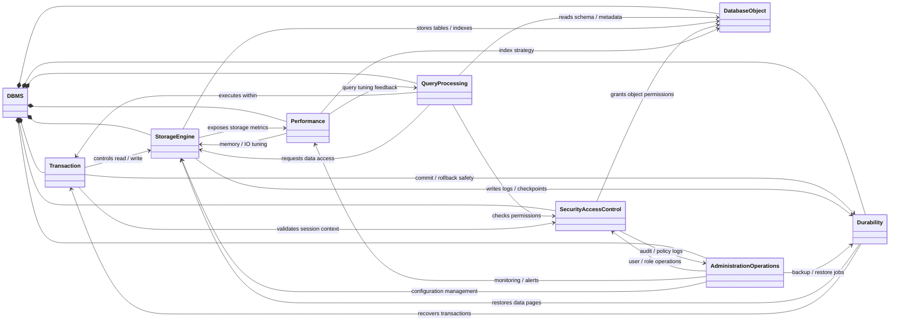
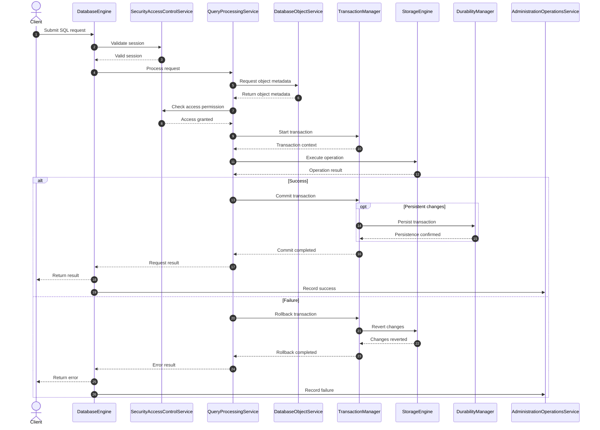

# Mini DBMS - Slotted-Page Database Management System

A Python-based lightweight Database Management System (DBMS) architecture featuring slotted-page storage engine, ACID transaction management with multiple isolation levels, cost-based query optimization, security access control, and recovery subsystems.

## 🚀 Current Status & Progress

The project is currently focused on **Database Management** (Schema, Table, Column, Index, Constraint definition and cataloging). 
* **Database Objects**: Fully integrated schema creation, index definition, and basic catalog updates.
* **Other Subsystems**: (Storage Engine, Transactions, Security, Query Processing, Durability) are initialized with core components or mock structures to facilitate end-to-end flow and unit/integration testing.

---

## 🧠 System Architecture & Design


### 1. Mindmap (Level 2 Overview)

The high-level visual representation of the subsystems within the Mini DBMS:


---

### 2. Class Diagram Overview


The architectural components and how they interact conceptually:




---

### 3. General Sequence Diagram (Execution Flow)


The end-to-end request processing flow, from query parsing, authentication, transaction boundaries, execution to persistence:




---

### 4. Database Object Sequence Diagrams

The complex database object management workflows have been decomposed into 4 focused sequence diagrams, located in `diagrams/db_object_sequences/`:

For detailed workflow diagrams, please refer to the **[Database Object Sequences Directory](diagrams/db_object_sequences/)**:

1. **[Database & Schema Provisioning](diagrams/db_object_sequences/seq_database_schema.mmd)**: Details the creation and registration of logical namespaces.
2. **[Table Definition Workflow](diagrams/db_object_sequences/seq_table.mmd)**: Orchestrates columns, data types, and constraint definitions.
3. **[Advanced Objects](diagrams/db_object_sequences/seq_view_proc_trig.mmd)**: The DDL workflows for Views, Stored Procedures, and Triggers.
4. **[Runtime Execution](diagrams/db_object_sequences/seq_runtime.mmd)**: Shows how data manipulation events interact with Triggers, Constraints, and Indexes.
---

### 5. Database Object Modules (Decomposed)

The **Database Object** domain has been fully decomposed into the following single-responsibility management modules, reflecting the design in the Level 5 Mindmap:

- **Database Management**: `DatabaseManager`, `DatabaseDescriptor`, `DatabaseConfiguration`, `DatabaseRegistry`
- **Schema Management**: `SchemaManager`, `SchemaDescriptor`, `SchemaCatalog`, `SchemaOwnershipPolicy`, `SchemaMigrationLedger`
- **Table Management**: `TableManager`, `TableDescriptor`, `TableOrganization`, `TableScope`
- **View Management**: `ViewManager`, `ViewDescriptor`, `ViewDependencyGraph`
- **Relationship Management**: `RelationshipManager`, `RelationshipDescriptor`, `ReferentialActionPolicy`
- **Column Management**: `ColumnManager`, `ColumnDescriptor`, `ColumnRuleSet`
- **Constraint Management**: `ConstraintManager`, `ConstraintDescriptor`, `ConstraintEnforcer`
- **Data Type Management**: `DataTypeManager`, `TypeValidator`, `TypeConverter`
- **Index Management**: `IndexManager`, `IndexDescriptor`, `IndexAccessMethod`, `IndexOrganization`, `IndexMaintainer`
- **Stored Procedure**: `StoredProcedureManager`, `ProcedureDescriptor`, `ProcedureExecutor`
- **Trigger Management**: `TriggerManager`, `TriggerDescriptor`, `TriggerEventBinding`, `TriggerExecutor`
- **Metadata Management**: `MetadataManager`, `SystemCatalog`, `DependencyManager`, `StatisticsManager`

---

## 🛠️ Installation & Running Tests

Ensure you have Python 3.10+ installed.

### 1. Install Dependencies
This project uses `pytest` for tests.
```bash
pip install pytest
```

### 2. Run Tests
Execute the unit and integration tests to verify the DBMS subsystems:
```bash
pytest
```
