# DBMS

Python DBMS architecture project. The repository is currently at the class-design stage: selected core classes define their initial attributes and method stubs, while business logic has not been implemented yet.

---

## System Architecture & Design

### 1. Mindmap (Level 2 Overview)

The high-level visual representation of the subsystems within the Mini DBMS:


---

### 2. Class Diagram Overview

The architectural components and how they interact conceptually:


```mermaid
classDiagram
    direction TB

    class DatabaseServer {
        +server_id: str
        +version: str
        +status: str
        +start() bool
        +stop() bool
        +restart() bool
    }

    class DatabaseManager {
        +database_factory: DatabaseFactoryProtocol
        +storage: DatabaseStorageProtocol
        +databases: dict
        +create_database(name: str) Database
        +get_database(name: str) Database
        +drop_database(name: str) bool
        +rename_database(old_name: str, new_name: str) bool
    }

    class Database {
        +database_id: str
        +name: str
        +owner: str
        +status: str
        +page_size: int
        +encoding: str
        +storage_location: str
        +default_schema: str
        +storage: DatabaseStorageProtocol
        +backup_service: DatabaseBackupProtocol
        +schemas: dict
        +open() bool
        +close() bool
        +backup() bool
        +restore() bool
        +create_schema(schema: Schema) bool
        +get_schema(name: str) Schema
        +rename_schema(old_name: str, new_name: str) bool
        +drop_schema(name: str) bool
    }

    class CatalogManager {
        +metadata_cache: MetadataCacheProtocol
        +register_object(name: str, descriptor: object) bool
        +remove_object(name: str) bool
        +lookup_object(name: str) object
    }

    class Schema {
        +schema_id: str
        +name: str
        +owner: str
        +tables: dict
        +views: dict
        +stored_procedures: dict
        +create_table(table: Table) bool
        +get_table(name: str) Table
        +rename_table(old_name: str, new_name: str) bool
        +drop_table(name: str) bool
        +create_view(view: View) bool
        +get_view(name: str) View
        +drop_view(name: str) bool
        +create_stored_procedure(procedure: StoredProcedure) bool
        +get_stored_procedure(name: str) StoredProcedure
        +drop_stored_procedure(name: str) bool
    }

    class Table {
        +table_id: str
        +name: str
        +columns: list
        +row_count: int
        +rows: dict
        +constraints: list
        +indexes: list
        +partitions: list
        +insert(row: Row) bool
        +update(row_id: str, new_values: dict) bool
        +delete(row_id: str) bool
        +truncate() bool
        +check_key_exists(key: object) bool
        +add_column(column: Column) bool
        +get_column(name: str) Column
        +rename_column(old_name: str, new_name: str) bool
        +drop_column(name: str) bool
        +add_constraint(constraint: Constraint) bool
        +drop_constraint(name: str) bool
        +add_index(index: Index) bool
        +get_index(name: str) Index
        +drop_index(name: str) bool
        +add_partition(partition: Partition) bool
        +get_partition(name: str) Partition
        +drop_partition(name: str) bool
    }

    class Column {
        +column_id: str
        +name: str
        +data_type: DataType
        +nullable: bool
        +validate(value: object) bool
    }

    class Row {
        +row_id: str
        +values: list or dict
        +version: str
        +read() list or dict
        +update(new_values: list or dict) bool
    }

    class Constraint {
        +constraint_id: str
        +name: str
        +constraint_type: str
        +validation_rule: object
        +strategy: ConstraintStrategy
        +set_strategy(strategy: ConstraintStrategy)
        +validate_row(row: Row, existing_rows: Iterable) bool
    }

    class ConstraintStrategy {
        <<abstract>>
        +validate(row: Row, existing_rows: Iterable) bool
    }

    class CheckStrategy {
        +validation_rule: Callable
        +validate(row: Row, existing_rows: Iterable) bool
    }

    class PrimaryKeyStrategy {
        +key_columns: tuple
        +validate(row: Row, existing_rows: Iterable) bool
    }

    class UniqueStrategy {
        +key_columns: tuple
        +validate(row: Row, existing_rows: Iterable) bool
    }

    class ForeignKeyStrategy {
        +foreign_key_column: str
        +referenced_keys: Set or Callable
        +validate(row: Row, existing_rows: Iterable) bool
        +cascade_delete(parent_key_value, child_rows) list
        +cascade_update(old_key_value, new_key_value, child_rows) int
    }

    class TableBuilder {
        +name: str
        +table_id: str
        +set_table_id(table_id: str) TableBuilder
        +add_column(name: str, data_type: DataType or DataTypeFactory or str) TableBuilder
        +add_column_object(column: Column) TableBuilder
        +add_constraint(constraint: Constraint) TableBuilder
        +add_index(index: Index) TableBuilder
        +build() Table
    }

    class ForeignKey {
        +constraint_id: str
        +reference_table: Table
        +reference_column: str
        +on_delete: str
        +on_update: str
        +validate_reference(value: object) bool
    }

    class Index {
        +index_id: str
        +name: str
        +type: str
        +unique: bool
        +entries: dict
        +columns: tuple
        +search(key: object) list
        +insert_key(key: object, rid: str) bool
        +delete_key(key: object, rid: str) bool
    }

    class BTreeIndex
    class HashIndex

    class IndexFactory {
        <<abstract>>
        +create_index(index_id: str, name: str, columns: Sequence, unique: bool) Index
    }

    class BTreeIndexFactory {
        +create_index(index_id: str, name: str, columns: Sequence, unique: bool) BTreeIndex
    }

    class HashIndexFactory {
        +create_index(index_id: str, name: str, columns: Sequence, unique: bool) HashIndex
    }

    class Partition {
        +partition_id: str
        +name: str
        +range: object
        +storage_allocator: StorageAllocatorProtocol
        +allocate_space() bool
        +release_space() bool
    }

    class View {
        +view_id: str
        +name: str
        +query_definition: str
        +query_executor: QueryExecutorProtocol
        +cached_results: object
        +refresh() bool
    }

    class StoredProcedure {
        +procedure_id: str
        +name: str
        +query_plan: object
        +query_executor: QueryExecutorProtocol
        +execute() object
    }

    class DataType {
        +name: str
        +validator: Callable
        +converter: Callable
        +validate(value: object) bool
        +convert(value: object) object
    }

    class DataTypeFactory {
        <<abstract>>
        +create_data_type() DataType
    }

    class IntegerDataTypeFactory {
        +create_data_type() DataType
    }

    class FloatDataTypeFactory {
        +create_data_type() DataType
    }

    class TextDataTypeFactory {
        +create_data_type() DataType
    }

    class DataTypeManager {
        +data_types: dict
        +register_data_type(name: str, data_type: DataType) bool
        +validate_value(value: object, data_type_name: str) bool
        +convert_value(value: object, data_type_name: str) object
        +resolve_data_type(name: str) DataType
    }

    class Trigger {
        +name: str
        +event: str
        +table_name: str
        +callback: Callable
        +fire(row: object) bool
    }

    class TriggerManager {
        +triggers: dict
        +create_trigger(name: str, event: str, table_name: str, callback: Callable) Trigger
        +drop_trigger(name: str) bool
        +bind_event(event: str, callback: Callable) bool
        +execute_triggers(event: str, row: object) bool
    }

    class MetadataCacheProtocol {
        <<Protocol>>
        +set(name: str, descriptor: object) None
        +remove(name: str) None
        +get(name: str) object or None
    }

    class DatabaseStorageProtocol {
        <<Protocol>>
        +load_schema_metadata(database: object) object
        +flush_dirty_pages(database: object) None
        +delete_database_files(name: str) None
    }

    class DatabaseBackupProtocol {
        <<Protocol>>
        +create_backup(database: object) object
        +restore_backup(database: object) object
    }

    class StorageAllocatorProtocol {
        <<Protocol>>
        +allocate_space(partition: object) object
        +release_space(partition: object) None
    }

    class QueryExecutorProtocol {
        <<Protocol>>
        +execute(query_or_plan: object) object
    }

    class DatabaseFactoryProtocol {
        <<Protocol>>
        +create(name: str) Database
    }

    class DuplicateDatabaseError
    class UnknownDatabaseError
    class TriggerError
    class DuplicateTriggerError

    class StorageEngine {
        +page_size: int
        +initialize() bool
        +read_page(page_id: int) Page
        +write_page(page: Page) bool
    }

    class FileManager {
        +root_path: str
        +create_file(path: str) bool
        +read(file: object) bytes
        +write(file: object, data: bytes) bool
    }

    class Page {
        +page_id: int
        +checksum: int
        +read_tuple() object
        +write_tuple(tuple: object) bool
    }

    class BufferPool {
        +capacity: int
        +pin_page(page_id: int) Page
        +cache_page(page: Page) bool
        +flush_page(page_id: int) bool
        +flush_all_pages() bool
    }

    class TransactionManager {
        +begin_transaction() Transaction
        +commit(tx: Transaction) bool
        +rollback(tx: Transaction) bool
    }

    class Transaction {
        +transaction_id: str
        +isolation_level: str
        +state: str
    }

    class LockManager {
        +acquire_lock(tx: Transaction, resource: str, mode: str) bool
        +release_lock(tx: Transaction, resource: str) bool
    }

    class MVCCManager {
        +create_snapshot() object
        +read_visible_version(row: Row, tx: Transaction) Row
    }

    class WALManager {
        +current_lsn: int
        +append(record: object) bool
        +flush() bool
    }

    class RecoveryManager {
        +recover() bool
        +redo() bool
        +undo() bool
    }

    class SQLParser {
        +lexer: Lexer
        +parse(sql: str) object
    }

    class Lexer {
        +input_text: str
        +tokenize() list
    }

    class AST {
        +root_node: object
        +traverse() list
    }

    class QueryOptimizer {
        +rules: list
        +optimize(plan: LogicalPlan) PhysicalPlan
        +estimate_cost(plan: LogicalPlan) float
    }

    class LogicalPlan {
        +operators: list
        +build() bool
    }

    class PhysicalPlan {
        +operators: list
        +generate() bool
    }

    class QueryExecutor {
        +execution_plan: PhysicalPlan
        +execute(plan: PhysicalPlan) object
        +fetch() list
    }

    class StatisticsManager {
        +statistics: dict
        +collect() bool
        +update_histogram() bool
        +estimate_cardinality() float
    }

    class SecurityManager {
        +users: list
        +roles: list
        +authenticate() bool
        +authorize() bool
    }

    class User {
        +username: str
        +password_hash: str
        +verify_password(password: str) bool
    }

    class Role {
        +role_name: str
        +permissions: list
        +grant(permission: Permission) bool
        +revoke(permission: Permission) bool
    }

    class Permission {
        +resource: str
        +action: str
        +matches(other_resource: str, other_action: str) bool
    }

    class ReplicationManager {
        +replication_mode: str
        +replicas: list
        +replicate() bool
        +synchronize() bool
    }

    class ClusterNode {
        +node_id: str
        +address: str
        +ping() bool
    }

    class BackupManager {
        +backup_jobs: list
        +full_backup() bool
    }

    class MonitoringManager {
        +metrics: dict
        +collect_metrics() object
    }

    %% Relationships
    DatabaseServer *-- DatabaseManager
    DatabaseServer *-- TransactionManager
    DatabaseServer *-- StorageEngine
    DatabaseServer *-- CatalogManager
    DatabaseServer *-- SecurityManager
    DatabaseServer *-- SQLParser
    DatabaseServer *-- QueryOptimizer
    DatabaseServer *-- QueryExecutor
    DatabaseServer *-- RecoveryManager
    DatabaseServer *-- ReplicationManager
    DatabaseServer *-- BackupManager
    DatabaseServer *-- StatisticsManager
    DatabaseServer *-- MonitoringManager

    DatabaseManager o-- Database
    DatabaseManager --> DatabaseFactoryProtocol
    DatabaseManager --> DatabaseStorageProtocol
    Database --> DatabaseStorageProtocol
    Database --> DatabaseBackupProtocol
    Database *-- Schema
    Schema *-- Table
    Schema *-- View
    Schema *-- StoredProcedure
    Table *-- Column
    Table *-- Constraint
    Table *-- Index
    Table *-- Partition
    Column --> DataType
    BTreeIndex --|> Index
    HashIndex --|> Index
    BTreeIndexFactory --|> IndexFactory
    HashIndexFactory --|> IndexFactory
    IndexFactory --> Index
    BTreeIndexFactory --> BTreeIndex
    HashIndexFactory --> HashIndex
    IntegerDataTypeFactory --|> DataTypeFactory
    FloatDataTypeFactory --|> DataTypeFactory
    TextDataTypeFactory --|> DataTypeFactory
    DataTypeFactory --> DataType
    DataTypeManager o-- DataType
    ForeignKey --|> Constraint
    ForeignKey --> Table
    Constraint --> ConstraintStrategy
    CheckStrategy --|> ConstraintStrategy
    PrimaryKeyStrategy --|> ConstraintStrategy
    UniqueStrategy --|> ConstraintStrategy
    ForeignKeyStrategy --|> ConstraintStrategy
    TableBuilder --> Table
    TableBuilder o-- Column
    TableBuilder o-- Constraint
    TableBuilder o-- Index
    TableBuilder --> DataTypeFactory
    CatalogManager --> MetadataCacheProtocol
    Partition --> StorageAllocatorProtocol
    StoredProcedure --> QueryExecutorProtocol
    View --> QueryExecutorProtocol
    TriggerManager o-- Trigger

    StorageEngine *-- BufferPool
    StorageEngine *-- FileManager
    BufferPool o-- Page
    
    TransactionManager *-- LockManager
    TransactionManager *-- MVCCManager
    TransactionManager *-- WALManager
    TransactionManager o-- Transaction
    WALManager <-- RecoveryManager

    SQLParser --> Lexer
    SQLParser --> AST
    AST --> LogicalPlan
    QueryOptimizer --> LogicalPlan
    QueryOptimizer --> PhysicalPlan
    QueryExecutor --> PhysicalPlan

    SecurityManager o-- User
    SecurityManager o-- Role
    Role o-- Permission

    ReplicationManager o-- ClusterNode
```

---

### 3. Implemented Database Object Class Diagrams

The diagrams for implemented Builder, Strategy, and Factory Method classes are maintained separately from this system overview:

- [Open the implemented Database Object class diagrams](docs/diagrams/class/database_object.md)

Only classes with executable behavior and unit tests appear in that document; planned components and method stubs remain out of scope.

### 4. Core Classes

Below is the list of the main core classes designed for this system:

*   **Database Management**: `DatabaseServer`, `DatabaseManager`, `Database`
*   **Schema, Table & Column Metadata**: `CatalogManager`, `Schema`, `Table`, `Column`, `Row`, `Partition`, `View`, `StoredProcedure`, `DataType`, `Trigger`
*   **Constraints & Indexes**: `Constraint`, `ForeignKey`, `Index`
*   **Storage Engine**: `StorageEngine`, `FileManager`, `Page`, `BufferPool`
*   **Query Processing**: `SQLParser`, `Lexer`, `AST`, `QueryOptimizer`, `LogicalPlan`, `PhysicalPlan`, `QueryExecutor`
*   **Transactions & Concurrency (ACID)**: `TransactionManager`, `Transaction`, `LockManager`, `MVCCManager`
*   **Logging & Recovery (Durability)**: `WALManager`, `RecoveryManager`, `ReplicationManager`, `ClusterNode`, `BackupManager`
*   **Security & Access Control**: `SecurityManager`, `User`, `Role`, `Permission`
*   **Performance & Operations**: `StatisticsManager`, `MonitoringManager`

### 5. Architecture Boundary Rules

*   An **entity** stores its own state and implements behavior local to that object.
    For example, `Database` owns `open()`, `close()`, `backup()`, and `restore()`.
*   A **manager** owns a collection or coordinates the lifecycle of multiple objects.
    For example, `DatabaseManager` owns `create_database()`, `get_database()`,
    `rename_database()`, and `drop_database()`.
*   A manager must not repeat the local behavior of its entity. Entity/manager pairs
    from the previous Database Object architecture were removed when the core entity
    already owns that responsibility.
*   Lower-level helpers are retained only when they represent a separate layer, such
    as `PageManager` managing page allocation while `Page` represents one page.

Supporting classes used by the core architecture:

*   **Database Object**: `DataTypeManager`, `TriggerManager`
*   **Database Object dependency contracts**: `MetadataCacheProtocol`, `DatabaseStorageProtocol`, `DatabaseBackupProtocol`, `StorageAllocatorProtocol`, `QueryExecutorProtocol`, `DatabaseFactoryProtocol`
*   **Database Object errors**: `DuplicateDatabaseError`, `UnknownDatabaseError`, `DuplicateSchemaError`, `UnknownSchemaError`, `DatabaseInUseError`, `TriggerError`, `DuplicateTriggerError`
*   **Storage Engine**: `PageManager`, `Record`, `RecordManager`, `StorageAllocator`, `LogFileManager`
*   **Query Processing**: `QueryProcessor`, `QueryValidator`, `ExecutionPlanner`, `Statement`, `SelectStatement`, `Token`, `TokenType`
*   **Transactions**: `IsolationManager`, `DeadlockManager`, `TransactionStatus`
*   **Durability**: `CheckpointManager`, `RestoreManager`, `LogRecord`
*   **Security & Access Control**: `UserManager`, `RoleManager`, `AuthenticationService`, `AuthorizationService`, `EncryptionService`, `AuditLogger`
*   **Administration & Operations**: `ConfigurationManager`, `ImportExportManager`, `OperationalLogger`

---

## Unit Tests by Core Component

Our testing strategy organizes unit tests around the core capabilities of the DBMS. The following lists the comprehensive suite of unit tests implemented so far:

### 1. Database Object (Schema, Metadata, & Management)
- `test_catalog_manager.py`
- `test_column.py`
- `test_constraint.py`
- `test_data_type.py`
- `test_data_type_factory.py`
- `test_data_type_manager.py`
- `test_database.py`
- `test_database_manager.py`
- `test_database_server.py`
- `test_foreign_key.py`
- `test_index.py`
- `test_index_factory.py`
- `test_partition.py`
- `test_row.py`
- `test_schema.py`
- `test_stored_procedure.py`
- `test_table.py`
- `test_table_builder.py`
- `test_trigger.py`
- `test_trigger_manager.py`
- `test_view.py`
- `test_view_builder.py`

### 2. Storage Engine
- `test_buffer_pool.py`
- `test_buffer_pool_singleton.py`
- `test_buffer_replacement_strategy.py`
- `test_dependencies.py`
- `test_file_manager.py`
- `test_log_file_manager.py`
- `test_page.py`
- `test_page_factory.py`
- `test_page_manager.py`
- `test_record.py`
- `test_record_manager.py`
- `test_record_mapper.py`
- `test_storage_allocator.py`
- `test_storage_engine.py`

### 3. Query Processing
- `test_ast.py`
- `test_execution_planner.py`
- `test_lexer.py`
- `test_logical_plan.py`
- `test_physical_plan.py`
- `test_query_executor.py`
- `test_query_optimizer.py`
- `test_query_processor.py`
- `test_query_validator.py`
- `test_select_statement.py`
- `test_sql_parser.py`
- `test_statement.py`
- `test_token.py`
- `test_token_type.py`

### 4. Transactions & Concurrency
- `test_deadlock_manager.py`
- `test_dependencies.py`
- `test_errors.py`
- `test_isolation_manager.py`
- `test_lock_manager.py`
- `test_mvcc_manager.py`
- `test_transaction.py`
- `test_transaction_manager.py`
- `test_transaction_status.py`

### 5. Durability (Logging & Recovery)
- `test_backup_manager.py`
- `test_checkpoint_manager.py`
- `test_cluster_node.py`
- `test_log_record.py`
- `test_recovery_manager.py`
- `test_replication_manager.py`
- `test_restore_manager.py`
- `test_wal_manager.py`

### 6. Security & Access Control
- `test_audit_logger.py`
- `test_authentication_service.py`
- `test_authorization_service.py`
- `test_encryption_service.py`
- `test_permission.py`
- `test_role.py`
- `test_role_manager.py`
- `test_security_manager.py`
- `test_user.py`
- `test_user_manager.py`

### 7. Performance
- `test_statistics_manager.py`

### 8. Administration & Operations
- `test_configuration_manager.py`
- `test_import_export_manager.py`
- `test_monitoring_manager.py`
- `test_operational_logger.py`

---

## Implementation Roadmap (Descending Order of Importance)

The development roadmap aligns with the top-down architecture design, starting from the core database management interfaces and metadata structures before diving into the lower-level execution and storage mechanics.

### Priority 1: Database Management Layer
*The entry point of the DBMS that manages the lifecycle of databases and server states.*
- `DatabaseServer` initialization and state management.
- `DatabaseManager` logic for creating, dropping, and retrieving databases.

### Priority 2: Schema, Table & Column Metadata (Data Dictionary)
*Defines the logical boundaries and structures of the data to be stored.*
- System catalogs and `CatalogManager` implementation.
- DDL logic for `Database`, `Schema`, `Table`, and `Column`.
- Data types handling (`DataTypeManager`) and triggers setup.

### Priority 3: Constraints & Indexes
*Maintains data integrity and optimizes access paths.*
- Primary, unique, and foreign key `Constraint` validations.
- `Index` structures for efficient record lookups.

### Priority 4: Storage Engine
*The physical storage layer responsible for translating logical data into bytes on disk.*
- Disk I/O management and `FileManager`.
- `Page` layout and `BufferPool` caching.
- Space allocation, `Record` and page management.

### Priority 5: Query Processing
*Allows users to interact with the database using SQL, processing requests and translating them into executable plans.*
- SQL parsing and AST construction (`SQLParser`, `Lexer`).
- Logical and physical plan generation (`QueryOptimizer`).
- Execution engine linking plans to the Storage layer (`QueryExecutor`).

### Priority 6: Transactions & Concurrency (ACID - Consistency & Isolation)
*Ensures that multiple concurrent operations do not corrupt data and maintain a consistent state.*
- `TransactionManager` and transaction lifecycle (Begin, Commit, Rollback).
- Concurrency control mechanisms (`LockManager`, `MVCCManager`).
- Deadlock detection and resolution.

### Priority 7: Logging & Recovery (Durability)
*Guarantees that committed data survives crashes and failures.*
- Write-Ahead Logging (`WALManager`) implementation.
- Checkpointing logic and crash recovery (`RecoveryManager`).
- Clustering and node replication (`ReplicationManager`).

### Priority 8: Security & Access Control
*Protects the data from unauthorized access.*
- User authentication and role-based access control (`SecurityManager`, `Role`).
- Granular permission validation for DML/DDL operations.

### Priority 9: Performance & Operations
*Optimizes the system and provides administrative tools.*
- Query cost estimation and `StatisticsManager`.
- Performance metric collection (`MonitoringManager`).
- Administrative and configuration operations.

---

## Core Modules & Applied Design Patterns

This section outlines the design patterns planned for the core modules, linking the sequence diagrams to the core classes and their unit tests. This ensures a structured development process.

| Module | Core Feature | Pattern | Target Classes | Status |
| :--- | :--- | :--- | :--- | :--- |
| **Database Objects** | Create Table | Builder | `TableBuilder`, `Table`, `Column`, `Constraint`, `Index` | Implemented |
| | Constraint Validation | Strategy | `ConstraintStrategy`, `CheckStrategy`, `PrimaryKeyStrategy`, `UniqueStrategy`, `ForeignKeyStrategy`, `Constraint`, `Table` | Implemented |
| | Index Creation | Factory Method | `IndexFactory`, `BTreeIndexFactory`, `HashIndexFactory`, `Index`, `BTreeIndex`, `HashIndex` | Implemented |
| | Database → Schema → Table Hierarchy | Composite | `Database`, `Schema`, `Table`, `View`, `StoredProcedure` | Implemented |
| | Metadata Management | Repository | `CatalogManager`, `MetadataCacheProtocol` | Implemented |
| | Data Type Creation | Factory Method | `DataTypeFactory`, `IntegerDataTypeFactory`, `FloatDataTypeFactory`, `TextDataTypeFactory`, `DataType`, `TableBuilder`, `Column` | Implemented |
| | View Creation | Builder | `ViewBuilder`, `View`, `AST`, `CatalogManager` | Implemented |
| **Storage Engine** | Buffer Replacement | [Strategy](docs/diagrams/sequence/design_patterns/storage_engine.md#4-strategy-buffer-replacement) | `BufferPool`, `BufferReplacementStrategy`, `FifoReplacementStrategy`, `LruReplacementStrategy`, `Page` | Implemented |
| | Page Allocation | [Factory Method](docs/diagrams/sequence/design_patterns/storage_engine.md#6-factory-method-page-allocation) | `PageFactory`, `DataPageFactory`, `IndexPageFactory`, `Page`, `DataPage`, `IndexPage` | Implemented |
| | File Access | [Adapter](docs/diagrams/sequence/design_patterns/storage_engine.md#2-adapter-file-access) | `FileManager`, `PageStoreProtocol`, `Page` | Implemented |
| | Buffer Pool Management | [Singleton](docs/diagrams/sequence/design_patterns/storage_engine.md#5-singleton-pattern-buffer-pool-management) | `BufferPool` | Implemented |
| | Record Read/Write | [Data Mapper](docs/diagrams/sequence/design_patterns/storage_engine.md#1-data-mapper-record-readwrite) | `RecordMapper`, `RecordManager`, `PageManager`, `Page`, `Record`, `Row` | Implemented |
| | Storage Allocation | Strategy | `StorageEngine`, `FileManager`, `Partition` | Planned |
| | Page Loading | [Proxy](docs/diagrams/sequence/design_patterns/storage_engine.md#3-proxy-page-loading) | `BufferPool`, `PageStoreProtocol`, `FileManager`, `Page` | Implemented |
| **Query Processing** | SQL Parsing | Interpreter | `SQLParser`, `Lexer`, `AST` | Planned |
| | AST Construction | Builder | `SQLParser`, `AST` | Planned |
| | AST Traversal | Visitor | `AST`, `QueryOptimizer`, `QueryExecutor` | Planned |
| | Query Validation | Chain of Responsibility | `AST`, `CatalogManager`, `Schema`, `Table`, `Column` | Planned |
| | Query Optimization | Strategy | `QueryOptimizer`, `LogicalPlan`, `PhysicalPlan` | Planned |
| | Execution Plan Creation | Factory Method | `LogicalPlan`, `PhysicalPlan`, `QueryOptimizer` | Planned |
| | Query Execution Pipeline | Chain of Responsibility | `QueryExecutor`, `PhysicalPlan` | Planned |
| | Execution Operators | Iterator | `QueryExecutor`, `PhysicalPlan`, `Row` | Planned |

### Design Patterns Deep Dive

#### 1. Database Objects

**Builder Pattern (Create Table)**

##### Class Diagram
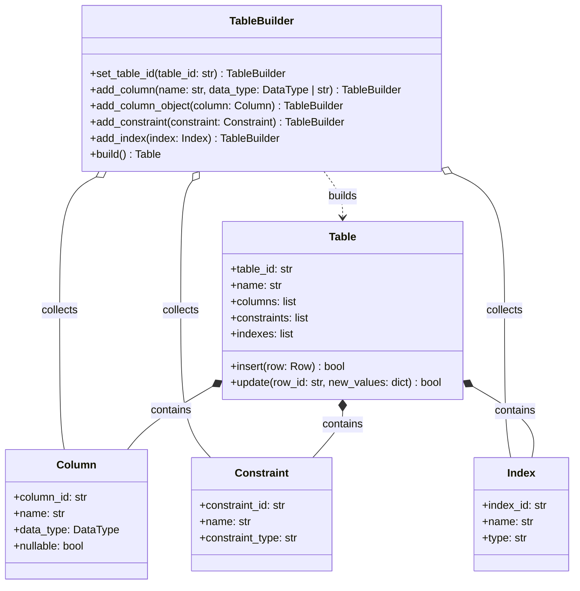
```mermaid
classDiagram
    direction TB

    class TableBuilder {
        +set_table_id(table_id: str) TableBuilder
        +add_column(name: str, data_type: DataType | str) TableBuilder
        +add_column_object(column: Column) TableBuilder
        +add_constraint(constraint: Constraint) TableBuilder
        +add_index(index: Index) TableBuilder
        +build() Table
    }

    class Table {
        +table_id: str
        +name: str
        +columns: list
        +constraints: list
        +indexes: list
        +insert(row: Row) bool
        +update(row_id: str, new_values: dict) bool
    }

    class Column {
        +column_id: str
        +name: str
        +data_type: DataType
        +nullable: bool
    }

    class Constraint {
        +constraint_id: str
        +name: str
        +constraint_type: str
    }

    class Index {
        +index_id: str
        +name: str
        +type: str
    }

    TableBuilder ..> Table : builds
    TableBuilder o-- Column : collects
    TableBuilder o-- Constraint : collects
    TableBuilder o-- Index : collects
    Table *-- Column : contains
    Table *-- Constraint : contains
    Table *-- Index : contains
```

##### Sequence Diagram
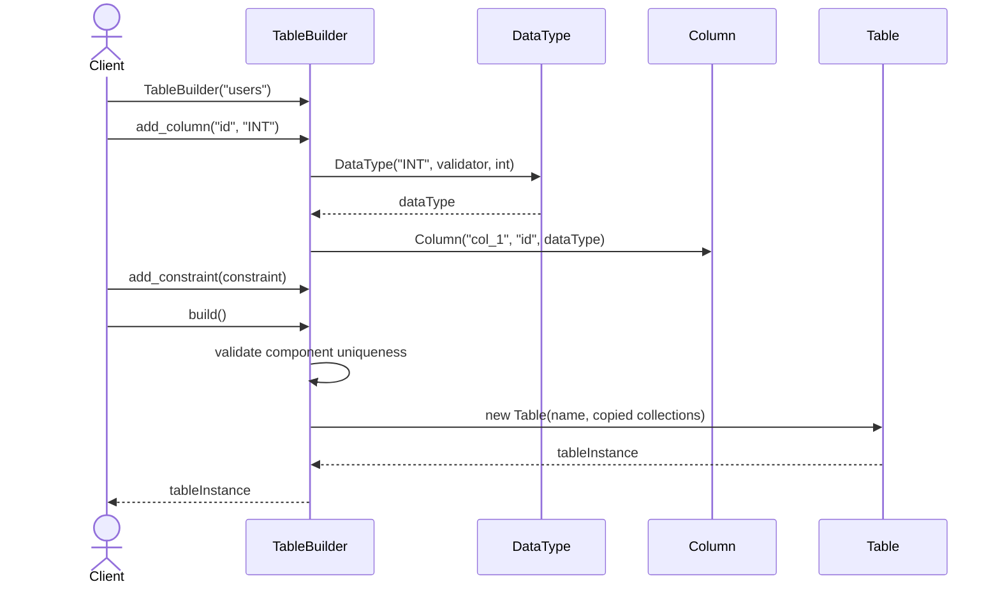
```mermaid
sequenceDiagram
    actor Client
    participant TableBuilder
    participant DataType
    participant Column
    participant Table

    Client->>TableBuilder: TableBuilder("users")
    Client->>TableBuilder: add_column("id", "INT")
    TableBuilder->>DataType: DataType("INT", validator, int)
    DataType-->>TableBuilder: dataType
    TableBuilder->>Column: Column("col_1", "id", dataType)
    Client->>TableBuilder: add_constraint(constraint)
    Client->>TableBuilder: build()
    TableBuilder->>TableBuilder: validate component uniqueness
    TableBuilder->>Table: new Table(name, copied collections)
    Table-->>TableBuilder: tableInstance
    TableBuilder-->>Client: tableInstance
```

* **Description**: Separates the construction of a complex object from its representation, allowing the same construction process to create various representations.
* **Use Case**: Creating a `Table` with multiple attributes (columns, data types, constraints).
* **Advantages**:
  * **Prevents Parameter Confusion:** Avoids forcing callers to pass an overwhelming list of parameters or `None`/`null` values when building tables with varying complexity.
  * **Flexible Step-by-Step Construction:** Allows parsing SQL statements incrementally and attaching columns or constraints one by one before final object instantiation.
  * **Validates Builder State:** Rejects empty names and duplicate columns, constraints, or indexes; `.build()` rechecks collection uniqueness before creating the table.
  * **Keeps Built Tables Independent:** Copies builder collections so later builder changes, or changes to another built table, do not mutate an existing table.
* **Reason**: A `TableBuilder` provides a fluent API for optional columns, constraints, and indexes without exposing the `Table` constructor's collection details.

**Strategy Pattern (Constraint Validation)**

##### Class Diagram
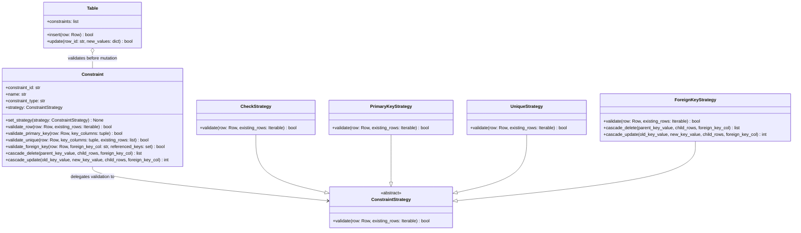
```mermaid
classDiagram
    direction TB

    class Table {
        +constraints: list
        +insert(row: Row) bool
        +update(row_id: str, new_values: dict) bool
    }

    class Constraint {
        +constraint_id: str
        +name: str
        +constraint_type: str
        +strategy: ConstraintStrategy
        +set_strategy(strategy: ConstraintStrategy) None
        +validate_row(row: Row, existing_rows: Iterable) bool
        +validate_primary_key(row: Row, key_columns: tuple) bool
        +validate_unique(row: Row, key_columns: tuple, existing_rows: list) bool
        +validate_foreign_key(row: Row, foreign_key_col: str, referenced_keys: set) bool
        +cascade_delete(parent_key_value, child_rows, foreign_key_col) list
        +cascade_update(old_key_value, new_key_value, child_rows, foreign_key_col) int
    }

    class ConstraintStrategy {
        <<abstract>>
        +validate(row: Row, existing_rows: Iterable) bool
    }

    class CheckStrategy {
        +validate(row: Row, existing_rows: Iterable) bool
    }

    class PrimaryKeyStrategy {
        +validate(row: Row, existing_rows: Iterable) bool
    }

    class UniqueStrategy {
        +validate(row: Row, existing_rows: Iterable) bool
    }

    class ForeignKeyStrategy {
        +validate(row: Row, existing_rows: Iterable) bool
        +cascade_delete(parent_key_value, child_rows, foreign_key_col) list
        +cascade_update(old_key_value, new_key_value, child_rows, foreign_key_col) int
    }

    Table o-- Constraint : validates before mutation
    Constraint --> ConstraintStrategy : delegates validation to
    CheckStrategy --|> ConstraintStrategy
    PrimaryKeyStrategy --|> ConstraintStrategy
    UniqueStrategy --|> ConstraintStrategy
    ForeignKeyStrategy --|> ConstraintStrategy
```

##### Sequence Diagram
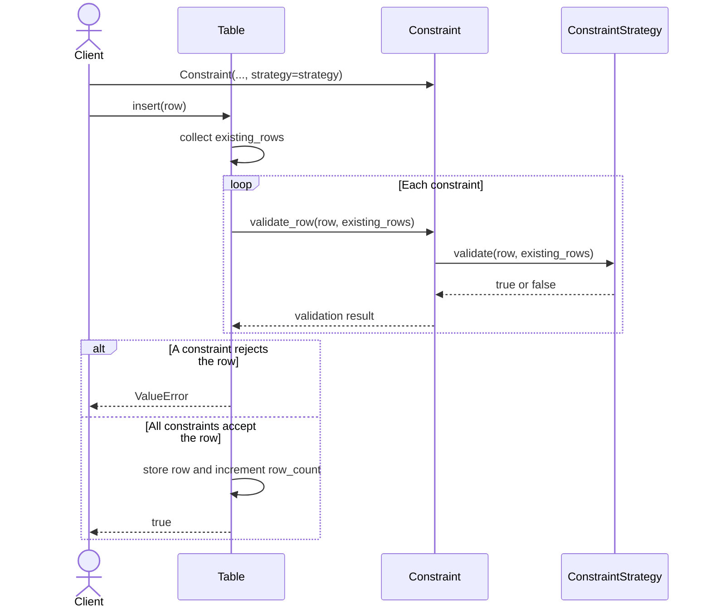
```mermaid
sequenceDiagram
    actor Client
    participant Table
    participant Constraint
    participant ConstraintStrategy

    Client->>Constraint: Constraint(..., strategy=strategy)
    Client->>Table: insert(row)
    Table->>Table: collect existing_rows
    loop Each constraint
        Table->>Constraint: validate_row(row, existing_rows)
        Constraint->>ConstraintStrategy: validate(row, existing_rows)
        ConstraintStrategy-->>Constraint: true or false
        Constraint-->>Table: validation result
    end
    alt A constraint rejects the row
        Table-->>Client: ValueError
    else All constraints accept the row
        Table->>Table: store row and increment row_count
        Table-->>Client: true
    end
```

* **Description**: Defines a family of algorithms, encapsulates each one, and makes them interchangeable.
* **Use Case**: Validating rows with injected `CheckStrategy`, `PrimaryKeyStrategy`, `UniqueStrategy`, or `ForeignKeyStrategy` before insert/update mutation.
* **Advantages**:
  * **One Interchangeable Contract:** Every concrete strategy implements `validate(row, existing_rows=...)` through `ConstraintStrategy`.
  * **Runtime Replacement:** `Constraint.set_strategy()` can replace the validation algorithm without changing `Table`.
  * **Easy to Extend:** A new rule only needs another `ConstraintStrategy` implementation; `Table` continues calling the same context API.
  * **Isolated Unit Testing:** Enables testing each validation rule independently (e.g., verifying Primary Key rules separately from Foreign Key rules).
* **Reason**: `Table` owns when validation happens, `Constraint` acts as the Strategy context, and each concrete strategy owns one validation algorithm. Invalid rows are rejected before table state changes.

**Factory Method (Index & DataType Creation)**

##### Class Diagram
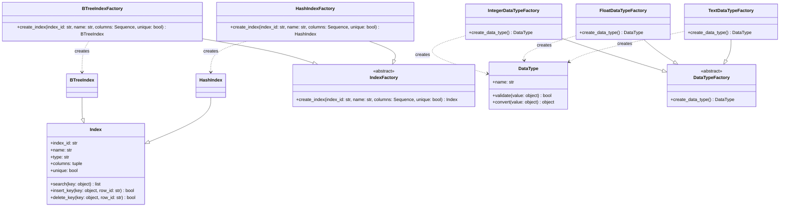
```mermaid
classDiagram
    direction TB

    class Index {
        +index_id: str
        +name: str
        +type: str
        +columns: tuple
        +unique: bool
        +search(key: object) list
        +insert_key(key: object, row_id: str) bool
        +delete_key(key: object, row_id: str) bool
    }

    class BTreeIndex
    class HashIndex

    class IndexFactory {
        <<abstract>>
        +create_index(index_id: str, name: str, columns: Sequence, unique: bool) Index
    }

    class BTreeIndexFactory {
        +create_index(index_id: str, name: str, columns: Sequence, unique: bool) BTreeIndex
    }

    class HashIndexFactory {
        +create_index(index_id: str, name: str, columns: Sequence, unique: bool) HashIndex
    }

    class DataType {
        +name: str
        +validate(value: object) bool
        +convert(value: object) object
    }

    class DataTypeFactory {
        <<abstract>>
        +create_data_type() DataType
    }

    class IntegerDataTypeFactory {
        +create_data_type() DataType
    }

    class FloatDataTypeFactory {
        +create_data_type() DataType
    }

    class TextDataTypeFactory {
        +create_data_type() DataType
    }

    BTreeIndex --|> Index
    HashIndex --|> Index
    BTreeIndexFactory --|> IndexFactory
    HashIndexFactory --|> IndexFactory
    BTreeIndexFactory ..> BTreeIndex : creates
    HashIndexFactory ..> HashIndex : creates
    IntegerDataTypeFactory --|> DataTypeFactory
    FloatDataTypeFactory --|> DataTypeFactory
    TextDataTypeFactory --|> DataTypeFactory
    IntegerDataTypeFactory ..> DataType : creates
    FloatDataTypeFactory ..> DataType : creates
    TextDataTypeFactory ..> DataType : creates
```

##### Sequence Diagram
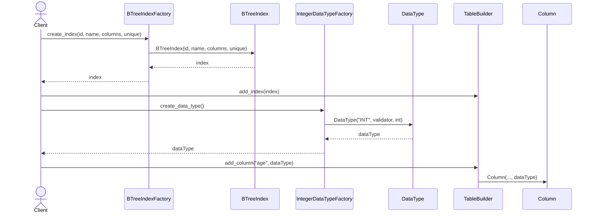
```mermaid
sequenceDiagram
    actor Client
    participant BTreeIndexFactory
    participant BTreeIndex
    participant IntegerDataTypeFactory
    participant DataType
    participant TableBuilder
    participant Column

    Client->>BTreeIndexFactory: create_index(id, name, columns, unique)
    BTreeIndexFactory->>BTreeIndex: BTreeIndex(id, name, columns, unique)
    BTreeIndex-->>BTreeIndexFactory: index
    BTreeIndexFactory-->>Client: index
    Client->>TableBuilder: add_index(index)
    Client->>IntegerDataTypeFactory: create_data_type()
    IntegerDataTypeFactory->>DataType: DataType("INT", validator, int)
    DataType-->>IntegerDataTypeFactory: dataType
    IntegerDataTypeFactory-->>Client: dataType
    Client->>TableBuilder: add_column("age", dataType)
    TableBuilder->>Column: Column(..., dataType)
```

* **Description**: Defines a creator interface while concrete factories decide which product class to instantiate.
* **Use Case**: The client chooses `BTreeIndexFactory` or `HashIndexFactory` for an index, and a concrete data-type factory for a configured `DataType` used by `TableBuilder`.
* **Advantages**:
  * **Encapsulates Instantiation Details:** The caller calls one factory method and receives the common `Index` or `DataType` abstraction.
  * **Supports Extension:** A new index or data type adds a product and its concrete factory without changing `TableBuilder`.
  * **Preserves Product State:** Factory-created indexes copy the supplied column collection before exposing it as immutable tuple metadata.
* **Reason**: `IndexFactory` and `DataTypeFactory` supply the common creation contract; their concrete subclasses choose the concrete product. `TableBuilder` accepts the resulting `Index` and `DataType` without knowing which concrete factory created them.

**Composite Pattern (Database Hierarchy)**

##### Class Diagram
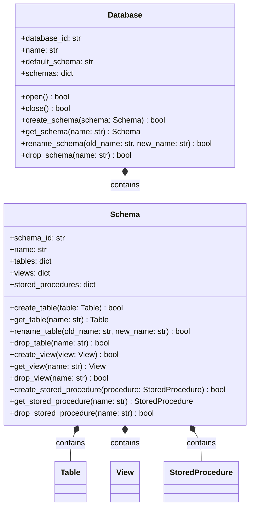
```mermaid
classDiagram
    direction TB

    class Database {
        +database_id: str
        +name: str
        +default_schema: str
        +schemas: dict
        +open() bool
        +close() bool
        +create_schema(schema: Schema) bool
        +get_schema(name: str) Schema
        +rename_schema(old_name: str, new_name: str) bool
        +drop_schema(name: str) bool
    }

    class Schema {
        +schema_id: str
        +name: str
        +tables: dict
        +views: dict
        +stored_procedures: dict
        +create_table(table: Table) bool
        +get_table(name: str) Table
        +rename_table(old_name: str, new_name: str) bool
        +drop_table(name: str) bool
        +create_view(view: View) bool
        +get_view(name: str) View
        +drop_view(name: str) bool
        +create_stored_procedure(procedure: StoredProcedure) bool
        +get_stored_procedure(name: str) StoredProcedure
        +drop_stored_procedure(name: str) bool
    }

    class Table
    class View
    class StoredProcedure

    Database *-- Schema : contains
    Schema *-- Table : contains
    Schema *-- View : contains
    Schema *-- StoredProcedure : contains
```

##### Sequence Diagram
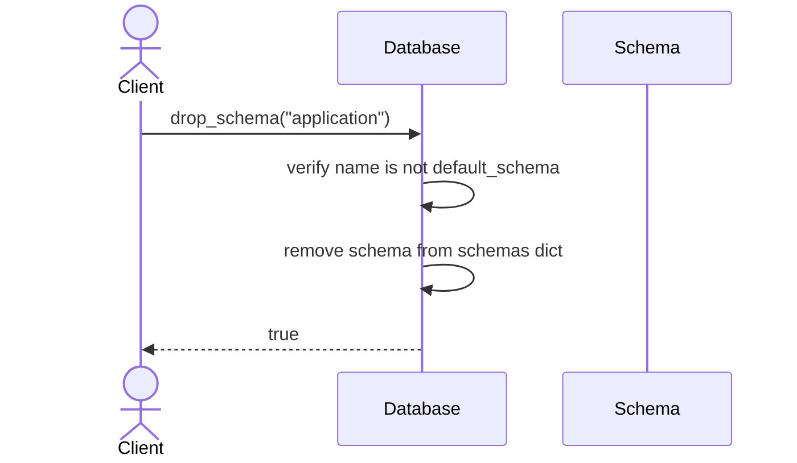
```mermaid
sequenceDiagram
    actor Client
    participant Database
    participant Schema

    Client->>Database: drop_schema("application")
    Database->>Database: verify name is not default_schema
    Database->>Database: remove schema from schemas dict
    Database-->>Client: true
```

* **Description**: Organizes `Database`, `Schema`, and child objects into a hierarchy for schema and component management.
* **Use Case**: `Database` manages `Schema` objects; each `Schema` manages its `Table`, `View`, and `StoredProcedure` collections.
* **Advantages**:
  * **Clear Ownership:** Each level owns only its direct child collection and exposes typed create, lookup, rename, and drop operations.
  * **Consistent Lookup Rules:** `Database` uses domain-specific schema exceptions; `Schema` uses the same duplicate and missing-name rules for its leaf collections.
  * **Safe Default Schema:** Renaming the default schema updates its name, while dropping it is rejected.
* **Reason**: The hierarchy keeps catalog ownership local: `Database` manages schemas, while each schema manages its own table, view, and stored-procedure metadata. Dropping a schema removes that direct association; leaf lifecycle cascade is not implemented.

**Repository Pattern (Metadata Management)**

##### Class Diagram
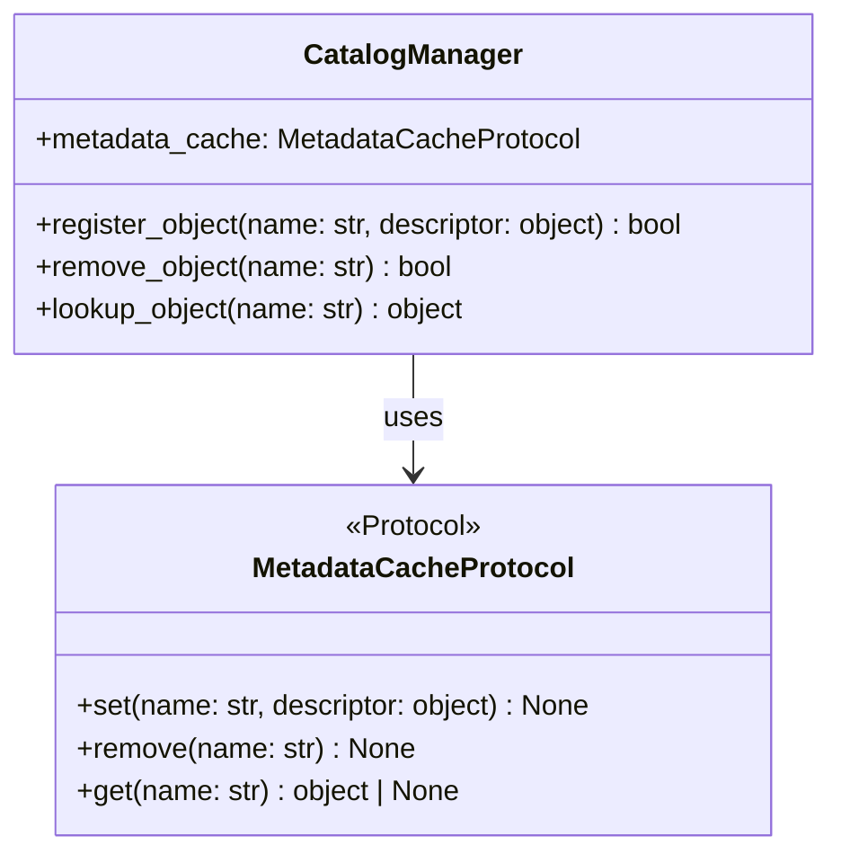
```mermaid
classDiagram
    direction TB

    class CatalogManager {
        +metadata_cache: MetadataCacheProtocol
        +register_object(name: str, descriptor: object) bool
        +remove_object(name: str) bool
        +lookup_object(name: str) object
    }

    class MetadataCacheProtocol {
        <<Protocol>>
        +set(name: str, descriptor: object) None
        +remove(name: str) None
        +get(name: str) object | None
    }

    CatalogManager --> MetadataCacheProtocol : uses
```

##### Sequence Diagram
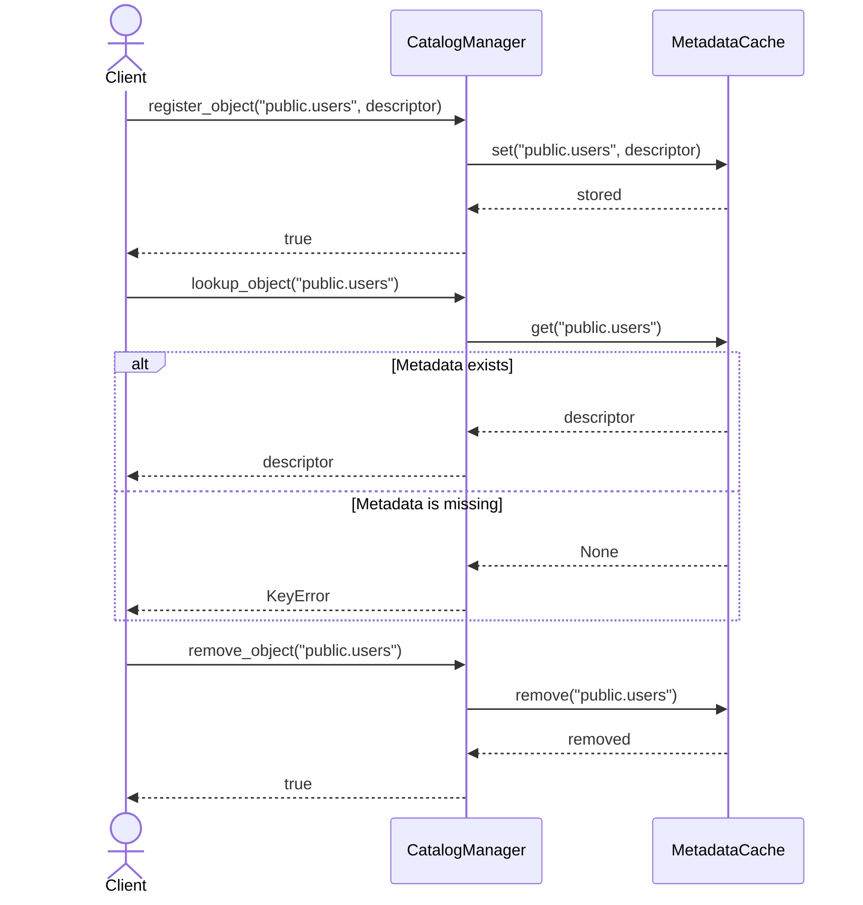
```mermaid
sequenceDiagram
    actor Client
    participant CatalogManager
    participant MetadataCache

    Client->>CatalogManager: register_object("public.users", descriptor)
    CatalogManager->>MetadataCache: set("public.users", descriptor)
    MetadataCache-->>CatalogManager: stored
    CatalogManager-->>Client: true

    Client->>CatalogManager: lookup_object("public.users")
    CatalogManager->>MetadataCache: get("public.users")
    alt Metadata exists
        MetadataCache-->>CatalogManager: descriptor
        CatalogManager-->>Client: descriptor
    else Metadata is missing
        MetadataCache-->>CatalogManager: None
        CatalogManager-->>Client: KeyError
    end

    Client->>CatalogManager: remove_object("public.users")
    CatalogManager->>MetadataCache: remove("public.users")
    MetadataCache-->>CatalogManager: removed
    CatalogManager-->>Client: true
```

* **Description**: Provides a single API for storing, retrieving, and removing catalog metadata through an injected cache abstraction.
* **Use Case**: Callers manage a descriptor such as `"public.users"` without depending on the cache implementation.
* **Advantages**:
  * **Decouples Storage:** `CatalogManager` calls only the `MetadataCacheProtocol` contract.
  * **Keeps Lookup Semantics Clear:** A missing descriptor becomes `KeyError`, while backend duplicate or missing-remove errors are propagated.
* **Reason**: `CatalogManager` acts as the Repository facade; the cache remains replaceable behind the protocol.

**Builder Pattern (View Creation)**

##### Class Diagram
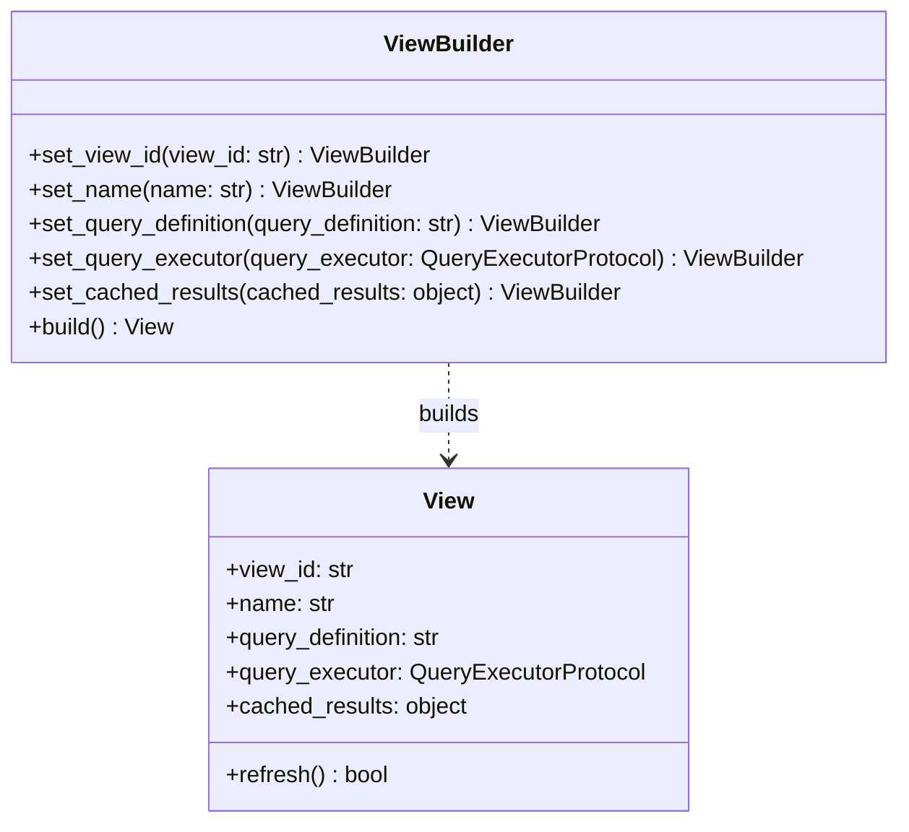
```mermaid
classDiagram
    direction TB

    class ViewBuilder {
        +set_view_id(view_id: str) ViewBuilder
        +set_name(name: str) ViewBuilder
        +set_query_definition(query_definition: str) ViewBuilder
        +set_query_executor(query_executor: QueryExecutorProtocol) ViewBuilder
        +set_cached_results(cached_results: object) ViewBuilder
        +build() View
    }

    class View {
        +view_id: str
        +name: str
        +query_definition: str
        +query_executor: QueryExecutorProtocol
        +cached_results: object
        +refresh() bool
    }

    ViewBuilder ..> View : builds
```

##### Sequence Diagram
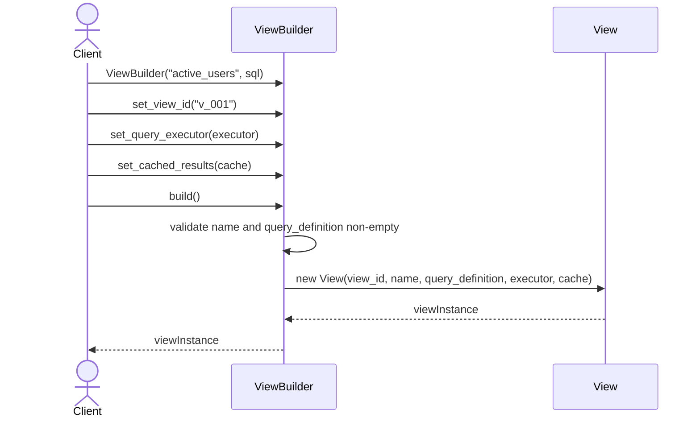
```mermaid
sequenceDiagram
    actor Client
    participant ViewBuilder
    participant View

    Client->>ViewBuilder: ViewBuilder("active_users", sql)
    Client->>ViewBuilder: set_view_id("v_001")
    Client->>ViewBuilder: set_query_executor(executor)
    Client->>ViewBuilder: set_cached_results(cache)
    Client->>ViewBuilder: build()
    ViewBuilder->>ViewBuilder: validate name and query_definition non-empty
    ViewBuilder->>View: new View(view_id, name, query_definition, executor, cache)
    View-->>ViewBuilder: viewInstance
    ViewBuilder-->>Client: viewInstance
```

* **Description**: Separates the multi-step construction of a `View` object from its representation, validating query parameters before object instantiation.
* **Use Case**: Constructing a `View` with custom query definitions, executors, and cached results.
* **Advantages**:
  * **Flexible Construction:** Provides a fluent interface for configuring optional parameters (`view_id`, `query_executor`, `cached_results`).
  * **Validation Before Creation:** Ensures view name and query definition are valid and non-empty prior to creating the `View` instance.
* **Reason**: A `ViewBuilder` encapsulates view creation rules cleanly without polluting the `View` domain entity constructor.

#### 2. Storage Engine

**Strategy Pattern (Buffer Replacement)**

##### Class Diagram
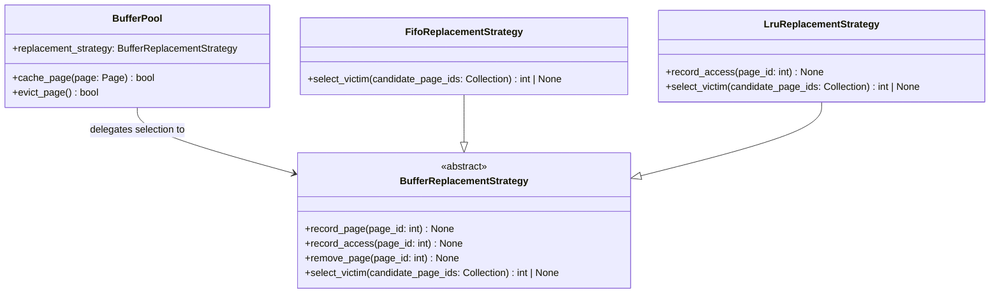
```mermaid
classDiagram
    direction TB

    class BufferPool {
        +replacement_strategy: BufferReplacementStrategy
        +cache_page(page: Page) bool
        +evict_page() bool
    }

    class BufferReplacementStrategy {
        <<abstract>>
        +record_page(page_id: int) None
        +record_access(page_id: int) None
        +remove_page(page_id: int) None
        +select_victim(candidate_page_ids: Collection) int | None
    }

    class FifoReplacementStrategy {
        +select_victim(candidate_page_ids: Collection) int | None
    }

    class LruReplacementStrategy {
        +record_access(page_id: int) None
        +select_victim(candidate_page_ids: Collection) int | None
    }

    BufferPool --> BufferReplacementStrategy : delegates selection to
    FifoReplacementStrategy --|> BufferReplacementStrategy
    LruReplacementStrategy --|> BufferReplacementStrategy
```

##### Sequence Diagram
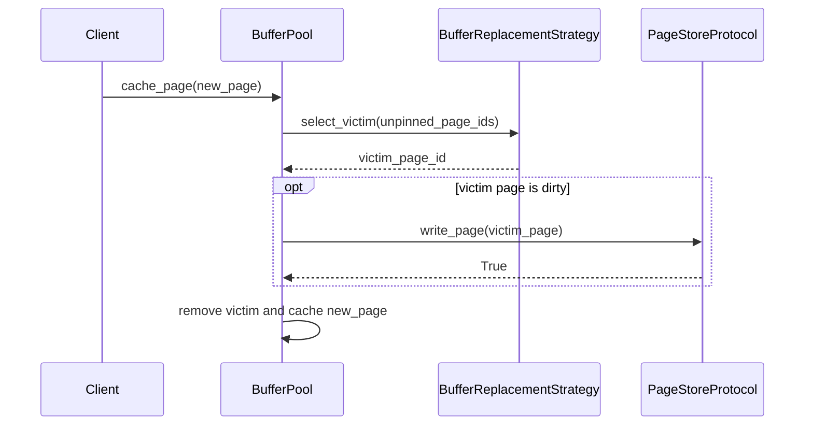
```mermaid
sequenceDiagram
    participant Client
    participant BufferPool
    participant Strategy as BufferReplacementStrategy
    participant Store as PageStoreProtocol

    Client->>BufferPool: cache_page(new_page)
    BufferPool->>Strategy: select_victim(unpinned_page_ids)
    Strategy-->>BufferPool: victim_page_id
    opt victim page is dirty
        BufferPool->>Store: write_page(victim_page)
        Store-->>BufferPool: True
    end
    BufferPool->>BufferPool: remove victim and cache new_page
```

* **Description**: `BufferPool` passes the unpinned page ids to a `BufferReplacementStrategy`, which selects one victim.
* **Use Case**: FIFO is the default strategy; callers can inject LRU without changing cache, pin, dirty-page, or flush logic.
* **Advantages**:
  * **Algorithm Pluggability:** Easily switch between FIFO, LRU, or custom eviction strategies.
  * **Decoupled Eviction Logic:** `BufferPool` maintains cache pins while strategy handles selection logic.
* **Reason**: Page replacement policy is isolated from the cache proxy. More policies can be added without editing `BufferPool`.

**Proxy Pattern (Page Loading & Buffer Pool)**

##### Class Diagram
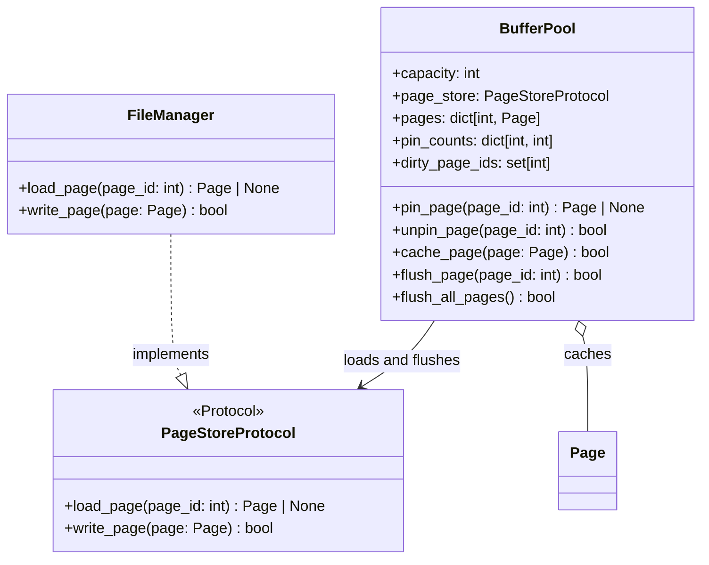
```mermaid
classDiagram
    direction TB

    class BufferPool {
        +capacity: int
        +page_store: PageStoreProtocol
        +pages: dict[int, Page]
        +pin_counts: dict[int, int]
        +dirty_page_ids: set[int]
        +pin_page(page_id: int) Page | None
        +unpin_page(page_id: int) bool
        +cache_page(page: Page) bool
        +flush_page(page_id: int) bool
        +flush_all_pages() bool
    }

    class PageStoreProtocol {
        <<Protocol>>
        +load_page(page_id: int) Page | None
        +write_page(page: Page) bool
    }

    class FileManager {
        +load_page(page_id: int) Page | None
        +write_page(page: Page) bool
    }

    class Page

    BufferPool --> PageStoreProtocol : loads and flushes
    FileManager ..|> PageStoreProtocol : implements
    BufferPool o-- Page : caches
```

##### Sequence Diagram
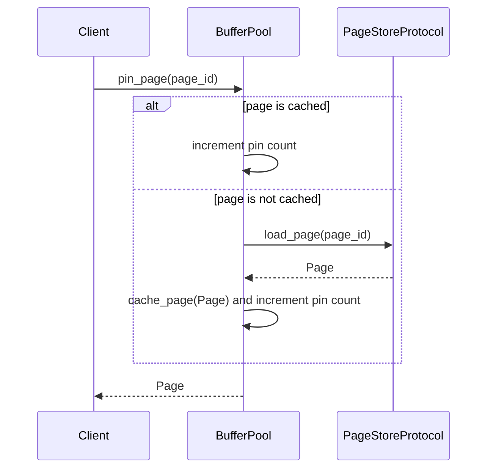
```mermaid
sequenceDiagram
    participant Client
    participant BufferPool
    participant Store as PageStoreProtocol

    Client->>BufferPool: pin_page(page_id)
    alt page is cached
        BufferPool->>BufferPool: increment pin count
    else page is not cached
        BufferPool->>Store: load_page(page_id)
        Store-->>BufferPool: Page
        BufferPool->>BufferPool: cache_page(Page) and increment pin count
    end
    BufferPool-->>Client: Page
```

* **Description**: `BufferPool` is a cache proxy in front of a `PageStoreProtocol` implementation such as `FileManager`.
* **Use Case**: `pin_page()` returns a cached page when possible; on a miss it loads the page through the store and caches it before returning.
* **Advantages**:
  * **Transparent Caching:** Intercepts page requests to manage in-memory caching automatically.
  * **Pin/Unpin Protection:** Prevents in-use pages from being evicted during active transactions.
* **Reason**: Callers use one page-access API and do not manage cache state, pin counts, or filesystem reads directly.

**Adapter Pattern (File Access)**

##### Class Diagram
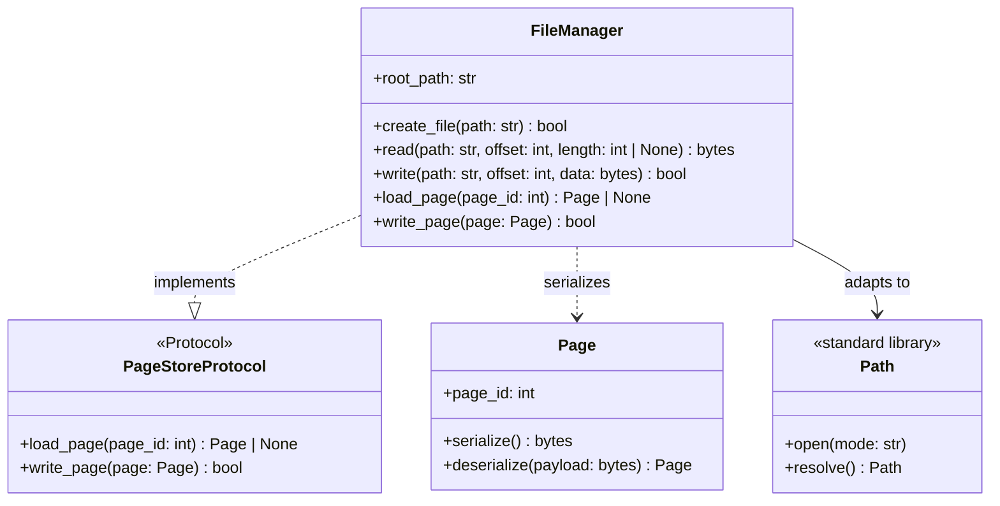
```mermaid
classDiagram
    direction TB

    class FileManager {
        +root_path: str
        +create_file(path: str) bool
        +read(path: str, offset: int, length: int | None) bytes
        +write(path: str, offset: int, data: bytes) bool
        +load_page(page_id: int) Page | None
        +write_page(page: Page) bool
    }

    class PageStoreProtocol {
        <<Protocol>>
        +load_page(page_id: int) Page | None
        +write_page(page: Page) bool
    }

    class Page {
        +page_id: int
        +serialize() bytes
        +deserialize(payload: bytes) Page
    }

    class Path {
        <<standard library>>
        +open(mode: str)
        +resolve() Path
    }

    FileManager ..|> PageStoreProtocol : implements
    FileManager ..> Page : serializes
    FileManager --> Path : adapts to
```

##### Sequence Diagram
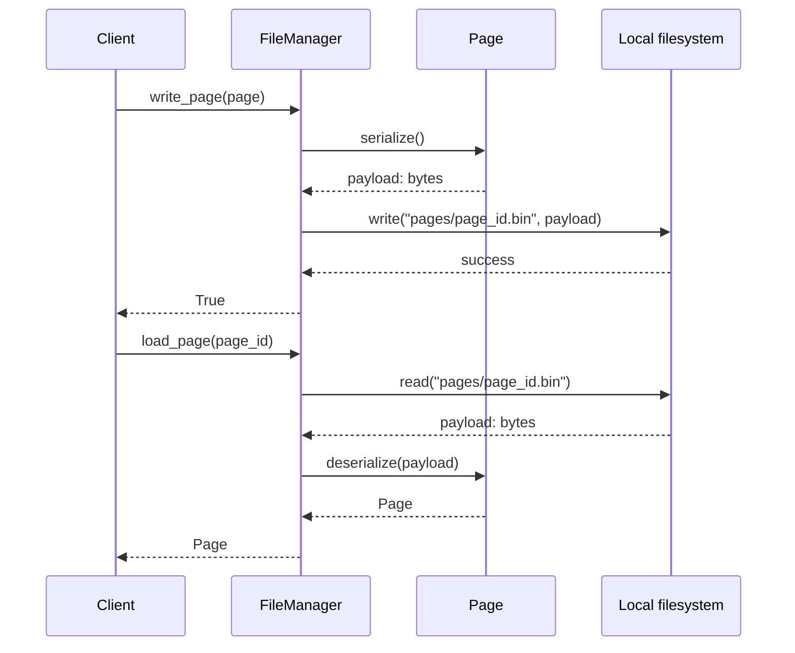
```mermaid
sequenceDiagram
    participant Client
    participant FileManager
    participant Page
    participant FileSystem as Local filesystem

    Client->>FileManager: write_page(page)
    FileManager->>Page: serialize()
    Page-->>FileManager: payload: bytes
    FileManager->>FileSystem: write("pages/page_id.bin", payload)
    FileSystem-->>FileManager: success
    FileManager-->>Client: True

    Client->>FileManager: load_page(page_id)
    FileManager->>FileSystem: read("pages/page_id.bin")
    FileSystem-->>FileManager: payload: bytes
    FileManager->>Page: deserialize(payload)
    Page-->>FileManager: Page
    FileManager-->>Client: Page
```

* **Description**: `FileManager` adapts root-relative DBMS file operations to Python's local filesystem API and implements `PageStoreProtocol`.
* **Use Case**: It reads/writes byte ranges and persists a serialized `Page` through `load_page()` and `write_page()`.
* **Advantages**:
  * **Abstraction of I/O:** Isolates low-level file I/O operations from upper database layers.
  * **Protocol Compliance:** Fulfills `PageStoreProtocol` so `BufferPool` can read/write without knowing filesystem details.
* **Reason**: Storage clients use one safe API without handling paths, offsets, binary modes, or page-file names directly.

**Data Mapper Pattern (Record Read/Write)**

##### Class Diagram
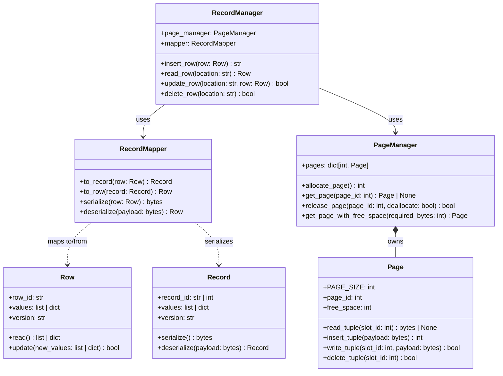
```mermaid
classDiagram
    direction TB

    class Row {
        +row_id: str
        +values: list | dict
        +version: str
        +read() list | dict
        +update(new_values: list | dict) bool
    }

    class Record {
        +record_id: str | int
        +values: list | dict
        +version: str
        +serialize() bytes
        +deserialize(payload: bytes) Record
    }

    class RecordMapper {
        +to_record(row: Row) Record
        +to_row(record: Record) Row
        +serialize(row: Row) bytes
        +deserialize(payload: bytes) Row
    }

    class RecordManager {
        +page_manager: PageManager
        +mapper: RecordMapper
        +insert_row(row: Row) str
        +read_row(location: str) Row
        +update_row(location: str, row: Row) bool
        +delete_row(location: str) bool
    }

    class PageManager {
        +pages: dict[int, Page]
        +allocate_page() int
        +get_page(page_id: int) Page | None
        +release_page(page_id: int, deallocate: bool) bool
        +get_page_with_free_space(required_bytes: int) Page
    }

    class Page {
        +PAGE_SIZE: int
        +page_id: int
        +free_space: int
        +read_tuple(slot_id: int) bytes | None
        +insert_tuple(payload: bytes) int
        +write_tuple(slot_id: int, payload: bytes) bool
        +delete_tuple(slot_id: int) bool
    }

    RecordMapper ..> Row : maps to/from
    RecordMapper ..> Record : serializes
    RecordManager --> RecordMapper : uses
    RecordManager --> PageManager : uses
    PageManager *-- Page : owns
```

##### Sequence Diagram
```mermaid
sequenceDiagram
    participant Client
    participant RecordManager
    participant RecordMapper
    participant PageManager
    participant Page
    participant Record

    Client->>RecordManager: insert_row(row)
    RecordManager->>RecordMapper: serialize(row)
    RecordMapper->>Record: Record(row_id, values, version)
    Record->>Record: serialize()
    Record-->>RecordMapper: payload: bytes
    RecordMapper-->>RecordManager: payload
    RecordManager->>PageManager: get_page_with_free_space(size)
    PageManager-->>RecordManager: Page
    RecordManager->>Page: insert_tuple(payload)
    Page-->>RecordManager: slot_id
    RecordManager->>PageManager: release_page(page_id)
    RecordManager-->>Client: "page_id:slot_id"
```

* **Description**: `RecordMapper` converts a database-object `Row` to a storage `Record` and its byte payload; it performs the reverse conversion when the row is read.
* **Use Case**: `RecordManager` stores that payload in a `Page` slot and returns a `page_id:slot_id` location.
* **Advantages**:
  * **Separation of Concerns:** `Row` remains a clean domain entity; binary serialization logic is encapsulated in `RecordMapper`.
  * **Format Independence:** Storage payload format can evolve without mutating `Row` or higher-level database code.
* **Reason**: `Row` does not need to know the page-slot or byte format.

**Singleton Pattern (Buffer Pool Management)**

##### Class Diagram
```mermaid
classDiagram
    direction TB

    class BufferPool {
        -_instance: BufferPool | None$
        -_instance_lock: RLock$
        +capacity: int
        +page_store: PageStoreProtocol
        +pages: dict[int, Page]
        +pin_counts: dict[int, int]
        +dirty_page_ids: set[int]
        +get_instance(capacity, page_store, replacement_strategy) BufferPool$
        +reset_instance() None$
        +pin_page(page_id: int) Page | None
        +unpin_page(page_id: int) bool
        +cache_page(page: Page) bool
        +evict_page() bool
        +flush_page(page_id: int) bool
        +flush_all_pages() bool
    }
```

##### Sequence Diagram
```mermaid
sequenceDiagram
    autonumber
    actor Client
    participant BufferPool

    Client->>BufferPool: get_instance(capacity, page_store, replacement_strategy)
    alt _instance is None
        BufferPool->>BufferPool: initialize single _instance
    end
    BufferPool-->>Client: _instance
```

* **Description**: Both `BufferPool(...)` and `BufferPool.get_instance()` return the same process-wide cache instance, coordinating memory caching across the database engine.
* **Use Case**: Storage components access one shared buffer pool instead of creating independent caches.
* **Advantages**:
  * **Global Cache Consistency:** Prevents duplicate buffer pool instances from polluting RAM or creating dirty page conflicts.
  * **Controlled Configuration:** The first creation sets capacity, page store, and replacement strategy; later conflicting explicit configuration raises `ValueError`.
  * **Controlled Lifetime:** A lock protects creation/reset, while `reset_instance()` exists only for isolated unit testing.
* **Reason**: Memory buffer caching requires centralized state management; Singleton guarantees one cache state for the process.

**Factory Method Pattern (Page Allocation)**

##### Class Diagram
```mermaid
classDiagram
    direction TB

    class Page {
        +PAGE_SIZE: int
        +page_id: int
        +data: bytes
        +free_space: int
        +read_tuple(slot_id: int) bytes | None
        +insert_tuple(payload: bytes) int
        +write_tuple(slot_id: int, payload: bytes) bool
        +delete_tuple(slot_id: int) bool
        +serialize() bytes
        +deserialize(payload: bytes) Page$
    }

    class DataPage {
        +page_type: str = "DATA"
    }

    class IndexPage {
        +page_type: str = "INDEX"
    }

    class PageFactory {
        <<abstract>>
        +create_page(page_id: int, data: bytes) Page
    }

    class DataPageFactory {
        +create_page(page_id: int, data: bytes) DataPage
    }

    class IndexPageFactory {
        +create_page(page_id: int, data: bytes) IndexPage
    }

    DataPage --|> Page
    IndexPage --|> Page
    DataPageFactory --|> PageFactory
    IndexPageFactory --|> PageFactory
    DataPageFactory ..> DataPage : creates
    IndexPageFactory ..> IndexPage : creates
```

##### Sequence Diagram
```mermaid
sequenceDiagram
    autonumber
    actor Client
    participant Factory as PageFactory
    participant DataFactory as DataPageFactory
    participant IndexFactory as IndexPageFactory
    participant DataPage
    participant IndexPage

    alt Allocate Data Page
        Client->>DataFactory: create_page(page_id, data)
        DataFactory->>DataPage: DataPage(page_id, data)
        DataPage-->>DataFactory: dataPageInstance
        DataFactory-->>Client: dataPageInstance
    else Allocate Index Page
        Client->>IndexFactory: create_page(page_id, data)
        IndexFactory->>IndexPage: IndexPage(page_id, data)
        IndexPage-->>IndexFactory: indexPageInstance
        IndexFactory-->>Client: indexPageInstance
    end
```

* **Description**: Encapsulates concrete `Page` subclass instantiation behind factory methods (`DataPageFactory`, `IndexPageFactory`).
* **Use Case**: Allocating specialized page types (`DataPage` for tuple records, `IndexPage` for B-Tree index nodes) without coupling callers to concrete constructors.
* **Advantages**:
  * **Loose Coupling:** Higher-level storage and query operators depend only on abstract `PageFactory` and `Page` abstractions.
  * **Extensibility:** New page types (e.g., `OverflowPage`, `HeaderPage`) can be added by creating a new `Page` subclass and corresponding factory without modifying existing code.
* **Reason**: Different storage subsystems require distinct page layouts and behaviors while sharing the underlying `Page` byte payload contract.

---

Ensure you have Python 3.10+ installed.

### 1. Install Dependencies

```bash
python -m pip install -r requirements-dev.txt
```

### 2. Run Tests

Run the current core class design tests:
```bash
python -m pytest -q
```
