# DBMS

Python DBMS architecture project. The repository is currently at the class-design stage: selected core classes define their initial attributes and method stubs, while business logic has not been implemented yet.

---

## 🧠 System Architecture & Design


### 1. Mindmap (Level 2 Overview)

The high-level visual representation of the subsystems within the Mini DBMS:


---

### 2. Class Diagram Overview

The architectural components and how they interact conceptually:

```mermaid
classDiagram
    direction TB

    class DBMS {
        +storage_engine: StorageEngine
        +transaction_manager: TransactionManager
        +query_processor: QueryProcessor
        +start() bool
        +shutdown() bool
        +execute(sql: str, session: object) object
    }

    class DatabaseServer {
        +server_id: str
        +version: str
        +status: str
        +start() bool
        +stop() bool
        +restart() bool
    }

    class DatabaseManager {
        +databases: dict
        +create_database(name: str) Database
        +get_database(name: str) Database
        +drop_database(name: str) bool
        +rename_database(old_name: str, new_name: str) bool
    }

    class Database {
        +id: str
        +name: str
        +recovery_model: str
        +schemas: list
        +open() bool
        +close() bool
        +backup() bool
        +restore() bool
    }

    class CatalogManager {
        +cache: object
        +register_object(name: str, desc: object) bool
        +remove_object(name: str) bool
        +lookup_object(name: str) object
    }

    class Schema {
        +name: str
        +database_id: str
        +tables: list
        +create_table(name: str) Table
        +drop_table(name: str) bool
    }

    class Table {
        +id: str
        +name: str
        +columns: list
        +indexes: list
        +constraints: list
        +insert(row: Row) bool
        +update(row_id: str, new_values: dict) bool
        +delete(row_id: str) bool
        +truncate() bool
        +analyze() bool
    }

    class Column {
        +id: str
        +name: str
        +data_type: object
        +nullable: bool
        +default_value: object
        +validate(value: object) bool
        +convert(value: object) object
        +compare(v1: object, v2: object) int
    }

    class Row {
        +id: str
        +values: list
        +version_chain: list
        +lock_info: object
        +read() list
        +update(new_values: list) bool
        +clone() Row
    }

    class ForeignKey {
        +name: str
        +referenced_table: Table
        +referenced_columns: list
        +delete_action: str
        +update_action: str
    }

    class Constraint {
        +name: str
        +constraint_type: str
        +columns: list
        +validate_row(row: Row) bool
    }

    class Index {
        +id: str
        +name: str
        +columns: list
        +search(key: object) list
        +insert(key: object, rid: str) bool
        +delete(key: object, rid: str) bool
    }

    class BTreeIndex {
        +root_page_id: str
        +split_node(node: BTreeNode) bool
        +merge_node(node: BTreeNode) bool
    }

    class BTreeNode {
        +page_id: str
        +is_leaf: bool
        +keys: list
        +children: list
    }

    class StorageEngine {
        +buffer_pool: BufferPool
        +file_manager: FileManager
        +read_page(page_id: str) Page
        +write_page(page: Page) bool
    }

    class FileManager {
        +active_files: dict
        +create_file(path: str) bool
        +open_file(path: str) object
        +close_file(path: str) bool
    }

    class Page {
        +page_id: str
        +header: object
        +data: bytes
        +initialize() bool
        +read_tuple(offset: int) bytes
        +write_tuple(offset: int, data: bytes) bool
    }

    class BufferPool {
        +capacity: int
        +cached_pages: dict
        +get_page(page_id: str) Page
        +put_page(page: Page) bool
        +flush() bool
    }

    class RecordManager {
        +schema: object
        +serialize(row: Row) bytes
        +deserialize(data: bytes) Row
    }

    class TransactionManager {
        +lock_manager: LockManager
        +mvcc_manager: MVCCManager
        +wal_manager: WALManager
        +begin() Transaction
        +commit(tx: Transaction) bool
        +rollback(tx: Transaction) bool
    }

    class Transaction {
        +id: str
        +state: str
        +lsn: int
        +locks: list
        +commit() bool
        +rollback() bool
    }

    class LockManager {
        +lock_table: dict
        +acquire(tx: object, resource: str, mode: str) bool
        +release(tx: object, resource: str) bool
    }

    class DeadlockDetector {
        +detect_cycle() bool
        +select_victim() object
    }

    class MVCCManager {
        +create_snapshot() object
        +get_visible_version(row: Row, tx: object) Row
    }

    class WALManager {
        +log_buffer: list
        +append_record(record: object) bool
        +flush() bool
    }

    class RecoveryManager {
        +analyze() bool
        +redo() bool
        +undo() bool
    }

    class SQLParser {
        +parse(sql: str) object
        +validate_syntax(sql: str) bool
    }

    class QueryOptimizer {
        +optimize(plan: object) object
        +estimate_cost(plan: object) float
    }

    class QueryExecutor {
        +execute(plan: object) object
        +fetch() list
        +cancel() bool
    }

    %% Relationships
    DBMS *-- StorageEngine
    DBMS *-- TransactionManager
    DBMS *-- QueryExecutor
    
    DatabaseServer *-- DatabaseManager
    DatabaseManager o-- Database
    Database *-- Schema
    Schema *-- Table
    Table *-- Column
    Table *-- Constraint
    Table *-- Index
    ForeignKey --|> Constraint
    ForeignKey --> Table
    BTreeIndex --|> Index
    BTreeIndex o-- BTreeNode
    
    StorageEngine *-- BufferPool
    StorageEngine *-- FileManager
    BufferPool o-- Page
    RecordManager ..> Row : serializes
    RecordManager ..> Page : writes
    
    TransactionManager *-- LockManager
    TransactionManager *-- MVCCManager
    TransactionManager *-- WALManager
    TransactionManager --> Transaction
    LockManager o-- DeadlockDetector
    
    WALManager <-- RecoveryManager
```



---

### 3. Core Class Descriptions

Below is the list of the 20-something core classes designed for this system:

#### 1. Core Facade & Orchestration
*   **`DBMS`**: The main system facade orchestrating the query parser, executor, storage engine, and transaction lifecycle.
*   **`DatabaseServer`**: Coordinates server-level events, state changes, startup, and graceful shutdowns.
*   **`DatabaseManager`**: Performs DDL operations at the database level (e.g., creating, dropping, or renaming databases).
*   **`Database`**: Represents a database aggregate holding recovery options, schemas, and filegroups.

#### 2. Schema, Table & Column Metadata
*   **`CatalogManager`**: The global catalog for resolving physical resources and caching object definitions.
*   **`Schema`**: Logical namespace partitioning tables, sequences, and views.
*   **`Table`**: Root domain entity for record storage, holding schema definitions, constraints, indexes, and partition schemes.
*   **`Column`**: Defines name, datatype, and validation rules for fields.
*   **`Row`**: Holds row values, MVCC headers, versions, and active lock states.

#### 3. Constraints & Indexes
*   **`Constraint`**: Enforces relational rules on tables.
*   **`ForeignKey`**: Validates relationships between source and target tables, handling updates/deletes cascading actions.
*   **`Index`**: Abstract definition of search index structures.
*   **`BTreeIndex`**: An index structured as a self-balancing B+ Tree.
*   **`BTreeNode`**: Represents a B-tree node page holding keys, children references, and leaf links.

#### 4. Storage Engine & Cache Management
*   **`StorageEngine`**: Allocates pages, routes reads/writes, and wraps buffer pool requests.
*   **`FileManager`**: Low-level read/write controller managing direct physical files on disk.
*   **`Page`**: 8KB block structured with headers and slot directories for records.
*   **`BufferPool`**: Page frame cache optimizing memory access with clocks/LRU replacement policies.
*   **`RecordManager`**: Handles serialization and deserialization of row objects to bytes.

#### 5. Transactions & Concurrency (ACID)
*   **`TransactionManager`**: Coordinates beginning, committing, and aborting transactions.
*   **`Transaction`**: Tracks unique tx status, snapshot isolation info, and local locks.
*   **`LockManager`**: Implements 2-Phase Locking (2PL) to prevent write-write conflicts.
*   **`DeadlockDetector`**: Checks the wait-for graph of transactions to resolve cyclic waits.
*   **`MVCCManager`**: Implements Multi-Version Concurrency Control, resolving visibility snapshots.

#### 6. Logging & Recovery (Durability)
*   **`WALManager`**: Write-Ahead Logger writing log buffers to disk before transaction commit completes.
*   **`RecoveryManager`**: Implements ARIES recovery protocol (Analysis, Redo, Undo) to restore consistent states after server crashes.

#### 7. Query Parsing & Execution
*   **`SQLParser`**: Parses input SQL text into AST representations and validates syntax.
*   **`QueryOptimizer`**: Rewrites AST plans and calculates estimated cost structures using catalog statistics.
*   **`QueryExecutor`**: Processes optimized plans, fetching tuples through iterator stages.

---

## 🛠️ Installation & Running Tests

Ensure you have Python 3.10+ installed.

### 1. Install Dependencies

```bash
python -m pip install -r requirements-dev.txt
```

### 2. Run Tests
Run the current core class design tests:
```bash
python -m pytest -q
```
