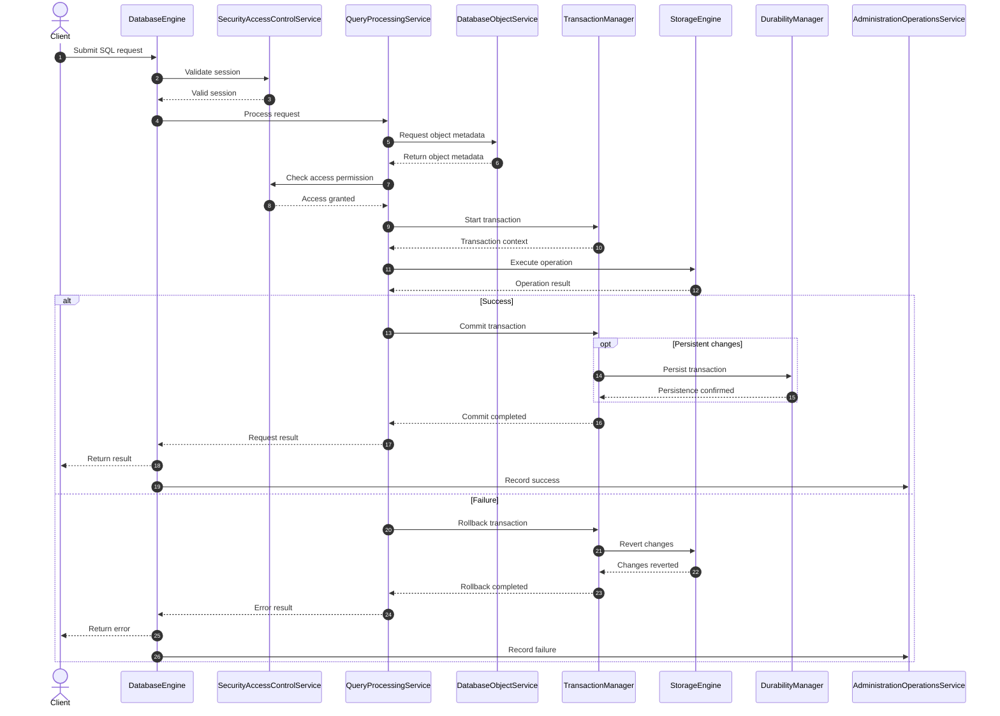

# DBMS

Python DBMS architecture project. The repository is currently at the class-design stage: selected core classes define their initial attributes and method stubs, while business logic has not been implemented yet.

---

## 🧠 System Architecture & Design


### 1. Mindmap (Level 2 Overview)

The high-level visual representation of the subsystems within the Mini DBMS:


---

### 2. Class Diagram Overview


The architectural components and how they interact conceptually:

```mermaid
classDiagram
direction TB

    class DBMS {
        +database_object_manager: DatabaseObjectManager
        +transaction_manager: TransactionManager
        +storage_engine: StorageEngine
        +durability_manager: DurabilityManager
        +query_processor: QueryProcessor
        +security_access_controller: SecurityAccessController
        +performance_manager: PerformanceManager
        +administration_operations_manager: AdministrationOperationsManager
        +start() bool
        +shutdown() bool
        +execute(sql: str, session: object) object
    }
    class DatabaseObjectManager {
        +metadata_manager: MetadataManager
        +get_object(name: str) object
        +object_exists(name: str) bool
    }
    class TransactionManager {
        +begin() Transaction
        +commit(transaction: Transaction) bool
        +rollback(transaction: Transaction) bool
    }
    class Transaction
    class TransactionStatus
    class StorageEngine {
        +buffer_pool: BufferPool
        +read(page_id: int) object
        +write(value: object) bool
        +delete(record_id: int) bool
        +revert(transaction_id: int) bool
    }
    class DurabilityManager {
        +transaction_log_manager: TransactionLogManager
        +recovery_manager: RecoveryManager
        +persist(transaction_id: int) bool
        +recover() bool
    }
    class QueryProcessor {
        +sql_parser: SqlParser
        +query_validator: QueryValidator
        +query_executor: QueryExecutor
        +process(sql: str, session: object) object
    }
    class SecurityAccessController
    class AdministrationOperationsManager
    class DataFileManager
    class PageManager
    class BufferPool {
        +capacity: int
        +get_page(page_id: int) Page
        +put_page(page: Page) bool
        +flush() bool
    }
    class Page
    class Record
    class RecordManager
    class StorageAllocator
    class LogFileManager
    class BackupManager
    class RestoreManager
    class TransactionLogManager {
        +append(record: LogRecord) bool
        +read_entries(transaction_id: int) list
    }
    class CheckpointManager
    class RecoveryManager {
        +transaction_log_manager: TransactionLogManager
        +recover() bool
        +rollback(transaction_id: int) bool
    }
    class LogRecord
    class ReplicationManager
    class SqlParser {
        +parse(tokens: list) Statement
    }
    class Lexer
    class Token
    class TokenType
    class Statement
    class SelectStatement
    class QueryValidator
    class QueryOptimizer
    class ExecutionPlanner
    class QueryExecutor
    class UserManager
    class AuthenticationService
    class AuthorizationService
    class EncryptionService
    class AuditLogger
    class RoleManager
    class PerformanceManager
    class MonitoringManager
    class ImportExportManager
    class ConfigurationManager
    class OperationalLogger

    class DatabaseManager
    class SchemaManager
    class TableManager
    class ViewManager
    class RelationshipManager
    class ColumnManager
    class ConstraintManager
    class DataTypeManager
    class IndexManager
    class StoredProcedureManager
    class TriggerManager
    class MetadataManager {
        +system_catalog: SystemCatalog
        +register(name: str, descriptor: object) bool
        +get(name: str) object
        +remove(name: str) bool
    }
    class SystemCatalog
    class TableDescriptor
    class ColumnDescriptor

    class ConcurrencyManager
    class LockManager
    class IsolationManager
    class DeadlockManager
    class AcidManager

    DBMS *-- DatabaseObjectManager
    DBMS *-- TransactionManager
    DBMS *-- StorageEngine
    DBMS *-- DurabilityManager
    DBMS *-- QueryProcessor
    DBMS *-- SecurityAccessController
    DBMS *-- PerformanceManager
    DBMS *-- AdministrationOperationsManager

    DatabaseObjectManager *-- DatabaseManager
    DatabaseObjectManager *-- SchemaManager
    DatabaseObjectManager *-- TableManager
    DatabaseObjectManager *-- ViewManager
    DatabaseObjectManager *-- RelationshipManager
    DatabaseObjectManager *-- ColumnManager
    DatabaseObjectManager *-- ConstraintManager
    DatabaseObjectManager *-- DataTypeManager
    DatabaseObjectManager *-- IndexManager
    DatabaseObjectManager *-- StoredProcedureManager
    DatabaseObjectManager *-- TriggerManager
    DatabaseObjectManager *-- MetadataManager
    MetadataManager *-- SystemCatalog
    SystemCatalog o-- TableDescriptor
    TableDescriptor o-- ColumnDescriptor

    TransactionManager *-- ConcurrencyManager
    TransactionManager *-- LockManager
    TransactionManager *-- IsolationManager
    TransactionManager *-- DeadlockManager
    TransactionManager *-- AcidManager
    TransactionManager --> Transaction
    Transaction --> TransactionStatus

    StorageEngine *-- DataFileManager
    StorageEngine *-- PageManager
    StorageEngine *-- BufferPool
    StorageEngine *-- RecordManager
    StorageEngine *-- StorageAllocator
    StorageEngine *-- LogFileManager
    DataFileManager --> PageManager
    PageManager --> BufferPool
    PageManager --> RecordManager
    DataFileManager --> StorageAllocator
    DataFileManager --> LogFileManager
    BufferPool o-- Page
    Page o-- Record

    DurabilityManager *-- BackupManager
    DurabilityManager *-- RestoreManager
    DurabilityManager *-- TransactionLogManager
    DurabilityManager *-- CheckpointManager
    DurabilityManager *-- RecoveryManager
    DurabilityManager *-- ReplicationManager
    BackupManager --> RestoreManager
    BackupManager --> TransactionLogManager
    TransactionLogManager --> CheckpointManager
    TransactionLogManager --> RecoveryManager
    TransactionLogManager --> ReplicationManager
    TransactionLogManager o-- LogRecord
    RecoveryManager --> TransactionLogManager

    QueryProcessor *-- SqlParser
    QueryProcessor *-- QueryValidator
    QueryProcessor *-- QueryOptimizer
    QueryProcessor *-- ExecutionPlanner
    QueryProcessor *-- QueryExecutor
    SqlParser --> QueryValidator
    QueryValidator --> QueryOptimizer
    QueryOptimizer --> ExecutionPlanner
    ExecutionPlanner --> QueryExecutor
    Lexer --> Token
    Token --> TokenType
    SqlParser --> Token
    SqlParser --> Statement
    SelectStatement --|> Statement

    SecurityAccessController *-- UserManager
    SecurityAccessController *-- AuthenticationService
    SecurityAccessController *-- AuthorizationService
    SecurityAccessController *-- EncryptionService
    SecurityAccessController *-- AuditLogger
    SecurityAccessController *-- RoleManager
    UserManager --> AuthenticationService
    UserManager --> AuthorizationService
    UserManager --> EncryptionService
    UserManager --> AuditLogger
    UserManager --> RoleManager

    AdministrationOperationsManager *-- MonitoringManager
    AdministrationOperationsManager *-- ImportExportManager
    AdministrationOperationsManager *-- ConfigurationManager
    AdministrationOperationsManager *-- OperationalLogger
    MonitoringManager --> ImportExportManager
    MonitoringManager --> ConfigurationManager
    MonitoringManager --> OperationalLogger
```




---

### 3. Planned General Sequence Diagram


Planned end-to-end flow. This sequence is a design reference, not implemented behavior.




---

### 4. Planned Database Object Sequence Diagrams

Planned Database Object workflows are documented in `diagrams/db_object_sequences/`. They are design references and are not implemented yet.

For detailed workflow diagrams, please refer to the **[Database Object Sequences Directory](diagrams/db_object_sequences/)**:

1. **[Database & Schema Provisioning](diagrams/db_object_sequences/seq_database_schema.mmd)**: Details the creation and registration of logical namespaces.
2. **[Table Definition Workflow](diagrams/db_object_sequences/seq_table.mmd)**: Orchestrates columns, data types, and constraint definitions.
3. **[Advanced Objects](diagrams/db_object_sequences/seq_view_proc_trig.mmd)**: The DDL workflows for Views, Stored Procedures, and Triggers.
4. **[Runtime Execution](diagrams/db_object_sequences/seq_runtime.mmd)**: Shows how data manipulation events interact with Triggers, Constraints, and Indexes.
---

### 5. Planned Detailed Database Object Classes

The following supporting classes belong to later Database Object design phases. Only the manager classes shown in the Class Diagram Overview currently have skeleton files.

- **Database Management**: `DatabaseManager`, `DatabaseDescriptor`, `DatabaseConfiguration`, `DatabaseRegistry`
- **Schema Management**: `SchemaManager`, `SchemaDescriptor`, `SchemaCatalog`, `SchemaOwnershipPolicy`, `SchemaMigrationLedger`
- **Table Management**: `TableManager`, `TableDescriptor`, `TableOrganization`, `TableScope`
- **View Management**: `ViewManager`, `ViewDescriptor`, `ViewDependencyGraph`
- **Relationship Management**: `RelationshipManager`, `RelationshipDescriptor`, `ReferentialActionPolicy`
- **Column Management**: `ColumnManager`, `ColumnDescriptor`, `ColumnRuleSet`
- **Constraint Management**: `ConstraintManager`, `ConstraintDescriptor`, `ConstraintEnforcer`
- **Data Type Management**: `DataTypeManager`, `TypeValidator`, `TypeConverter`
- **Index Management**: `IndexManager`, `IndexDescriptor`, `IndexAccessMethod`, `IndexOrganization`, `IndexMaintainer`
- **Stored Procedure**: `StoredProcedureManager`, `ProcedureDescriptor`, `ProcedureExecutor`
- **Trigger Management**: `TriggerManager`, `TriggerDescriptor`, `TriggerEventBinding`, `TriggerExecutor`
- **Metadata Management**: `MetadataManager`, `SystemCatalog`, `DependencyManager`, `StatisticsManager`

---

## 🛠️ Installation & Running Tests

Ensure you have Python 3.10+ installed.

### 1. Install Dependencies

```bash
python -m pip install -r requirements-dev.txt
```

### 2. Run Tests
Run the current class-instantiation unit tests:
```bash
python -m pytest -q
```
