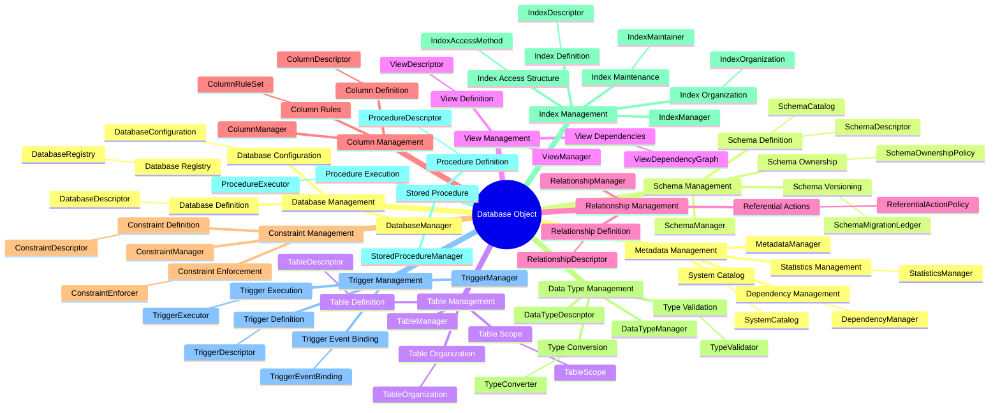

- Database Object
    - Database Management
        - Database Definition
        - Database Configuration
        - Database Registry
    - Schema Management
        - Schema Definition
        - Schema Ownership
        - Schema Versioning
    - Table Management
        - Table Definition
        - Table Organization
        - Table Scope
    - View Management
        - View Definition
        - View Dependencies
    - Relationship Management
        - Relationship Definition
        - Referential Actions
    - Column Management
        - Column Definition
        - Column Rules
    - Constraint Management
        - Constraint Definition
        - Constraint Enforcement
    - Data Type Management
        - Type Validation
        - Type Conversion
    - Index Management
        - Index Definition
        - Index Access Structure
        - Index Organization
        - Index Maintenance
    - Stored Procedure
        - Procedure Definition
        - Procedure Execution
    - Trigger Management
        - Trigger Definition
        - Trigger Event Binding
        - Trigger Execution
    - Metadata Management
        - System Catalog
        - Dependency Management
        - Statistics Management

- Transaction
    - Transaction Manager
        - Begin
        - Commit
        - Rollback
        - Savepoint
        - State Tracking
    - Concurrency
        - Multi-user Access
        - Read Consistency
        - Write Conflict Handling
        - MVCC
    - Lock Management
        - Shared Lock
        - Exclusive Lock
        - Row-level Lock
        - Lock Timeout
    - Isolation Management
        - Read Committed
        - Repeatable Read
        - Serializable
        - Snapshot Isolation
    - Deadlock Management
        - Detection
        - Victim Selection
        - Retry
    - ACID
        - Atomicity
        - Consistency
        - Isolation
        - Durability

- Storage Engine
    - Data File Management
        - File Organization
        - File I/O
        - File Metadata
        - File Space Control
    - Page Management
        - Page Allocation
        - Page Split
        - Page Merge
        - Free Space Tracking
    - Buffer Pool + Cache
        - Page Cache
        - Dirty Page Tracking
        - Cache Replacement Policy
        - Read-ahead
    - Record Management
        - Record Format
        - Record Access
        - Record Modification
        - Record Versioning
    - Storage Allocation
        - Allocation Units
        - Spacing Mapping
    - Log File
        - Write-ahead Logging
        - Redo Log
        - Undo Log
        - Log Sequence Management

- Durability
    - Backup Management
        - Full Backup
        - Incremental Backup
        - Scheduling
        - Verification
    - Restore Management
        - Full Restore
        - Point-in-time Restore
        - Validation
    - Transaction Log Management
        - Log Writing
        - Log Truncation
        - Log Backup
        - Log Replay
    - Checkpoint
        - Automatic Checkpoint
        - Dirty Page Flush
        - Recovery Boundary
    - Recovery
        - Crash Recovery
        - Redo Phase
        - Undo Phase
        - Consistency Check
    - Replication
        - Primary-replica
        - Sync/Async
        - Log Shipping
        - Failover

- Query Processing
    - SQL Parser
        - Lexical Analysis
        - Syntax Analysis
        - Parse Tree
    - Query Validation
        - Object Check
        - Column Check
        - Type Check
        - Permission Check
    - Query Optimizer
        - Cost-based Optimization
        - Join Order
        - Index Selection
        - Predicate Pushdown
    - Execution Planning
        - Logical Plan
        - Physical Plan
        - Join Strategy
        - Parallel Plan
    - Query Executor
        - Scan Execution
        - Join Execution
        - Filter
        - Aggregation
        - Result Set

- Security & Access Control
    - User Management
        - User Identity
        - User Session
    - Authentication
        - Authentication Methods
            - Password Authentication
            - Token Authentication
            - External Authentication
        - Credential Management
            - Credential Verification
            - Credential Expiration
            - Credential Recovery
        - Authentication Session
            - Login
            - Logout
            - Session Validation
    - Authorization
        - Permission Management
            - User Permission
            - Role Permission
            - Permission Inheritance
        - Object-level Permission
        - Fine-grained Permission
        - Access Decision
        - Data Protection
    - Encryption
        - Key Management
            - Master Key
            - Data Key
            - Key Rotation
    - Auditing
        - Audit Event
        - Audit Log
        - Audit Policy
    - Role Management
        - Role Definition
            - Role Identity
            - Role Permissions
            - Default Role
        - Role Assignment
            - User-to-Role Mapping
            - Active Role
        - Role Hierarchy

- Administration & Operations
    - Monitoring & Logging
        - Health
        - Metrics
        - Error Log
        - Query Log
        - Alerting
    - Import & Export
        - CSV
        - JSON
        - SQL Dump
        - Export
        - Bulk Load
    - Configuration Management
        - Server Config
        - DB Config
        - Runtime Params
        - Resource Limits
    - Operational Logging
        - Startup
        - Shutdown
        - Maintenance
        - Backup
        - Error

---

# Bổ sung thiết kế Class cho `Database Object`

## 1. Mục tiêu và phạm vi

Phần mindmap gốc ở trên là **Feature Mindmap**: mô tả hệ thống có những nhóm tính năng nào. Phần bổ sung này là **Class Mindmap Level 1** dành riêng cho nhánh `Database Object`.

Nguyên tắc sử dụng:

- Không sửa hoặc thay thế các nhánh tính năng gốc.
- Copy nguyên nhánh `Database Object` sang bản thiết kế class.
- Class `Manager` được nối trực tiếp với module Layer 2 mà nó điều phối.
- Class phục vụ một feature Layer 3 được nối trực tiếp với feature đó.
- `Manager` không phải parent class theo inheritance; nó là coordinator sử dụng các dependency qua composition/delegation.
- `Descriptor` là object dữ liệu mô tả metadata của một database object đã tồn tại hoặc đã được DBMS đăng ký.
- `Configuration`, `Policy`, `Ledger`, `Catalog`, `Registry`, `Graph`, `Enforcer`, `Executor` chỉ được dùng khi vai trò của class đủ rõ.
- Ở Level 1 chưa thêm hàng loạt `Validator`, `Builder`, `Factory`, `Applier` hoặc implementation chi tiết nếu sequence Level 2 chưa chứng minh rằng cần tách trách nhiệm.

## 2. Class Mindmap Level 1 hoàn chỉnh



## 3. Cấu trúc dạng cây để đưa vào MindMeister

```text
Database Object
│
├── Database Management
│   ├── DatabaseManager
│   ├── Database Definition
│   │   └── DatabaseDescriptor
│   ├── Database Configuration
│   │   └── DatabaseConfiguration
│   └── Database Registry
│       └── DatabaseRegistry
│
├── Schema Management
│   ├── SchemaManager
│   ├── Schema Definition
│   │   ├── SchemaDescriptor
│   │   └── SchemaCatalog
│   ├── Schema Ownership
│   │   └── SchemaOwnershipPolicy
│   └── Schema Versioning
│       └── SchemaMigrationLedger
│
├── Table Management
│   ├── TableManager
│   ├── Table Definition
│   │   └── TableDescriptor
│   ├── Table Organization
│   │   └── TableOrganization
│   └── Table Scope
│       └── TableScope
│
├── View Management
│   ├── ViewManager
│   ├── View Definition
│   │   └── ViewDescriptor
│   └── View Dependencies
│       └── ViewDependencyGraph
│
├── Relationship Management
│   ├── RelationshipManager
│   ├── Relationship Definition
│   │   └── RelationshipDescriptor
│   └── Referential Actions
│       └── ReferentialActionPolicy
│
├── Column Management
│   ├── ColumnManager
│   ├── Column Definition
│   │   └── ColumnDescriptor
│   └── Column Rules
│       └── ColumnRuleSet
│
├── Constraint Management
│   ├── ConstraintManager
│   ├── Constraint Definition
│   │   └── ConstraintDescriptor
│   └── Constraint Enforcement
│       └── ConstraintEnforcer
│
├── Data Type Management
│   ├── DataTypeManager
│   ├── DataTypeDescriptor
│   ├── Type Validation
│   │   └── TypeValidator
│   └── Type Conversion
│       └── TypeConverter
│
├── Index Management
│   ├── IndexManager
│   ├── Index Definition
│   │   └── IndexDescriptor
│   ├── Index Access Structure
│   │   └── IndexAccessMethod
│   ├── Index Organization
│   │   └── IndexOrganization
│   └── Index Maintenance
│       └── IndexMaintainer
│
├── Stored Procedure
│   ├── StoredProcedureManager
│   ├── Procedure Definition
│   │   └── ProcedureDescriptor
│   └── Procedure Execution
│       └── ProcedureExecutor
│
├── Trigger Management
│   ├── TriggerManager
│   ├── Trigger Definition
│   │   └── TriggerDescriptor
│   ├── Trigger Event Binding
│   │   └── TriggerEventBinding
│   └── Trigger Execution
│       └── TriggerExecutor
│
└── Metadata Management
    ├── MetadataManager
    ├── System Catalog
    │   └── SystemCatalog
    ├── Dependency Management
    │   └── DependencyManager
    └── Statistics Management
        └── StatisticsManager
```

## 4. Thiết kế chi tiết theo từng module

### 4.1. Database Management

Mindmap gốc:

```text
Database Management
├── Database Definition
├── Database Configuration
└── Database Registry
```

Thiết kế class:

```text
Database Management
├── DatabaseManager
├── Database Definition
│   └── DatabaseDescriptor
├── Database Configuration
│   └── DatabaseConfiguration
└── Database Registry
    └── DatabaseRegistry
```

#### `DatabaseManager`

Class điều phối các use case cấp cao:

- Create database.
- Open database.
- Update database configuration.
- Drop database.
- Find database.

`DatabaseManager` không phải parent class của `DatabaseDescriptor`, `DatabaseConfiguration` hoặc `DatabaseRegistry`. Nó sử dụng các class đó qua composition/dependency.

```python
class DatabaseManager:
    def __init__(self, registry: "DatabaseRegistry") -> None:
        self._registry = registry
```

#### `DatabaseDescriptor`

Metadata mô tả một database đã được DBMS nhận diện hoặc đăng ký.

```python
from dataclasses import dataclass


@dataclass(frozen=True)
class DatabaseDescriptor:
    database_id: str
    name: str
    owner_id: str
    configuration: "DatabaseConfiguration"
```

Chưa dùng đồng thời `DatabaseDefinition` và `DatabaseDescriptor` ở Level 1 để tránh hai class có trách nhiệm gần như trùng nhau. Nếu sau này cần tách input của lệnh tạo database, có thể bổ sung `CreateDatabaseRequest` ở Level 2.

#### `DatabaseConfiguration`

Chứa dữ liệu cấu hình của database:

```python
@dataclass(frozen=True)
class DatabaseConfiguration:
    storage_path: str
    encoding: str
    default_schema: str
```

Class này chứa dữ liệu; việc cập nhật hoặc áp dụng configuration thuộc `DatabaseManager` ở Level 1.

#### `DatabaseRegistry`

Lưu và tra cứu các database đã đăng ký:

```python
class DatabaseRegistry:
    def register(self, database: DatabaseDescriptor) -> None:
        ...

    def find_by_id(self, database_id: str) -> DatabaseDescriptor | None:
        ...

    def find_by_name(self, name: str) -> DatabaseDescriptor | None:
        ...

    def remove(self, database_id: str) -> None:
        ...
```

Không cần `DatabaseRegistryEntry` ở Level 1 vì `DatabaseDescriptor` đã có thể đóng vai trò record metadata. Không cần `DatabaseLocator` nếu `DatabaseRegistry` đã cung cấp thao tác tìm kiếm cơ bản.

---

### 4.2. Schema Management

Mindmap gốc:

```text
Schema Management
├── Schema Definition
├── Schema Ownership
└── Schema Versioning
```

Thiết kế class:

```text
Schema Management
├── SchemaManager
├── Schema Definition
│   ├── SchemaDescriptor
│   └── SchemaCatalog
├── Schema Ownership
│   └── SchemaOwnershipPolicy
└── Schema Versioning
    └── SchemaMigrationLedger
```

#### `SchemaManager`

Class điều phối:

- Create schema.
- Rename schema.
- Change owner.
- Apply schema change.
- Drop schema.
- Get schema.

```python
class SchemaManager:
    def __init__(
        self,
        catalog: "SchemaCatalog",
        ownership_policy: "SchemaOwnershipPolicy",
        migration_ledger: "SchemaMigrationLedger",
    ) -> None:
        self._catalog = catalog
        self._ownership_policy = ownership_policy
        self._migration_ledger = migration_ledger
```

Không dùng hậu tố `Lifecycle`; tên thống nhất là `SchemaManager`.

#### `SchemaDescriptor`

Metadata mô tả schema đã tồn tại:

```python
@dataclass(frozen=True)
class SchemaDescriptor:
    schema_id: str
    database_id: str
    name: str
    owner_id: str
    version: int
```

#### `SchemaCatalog`

Lưu và tra cứu metadata chuyên biệt của schema:

```python
class SchemaCatalog:
    def add(self, schema: SchemaDescriptor) -> None:
        ...

    def find_by_id(self, schema_id: str) -> SchemaDescriptor | None:
        ...

    def find_by_name(
        self,
        database_id: str,
        name: str,
    ) -> SchemaDescriptor | None:
        ...

    def update(self, schema: SchemaDescriptor) -> None:
        ...

    def remove(self, schema_id: str) -> None:
        ...
```

`SchemaCatalog` là gateway chuyên biệt của schema. Trong detailed class diagram, nó có thể phụ thuộc vào `SystemCatalog` thay vì tự tạo một kho metadata độc lập hoàn toàn.

#### `SchemaOwnershipPolicy`

Chứa rule liên quan đến ownership:

```python
class SchemaOwnershipPolicy:
    def can_create(self, actor_id: str, database_id: str) -> bool:
        ...

    def can_change_owner(
        self,
        actor_id: str,
        schema: SchemaDescriptor,
        new_owner_id: str,
    ) -> bool:
        ...

    def can_drop(self, actor_id: str, schema: SchemaDescriptor) -> bool:
        ...
```

Phân biệt:

- `SchemaDescriptor.owner_id`: dữ liệu owner hiện tại.
- `SchemaOwnershipPolicy`: rule ai được phép tạo, đổi hoặc xóa schema.

#### `SchemaMigrationLedger`

Ghi lịch sử thay đổi schema có thứ tự:

```python
@dataclass(frozen=True)
class SchemaMigrationRecord:
    migration_id: str
    schema_id: str
    from_version: int
    to_version: int
    operation: str


class SchemaMigrationLedger:
    def append(self, record: SchemaMigrationRecord) -> None:
        ...

    def history(self, schema_id: str) -> list[SchemaMigrationRecord]:
        ...

    def latest_version(self, schema_id: str) -> int:
        ...
```

`SchemaMigrationRecord` là supporting data class và có thể được đưa xuống Level 2.

---

### 4.3. Table Management

Mindmap gốc:

```text
Table Management
├── Table Definition
├── Table Organization
└── Table Scope
```

Thiết kế class:

```text
Table Management
├── TableManager
├── Table Definition
│   └── TableDescriptor
├── Table Organization
│   └── TableOrganization
└── Table Scope
    └── TableScope
```

#### `TableManager`

Điều phối:

- Create table.
- Alter table.
- Rename table.
- Drop table.
- Get table.

Nó điều phối metadata và có thể sử dụng `ColumnManager`, `ConstraintManager`, `RelationshipManager`, `IndexManager` và `MetadataManager`. Nó không trực tiếp quản lý page, record hoặc file vật lý.

```python
class TableManager:
    def __init__(
        self,
        metadata_manager: "MetadataManager",
        column_manager: "ColumnManager",
        constraint_manager: "ConstraintManager",
        relationship_manager: "RelationshipManager",
        index_manager: "IndexManager",
    ) -> None:
        ...
```

#### `TableDescriptor`

```python
@dataclass(frozen=True)
class TableDescriptor:
    table_id: str
    schema_id: str
    name: str
    organization: "TableOrganization"
    scope: "TableScope"
```

Ở Level 2 có thể bổ sung các ID liên quan:

```python
column_ids: tuple[str, ...]
constraint_ids: tuple[str, ...]
index_ids: tuple[str, ...]
```

#### `TableOrganization`

Đại diện cách table được tổ chức về mặt logic, ví dụ:

- Regular.
- Partitioned.
- Temporary organization.

Phần tổ chức vật lý theo page/file vẫn thuộc `Storage Engine`.

#### `TableScope`

Đại diện phạm vi tồn tại hoặc truy cập:

- Persistent.
- Temporary.
- Session-local.

Chưa thêm `TableBuilder`, `TableValidator`, `TableFactory` hoặc `TableExecutor` ở Level 1.

---

### 4.4. View Management

Mindmap gốc:

```text
View Management
├── View Definition
└── View Dependencies
```

Thiết kế class:

```text
View Management
├── ViewManager
├── View Definition
│   └── ViewDescriptor
└── View Dependencies
    └── ViewDependencyGraph
```

#### `ViewManager`

Điều phối:

- Create view.
- Replace view.
- Drop view.
- Get view.

#### `ViewDescriptor`

```python
@dataclass(frozen=True)
class ViewDescriptor:
    view_id: str
    schema_id: str
    name: str
    query_definition: str
```

Ở Level 2, `query_definition` có thể chuyển từ `str` thành AST hoặc logical query representation.

#### `ViewDependencyGraph`

Theo dõi view phụ thuộc vào:

- Tables.
- Columns.
- Other views.
- Functions hoặc procedures.

`ViewDependencyGraph` là cấu trúc chuyên biệt cho view. `DependencyManager` ở `Metadata Management` vẫn là class quản lý dependency tổng quát của toàn bộ database object.

---

### 4.5. Relationship Management

Mindmap gốc:

```text
Relationship Management
├── Relationship Definition
└── Referential Actions
```

Thiết kế class:

```text
Relationship Management
├── RelationshipManager
├── Relationship Definition
│   └── RelationshipDescriptor
└── Referential Actions
    └── ReferentialActionPolicy
```

#### `RelationshipManager`

Điều phối:

- Create relationship.
- Alter relationship.
- Drop relationship.
- Resolve relationship.

#### `RelationshipDescriptor`

```python
@dataclass(frozen=True)
class RelationshipDescriptor:
    relationship_id: str
    source_table_id: str
    source_column_ids: tuple[str, ...]
    target_table_id: str
    target_column_ids: tuple[str, ...]
    action_policy: "ReferentialActionPolicy"
```

Không cần thêm riêng `ForeignKeyDefinition` ở Level 1 nếu `RelationshipDescriptor` đã mô tả đầy đủ quan hệ giữa các table/column.

#### `ReferentialActionPolicy`

```python
@dataclass(frozen=True)
class ReferentialActionPolicy:
    on_update: str
    on_delete: str
```

Các giá trị có thể bao gồm:

- `RESTRICT`.
- `CASCADE`.
- `SET NULL`.
- `SET DEFAULT`.
- `NO ACTION`.

Đây là policy/data object ở Level 1, chưa phải executor.

---

### 4.6. Column Management

Mindmap gốc:

```text
Column Management
├── Column Definition
└── Column Rules
```

Thiết kế class:

```text
Column Management
├── ColumnManager
├── Column Definition
│   └── ColumnDescriptor
└── Column Rules
    └── ColumnRuleSet
```

#### `ColumnManager`

Điều phối:

- Add column.
- Alter column.
- Rename column.
- Drop column.
- Get columns.

#### `ColumnDescriptor`

```python
@dataclass(frozen=True)
class ColumnDescriptor:
    column_id: str
    table_id: str
    name: str
    data_type_id: str
    ordinal_position: int
    rules: "ColumnRuleSet"
```

#### `ColumnRuleSet`

```python
@dataclass(frozen=True)
class ColumnRuleSet:
    nullable: bool
    default_expression: str | None
    generated_expression: str | None
```

Phân biệt:

- `ColumnRuleSet`: thuộc tính trực tiếp của column.
- `ConstraintDescriptor`: object constraint có identity và lifecycle riêng.

Ví dụ, `nullable=False` có thể nằm trong `ColumnRuleSet`; primary key, unique, foreign key và check constraint được quản lý trong `Constraint Management`.

---

### 4.7. Constraint Management

Mindmap gốc:

```text
Constraint Management
├── Constraint Definition
└── Constraint Enforcement
```

Thiết kế class:

```text
Constraint Management
├── ConstraintManager
├── Constraint Definition
│   └── ConstraintDescriptor
└── Constraint Enforcement
    └── ConstraintEnforcer
```

#### `ConstraintManager`

Quản lý metadata và lifecycle:

- Create constraint.
- Alter constraint.
- Drop constraint.
- Get constraints.

#### `ConstraintDescriptor`

```python
@dataclass(frozen=True)
class ConstraintDescriptor:
    constraint_id: str
    table_id: str
    name: str
    constraint_type: str
    column_ids: tuple[str, ...]
    expression: str | None
    relationship_id: str | None
```

`constraint_type` có thể biểu diễn:

- Primary key.
- Foreign key.
- Unique.
- Check.
- Not null.

Không tạo ngay các subclass `PrimaryKeyConstraint`, `ForeignKeyConstraint`, `UniqueConstraint`, `CheckConstraint` nếu chúng chỉ khác type và một vài field. Chỉ tách subclass ở Level 2 khi hành vi hoặc state khác nhau đủ lớn.

#### `ConstraintEnforcer`

Thực hiện kiểm tra khi dữ liệu thay đổi:

```python
class ConstraintEnforcer:
    def check(
        self,
        constraints: tuple[ConstraintDescriptor, ...],
        row: "RowData",
    ) -> None:
        ...
```

Một số constraint như primary key hoặc unique có thể yêu cầu phối hợp với `IndexManager`, nhưng `ConstraintManager` và `IndexManager` vẫn là hai class có trách nhiệm riêng.

---

### 4.8. Data Type Management

Mindmap gốc:

```text
Data Type Management
├── Type Validation
└── Type Conversion
```

Thiết kế class:

```text
Data Type Management
├── DataTypeManager
├── DataTypeDescriptor
├── Type Validation
│   └── TypeValidator
└── Type Conversion
    └── TypeConverter
```

`DataTypeDescriptor` được nối trực tiếp vào module vì cả Type Validation và Type Conversion đều cần một object đại diện cho type.

#### `DataTypeManager`

Entry point và registry logic cho kiểu dữ liệu:

- Register type.
- Resolve type.
- Validate value.
- Convert value.

#### `DataTypeDescriptor`

```python
@dataclass(frozen=True)
class DataTypeDescriptor:
    type_id: str
    name: str
    python_type: type
    nullable: bool = True
```

#### `TypeValidator`

```python
class TypeValidator:
    def validate(
        self,
        value: object,
        target_type: DataTypeDescriptor,
    ) -> bool:
        ...
```

#### `TypeConverter`

```python
class TypeConverter:
    def convert(
        self,
        value: object,
        source_type: DataTypeDescriptor,
        target_type: DataTypeDescriptor,
    ) -> object:
        ...
```

Ở module này, `Validator` và `Converter` hợp lý ngay ở Level 1 vì mindmap gốc đã tách hai hành vi độc lập.

---

### 4.9. Index Management

Mindmap gốc:

```text
Index Management
├── Index Definition
├── Index Access Structure
├── Index Organization
└── Index Maintenance
```

Thiết kế class:

```text
Index Management
├── IndexManager
├── Index Definition
│   └── IndexDescriptor
├── Index Access Structure
│   └── IndexAccessMethod
├── Index Organization
│   └── IndexOrganization
└── Index Maintenance
    └── IndexMaintainer
```

#### `IndexManager`

Điều phối:

- Create index.
- Drop index.
- Get index.
- Rebuild index.

#### `IndexDescriptor`

```python
@dataclass(frozen=True)
class IndexDescriptor:
    index_id: str
    table_id: str
    name: str
    column_ids: tuple[str, ...]
    unique: bool
    access_method: "IndexAccessMethod"
    organization: "IndexOrganization"
```

#### `IndexAccessMethod`

Đại diện loại cấu trúc truy cập, ví dụ:

```python
from enum import Enum


class IndexAccessMethod(Enum):
    BTREE = "btree"
    HASH = "hash"
```

Chưa thêm `BTreeIndex` hoặc `HashIndex` vào Level 1 vì đó là implementation detail của Level 2 hoặc Storage Engine.

#### `IndexOrganization`

Metadata mô tả cách index được tổ chức ở mức logic, chẳng hạn:

- Clustered hoặc non-clustered.
- Ordering.
- Key layout.

Phần page/file vật lý thuộc `Storage Engine`.

#### `IndexMaintainer`

Chịu trách nhiệm cập nhật index khi record thay đổi:

- Insert key.
- Update key.
- Delete key.
- Rebuild index.

---

### 4.10. Stored Procedure

Mindmap gốc:

```text
Stored Procedure
├── Procedure Definition
└── Procedure Execution
```

Thiết kế class:

```text
Stored Procedure
├── StoredProcedureManager
├── Procedure Definition
│   └── ProcedureDescriptor
└── Procedure Execution
    └── ProcedureExecutor
```

#### `StoredProcedureManager`

Điều phối:

- Create procedure.
- Replace procedure.
- Drop procedure.
- Resolve procedure.

#### `ProcedureDescriptor`

```python
@dataclass(frozen=True)
class ProcedureDescriptor:
    procedure_id: str
    schema_id: str
    name: str
    parameter_types: tuple[str, ...]
    body: str
    language: str
```

#### `ProcedureExecutor`

```python
class ProcedureExecutor:
    def execute(
        self,
        procedure: ProcedureDescriptor,
        arguments: tuple[object, ...],
        context: "ExecutionContext",
    ) -> object:
        ...
```

`ProcedureParameter`, `ProcedureSignature`, `ProcedureResult` và execution context chi tiết có thể được bổ sung ở Level 2.

---

### 4.11. Trigger Management

Mindmap gốc:

```text
Trigger Management
├── Trigger Definition
├── Trigger Event Binding
└── Trigger Execution
```

Thiết kế class:

```text
Trigger Management
├── TriggerManager
├── Trigger Definition
│   └── TriggerDescriptor
├── Trigger Event Binding
│   └── TriggerEventBinding
└── Trigger Execution
    └── TriggerExecutor
```

#### `TriggerManager`

Quản lý lifecycle:

- Create trigger.
- Alter trigger.
- Drop trigger.
- Resolve triggers for an event.

#### `TriggerDescriptor`

```python
@dataclass(frozen=True)
class TriggerDescriptor:
    trigger_id: str
    table_id: str
    name: str
    binding: "TriggerEventBinding"
    action_reference: str
```

#### `TriggerEventBinding`

```python
@dataclass(frozen=True)
class TriggerEventBinding:
    event: str
    timing: str
    granularity: str
```

Ví dụ:

```text
event = INSERT
timing = BEFORE
granularity = ROW
```

#### `TriggerExecutor`

```python
class TriggerExecutor:
    def execute(
        self,
        trigger: TriggerDescriptor,
        context: "TriggerExecutionContext",
    ) -> None:
        ...
```

`TriggerExecutionContext` là supporting class của Level 2.

---

### 4.12. Metadata Management

Mindmap gốc:

```text
Metadata Management
├── System Catalog
├── Dependency Management
└── Statistics Management
```

Thiết kế class:

```text
Metadata Management
├── MetadataManager
├── System Catalog
│   └── SystemCatalog
├── Dependency Management
│   └── DependencyManager
└── Statistics Management
    └── StatisticsManager
```

#### `MetadataManager`

Facade/coordinator của metadata:

- Register object.
- Update object.
- Remove object.
- Find object.
- Resolve dependencies.
- Get statistics.

#### `SystemCatalog`

Kho metadata trung tâm của `Database Object`:

```python
class SystemCatalog:
    def add(self, descriptor: object) -> None:
        ...

    def get(self, object_id: str) -> object | None:
        ...

    def update(self, descriptor: object) -> None:
        ...

    def remove(self, object_id: str) -> None:
        ...
```

Ở detailed design, có thể dùng generic protocol hoặc phân loại descriptor rõ hơn thay vì dùng trực tiếp `object`.

#### `DependencyManager`

Theo dõi dependency giữa:

- Schema.
- Table.
- Column.
- View.
- Constraint.
- Index.
- Procedure.
- Trigger.

```python
class DependencyManager:
    def add_dependency(
        self,
        source_object_id: str,
        target_object_id: str,
    ) -> None:
        ...

    def dependents_of(self, object_id: str) -> tuple[str, ...]:
        ...
```

`DependencyManager` có thể sử dụng `ViewDependencyGraph`, nhưng không bị giới hạn ở view.

#### `StatisticsManager`

Thu thập và cung cấp metadata thống kê, ví dụ:

- Row count.
- Table statistics.
- Index statistics.
- Column distribution.

Ở Level 1 chưa thêm `ObjectStatistics`, `ColumnStatistics`, `Histogram`, `StatisticsCollector`; chúng thuộc Level 2.

## 5. Danh sách class Level 1 đã chốt

```text
DatabaseManager
DatabaseDescriptor
DatabaseConfiguration
DatabaseRegistry

SchemaManager
SchemaDescriptor
SchemaCatalog
SchemaOwnershipPolicy
SchemaMigrationLedger

TableManager
TableDescriptor
TableOrganization
TableScope

ViewManager
ViewDescriptor
ViewDependencyGraph

RelationshipManager
RelationshipDescriptor
ReferentialActionPolicy

ColumnManager
ColumnDescriptor
ColumnRuleSet

ConstraintManager
ConstraintDescriptor
ConstraintEnforcer

DataTypeManager
DataTypeDescriptor
TypeValidator
TypeConverter

IndexManager
IndexDescriptor
IndexAccessMethod
IndexOrganization
IndexMaintainer

StoredProcedureManager
ProcedureDescriptor
ProcedureExecutor

TriggerManager
TriggerDescriptor
TriggerEventBinding
TriggerExecutor

MetadataManager
SystemCatalog
DependencyManager
StatisticsManager
```

## 6. Class Diagram Level 1 — Database Object

Sơ đồ này thể hiện dependency ở mức overview. Nó không biểu thị rằng các descriptor kế thừa từ manager.

```mermaid
classDiagram
    class DatabaseManager
    class DatabaseDescriptor
    class DatabaseConfiguration
    class DatabaseRegistry

    class SchemaManager
    class SchemaDescriptor
    class SchemaCatalog
    class SchemaOwnershipPolicy
    class SchemaMigrationLedger

    class TableManager
    class TableDescriptor
    class TableOrganization
    class TableScope

    class ViewManager
    class ViewDescriptor
    class ViewDependencyGraph

    class RelationshipManager
    class RelationshipDescriptor
    class ReferentialActionPolicy

    class ColumnManager
    class ColumnDescriptor
    class ColumnRuleSet

    class ConstraintManager
    class ConstraintDescriptor
    class ConstraintEnforcer

    class DataTypeManager
    class DataTypeDescriptor
    class TypeValidator
    class TypeConverter

    class IndexManager
    class IndexDescriptor
    class IndexAccessMethod
    class IndexOrganization
    class IndexMaintainer

    class StoredProcedureManager
    class ProcedureDescriptor
    class ProcedureExecutor

    class TriggerManager
    class TriggerDescriptor
    class TriggerEventBinding
    class TriggerExecutor

    class MetadataManager
    class SystemCatalog
    class DependencyManager
    class StatisticsManager

    DatabaseManager --> DatabaseRegistry : uses
    DatabaseManager --> DatabaseDescriptor : manages
    DatabaseDescriptor *-- DatabaseConfiguration : contains

    SchemaManager --> SchemaCatalog : uses
    SchemaManager --> SchemaOwnershipPolicy : uses
    SchemaManager --> SchemaMigrationLedger : uses
    SchemaManager --> SchemaDescriptor : manages
    SchemaCatalog --> SchemaDescriptor : stores

    TableManager --> TableDescriptor : manages
    TableDescriptor *-- TableOrganization : contains
    TableDescriptor *-- TableScope : contains
    TableManager --> ColumnManager : coordinates
    TableManager --> ConstraintManager : coordinates
    TableManager --> RelationshipManager : coordinates
    TableManager --> IndexManager : coordinates

    ViewManager --> ViewDescriptor : manages
    ViewManager --> ViewDependencyGraph : uses

    RelationshipManager --> RelationshipDescriptor : manages
    RelationshipDescriptor *-- ReferentialActionPolicy : contains

    ColumnManager --> ColumnDescriptor : manages
    ColumnDescriptor *-- ColumnRuleSet : contains
    ColumnDescriptor --> DataTypeDescriptor : references

    ConstraintManager --> ConstraintDescriptor : manages
    ConstraintManager --> ConstraintEnforcer : uses
    ConstraintManager --> IndexManager : may coordinate
    ConstraintDescriptor --> RelationshipDescriptor : may reference

    DataTypeManager --> DataTypeDescriptor : manages
    DataTypeManager --> TypeValidator : uses
    DataTypeManager --> TypeConverter : uses

    IndexManager --> IndexDescriptor : manages
    IndexDescriptor *-- IndexAccessMethod : contains
    IndexDescriptor *-- IndexOrganization : contains
    IndexManager --> IndexMaintainer : uses

    StoredProcedureManager --> ProcedureDescriptor : manages
    StoredProcedureManager --> ProcedureExecutor : uses

    TriggerManager --> TriggerDescriptor : manages
    TriggerDescriptor *-- TriggerEventBinding : contains
    TriggerManager --> TriggerExecutor : uses

    MetadataManager --> SystemCatalog : uses
    MetadataManager --> DependencyManager : uses
    MetadataManager --> StatisticsManager : uses

    DatabaseRegistry --> DatabaseDescriptor : stores
    SchemaCatalog --> SystemCatalog : delegates metadata persistence
    TableManager --> MetadataManager : updates metadata
    ViewManager --> MetadataManager : updates metadata
    RelationshipManager --> MetadataManager : updates metadata
    ColumnManager --> MetadataManager : updates metadata
    ConstraintManager --> MetadataManager : updates metadata
    IndexManager --> MetadataManager : updates metadata
    StoredProcedureManager --> MetadataManager : updates metadata
    TriggerManager --> MetadataManager : updates metadata
```



## 7. Các class chưa đưa vào Level 1

Các class sau không bị kết luận là sai, nhưng chưa được đưa vào Level 1 vì chưa có sequence chi tiết chứng minh chúng cần trách nhiệm độc lập:

```text
DatabaseDefinitionValidator
DatabaseBuilder
DatabaseConfigValidator
DatabaseConfigApplier
DatabaseRegistryEntry
DatabaseLocator
SchemaDefinitionValidator
TableBuilder
TableValidator
TableFactory
ViewDefinitionValidator
RelationshipValidator
ColumnRuleValidator
PrimaryKeyConstraint
ForeignKeyConstraint
UniqueConstraint
CheckConstraint
BTreeIndex
HashIndex
ProcedureParameter
ProcedureSignature
ProcedureResult
TriggerExecutionContext
ObjectStatistics
ColumnStatistics
Histogram
StatisticsCollector
```

Điều kiện để thêm lại:

| Class | Chỉ nên thêm khi |
|---|---|
| `...Validator` | Có nhiều rule độc lập, cần test và thay đổi riêng |
| `...Builder` | Việc dựng descriptor có nhiều bước hoặc nhiều dependency |
| `...Applier` | Apply configuration/schema change có side effect hoặc lifecycle riêng |
| `...Entry` | Dữ liệu lưu persistence khác đáng kể descriptor domain |
| `...Locator` | Có nhiều nguồn hoặc nhiều strategy tìm kiếm |
| Constraint subclasses | Mỗi loại có hành vi/state khác nhau đủ lớn |
| `BTreeIndex`, `HashIndex` | Bắt đầu thiết kế implementation Level 2 |
| Statistics data classes | Bắt đầu thiết kế statistics model chi tiết |

## 8. Hướng sequence diagram sau Class Diagram Level 1

Sau khi chốt Class Diagram Level 1, sequence overview nên dùng các class điều phối, không dùng tất cả descriptor làm participant.

Các sequence nên thiết kế tiếp:

1. `Create Database`
   - `DatabaseManager`
   - `DatabaseRegistry`
   - `MetadataManager`

2. `Create Schema`
   - `SchemaManager`
   - `SchemaOwnershipPolicy`
   - `SchemaCatalog`
   - `SchemaMigrationLedger`
   - `MetadataManager`

3. `Create Table`
   - `TableManager`
   - `ColumnManager`
   - `ConstraintManager`
   - `RelationshipManager`
   - `IndexManager`
   - `MetadataManager`

4. `Create View`
   - `ViewManager`
   - `ViewDependencyGraph`
   - `DependencyManager`
   - `MetadataManager`

5. `Alter Schema`
   - `SchemaManager`
   - `SchemaCatalog`
   - `SchemaMigrationLedger`
   - `DependencyManager`

6. `Insert/Update/Delete Metadata Coordination`
   - `ConstraintEnforcer`
   - `IndexMaintainer`
   - `TriggerExecutor`
   - Các manager liên quan.

Sequence Level 1 chỉ thể hiện class điều phối liên lạc với nhau. Sequence Level 2 mới đi xuống validator, repository implementation, AST, execution context, record hoặc page.

## 9. Ghi chú thiết kế Python

- Các class `Descriptor`, `Configuration`, `Policy value`, `Binding` phù hợp để bắt đầu bằng `@dataclass`, thường có thể dùng `frozen=True` nếu muốn immutable metadata.
- Các class `Manager`, `Catalog`, `Registry`, `Enforcer`, `Executor`, `Maintainer` là service/object có hành vi.
- Dependency được truyền qua constructor để dễ unit test và thay implementation.
- Ưu tiên composition/delegation hơn inheritance cho quan hệ giữa manager và supporting class.
- Chỉ tạo `Protocol` hoặc `ABC` khi có ít nhất hai implementation dự kiến, hoặc khi cần tách boundary để test/inject dependency.

## 10. Tài liệu tham khảo định hướng

- Python `dataclasses`: phù hợp để tạo các class dữ liệu và tự sinh các method như `__init__` và `__repr__`.
- DBMS system catalog: lưu metadata về các database object như schema, table, column và constraint.
- Schema: namespace chứa table và nhiều loại object khác.
- View: được định nghĩa từ query và có dependency tới các object được tham chiếu.
- Constraint: được định nghĩa ở mức column hoặc table và được kiểm tra khi dữ liệu thay đổi.
