# Database Object Unit Test Sequences

This document outlines the detailed sequence diagrams for the unit tests in the `Database Object` subsystem.

---

## 1. test_catalog_manager.py

### 1.1 test_catalog_manager_can_be_created()

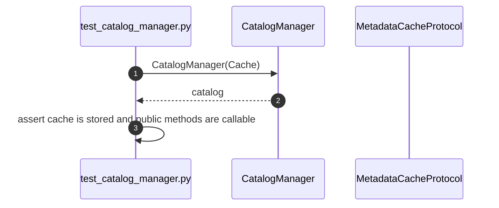

### 1.2 test_register_object()

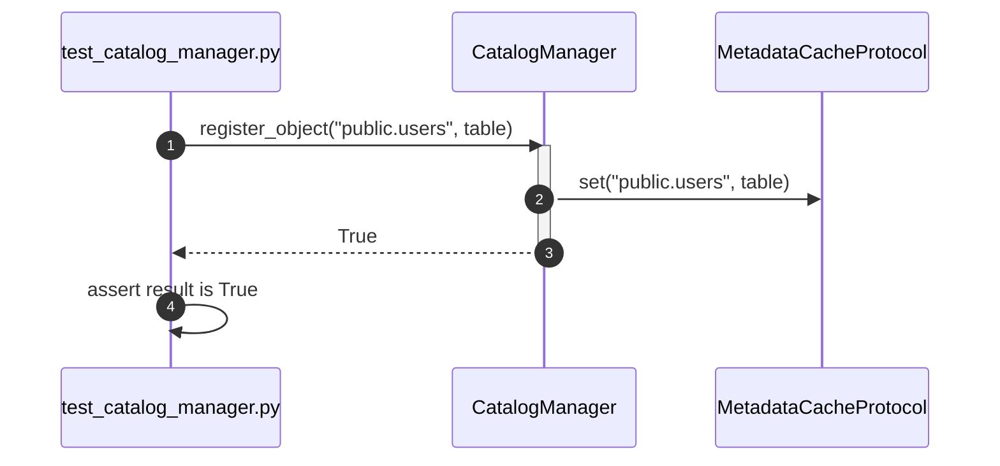

### 1.3 test_remove_object()

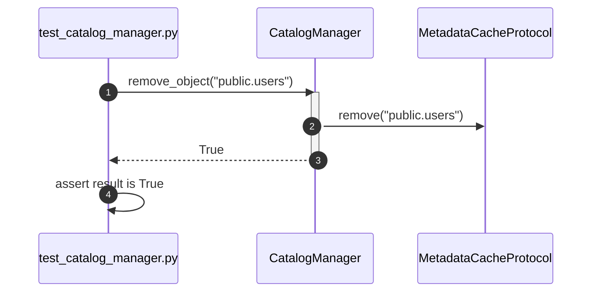

### 1.4 test_lookup_object()

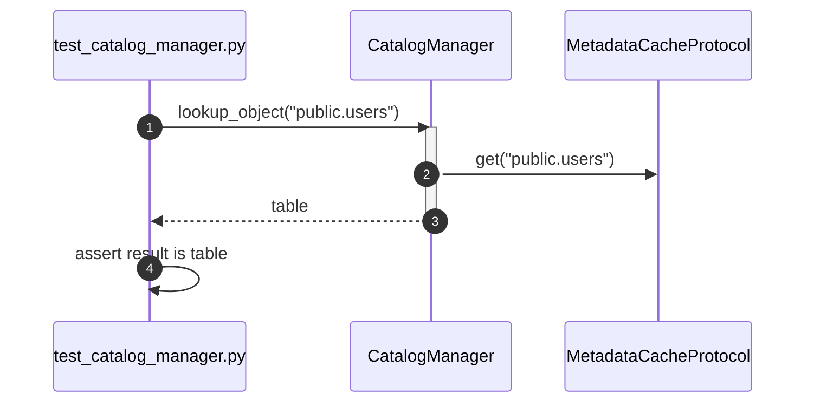

---

## 2. test_column.py

### 2.1 test_column_can_be_created()

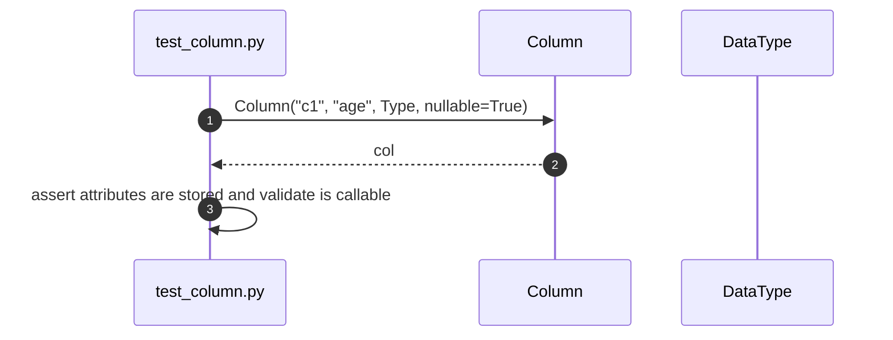

### 2.2 test_validate()

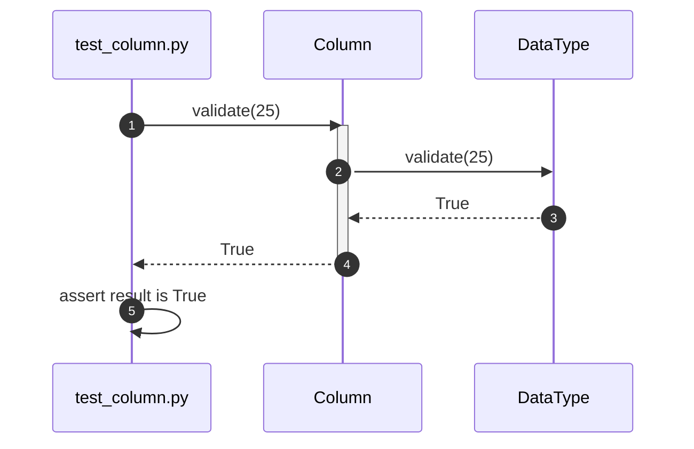

---

## 3. test_constraint.py

### 3.1 test_constraint_can_be_created()

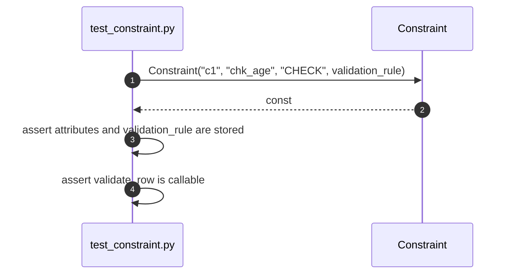

### 3.2 test_validate_row()

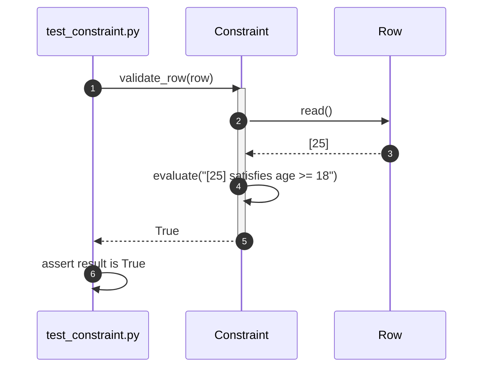

---

## 4. test_data_type_manager.py

### 4.1 test_register_data_type()

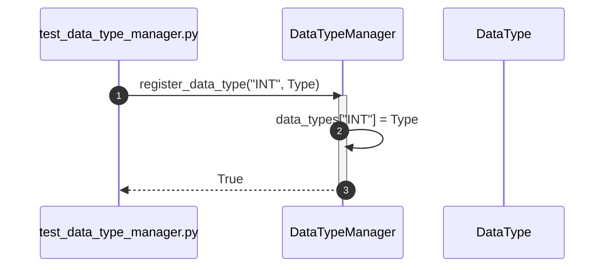

### 4.2 test_validate_value()

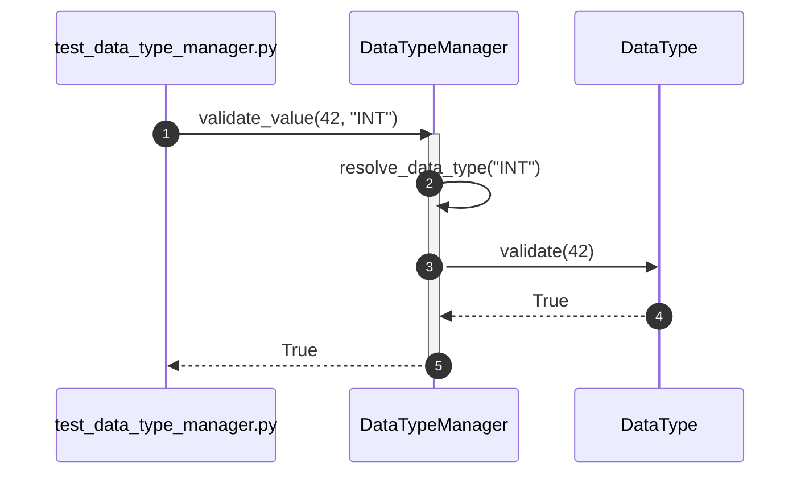

### 4.3 test_convert_value()

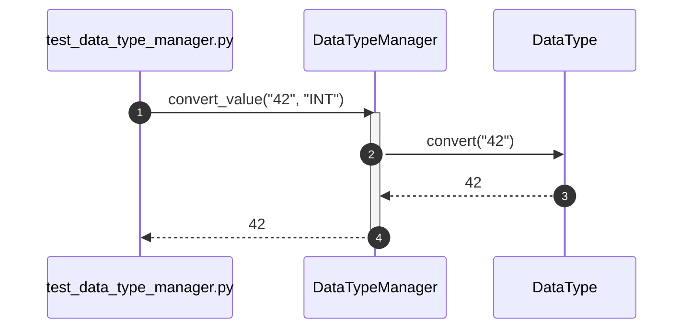

### 4.4 test_reject_invalid_value()

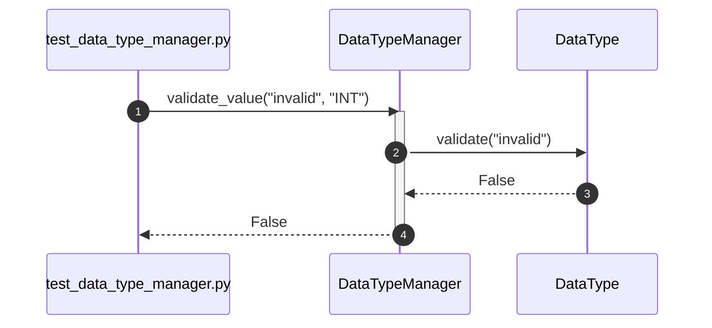

### 4.5 test_reject_invalid_conversion()

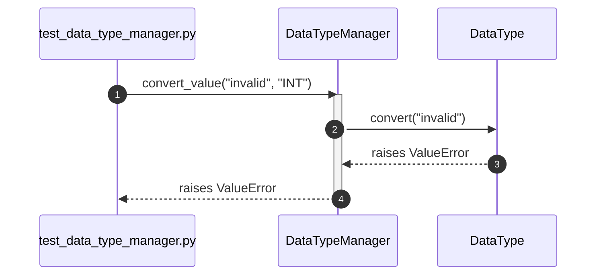

### 4.6 test_resolve_data_type()

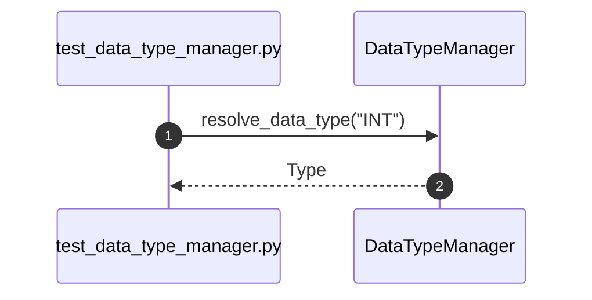

### 4.7 test_data_type_manager_can_be_created()

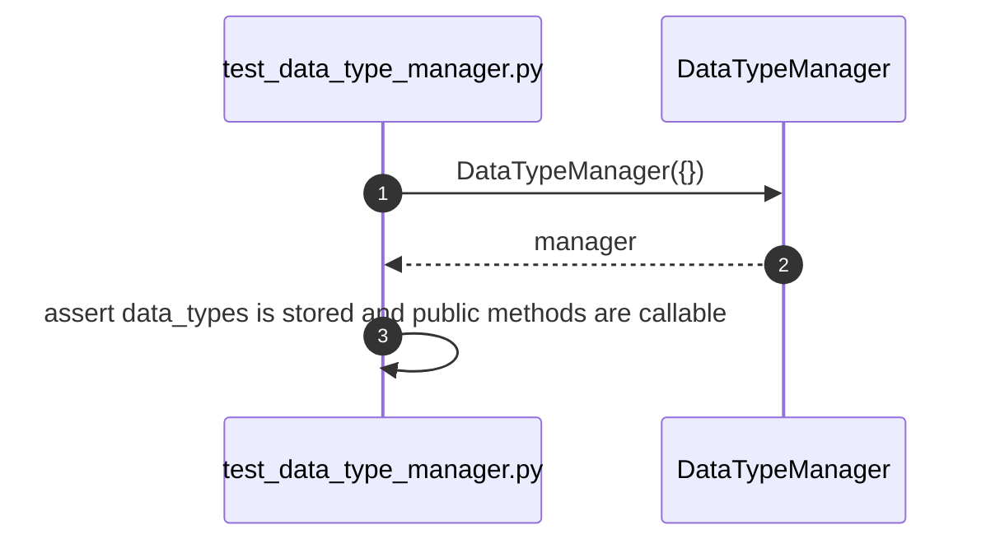

---

## 5. test_database.py

### 5.1 test_database_can_be_created()

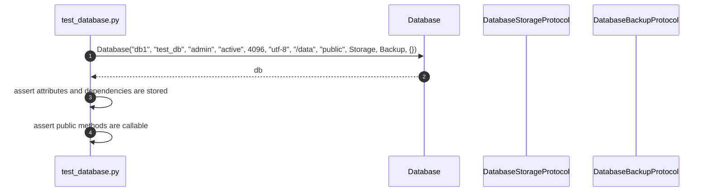

### 5.2 test_open()

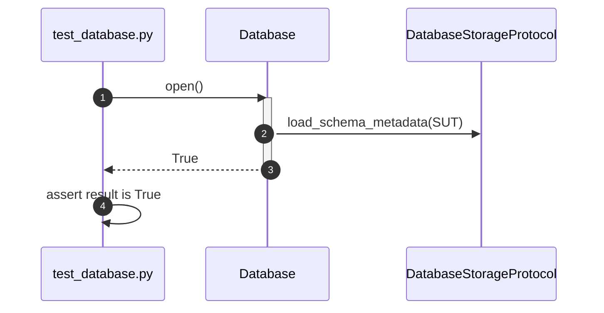

### 5.3 test_close()

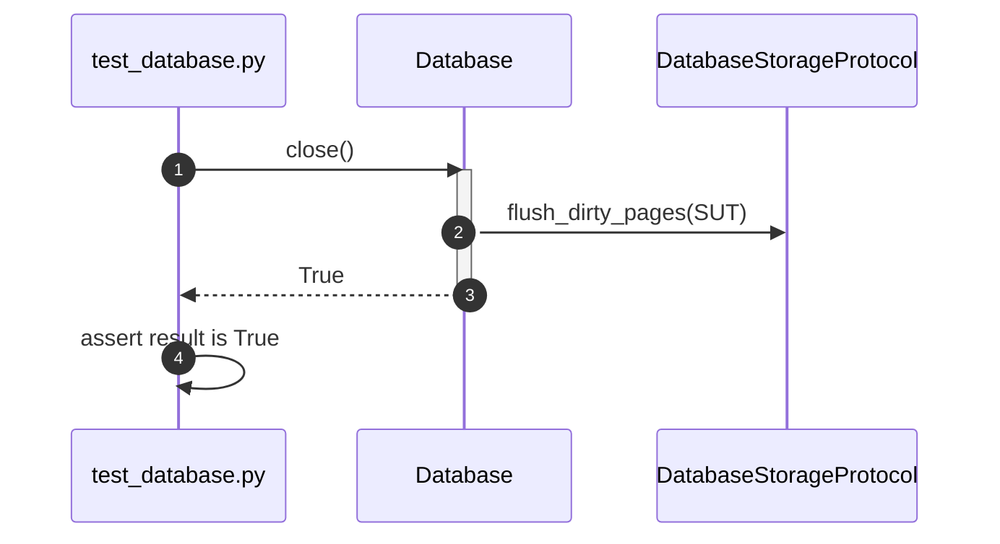

### 5.4 test_backup()


### 5.5 test_restore()

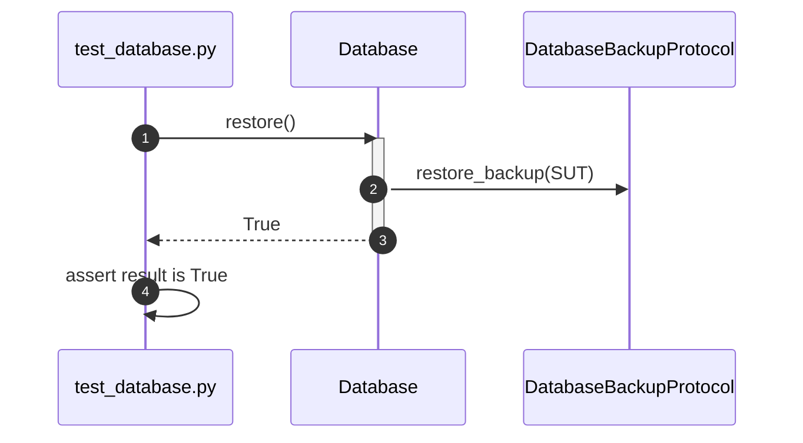

---

## 6. test_database_manager.py

### 6.1 test_create_database()

```mermaid
sequenceDiagram
    autonumber
    participant Test as test_database_manager.py
    participant SUT as DatabaseManager
    participant Factory as DatabaseFactoryProtocol

    Test->>SUT: create_database("sales")
    activate SUT
    SUT->>SUT: Contains("sales")
    SUT-->>SUT: False
    SUT->>Factory: create("sales")
    Factory-->>SUT: db
    SUT->>SUT: databases["sales"] = db
    SUT-->>Test: db
    deactivate SUT
```

### 6.2 test_get_database()

```mermaid
sequenceDiagram
    autonumber
    participant Test as test_database_manager.py
    participant SUT as DatabaseManager

    Test->>SUT: get_database("sales")
    SUT-->>Test: db
```

### 6.3 test_rename_database()

```mermaid
sequenceDiagram
    autonumber
    participant Test as test_database_manager.py
    participant SUT as DatabaseManager

    Test->>SUT: rename_database("sales", "marketing")
    activate SUT
    SUT->>SUT: move databases["sales"] to databases["marketing"]
    SUT-->>Test: True
    deactivate SUT
```

### 6.4 test_drop_database()

```mermaid
sequenceDiagram
    autonumber
    participant Test as test_database_manager.py
    participant SUT as DatabaseManager
    participant DB as Database
    participant Storage as DatabaseStorageProtocol

    Test->>SUT: drop_database("sales")
    activate SUT
    SUT->>DB: close()
    SUT->>Storage: delete_database_files("sales")
    SUT-->>Test: True
    deactivate SUT
```

### 6.5 test_reject_duplicate_database()

```mermaid
sequenceDiagram
    autonumber
    participant Test as test_database_manager.py
    participant SUT as DatabaseManager

    Test->>SUT: create_database("sales")
    activate SUT
    SUT->>SUT: Contains("sales")
    SUT-->>SUT: True
    SUT-->>Test: raises DuplicateDatabaseError
    deactivate SUT
```

### 6.6 test_reject_unknown_database()

```mermaid
sequenceDiagram
    autonumber
    participant Test as test_database_manager.py
    participant SUT as DatabaseManager

    Test->>SUT: get_database("unknown")
    SUT-->>Test: raises UnknownDatabaseError
```

### 6.7 test_database_manager_can_be_created()

```mermaid
sequenceDiagram
    autonumber
    participant Test as test_database_manager.py
    participant SUT as DatabaseManager
    participant Factory as DatabaseFactoryProtocol
    participant Storage as DatabaseStorageProtocol

    Test->>SUT: DatabaseManager(Factory, Storage, {})
    SUT-->>Test: manager
    Test->>Test: assert factory, storage and databases are stored
    Test->>Test: assert public methods are callable
```

---

## 7. test_database_server.py

### 7.1 test_database_server_can_be_created()

```mermaid
sequenceDiagram
    autonumber
    participant Test as test_database_server.py
    participant SUT as DatabaseServer

    Test->>SUT: DatabaseServer("srv1", "1.0", "stopped")
    SUT-->>Test: srv
    Test->>Test: assert attributes are stored and public methods are callable
```

### 7.2 test_start_server()

```mermaid
sequenceDiagram
    autonumber
    participant Test as test_database_server.py
    participant SUT as DatabaseServer

    Test->>SUT: start()
    activate SUT
    SUT->>SUT: set_status("running")
    SUT-->>Test: True
    deactivate SUT
```

### 7.3 test_stop_server()

```mermaid
sequenceDiagram
    autonumber
    participant Test as test_database_server.py
    participant SUT as DatabaseServer

    Test->>SUT: stop()
    activate SUT
    SUT->>SUT: set_status("stopped")
    SUT-->>Test: True
    deactivate SUT
```

### 7.4 test_restart_server()

```mermaid
sequenceDiagram
    autonumber
    participant Test as test_database_server.py
    participant SUT as DatabaseServer

    Test->>SUT: restart()
    activate SUT
    SUT->>SUT: stop()
    SUT->>SUT: start()
    SUT-->>Test: True
    deactivate SUT
```

---
## 8. test_foreign_key.py

### 8.1 test_foreign_key_can_be_created()

```mermaid
sequenceDiagram
    autonumber
    participant Test as test_foreign_key.py
    participant SUT as ForeignKey

    Test->>SUT: ForeignKey("fk1", ParentTable, "ref_col", "restrict", "cascade")
    SUT-->>Test: fk
    Test->>Test: assert foreign-key attributes are stored
    Test->>Test: assert validate_reference is callable
```

### 8.2 test_validate_reference()

```mermaid
sequenceDiagram
    autonumber
    participant Test as test_foreign_key.py
    participant SUT as ForeignKey
    participant ParentTable as Table

    Test->>SUT: validate_reference(42)
    activate SUT
    SUT->>ParentTable: check_key_exists(42)
    ParentTable-->>SUT: True
    SUT-->>Test: True
    deactivate SUT
```

---

## 9. test_index.py

### 9.1 test_index_can_be_created()

```mermaid
sequenceDiagram
    autonumber
    participant Test as test_index.py
    participant SUT as Index

    Test->>SUT: Index("idx1", "users_age", "B-Tree", True, {})
    SUT-->>Test: idx
    Test->>Test: assert attributes and entries are stored
    Test->>Test: assert public methods are callable
```

### 9.2 test_search()

```mermaid
sequenceDiagram
    autonumber
    participant Test as test_index.py
    participant SUT as Index

    Test->>SUT: search(25)
    activate SUT
    SUT->>SUT: traverse_tree(25)
    SUT-->>Test: ["P0:1"]
    deactivate SUT
```

### 9.3 test_insert_key()

```mermaid
sequenceDiagram
    autonumber
    participant Test as test_index.py
    participant SUT as Index

    Test->>SUT: insert_key(25, "P0:1")
    activate SUT
    SUT->>SUT: insert_into_tree(25, "P0:1")
    SUT-->>Test: True
    deactivate SUT
```

### 9.4 test_delete_key()

```mermaid
sequenceDiagram
    autonumber
    participant Test as test_index.py
    participant SUT as Index

    Test->>SUT: delete_key(25, "P0:1")
    activate SUT
    SUT->>SUT: remove_from_tree(25, "P0:1")
    SUT-->>Test: True
    deactivate SUT
```

---

## 10. test_partition.py

### 10.1 test_partition_can_be_created()

```mermaid
sequenceDiagram
    autonumber
    participant Test as test_partition.py
    participant SUT as Partition
    participant Allocator as StorageAllocatorProtocol

    Test->>SUT: Partition("p1", "part_1", (1, 100), Allocator)
    SUT-->>Test: p
    Test->>Test: assert attributes and allocator are stored
    Test->>Test: assert public methods are callable
```

### 10.2 test_allocate_partition_space()

```mermaid
sequenceDiagram
    autonumber
    participant Test as test_partition.py
    participant SUT as Partition
    participant Allocator as StorageAllocatorProtocol

    Test->>SUT: allocate_space()
    activate SUT
    SUT->>Allocator: allocate_space(SUT)
    SUT-->>Test: True
    deactivate SUT
```

### 10.3 test_release_partition_space()

```mermaid
sequenceDiagram
    autonumber
    participant Test as test_partition.py
    participant SUT as Partition
    participant Allocator as StorageAllocatorProtocol

    Test->>SUT: release_space()
    activate SUT
    SUT->>Allocator: release_space(SUT)
    SUT-->>Test: True
    deactivate SUT
```

---

## 11. test_row.py

### 11.1 test_row_can_be_created()

```mermaid
sequenceDiagram
    autonumber
    participant Test as test_row.py
    participant SUT as Row

    Test->>SUT: Row("row1", [1, "Alice"], "v1")
    SUT-->>Test: row
    Test->>Test: assert row attributes are stored
```

### 11.2 test_read_row_values()

```mermaid
sequenceDiagram
    autonumber
    participant Test as test_row.py
    participant SUT as Row

    Test->>SUT: read()
    SUT-->>Test: [1, "Alice"]
```

### 11.3 test_update_row_values()

```mermaid
sequenceDiagram
    autonumber
    participant Test as test_row.py
    participant SUT as Row

    Test->>SUT: update([1, "Bob"])
    activate SUT
    SUT->>SUT: set_values([1, "Bob"])
    SUT->>SUT: increment_version()
    SUT-->>Test: True
    deactivate SUT
```

---

## 12. test_schema.py

### 12.1 test_schema_can_be_created()

```mermaid
sequenceDiagram
    autonumber
    participant Test as test_schema.py
    participant SUT as Schema

    Test->>SUT: Schema("s1", "public", "admin", {})
    SUT-->>Test: sch
    Test->>Test: assert attributes and tables are stored
    Test->>Test: assert public methods are callable
```

### 12.2 test_create_table()

```mermaid
sequenceDiagram
    autonumber
    participant Test as test_schema.py
    participant SUT as Schema
    participant Table as Table

    Test->>SUT: create_table("users")
    activate SUT
    SUT->>Table: Table("", "users")
    Table-->>SUT: tbl
    SUT->>SUT: register_table("users", tbl)
    SUT-->>Test: tbl
    deactivate SUT
```

### 12.3 test_drop_table()

```mermaid
sequenceDiagram
    autonumber
    participant Test as test_schema.py
    participant SUT as Schema

    Test->>SUT: drop_table("users")
    activate SUT
    SUT->>SUT: unregister_table("users")
    SUT-->>Test: True
    deactivate SUT
```

---

## 13. test_stored_procedure.py

### 13.1 test_stored_procedure_can_be_created()

```mermaid
sequenceDiagram
    autonumber
    participant Test as test_stored_procedure.py
    participant SUT as StoredProcedure
    participant QE as QueryExecutorProtocol

    Test->>SUT: StoredProcedure("p1", "calculate_total", query_plan, QE)
    SUT-->>Test: proc
    Test->>Test: assert attributes and dependencies are stored
    Test->>Test: assert execute is callable
```

### 13.2 test_execute_stored_procedure()

```mermaid
sequenceDiagram
    autonumber
    participant Test as test_stored_procedure.py
    participant SUT as StoredProcedure
    participant QE as QueryExecutorProtocol

    Test->>SUT: execute()
    activate SUT
    SUT->>QE: execute(proc.query_plan)
    QE-->>SUT: results
    SUT-->>Test: results
    deactivate SUT
```

---

## 14. test_table.py

### 14.1 test_table_can_be_created()

```mermaid
sequenceDiagram
    autonumber
    participant Test as test_table.py
    participant SUT as Table

    Test->>SUT: Table("t1", "users", [], 0, {}, [], [])
    SUT-->>Test: tbl
    Test->>Test: assert attributes and collections are stored
    Test->>Test: assert public methods are callable
```

### 14.2 test_insert()

```mermaid
sequenceDiagram
    autonumber
    participant Test as test_table.py
    participant SUT as Table

    Test->>SUT: insert(row)
    activate SUT
    SUT->>SUT: check_constraints(row)
    SUT->>SUT: append_row(row)
    SUT-->>Test: True
    deactivate SUT
```

### 14.3 test_update_table_row()

```mermaid
sequenceDiagram
    autonumber
    participant Test as test_table.py
    participant SUT as Table
    participant Row as Row

    Test->>SUT: update("row1", {"name": "Bob"})
    activate SUT
    SUT->>Row: update({"name": "Bob"})
    Row-->>SUT: True
    SUT-->>Test: True
    deactivate SUT
```

### 14.4 test_delete()

```mermaid
sequenceDiagram
    autonumber
    participant Test as test_table.py
    participant SUT as Table

    Test->>SUT: delete("row1")
    activate SUT
    SUT->>SUT: mark_deleted("row1")
    SUT-->>Test: True
    deactivate SUT
```

### 14.5 test_truncate()

```mermaid
sequenceDiagram
    autonumber
    participant Test as test_table.py
    participant SUT as Table

    Test->>SUT: truncate()
    activate SUT
    SUT->>SUT: clear_all_data()
    SUT-->>Test: True
    deactivate SUT
```

---

## 15. test_trigger_manager.py

### 15.1 test_create_trigger()

```mermaid
sequenceDiagram
    autonumber
    participant Test as test_trigger_manager.py
    participant SUT as TriggerManager
    participant Trigger as Trigger

    Test->>SUT: create_trigger("tr1", "INSERT", "users", callback)
    activate SUT
    SUT->>Trigger: Trigger("tr1", "INSERT", "users", callback)
    Trigger-->>SUT: trigger
    SUT->>SUT: triggers["INSERT"].append(trigger)
    SUT-->>Test: trigger
    deactivate SUT
```

### 15.2 test_drop_trigger()

```mermaid
sequenceDiagram
    autonumber
    participant Test as test_trigger_manager.py
    participant SUT as TriggerManager

    Test->>SUT: drop_trigger("tr1")
    activate SUT
    SUT->>SUT: remove_trigger("tr1")
    SUT-->>Test: True
    deactivate SUT
```

### 15.3 test_bind_event()

```mermaid
sequenceDiagram
    autonumber
    participant Test as test_trigger_manager.py
    participant SUT as TriggerManager

    Test->>SUT: bind_event("INSERT", callback)
    SUT-->>Test: True
```

### 15.4 test_execute_trigger()

```mermaid
sequenceDiagram
    autonumber
    participant Test as test_trigger_manager.py
    participant SUT as TriggerManager
    participant Trigger as Trigger

    Test->>SUT: execute_triggers("INSERT", row)
    activate SUT
    SUT->>Trigger: fire(row)
    Trigger-->>SUT: True
    SUT-->>Test: True
    deactivate SUT
```

### 15.5 test_skip_unmatched_event()

```mermaid
sequenceDiagram
    autonumber
    participant Test as test_trigger_manager.py
    participant SUT as TriggerManager

    Test->>SUT: execute_triggers("UPDATE", row)
    SUT-->>Test: True
```

### 15.6 test_abort_on_trigger_failure()

```mermaid
sequenceDiagram
    autonumber
    participant Test as test_trigger_manager.py
    participant SUT as TriggerManager
    participant Trigger as Trigger

    Test->>SUT: execute_triggers("INSERT", row)
    activate SUT
    SUT->>Trigger: fire(row)
    Trigger-->>SUT: raises TriggerError
    SUT-->>Test: raises TriggerError
    deactivate SUT
```

### 15.7 test_reject_duplicate_trigger()

```mermaid
sequenceDiagram
    autonumber
    participant Test as test_trigger_manager.py
    participant SUT as TriggerManager

    Test->>SUT: create_trigger("tr1", "INSERT", "users", callback)
    SUT-->>Test: raises DuplicateTriggerError
```

### 15.8 test_trigger_manager_can_be_created()

```mermaid
sequenceDiagram
    autonumber
    participant Test as test_trigger_manager.py
    participant SUT as TriggerManager

    Test->>SUT: TriggerManager({})
    SUT-->>Test: manager
    Test->>Test: assert triggers is stored and public methods are callable
```

---

## 16. test_view.py

### 16.1 test_view_can_be_created()

```mermaid
sequenceDiagram
    autonumber
    participant Test as test_view.py
    participant SUT as View
    participant QE as QueryExecutorProtocol

    Test->>SUT: View("v1", "active_users", "SELECT * FROM users", QE, [])
    SUT-->>Test: view
    Test->>Test: assert attributes and dependencies are stored
    Test->>Test: assert public methods are callable
```

### 16.2 test_create_view()

```mermaid
sequenceDiagram
    autonumber
    participant Test as test_view.py
    participant SUT as View

    Test->>SUT: create_view()
    SUT-->>Test: True
```

### 16.3 test_refresh()

```mermaid
sequenceDiagram
    autonumber
    participant Test as test_view.py
    participant SUT as View
    participant QE as QueryExecutorProtocol

    Test->>SUT: refresh()
    activate SUT
    SUT->>QE: execute("SELECT * FROM users")
    QE-->>SUT: updated_data
    SUT->>SUT: update_cached_results(updated_data)
    SUT-->>Test: True
    deactivate SUT
```

---

## 17. test_data_type.py

### 17.1 test_data_type_stores_name_validator_and_converter()

```mermaid
sequenceDiagram
    autonumber
    participant Test as test_data_type.py
    participant SUT as DataType

    Test->>SUT: DataType("INT", validator, converter)
    SUT-->>Test: data_type
    Test->>Test: assert stored attributes are injected objects
```

### 17.2 test_data_type_exposes_validate_method()

```mermaid
sequenceDiagram
    autonumber
    participant Test as test_data_type.py
    participant SUT as DataType

    Test->>SUT: DataType("INT", validator, converter)
    SUT-->>Test: data_type
    Test->>Test: assert callable(data_type.validate)
```

### 17.3 test_data_type_exposes_convert_method()

```mermaid
sequenceDiagram
    autonumber
    participant Test as test_data_type.py
    participant SUT as DataType

    Test->>SUT: DataType("INT", validator, converter)
    SUT-->>Test: data_type
    Test->>Test: assert callable(data_type.convert)
```

---

## 18. test_trigger.py

### 18.1 test_trigger_stores_name_event_table_and_callback()

```mermaid
sequenceDiagram
    autonumber
    participant Test as test_trigger.py
    participant SUT as Trigger

    Test->>SUT: Trigger("tr1", "INSERT", "users", callback)
    SUT-->>Test: trigger
    Test->>Test: assert stored attributes match constructor arguments
```

### 18.2 test_trigger_exposes_fire_method()

```mermaid
sequenceDiagram
    autonumber
    participant Test as test_trigger.py
    participant SUT as Trigger

    Test->>SUT: Trigger("tr1", "INSERT", "users", callback)
    SUT-->>Test: trigger
    Test->>Test: assert callable(trigger.fire)
```

---

## 19. test_dependencies.py

### 19.1 test_metadata_cache_stub_matches_protocol()

```mermaid
sequenceDiagram
    autonumber
    participant Test as test_dependencies.py
    participant Protocol as MetadataCacheProtocol

    Test->>Protocol: isinstance(MetadataCacheStub(), MetadataCacheProtocol)
    Protocol-->>Test: True
```

### 19.2 test_database_storage_stub_matches_protocol()

```mermaid
sequenceDiagram
    autonumber
    participant Test as test_dependencies.py
    participant Protocol as DatabaseStorageProtocol

    Test->>Protocol: isinstance(DatabaseStorageStub(), DatabaseStorageProtocol)
    Protocol-->>Test: True
```

### 19.3 test_database_backup_stub_matches_protocol()

```mermaid
sequenceDiagram
    autonumber
    participant Test as test_dependencies.py
    participant Protocol as DatabaseBackupProtocol

    Test->>Protocol: isinstance(DatabaseBackupStub(), DatabaseBackupProtocol)
    Protocol-->>Test: True
```

### 19.4 test_storage_allocator_stub_matches_protocol()

```mermaid
sequenceDiagram
    autonumber
    participant Test as test_dependencies.py
    participant Protocol as StorageAllocatorProtocol

    Test->>Protocol: isinstance(StorageAllocatorStub(), StorageAllocatorProtocol)
    Protocol-->>Test: True
```

### 19.5 test_query_executor_stub_matches_protocol()

```mermaid
sequenceDiagram
    autonumber
    participant Test as test_dependencies.py
    participant Protocol as QueryExecutorProtocol

    Test->>Protocol: isinstance(QueryExecutorStub(), QueryExecutorProtocol)
    Protocol-->>Test: True
```

### 19.6 test_database_factory_stub_matches_protocol()

```mermaid
sequenceDiagram
    autonumber
    participant Test as test_dependencies.py
    participant Protocol as DatabaseFactoryProtocol

    Test->>Protocol: isinstance(DatabaseFactoryStub(), DatabaseFactoryProtocol)
    Protocol-->>Test: True
```

---

## 20. test_exceptions.py

### 20.1 test_duplicate_database_error_inherits_exception()

```mermaid
sequenceDiagram
    autonumber
    participant Test as test_exceptions.py
    participant Error as DuplicateDatabaseError

    Test->>Error: issubclass(DuplicateDatabaseError, Exception)
    Error-->>Test: True
```

### 20.2 test_unknown_database_error_inherits_exception()

```mermaid
sequenceDiagram
    autonumber
    participant Test as test_exceptions.py
    participant Error as UnknownDatabaseError

    Test->>Error: issubclass(UnknownDatabaseError, Exception)
    Error-->>Test: True
```

### 20.3 test_trigger_error_inherits_exception()

```mermaid
sequenceDiagram
    autonumber
    participant Test as test_exceptions.py
    participant Error as TriggerError

    Test->>Error: issubclass(TriggerError, Exception)
    Error-->>Test: True
```

### 20.4 test_duplicate_trigger_error_inherits_exception()

```mermaid
sequenceDiagram
    autonumber
    participant Test as test_exceptions.py
    participant Error as DuplicateTriggerError

    Test->>Error: issubclass(DuplicateTriggerError, Exception)
    Error-->>Test: True
```

---
