# Database Object Unit Test Sequences

---

## 1. test_catalog_manager.py

### 1.1 test_catalog_manager_can_be_created()

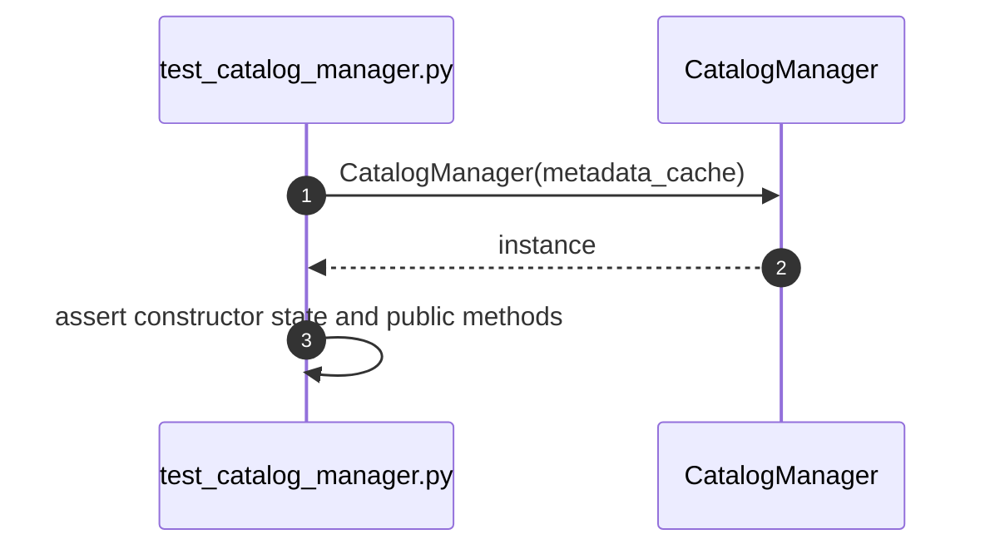
```mermaid
sequenceDiagram
    autonumber
    participant Test as test_catalog_manager.py
    participant SUT as CatalogManager

    Test->>SUT: CatalogManager(metadata_cache)
    SUT-->>Test: instance
    Test->>Test: assert constructor state and public methods
```

### 1.2 test_register_object()

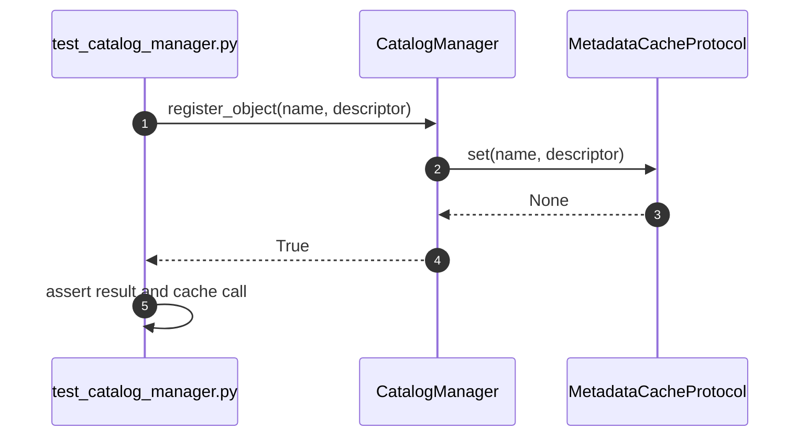
```mermaid
sequenceDiagram
    autonumber
    participant Test as test_catalog_manager.py
    participant SUT as CatalogManager
    participant Cache as MetadataCacheProtocol

    Test->>SUT: register_object(name, descriptor)
    SUT->>Cache: set(name, descriptor)
    Cache-->>SUT: None
    SUT-->>Test: True
    Test->>Test: assert result and cache call
```

### 1.3 test_remove_object()

```mermaid
sequenceDiagram
    autonumber
    participant Test as test_catalog_manager.py
    participant SUT as CatalogManager
    participant Cache as MetadataCacheProtocol

    Test->>SUT: remove_object(name)
    SUT->>Cache: remove(name)
    Cache-->>SUT: None
    SUT-->>Test: True
    Test->>Test: assert result and cache call
```

### 1.4 test_lookup_object()

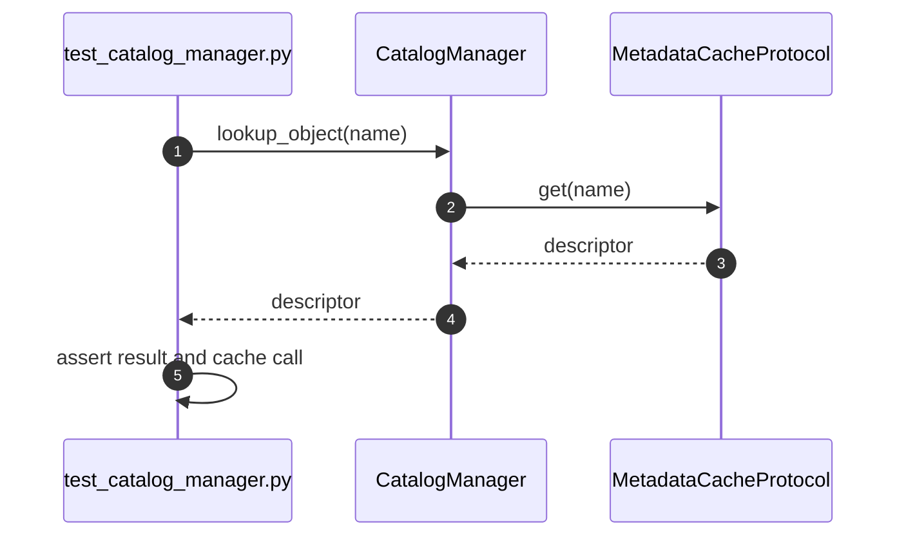
```mermaid
sequenceDiagram
    autonumber
    participant Test as test_catalog_manager.py
    participant SUT as CatalogManager
    participant Cache as MetadataCacheProtocol

    Test->>SUT: lookup_object(name)
    SUT->>Cache: get(name)
    Cache-->>SUT: descriptor
    SUT-->>Test: descriptor
    Test->>Test: assert result and cache call
```

---

## 2. test_column.py

### 2.1 test_column_can_be_created()

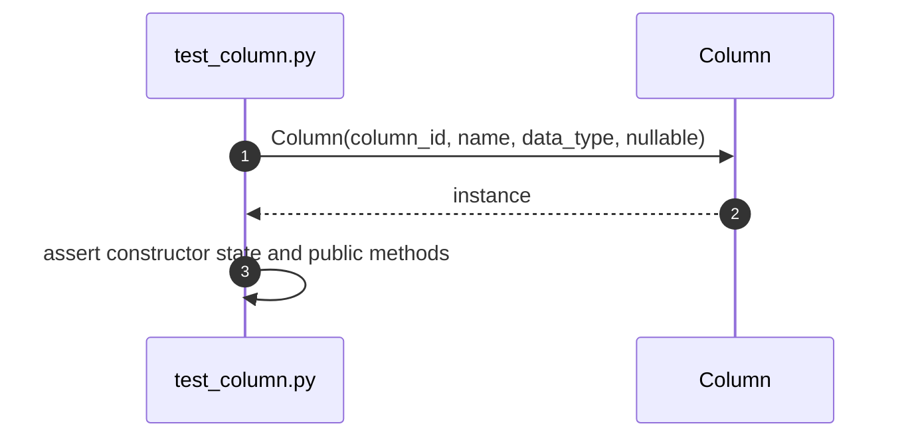
```mermaid
sequenceDiagram
    autonumber
    participant Test as test_column.py
    participant SUT as Column

    Test->>SUT: Column(column_id, name, data_type, nullable)
    SUT-->>Test: instance
    Test->>Test: assert constructor state and public methods
```

### 2.2 test_validate()

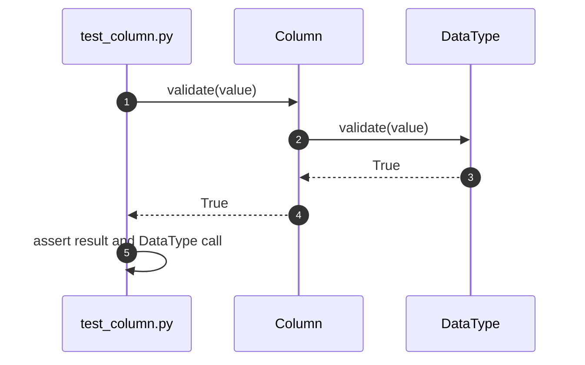
```mermaid
sequenceDiagram
    autonumber
    participant Test as test_column.py
    participant SUT as Column
    participant Type as DataType

    Test->>SUT: validate(value)
    SUT->>Type: validate(value)
    Type-->>SUT: True
    SUT-->>Test: True
    Test->>Test: assert result and DataType call
```

---

## 3. test_constraint.py

### 3.1 test_constraint_can_be_created()

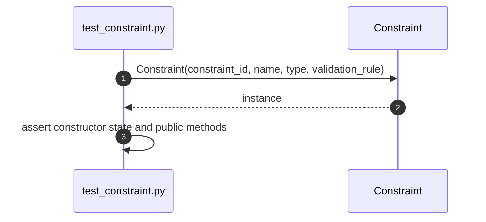
```mermaid
sequenceDiagram
    autonumber
    participant Test as test_constraint.py
    participant SUT as Constraint

    Test->>SUT: Constraint(constraint_id, name, type, validation_rule)
    SUT-->>Test: instance
    Test->>Test: assert constructor state and public methods
```

### 3.2 test_validate_row()

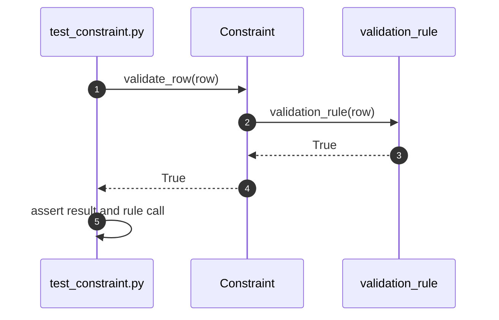
```mermaid
sequenceDiagram
    autonumber
    participant Test as test_constraint.py
    participant SUT as Constraint
    participant Rule as validation_rule

    Test->>SUT: validate_row(row)
    SUT->>Rule: validation_rule(row)
    Rule-->>SUT: True
    SUT-->>Test: True
    Test->>Test: assert result and rule call
```

---

## 4. test_data_type.py

### 4.1 test_data_type_can_be_created()

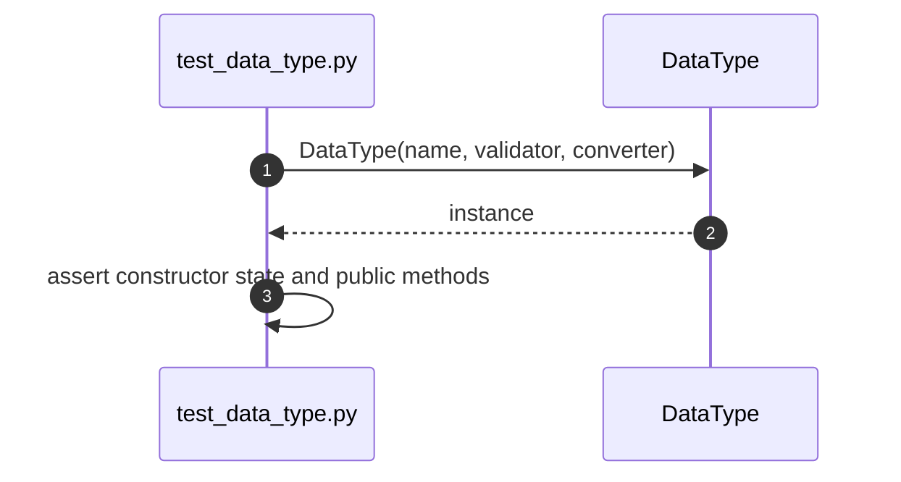
```mermaid
sequenceDiagram
    autonumber
    participant Test as test_data_type.py
    participant SUT as DataType

    Test->>SUT: DataType(name, validator, converter)
    SUT-->>Test: instance
    Test->>Test: assert constructor state and public methods
```

### 4.2 test_validate()

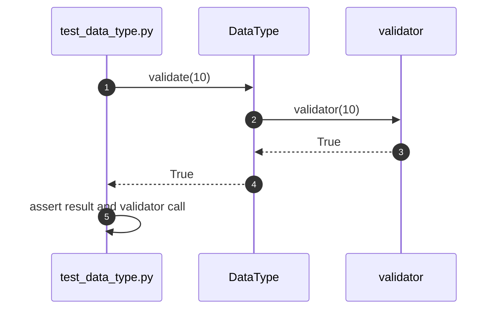
```mermaid
sequenceDiagram
    autonumber
    participant Test as test_data_type.py
    participant SUT as DataType
    participant Validator as validator

    Test->>SUT: validate(10)
    SUT->>Validator: validator(10)
    Validator-->>SUT: True
    SUT-->>Test: True
    Test->>Test: assert result and validator call
```

### 4.3 test_convert()

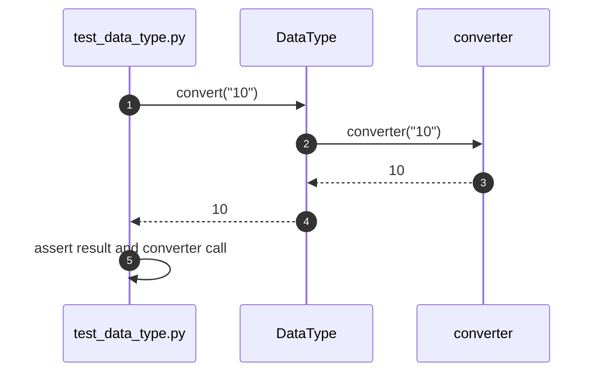
```mermaid
sequenceDiagram
    autonumber
    participant Test as test_data_type.py
    participant SUT as DataType
    participant Converter as converter

    Test->>SUT: convert("10")
    SUT->>Converter: converter("10")
    Converter-->>SUT: 10
    SUT-->>Test: 10
    Test->>Test: assert result and converter call
```

---

## 5. test_data_type_manager.py

### 5.1 test_data_type_manager_can_be_created()

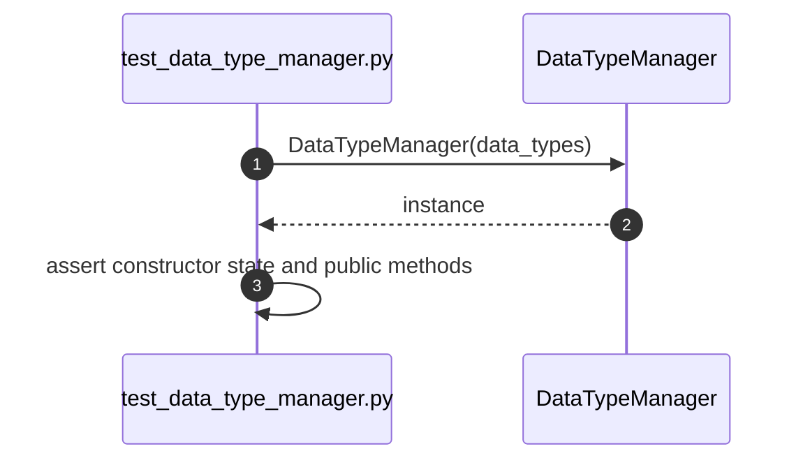
```mermaid
sequenceDiagram
    autonumber
    participant Test as test_data_type_manager.py
    participant SUT as DataTypeManager

    Test->>SUT: DataTypeManager(data_types)
    SUT-->>Test: instance
    Test->>Test: assert constructor state and public methods
```

### 5.2 test_register_data_type()

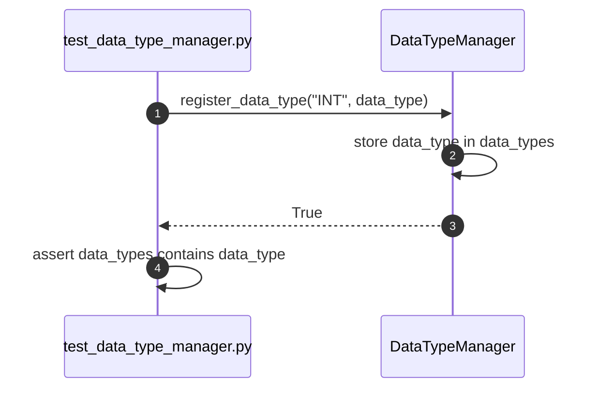
```mermaid
sequenceDiagram
    autonumber
    participant Test as test_data_type_manager.py
    participant SUT as DataTypeManager

    Test->>SUT: register_data_type("INT", data_type)
    SUT->>SUT: store data_type in data_types
    SUT-->>Test: True
    Test->>Test: assert data_types contains data_type
```

### 5.3 test_validate_value()

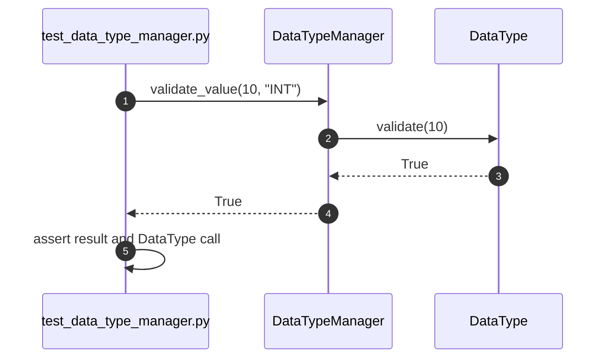
```mermaid
sequenceDiagram
    autonumber
    participant Test as test_data_type_manager.py
    participant SUT as DataTypeManager
    participant Type as DataType

    Test->>SUT: validate_value(10, "INT")
    SUT->>Type: validate(10)
    Type-->>SUT: True
    SUT-->>Test: True
    Test->>Test: assert result and DataType call
```

### 5.4 test_convert_value()

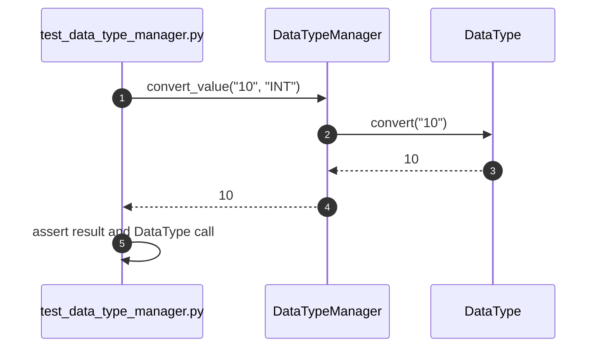
```mermaid
sequenceDiagram
    autonumber
    participant Test as test_data_type_manager.py
    participant SUT as DataTypeManager
    participant Type as DataType

    Test->>SUT: convert_value("10", "INT")
    SUT->>Type: convert("10")
    Type-->>SUT: 10
    SUT-->>Test: 10
    Test->>Test: assert result and DataType call
```

### 5.5 test_resolve_data_type()

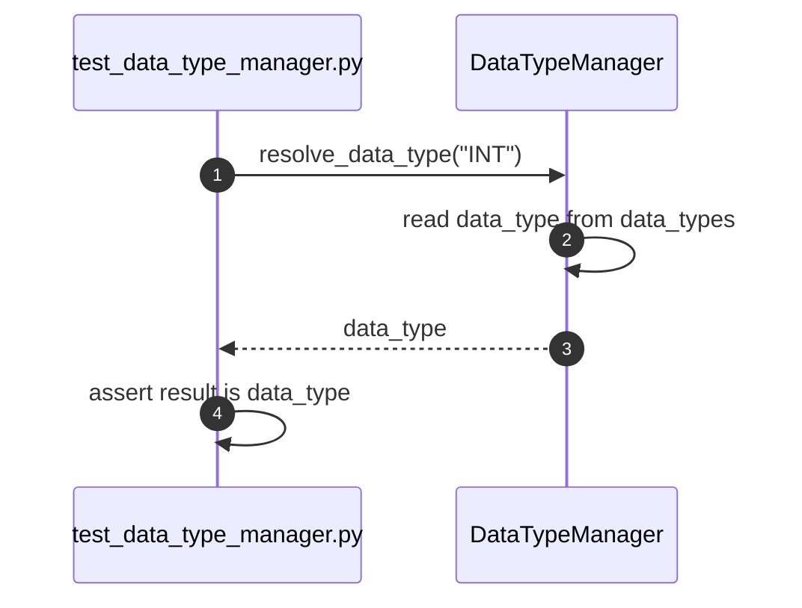
```mermaid
sequenceDiagram
    autonumber
    participant Test as test_data_type_manager.py
    participant SUT as DataTypeManager

    Test->>SUT: resolve_data_type("INT")
    SUT->>SUT: read data_type from data_types
    SUT-->>Test: data_type
    Test->>Test: assert result is data_type
```

---

## 6. test_database.py

### 6.1 test_database_can_be_created()

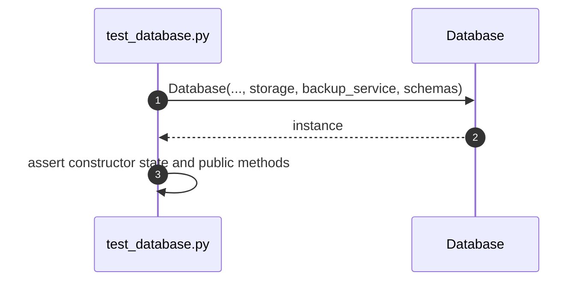
```mermaid
sequenceDiagram
    autonumber
    participant Test as test_database.py
    participant SUT as Database

    Test->>SUT: Database(..., storage, backup_service, schemas)
    SUT-->>Test: instance
    Test->>Test: assert constructor state and public methods
```

### 6.2 test_open()

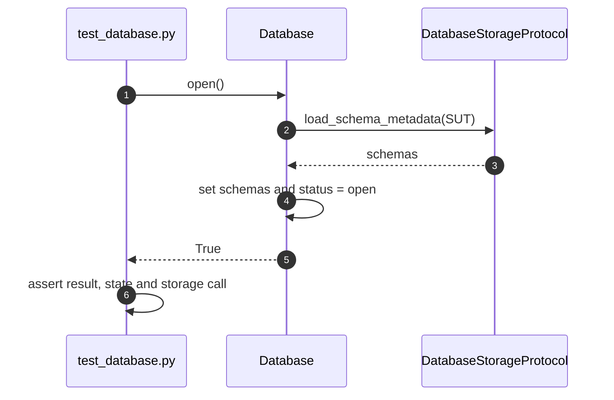
```mermaid
sequenceDiagram
    autonumber
    participant Test as test_database.py
    participant SUT as Database
    participant Storage as DatabaseStorageProtocol

    Test->>SUT: open()
    SUT->>Storage: load_schema_metadata(SUT)
    Storage-->>SUT: schemas
    SUT->>SUT: set schemas and status = open
    SUT-->>Test: True
    Test->>Test: assert result, state and storage call
```

### 6.3 test_close()

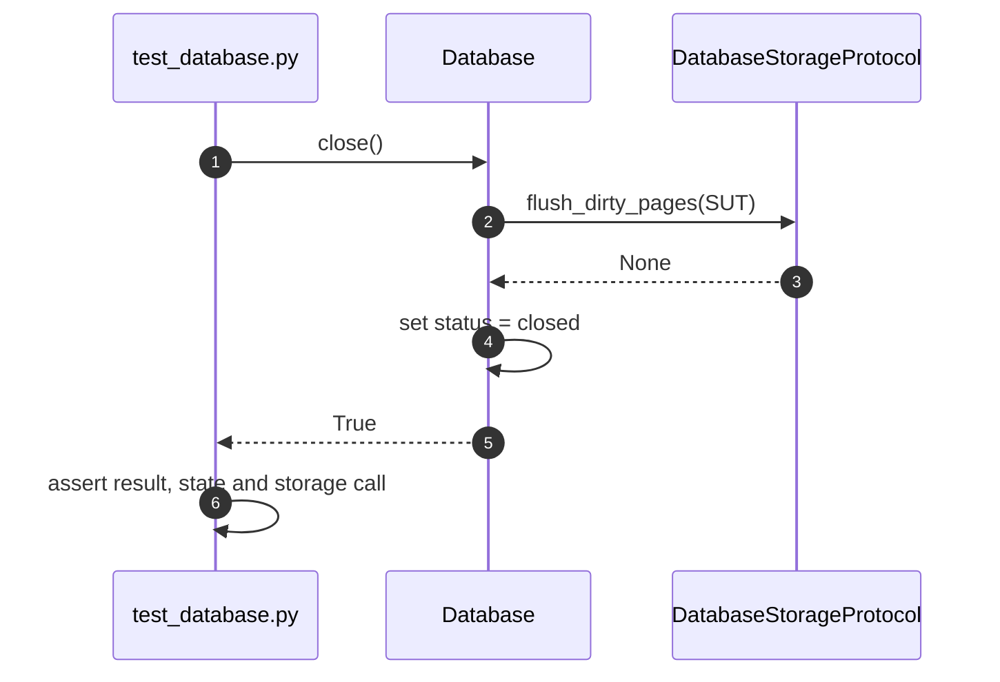
```mermaid
sequenceDiagram
    autonumber
    participant Test as test_database.py
    participant SUT as Database
    participant Storage as DatabaseStorageProtocol

    Test->>SUT: close()
    SUT->>Storage: flush_dirty_pages(SUT)
    Storage-->>SUT: None
    SUT->>SUT: set status = closed
    SUT-->>Test: True
    Test->>Test: assert result, state and storage call
```

### 6.4 test_backup()

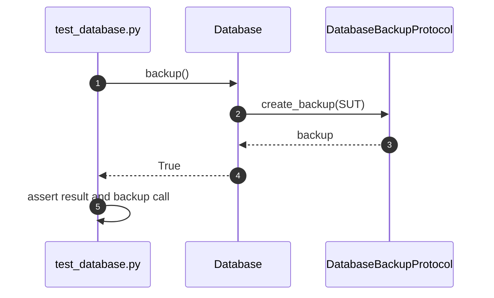
```mermaid
sequenceDiagram
    autonumber
    participant Test as test_database.py
    participant SUT as Database
    participant Backup as DatabaseBackupProtocol

    Test->>SUT: backup()
    SUT->>Backup: create_backup(SUT)
    Backup-->>SUT: backup
    SUT-->>Test: True
    Test->>Test: assert result and backup call
```

### 6.5 test_restore()

```mermaid
sequenceDiagram
    autonumber
    participant Test as test_database.py
    participant SUT as Database
    participant Backup as DatabaseBackupProtocol

    Test->>SUT: restore()
    SUT->>Backup: restore_backup(SUT)
    Backup-->>SUT: backup
    SUT-->>Test: True
    Test->>Test: assert result and restore call
```

### 6.6 test_create_schema()

```mermaid
sequenceDiagram
    autonumber
    participant Test as test_database.py
    participant SUT as Database

    Test->>SUT: create_schema(schema)
    SUT->>SUT: store schema in schemas
    SUT-->>Test: True
    Test->>Test: assert schemas contains schema
```

### 6.7 test_get_schema()

```mermaid
sequenceDiagram
    autonumber
    participant Test as test_database.py
    participant SUT as Database

    Test->>SUT: get_schema("public")
    SUT->>SUT: read schema from schemas
    SUT-->>Test: schema
    Test->>Test: assert result is schema
```

### 6.8 test_rename_schema()

```mermaid
sequenceDiagram
    autonumber
    participant Test as test_database.py
    participant SUT as Database

    Test->>SUT: rename_schema("public", "application")
    SUT->>SUT: rename schema and move dictionary key
    SUT-->>Test: True
    Test->>Test: assert schema name and schemas keys
```

### 6.9 test_drop_schema()

```mermaid
sequenceDiagram
    autonumber
    participant Test as test_database.py
    participant SUT as Database

    Test->>SUT: drop_schema("public")
    SUT->>SUT: remove schema from schemas
    SUT-->>Test: True
    Test->>Test: assert schemas no longer contains schema
```

---

## 7. test_database_manager.py

### 7.1 test_database_manager_can_be_created()

```mermaid
sequenceDiagram
    autonumber
    participant Test as test_database_manager.py
    participant SUT as DatabaseManager

    Test->>SUT: DatabaseManager(factory, storage, databases)
    SUT-->>Test: instance
    Test->>Test: assert constructor state and public methods
```

### 7.2 test_create_database()

```mermaid
sequenceDiagram
    autonumber
    participant Test as test_database_manager.py
    participant SUT as DatabaseManager
    participant Factory as DatabaseFactoryProtocol

    Test->>SUT: create_database("test_db")
    SUT->>Factory: create("test_db")
    Factory-->>SUT: database
    SUT->>SUT: store database
    SUT-->>Test: database
    Test->>Test: assert result, registry and factory call
```

### 7.3 test_get_database()

```mermaid
sequenceDiagram
    autonumber
    participant Test as test_database_manager.py
    participant SUT as DatabaseManager

    Test->>SUT: get_database("test_db")
    SUT->>SUT: read database from databases
    SUT-->>Test: database
    Test->>Test: assert result is database
```

### 7.4 test_rename_database()

```mermaid
sequenceDiagram
    autonumber
    participant Test as test_database_manager.py
    participant SUT as DatabaseManager

    Test->>SUT: rename_database("test_db", "renamed_db")
    SUT->>SUT: rename database and move registry key
    SUT-->>Test: True
    Test->>Test: assert database name and registry keys
```

### 7.5 test_drop_database()

```mermaid
sequenceDiagram
    autonumber
    participant Test as test_database_manager.py
    participant SUT as DatabaseManager
    participant Storage as DatabaseStorageProtocol

    Test->>SUT: drop_database("test_db")
    SUT->>SUT: remove database from registry
    SUT->>Storage: delete_database_files("test_db")
    Storage-->>SUT: None
    SUT-->>Test: True
    Test->>Test: assert registry and storage call
```

---

## 8. test_database_server.py

### 8.1 test_database_server_can_be_created()

```mermaid
sequenceDiagram
    autonumber
    participant Test as test_database_server.py
    participant SUT as DatabaseServer

    Test->>SUT: DatabaseServer(server_id, version, status)
    SUT-->>Test: instance
    Test->>Test: assert constructor state and public methods
```

### 8.2 test_start()

```mermaid
sequenceDiagram
    autonumber
    participant Test as test_database_server.py
    participant SUT as DatabaseServer

    Test->>SUT: start()
    SUT->>SUT: set status = running
    SUT-->>Test: True
    Test->>Test: assert result and status
```

### 8.3 test_stop()

```mermaid
sequenceDiagram
    autonumber
    participant Test as test_database_server.py
    participant SUT as DatabaseServer

    Test->>SUT: stop()
    SUT->>SUT: set status = stopped
    SUT-->>Test: True
    Test->>Test: assert result and status
```

### 8.4 test_restart()

```mermaid
sequenceDiagram
    autonumber
    participant Test as test_database_server.py
    participant SUT as DatabaseServer

    Test->>SUT: restart()
    SUT->>SUT: restart and keep status = running
    SUT-->>Test: True
    Test->>Test: assert result and status
```

---

## 9. test_foreign_key.py

### 9.1 test_foreign_key_can_be_created()

```mermaid
sequenceDiagram
    autonumber
    participant Test as test_foreign_key.py
    participant SUT as ForeignKey

    Test->>SUT: ForeignKey(id, table, column, on_delete, on_update)
    SUT-->>Test: instance
    Test->>Test: assert constructor state and public methods
```

### 9.2 test_validate_reference()

```mermaid
sequenceDiagram
    autonumber
    participant Test as test_foreign_key.py
    participant SUT as ForeignKey
    participant Table as reference_table

    Test->>SUT: validate_reference(value)
    SUT->>Table: check_key_exists(value)
    Table-->>SUT: True
    SUT-->>Test: True
    Test->>Test: assert result and Table call
```

---

## 10. test_index.py

### 10.1 test_index_can_be_created()

```mermaid
sequenceDiagram
    autonumber
    participant Test as test_index.py
    participant SUT as Index

    Test->>SUT: Index(index_id, name, type, unique, entries)
    SUT-->>Test: instance
    Test->>Test: assert constructor state and public methods
```

### 10.2 test_search()

```mermaid
sequenceDiagram
    autonumber
    participant Test as test_index.py
    participant SUT as Index

    Test->>SUT: search(25)
    SUT->>SUT: read row_ids from entries
    SUT-->>Test: row_ids
    Test->>Test: assert result is row_ids
```

### 10.3 test_insert_key()

```mermaid
sequenceDiagram
    autonumber
    participant Test as test_index.py
    participant SUT as Index

    Test->>SUT: insert_key(25, "r1")
    SUT->>SUT: store row_id in entries[25]
    SUT-->>Test: True
    Test->>Test: assert entries[25] contains row_id
```

### 10.4 test_delete_key()

```mermaid
sequenceDiagram
    autonumber
    participant Test as test_index.py
    participant SUT as Index

    Test->>SUT: delete_key(25, "r1")
    SUT->>SUT: remove row_id from entries[25]
    SUT-->>Test: True
    Test->>Test: assert entries[25] no longer contains row_id
```

---

## 11. test_partition.py

### 11.1 test_partition_can_be_created()

```mermaid
sequenceDiagram
    autonumber
    participant Test as test_partition.py
    participant SUT as Partition

    Test->>SUT: Partition(id, name, range, storage_allocator)
    SUT-->>Test: instance
    Test->>Test: assert constructor state and public methods
```

### 11.2 test_allocate_space()

```mermaid
sequenceDiagram
    autonumber
    participant Test as test_partition.py
    participant SUT as Partition
    participant Allocator as StorageAllocatorProtocol

    Test->>SUT: allocate_space()
    SUT->>Allocator: allocate_space(SUT)
    Allocator-->>SUT: allocation
    SUT-->>Test: True
    Test->>Test: assert result and allocator call
```

### 11.3 test_release_space()

```mermaid
sequenceDiagram
    autonumber
    participant Test as test_partition.py
    participant SUT as Partition
    participant Allocator as StorageAllocatorProtocol

    Test->>SUT: release_space()
    SUT->>Allocator: release_space(SUT)
    Allocator-->>SUT: None
    SUT-->>Test: True
    Test->>Test: assert result and allocator call
```

---

## 12. test_row.py

### 12.1 test_row_can_be_created()

```mermaid
sequenceDiagram
    autonumber
    participant Test as test_row.py
    participant SUT as Row

    Test->>SUT: Row(row_id, values, version)
    SUT-->>Test: instance
    Test->>Test: assert constructor state and public methods
```

### 12.2 test_read()

```mermaid
sequenceDiagram
    autonumber
    participant Test as test_row.py
    participant SUT as Row

    Test->>SUT: read()
    SUT-->>Test: values
    Test->>Test: assert result is stored values
```

### 12.3 test_update()

```mermaid
sequenceDiagram
    autonumber
    participant Test as test_row.py
    participant SUT as Row

    Test->>SUT: update(new_values)
    SUT->>SUT: replace values
    SUT-->>Test: True
    Test->>Test: assert result and stored values
```

---

## 13. test_schema.py

### 13.1 test_schema_can_be_created()

```mermaid
sequenceDiagram
    autonumber
    participant Test as test_schema.py
    participant SUT as Schema

    Test->>SUT: Schema(schema_id, name, owner, tables)
    SUT-->>Test: instance
    Test->>Test: assert constructor state and public methods
```

### 13.2 test_create_table()

```mermaid
sequenceDiagram
    autonumber
    participant Test as test_schema.py
    participant SUT as Schema

    Test->>SUT: create_table(table)
    SUT->>SUT: store table in tables
    SUT-->>Test: True
    Test->>Test: assert tables contains table
```

### 13.3 test_get_table()

```mermaid
sequenceDiagram
    autonumber
    participant Test as test_schema.py
    participant SUT as Schema

    Test->>SUT: get_table("users")
    SUT->>SUT: read table from tables
    SUT-->>Test: table
    Test->>Test: assert result is table
```

### 13.4 test_rename_table()

```mermaid
sequenceDiagram
    autonumber
    participant Test as test_schema.py
    participant SUT as Schema

    Test->>SUT: rename_table("users", "customers")
    SUT->>SUT: rename table and move dictionary key
    SUT-->>Test: True
    Test->>Test: assert table name and tables keys
```

### 13.5 test_drop_table()

```mermaid
sequenceDiagram
    autonumber
    participant Test as test_schema.py
    participant SUT as Schema

    Test->>SUT: drop_table("users")
    SUT->>SUT: remove table from tables
    SUT-->>Test: True
    Test->>Test: assert tables no longer contains table
```

### 13.6 test_create_view()

```mermaid
sequenceDiagram
    autonumber
    participant Test as test_schema.py
    participant SUT as Schema

    Test->>SUT: create_view(view)
    SUT->>SUT: store view in views
    SUT-->>Test: True
    Test->>Test: assert views contains view
```

### 13.7 test_get_view()

```mermaid
sequenceDiagram
    autonumber
    participant Test as test_schema.py
    participant SUT as Schema

    Test->>SUT: get_view("active_users")
    SUT->>SUT: read view from views
    SUT-->>Test: view
    Test->>Test: assert result is view
```

### 13.8 test_drop_view()

```mermaid
sequenceDiagram
    autonumber
    participant Test as test_schema.py
    participant SUT as Schema

    Test->>SUT: drop_view("active_users")
    SUT->>SUT: remove view from views
    SUT-->>Test: True
    Test->>Test: assert views no longer contains view
```

### 13.9 test_create_stored_procedure()

```mermaid
sequenceDiagram
    autonumber
    participant Test as test_schema.py
    participant SUT as Schema

    Test->>SUT: create_stored_procedure(procedure)
    SUT->>SUT: store procedure in stored_procedures
    SUT-->>Test: True
    Test->>Test: assert stored_procedures contains procedure
```

### 13.10 test_get_stored_procedure()

```mermaid
sequenceDiagram
    autonumber
    participant Test as test_schema.py
    participant SUT as Schema

    Test->>SUT: get_stored_procedure("calculate_total")
    SUT->>SUT: read procedure from stored_procedures
    SUT-->>Test: procedure
    Test->>Test: assert result is procedure
```

### 13.11 test_drop_stored_procedure()

```mermaid
sequenceDiagram
    autonumber
    participant Test as test_schema.py
    participant SUT as Schema

    Test->>SUT: drop_stored_procedure("calculate_total")
    SUT->>SUT: remove procedure from stored_procedures
    SUT-->>Test: True
    Test->>Test: assert stored_procedures no longer contains procedure
```

---

## 14. test_stored_procedure.py

### 14.1 test_stored_procedure_can_be_created()

```mermaid
sequenceDiagram
    autonumber
    participant Test as test_stored_procedure.py
    participant SUT as StoredProcedure

    Test->>SUT: StoredProcedure(id, name, query_plan, query_executor)
    SUT-->>Test: instance
    Test->>Test: assert constructor state and public methods
```

### 14.2 test_execute()

```mermaid
sequenceDiagram
    autonumber
    participant Test as test_stored_procedure.py
    participant SUT as StoredProcedure
    participant Executor as QueryExecutorProtocol

    Test->>SUT: execute()
    SUT->>Executor: execute(query_plan)
    Executor-->>SUT: results
    SUT-->>Test: results
    Test->>Test: assert results and executor call
```

---

## 15. test_table.py

### 15.1 test_table_can_be_created()

```mermaid
sequenceDiagram
    autonumber
    participant Test as test_table.py
    participant SUT as Table

    Test->>SUT: Table(id, name, columns, row_count, rows, constraints, indexes)
    SUT-->>Test: instance
    Test->>Test: assert constructor state and public methods
```

### 15.2 test_insert()

```mermaid
sequenceDiagram
    autonumber
    participant Test as test_table.py
    participant SUT as Table

    Test->>SUT: insert(row)
    SUT->>SUT: store row and increment row_count
    SUT-->>Test: True
    Test->>Test: assert rows and row_count
```

### 15.3 test_update()

```mermaid
sequenceDiagram
    autonumber
    participant Test as test_table.py
    participant SUT as Table
    participant Row as Row

    Test->>SUT: update(row_id, new_values)
    SUT->>Row: update(new_values)
    Row-->>SUT: True
    SUT-->>Test: True
    Test->>Test: assert result and Row call
```

### 15.4 test_delete()

```mermaid
sequenceDiagram
    autonumber
    participant Test as test_table.py
    participant SUT as Table

    Test->>SUT: delete(row_id)
    SUT->>SUT: remove row and decrement row_count
    SUT-->>Test: True
    Test->>Test: assert rows and row_count
```

### 15.5 test_truncate()

```mermaid
sequenceDiagram
    autonumber
    participant Test as test_table.py
    participant SUT as Table

    Test->>SUT: truncate()
    SUT->>SUT: clear rows and reset row_count
    SUT-->>Test: True
    Test->>Test: assert rows and row_count
```

### 15.6 test_check_key_exists()

```mermaid
sequenceDiagram
    autonumber
    participant Test as test_table.py
    participant SUT as Table

    Test->>SUT: check_key_exists(row_id)
    SUT->>SUT: check row_id in rows
    SUT-->>Test: True
    Test->>Test: assert result is True
```

### 15.7 test_add_column()

```mermaid
sequenceDiagram
    autonumber
    participant Test as test_table.py
    participant SUT as Table

    Test->>SUT: add_column(column)
    SUT->>SUT: store column in columns
    SUT-->>Test: True
    Test->>Test: assert columns contains column
```

### 15.8 test_get_column()

```mermaid
sequenceDiagram
    autonumber
    participant Test as test_table.py
    participant SUT as Table

    Test->>SUT: get_column("age")
    SUT->>SUT: read column from columns
    SUT-->>Test: column
    Test->>Test: assert result is column
```

### 15.9 test_rename_column()

```mermaid
sequenceDiagram
    autonumber
    participant Test as test_table.py
    participant SUT as Table

    Test->>SUT: rename_column("age", "years")
    SUT->>SUT: update column name
    SUT-->>Test: True
    Test->>Test: assert result and column name
```

### 15.10 test_drop_column()

```mermaid
sequenceDiagram
    autonumber
    participant Test as test_table.py
    participant SUT as Table

    Test->>SUT: drop_column("age")
    SUT->>SUT: remove column from columns
    SUT-->>Test: True
    Test->>Test: assert columns no longer contains column
```

### 15.11 test_add_constraint()

```mermaid
sequenceDiagram
    autonumber
    participant Test as test_table.py
    participant SUT as Table

    Test->>SUT: add_constraint(constraint)
    SUT->>SUT: store constraint in constraints
    SUT-->>Test: True
    Test->>Test: assert constraints contains constraint
```

### 15.12 test_drop_constraint()

```mermaid
sequenceDiagram
    autonumber
    participant Test as test_table.py
    participant SUT as Table

    Test->>SUT: drop_constraint("adult_only")
    SUT->>SUT: remove constraint from constraints
    SUT-->>Test: True
    Test->>Test: assert constraints no longer contains constraint
```

### 15.13 test_add_index()

```mermaid
sequenceDiagram
    autonumber
    participant Test as test_table.py
    participant SUT as Table

    Test->>SUT: add_index(index)
    SUT->>SUT: store index in indexes
    SUT-->>Test: True
    Test->>Test: assert indexes contains index
```

### 15.14 test_get_index()

```mermaid
sequenceDiagram
    autonumber
    participant Test as test_table.py
    participant SUT as Table

    Test->>SUT: get_index("users_age")
    SUT->>SUT: read index from indexes
    SUT-->>Test: index
    Test->>Test: assert result is index
```

### 15.15 test_drop_index()

```mermaid
sequenceDiagram
    autonumber
    participant Test as test_table.py
    participant SUT as Table

    Test->>SUT: drop_index("users_age")
    SUT->>SUT: remove index from indexes
    SUT-->>Test: True
    Test->>Test: assert indexes no longer contains index
```

### 15.16 test_add_partition()

```mermaid
sequenceDiagram
    autonumber
    participant Test as test_table.py
    participant SUT as Table

    Test->>SUT: add_partition(partition)
    SUT->>SUT: store partition in partitions
    SUT-->>Test: True
    Test->>Test: assert partitions contains partition
```

### 15.17 test_get_partition()

```mermaid
sequenceDiagram
    autonumber
    participant Test as test_table.py
    participant SUT as Table

    Test->>SUT: get_partition("part_1")
    SUT->>SUT: read partition from partitions
    SUT-->>Test: partition
    Test->>Test: assert result is partition
```

### 15.18 test_drop_partition()

```mermaid
sequenceDiagram
    autonumber
    participant Test as test_table.py
    participant SUT as Table

    Test->>SUT: drop_partition("part_1")
    SUT->>SUT: remove partition from partitions
    SUT-->>Test: True
    Test->>Test: assert partitions no longer contains partition
```

---

## 16. test_trigger.py

### 16.1 test_trigger_can_be_created()

```mermaid
sequenceDiagram
    autonumber
    participant Test as test_trigger.py
    participant SUT as Trigger

    Test->>SUT: Trigger(name, event, table_name, callback)
    SUT-->>Test: instance
    Test->>Test: assert constructor state and public methods
```

### 16.2 test_fire()

```mermaid
sequenceDiagram
    autonumber
    participant Test as test_trigger.py
    participant SUT as Trigger
    participant Callback as callback

    Test->>SUT: fire(row)
    SUT->>Callback: callback(row)
    Callback-->>SUT: True
    SUT-->>Test: True
    Test->>Test: assert result and callback call
```

---

## 17. test_trigger_manager.py

### 17.1 test_trigger_manager_can_be_created()

```mermaid
sequenceDiagram
    autonumber
    participant Test as test_trigger_manager.py
    participant SUT as TriggerManager

    Test->>SUT: TriggerManager(triggers)
    SUT-->>Test: instance
    Test->>Test: assert constructor state and public methods
```

### 17.2 test_create_trigger()

```mermaid
sequenceDiagram
    autonumber
    participant Test as test_trigger_manager.py
    participant SUT as TriggerManager
    participant Trigger as Trigger

    Test->>SUT: create_trigger(name, event, table_name, callback)
    SUT->>Trigger: Trigger(name, event, table_name, callback)
    Trigger-->>SUT: trigger
    SUT->>SUT: store trigger by event
    SUT-->>Test: trigger
    Test->>Test: assert trigger and registry
```

### 17.3 test_drop_trigger()

```mermaid
sequenceDiagram
    autonumber
    participant Test as test_trigger_manager.py
    participant SUT as TriggerManager

    Test->>SUT: drop_trigger(name)
    SUT->>SUT: remove trigger from event list
    SUT-->>Test: True
    Test->>Test: assert event list is empty
```

### 17.4 test_bind_event()

```mermaid
sequenceDiagram
    autonumber
    participant Test as test_trigger_manager.py
    participant SUT as TriggerManager
    participant Trigger as Trigger

    Test->>SUT: bind_event(event, callback)
    SUT->>Trigger: set callback
    SUT-->>Test: True
    Test->>Test: assert trigger callback
```

### 17.5 test_execute_triggers()

```mermaid
sequenceDiagram
    autonumber
    participant Test as test_trigger_manager.py
    participant SUT as TriggerManager
    participant Trigger as Trigger

    Test->>SUT: execute_triggers(event, row)
    SUT->>Trigger: fire(row)
    Trigger-->>SUT: True
    SUT-->>Test: True
    Test->>Test: assert result and Trigger call
```

---

## 18. test_view.py

### 18.1 test_view_can_be_created()

```mermaid
sequenceDiagram
    autonumber
    participant Test as test_view.py
    participant SUT as View

    Test->>SUT: View(id, name, query_definition, executor, cached_results)
    SUT-->>Test: instance
    Test->>Test: assert constructor state and public methods
```

### 18.2 test_refresh()

```mermaid
sequenceDiagram
    autonumber
    participant Test as test_view.py
    participant SUT as View
    participant Executor as QueryExecutorProtocol

    Test->>SUT: refresh()
    SUT->>Executor: execute(query_definition)
    Executor-->>SUT: results
    SUT->>SUT: replace cached_results
    SUT-->>Test: True
    Test->>Test: assert result, cache and executor call
```

---

## 19. test_dependencies.py

### 19.1 test_metadata_cache_stub_matches_protocol()

```mermaid
sequenceDiagram
    autonumber
    participant Test as test_dependencies.py
    participant SUT as Protocol

    Test->>SUT: isinstance(MetadataCacheStub, MetadataCacheProtocol)
    SUT-->>Test: True
    Test->>Test: assert structural conformance
```

### 19.2 test_database_storage_stub_matches_protocol()

```mermaid
sequenceDiagram
    autonumber
    participant Test as test_dependencies.py
    participant SUT as Protocol

    Test->>SUT: isinstance(DatabaseStorageStub, DatabaseStorageProtocol)
    SUT-->>Test: True
    Test->>Test: assert structural conformance
```

### 19.3 test_database_backup_stub_matches_protocol()

```mermaid
sequenceDiagram
    autonumber
    participant Test as test_dependencies.py
    participant SUT as Protocol

    Test->>SUT: isinstance(DatabaseBackupStub, DatabaseBackupProtocol)
    SUT-->>Test: True
    Test->>Test: assert structural conformance
```

### 19.4 test_storage_allocator_stub_matches_protocol()

```mermaid
sequenceDiagram
    autonumber
    participant Test as test_dependencies.py
    participant SUT as Protocol

    Test->>SUT: isinstance(StorageAllocatorStub, StorageAllocatorProtocol)
    SUT-->>Test: True
    Test->>Test: assert structural conformance
```

### 19.5 test_query_executor_stub_matches_protocol()

```mermaid
sequenceDiagram
    autonumber
    participant Test as test_dependencies.py
    participant SUT as Protocol

    Test->>SUT: isinstance(QueryExecutorStub, QueryExecutorProtocol)
    SUT-->>Test: True
    Test->>Test: assert structural conformance
```

### 19.6 test_database_factory_stub_matches_protocol()

```mermaid
sequenceDiagram
    autonumber
    participant Test as test_dependencies.py
    participant SUT as Protocol

    Test->>SUT: isinstance(DatabaseFactoryStub, DatabaseFactoryProtocol)
    SUT-->>Test: True
    Test->>Test: assert structural conformance
```

---

## 20. test_exceptions.py

### 20.1 test_duplicate_database_error_inherits_exception()

```mermaid
sequenceDiagram
    autonumber
    participant Test as test_exceptions.py
    participant SUT as Exception

    Test->>SUT: issubclass(DuplicateDatabaseError, Exception)
    SUT-->>Test: True
    Test->>Test: assert inheritance
```

### 20.2 test_unknown_database_error_inherits_exception()

```mermaid
sequenceDiagram
    autonumber
    participant Test as test_exceptions.py
    participant SUT as Exception

    Test->>SUT: issubclass(UnknownDatabaseError, Exception)
    SUT-->>Test: True
    Test->>Test: assert inheritance
```

### 20.3 test_trigger_error_inherits_exception()

```mermaid
sequenceDiagram
    autonumber
    participant Test as test_exceptions.py
    participant SUT as Exception

    Test->>SUT: issubclass(TriggerError, Exception)
    SUT-->>Test: True
    Test->>Test: assert inheritance
```

### 20.4 test_duplicate_trigger_error_inherits_exception()

```mermaid
sequenceDiagram
    autonumber
    participant Test as test_exceptions.py
    participant SUT as Exception

    Test->>SUT: issubclass(DuplicateTriggerError, Exception)
    SUT-->>Test: True
    Test->>Test: assert inheritance
```
