# Database Object Unit Test Sequences

This document outlines the detailed sequence diagrams for the unit tests in the `Database Object` subsystem.

---

## 1. test_catalog_manager.py

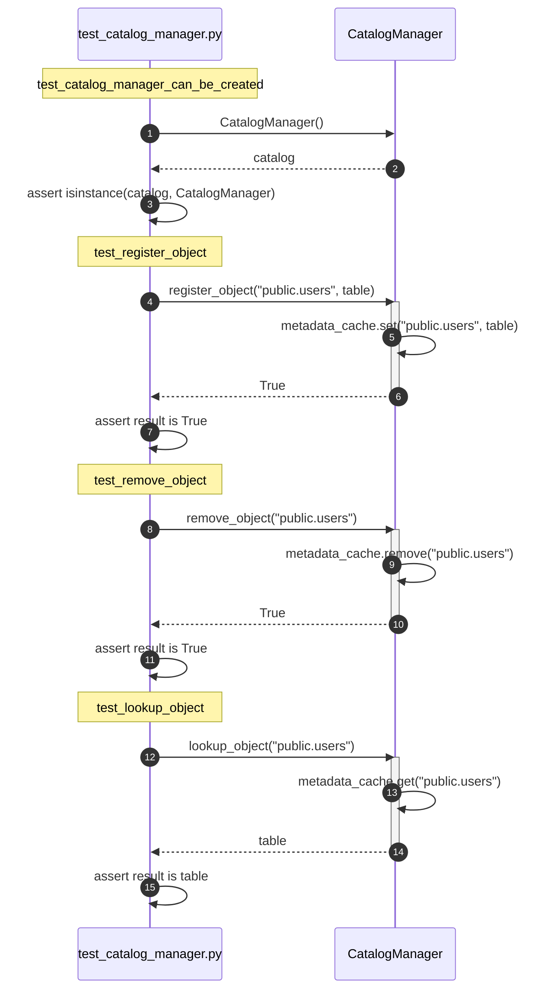
```mermaid
sequenceDiagram
    autonumber
    participant Test as test_catalog_manager.py
    participant SUT as CatalogManager

    Note over Test: test_catalog_manager_can_be_created
    Test->>SUT: CatalogManager()
    SUT-->>Test: catalog
    Test->>Test: assert isinstance(catalog, CatalogManager)

    Note over Test: test_register_object
    Test->>SUT: register_object("public.users", table)
    activate SUT
    SUT->>SUT: metadata_cache.set("public.users", table)
    SUT-->>Test: True
    deactivate SUT
    Test->>Test: assert result is True

    Note over Test: test_remove_object
    Test->>SUT: remove_object("public.users")
    activate SUT
    SUT->>SUT: metadata_cache.remove("public.users")
    SUT-->>Test: True
    deactivate SUT
    Test->>Test: assert result is True

    Note over Test: test_lookup_object
    Test->>SUT: lookup_object("public.users")
    activate SUT
    SUT->>SUT: metadata_cache.get("public.users")
    SUT-->>Test: table
    deactivate SUT
    Test->>Test: assert result is table
```

---

## 2. test_column.py

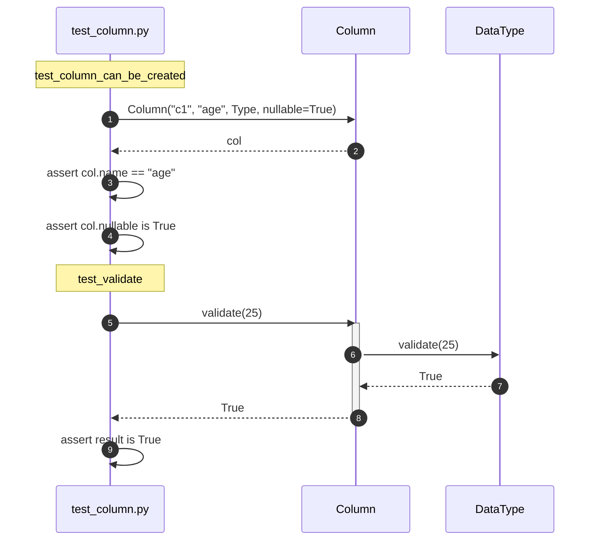
```mermaid
sequenceDiagram
    autonumber
    participant Test as test_column.py
    participant SUT as Column
    participant Type as DataType

    Note over Test: test_column_can_be_created
    Test->>SUT: Column("c1", "age", Type, nullable=True)
    SUT-->>Test: col
    Test->>Test: assert col.name == "age"
    Test->>Test: assert col.nullable is True

    Note over Test: test_validate
    Test->>SUT: validate(25)
    activate SUT
    SUT->>Type: validate(25)
    Type-->>SUT: True
    SUT-->>Test: True
    deactivate SUT
    Test->>Test: assert result is True
```

---

## 3. test_constraint.py

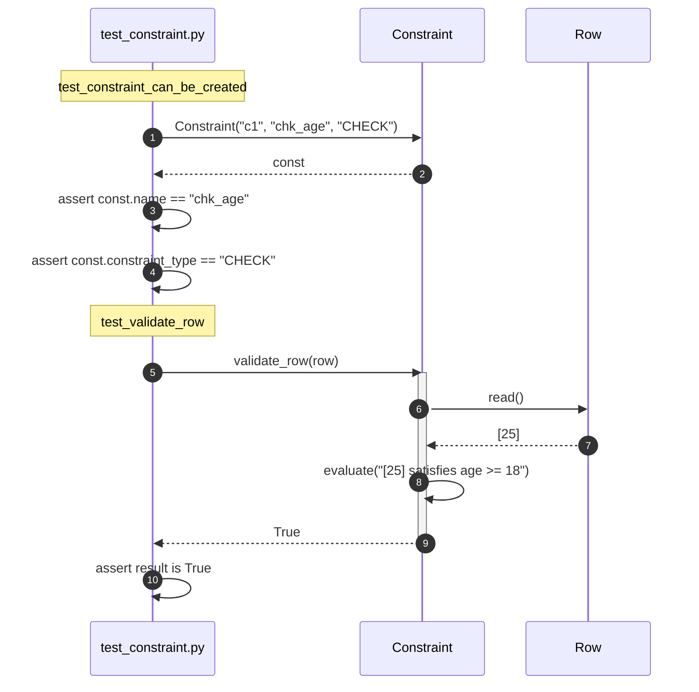
```mermaid
sequenceDiagram
    autonumber
    participant Test as test_constraint.py
    participant SUT as Constraint
    participant Row as Row

    Note over Test: test_constraint_can_be_created
    Test->>SUT: Constraint("c1", "chk_age", "CHECK")
    SUT-->>Test: const
    Test->>Test: assert const.name == "chk_age"
    Test->>Test: assert const.constraint_type == "CHECK"

    Note over Test: test_validate_row
    Test->>SUT: validate_row(row)
    activate SUT
    SUT->>Row: read()
    Row-->>SUT: [25]
    SUT->>SUT: evaluate("[25] satisfies age >= 18")
    SUT-->>Test: True
    deactivate SUT
    Test->>Test: assert result is True
```

---

## 4. test_data_type_manager.py

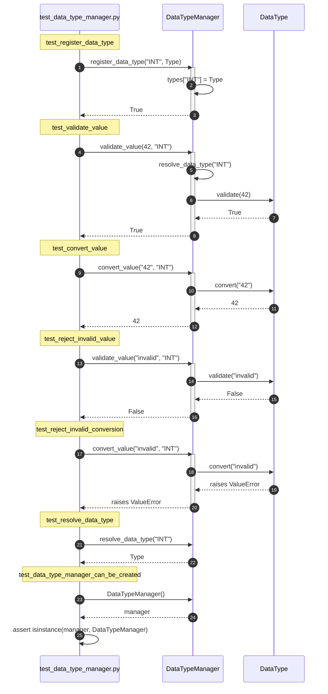
```mermaid
sequenceDiagram
    autonumber
    participant Test as test_data_type_manager.py
    participant SUT as DataTypeManager
    participant Type as DataType

    Note over Test: test_register_data_type
    Test->>SUT: register_data_type("INT", Type)
    activate SUT
    SUT->>SUT: types["INT"] = Type
    SUT-->>Test: True
    deactivate SUT

    Note over Test: test_validate_value
    Test->>SUT: validate_value(42, "INT")
    activate SUT
    SUT->>SUT: resolve_data_type("INT")
    SUT->>Type: validate(42)
    Type-->>SUT: True
    SUT-->>Test: True
    deactivate SUT

    Note over Test: test_convert_value
    Test->>SUT: convert_value("42", "INT")
    activate SUT
    SUT->>Type: convert("42")
    Type-->>SUT: 42
    SUT-->>Test: 42
    deactivate SUT

    Note over Test: test_reject_invalid_value
    Test->>SUT: validate_value("invalid", "INT")
    activate SUT
    SUT->>Type: validate("invalid")
    Type-->>SUT: False
    SUT-->>Test: False
    deactivate SUT

    Note over Test: test_reject_invalid_conversion
    Test->>SUT: convert_value("invalid", "INT")
    activate SUT
    SUT->>Type: convert("invalid")
    Type-->>SUT: raises ValueError
    SUT-->>Test: raises ValueError
    deactivate SUT

    Note over Test: test_resolve_data_type
    Test->>SUT: resolve_data_type("INT")
    SUT-->>Test: Type

    Note over Test: test_data_type_manager_can_be_created
    Test->>SUT: DataTypeManager()
    SUT-->>Test: manager
    Test->>Test: assert isinstance(manager, DataTypeManager)
```

---

## 5. test_database.py

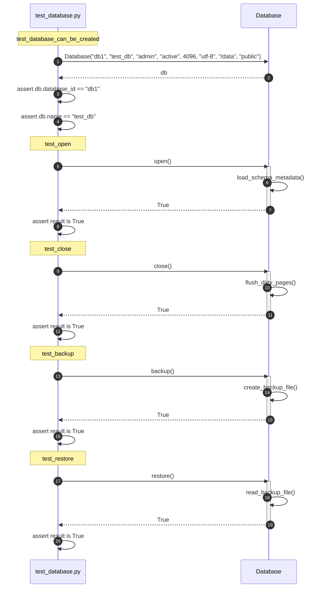
```mermaid
sequenceDiagram
    autonumber
    participant Test as test_database.py
    participant SUT as Database

    Note over Test: test_database_can_be_created
    Test->>SUT: Database("db1", "test_db", "admin", "active", 4096, "utf-8", "/data", "public")
    SUT-->>Test: db
    Test->>Test: assert db.database_id == "db1"
    Test->>Test: assert db.name == "test_db"

    Note over Test: test_open
    Test->>SUT: open()
    activate SUT
    SUT->>SUT: load_schema_metadata()
    SUT-->>Test: True
    deactivate SUT
    Test->>Test: assert result is True

    Note over Test: test_close
    Test->>SUT: close()
    activate SUT
    SUT->>SUT: flush_dirty_pages()
    SUT-->>Test: True
    deactivate SUT
    Test->>Test: assert result is True

    Note over Test: test_backup
    Test->>SUT: backup()
    activate SUT
    SUT->>SUT: create_backup_file()
    SUT-->>Test: True
    deactivate SUT
    Test->>Test: assert result is True

    Note over Test: test_restore
    Test->>SUT: restore()
    activate SUT
    SUT->>SUT: read_backup_file()
    SUT-->>Test: True
    deactivate SUT
    Test->>Test: assert result is True
```

---

## 6. test_database_manager.py

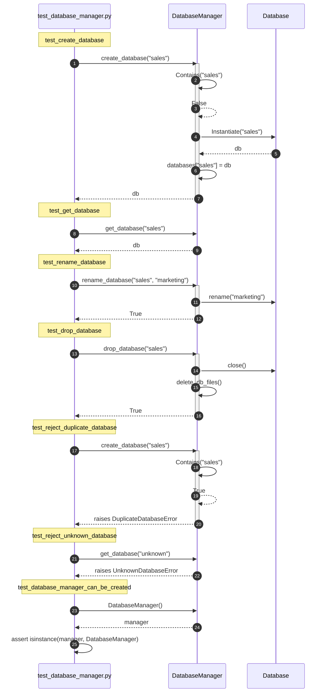
```mermaid
sequenceDiagram
    autonumber
    participant Test as test_database_manager.py
    participant SUT as DatabaseManager
    participant DB as Database

    Note over Test: test_create_database
    Test->>SUT: create_database("sales")
    activate SUT
    SUT->>SUT: Contains("sales")
    SUT-->>SUT: False
    SUT->>DB: Instantiate("sales")
    DB-->>SUT: db
    SUT->>SUT: databases["sales"] = db
    SUT-->>Test: db
    deactivate SUT

    Note over Test: test_get_database
    Test->>SUT: get_database("sales")
    SUT-->>Test: db

    Note over Test: test_rename_database
    Test->>SUT: rename_database("sales", "marketing")
    activate SUT
    SUT->>DB: rename("marketing")
    SUT-->>Test: True
    deactivate SUT

    Note over Test: test_drop_database
    Test->>SUT: drop_database("sales")
    activate SUT
    SUT->>DB: close()
    SUT->>SUT: delete_db_files()
    SUT-->>Test: True
    deactivate SUT

    Note over Test: test_reject_duplicate_database
    Test->>SUT: create_database("sales")
    activate SUT
    SUT->>SUT: Contains("sales")
    SUT-->>SUT: True
    SUT-->>Test: raises DuplicateDatabaseError
    deactivate SUT

    Note over Test: test_reject_unknown_database
    Test->>SUT: get_database("unknown")
    SUT-->>Test: raises UnknownDatabaseError

    Note over Test: test_database_manager_can_be_created
    Test->>SUT: DatabaseManager()
    SUT-->>Test: manager
    Test->>Test: assert isinstance(manager, DatabaseManager)
```

---

## 7. test_database_server.py

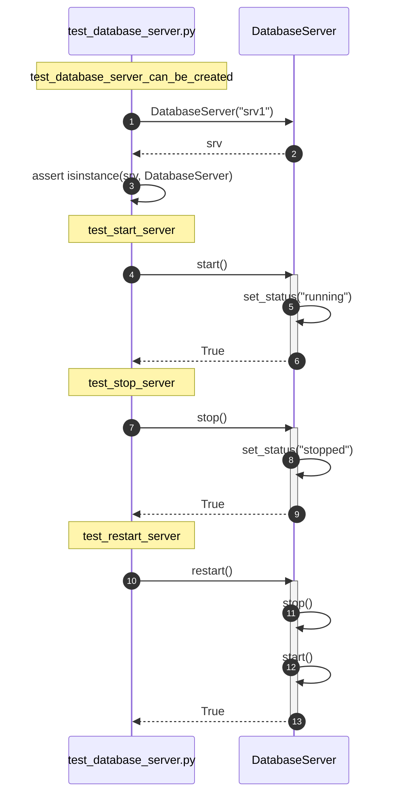
```mermaid
sequenceDiagram
    autonumber
    participant Test as test_database_server.py
    participant SUT as DatabaseServer

    Note over Test: test_database_server_can_be_created
    Test->>SUT: DatabaseServer("srv1")
    SUT-->>Test: srv
    Test->>Test: assert isinstance(srv, DatabaseServer)

    Note over Test: test_start_server
    Test->>SUT: start()
    activate SUT
    SUT->>SUT: set_status("running")
    SUT-->>Test: True
    deactivate SUT

    Note over Test: test_stop_server
    Test->>SUT: stop()
    activate SUT
    SUT->>SUT: set_status("stopped")
    SUT-->>Test: True
    deactivate SUT

    Note over Test: test_restart_server
    Test->>SUT: restart()
    activate SUT
    SUT->>SUT: stop()
    SUT->>SUT: start()
    SUT-->>Test: True
    deactivate SUT
```

---

## 8. test_foreign_key.py

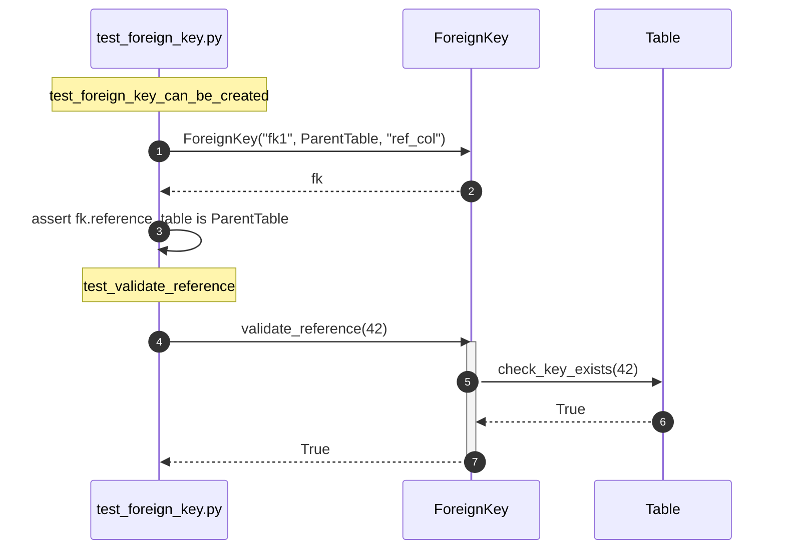
```mermaid
sequenceDiagram
    autonumber
    participant Test as test_foreign_key.py
    participant SUT as ForeignKey
    participant ParentTable as Table

    Note over Test: test_foreign_key_can_be_created
    Test->>SUT: ForeignKey("fk1", ParentTable, "ref_col")
    SUT-->>Test: fk
    Test->>Test: assert fk.reference_table is ParentTable

    Note over Test: test_validate_reference
    Test->>SUT: validate_reference(42)
    activate SUT
    SUT->>ParentTable: check_key_exists(42)
    ParentTable-->>SUT: True
    SUT-->>Test: True
    deactivate SUT
```

---

## 9. test_index.py

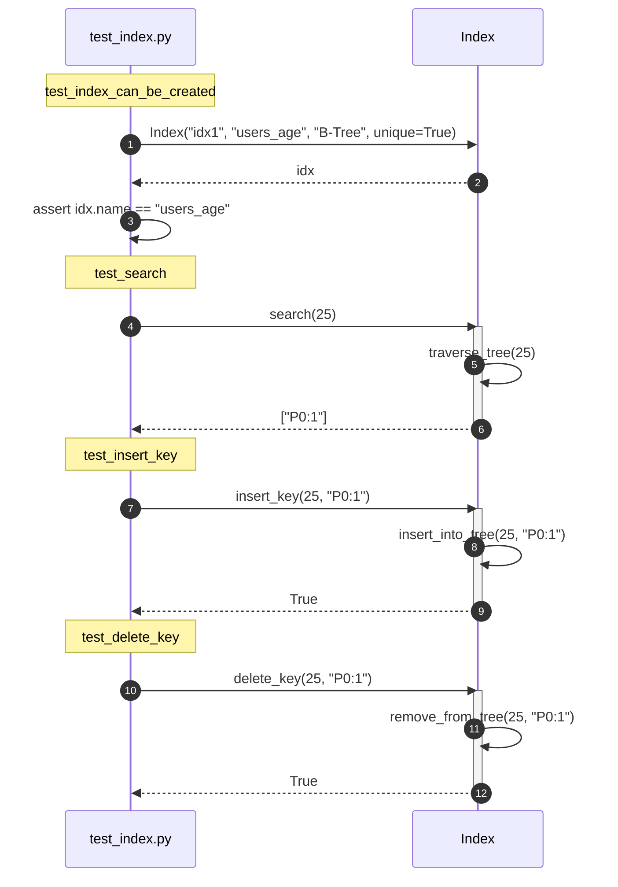
```mermaid
sequenceDiagram
    autonumber
    participant Test as test_index.py
    participant SUT as Index

    Note over Test: test_index_can_be_created
    Test->>SUT: Index("idx1", "users_age", "B-Tree", unique=True)
    SUT-->>Test: idx
    Test->>Test: assert idx.name == "users_age"

    Note over Test: test_search
    Test->>SUT: search(25)
    activate SUT
    SUT->>SUT: traverse_tree(25)
    SUT-->>Test: ["P0:1"]
    deactivate SUT

    Note over Test: test_insert_key
    Test->>SUT: insert_key(25, "P0:1")
    activate SUT
    SUT->>SUT: insert_into_tree(25, "P0:1")
    SUT-->>Test: True
    deactivate SUT

    Note over Test: test_delete_key
    Test->>SUT: delete_key(25, "P0:1")
    activate SUT
    SUT->>SUT: remove_from_tree(25, "P0:1")
    SUT-->>Test: True
    deactivate SUT
```

---

## 10. test_partition.py

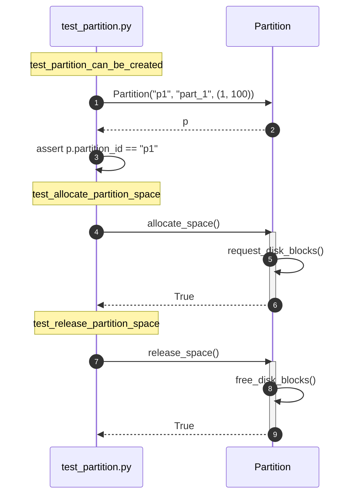
```mermaid
sequenceDiagram
    autonumber
    participant Test as test_partition.py
    participant SUT as Partition

    Note over Test: test_partition_can_be_created
    Test->>SUT: Partition("p1", "part_1", (1, 100))
    SUT-->>Test: p
    Test->>Test: assert p.partition_id == "p1"

    Note over Test: test_allocate_partition_space
    Test->>SUT: allocate_space()
    activate SUT
    SUT->>SUT: request_disk_blocks()
    SUT-->>Test: True
    deactivate SUT

    Note over Test: test_release_partition_space
    Test->>SUT: release_space()
    activate SUT
    SUT->>SUT: free_disk_blocks()
    SUT-->>Test: True
    deactivate SUT
```

---

## 11. test_row.py

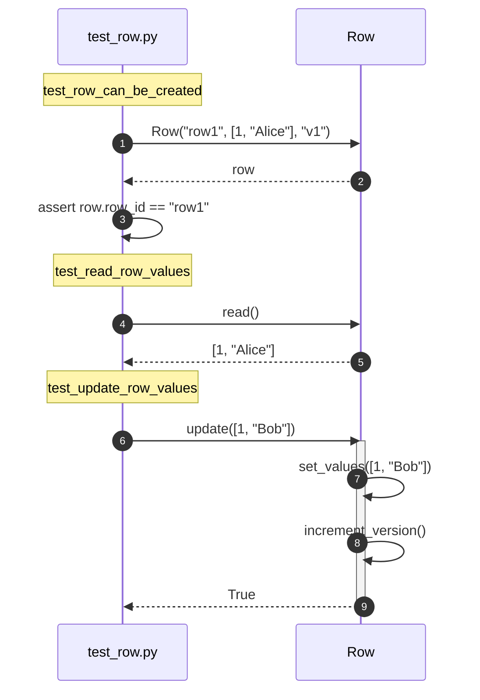
```mermaid
sequenceDiagram
    autonumber
    participant Test as test_row.py
    participant SUT as Row

    Note over Test: test_row_can_be_created
    Test->>SUT: Row("row1", [1, "Alice"], "v1")
    SUT-->>Test: row
    Test->>Test: assert row.row_id == "row1"

    Note over Test: test_read_row_values
    Test->>SUT: read()
    SUT-->>Test: [1, "Alice"]

    Note over Test: test_update_row_values
    Test->>SUT: update([1, "Bob"])
    activate SUT
    SUT->>SUT: set_values([1, "Bob"])
    SUT->>SUT: increment_version()
    SUT-->>Test: True
    deactivate SUT
```

---

## 12. test_schema.py

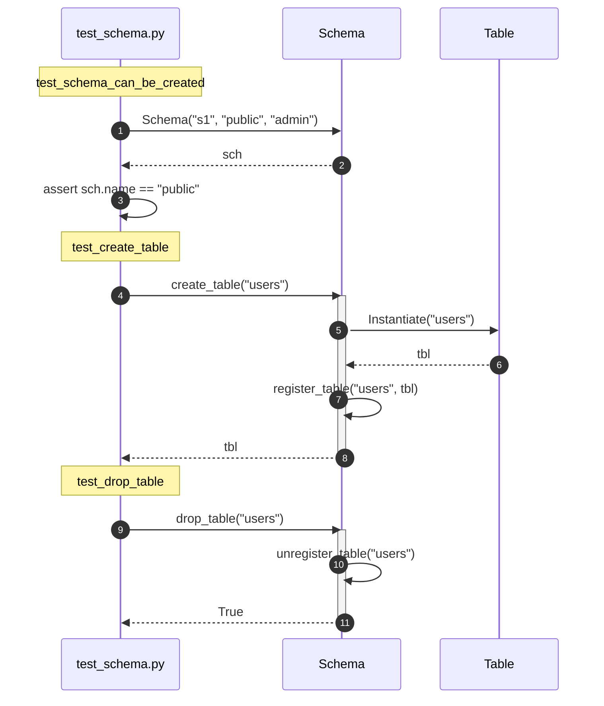
```mermaid
sequenceDiagram
    autonumber
    participant Test as test_schema.py
    participant SUT as Schema
    participant Table as Table

    Note over Test: test_schema_can_be_created
    Test->>SUT: Schema("s1", "public", "admin")
    SUT-->>Test: sch
    Test->>Test: assert sch.name == "public"

    Note over Test: test_create_table
    Test->>SUT: create_table("users")
    activate SUT
    SUT->>Table: Instantiate("users")
    Table-->>SUT: tbl
    SUT->>SUT: register_table("users", tbl)
    SUT-->>Test: tbl
    deactivate SUT

    Note over Test: test_drop_table
    Test->>SUT: drop_table("users")
    activate SUT
    SUT->>SUT: unregister_table("users")
    SUT-->>Test: True
    deactivate SUT
```

---

## 13. test_stored_procedure.py

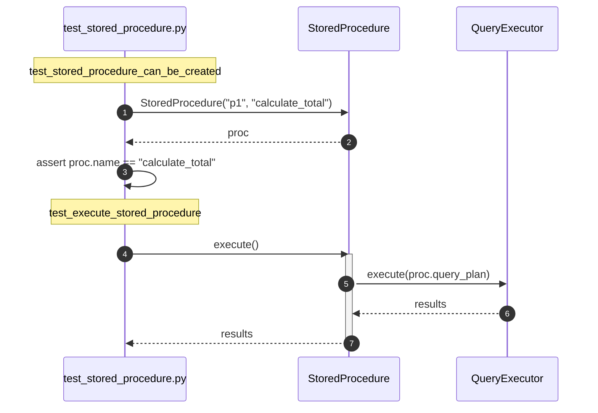
```mermaid
sequenceDiagram
    autonumber
    participant Test as test_stored_procedure.py
    participant SUT as StoredProcedure
    participant QE as QueryExecutor

    Note over Test: test_stored_procedure_can_be_created
    Test->>SUT: StoredProcedure("p1", "calculate_total")
    SUT-->>Test: proc
    Test->>Test: assert proc.name == "calculate_total"

    Note over Test: test_execute_stored_procedure
    Test->>SUT: execute()
    activate SUT
    SUT->>QE: execute(proc.query_plan)
    QE-->>SUT: results
    SUT-->>Test: results
    deactivate SUT
```

---

## 14. test_table.py

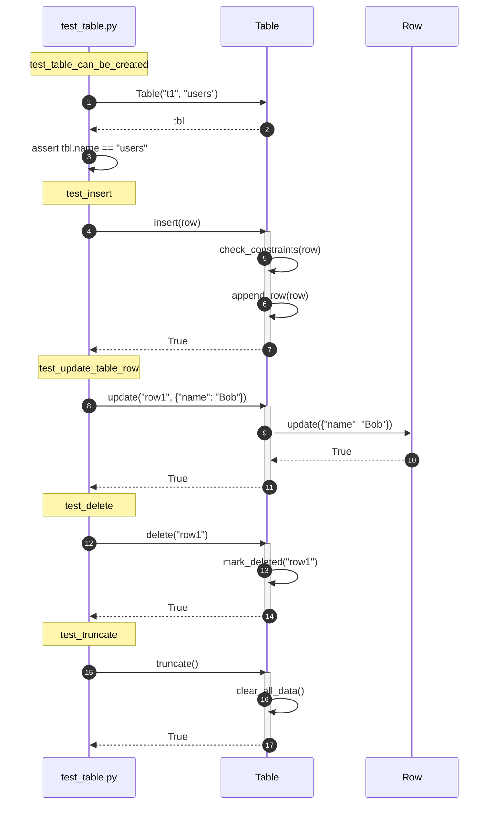
```mermaid
sequenceDiagram
    autonumber
    participant Test as test_table.py
    participant SUT as Table
    participant Row as Row

    Note over Test: test_table_can_be_created
    Test->>SUT: Table("t1", "users")
    SUT-->>Test: tbl
    Test->>Test: assert tbl.name == "users"

    Note over Test: test_insert
    Test->>SUT: insert(row)
    activate SUT
    SUT->>SUT: check_constraints(row)
    SUT->>SUT: append_row(row)
    SUT-->>Test: True
    deactivate SUT

    Note over Test: test_update_table_row
    Test->>SUT: update("row1", {"name": "Bob"})
    activate SUT
    SUT->>Row: update({"name": "Bob"})
    Row-->>SUT: True
    SUT-->>Test: True
    deactivate SUT

    Note over Test: test_delete
    Test->>SUT: delete("row1")
    activate SUT
    SUT->>SUT: mark_deleted("row1")
    SUT-->>Test: True
    deactivate SUT

    Note over Test: test_truncate
    Test->>SUT: truncate()
    activate SUT
    SUT->>SUT: clear_all_data()
    SUT-->>Test: True
    deactivate SUT
```

---

## 15. test_trigger_manager.py

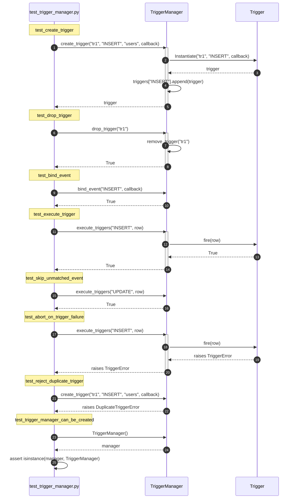
```mermaid
sequenceDiagram
    autonumber
    participant Test as test_trigger_manager.py
    participant SUT as TriggerManager
    participant Trigger as Trigger

    Note over Test: test_create_trigger
    Test->>SUT: create_trigger("tr1", "INSERT", "users", callback)
    activate SUT
    SUT->>Trigger: Instantiate("tr1", "INSERT", callback)
    Trigger-->>SUT: trigger
    SUT->>SUT: triggers["INSERT"].append(trigger)
    SUT-->>Test: trigger
    deactivate SUT

    Note over Test: test_drop_trigger
    Test->>SUT: drop_trigger("tr1")
    activate SUT
    SUT->>SUT: remove_trigger("tr1")
    SUT-->>Test: True
    deactivate SUT

    Note over Test: test_bind_event
    Test->>SUT: bind_event("INSERT", callback)
    SUT-->>Test: True

    Note over Test: test_execute_trigger
    Test->>SUT: execute_triggers("INSERT", row)
    activate SUT
    SUT->>Trigger: fire(row)
    Trigger-->>SUT: True
    SUT-->>Test: True
    deactivate SUT

    Note over Test: test_skip_unmatched_event
    Test->>SUT: execute_triggers("UPDATE", row)
    SUT-->>Test: True

    Note over Test: test_abort_on_trigger_failure
    Test->>SUT: execute_triggers("INSERT", row)
    activate SUT
    SUT->>Trigger: fire(row)
    Trigger-->>SUT: raises TriggerError
    SUT-->>Test: raises TriggerError
    deactivate SUT

    Note over Test: test_reject_duplicate_trigger
    Test->>SUT: create_trigger("tr1", "INSERT", "users", callback)
    SUT-->>Test: raises DuplicateTriggerError

    Note over Test: test_trigger_manager_can_be_created
    Test->>SUT: TriggerManager()
    SUT-->>Test: manager
    Test->>Test: assert isinstance(manager, TriggerManager)
```

---

## 16. test_view.py

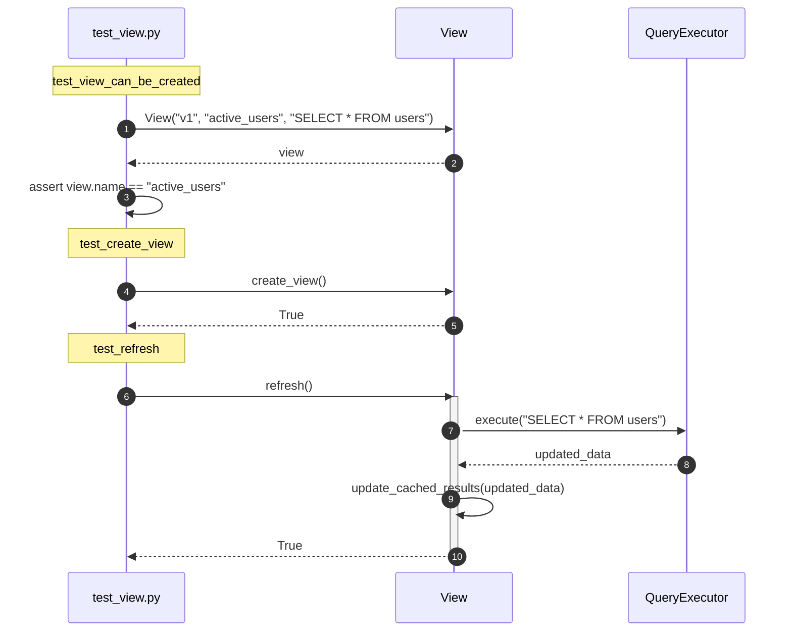
```mermaid
sequenceDiagram
    autonumber
    participant Test as test_view.py
    participant SUT as View
    participant QE as QueryExecutor

    Note over Test: test_view_can_be_created
    Test->>SUT: View("v1", "active_users", "SELECT * FROM users")
    SUT-->>Test: view
    Test->>Test: assert view.name == "active_users"

    Note over Test: test_create_view
    Test->>SUT: create_view()
    SUT-->>Test: True

    Note over Test: test_refresh
    Test->>SUT: refresh()
    activate SUT
    SUT->>QE: execute("SELECT * FROM users")
    QE-->>SUT: updated_data
    SUT->>SUT: update_cached_results(updated_data)
    SUT-->>Test: True
    deactivate SUT
```
