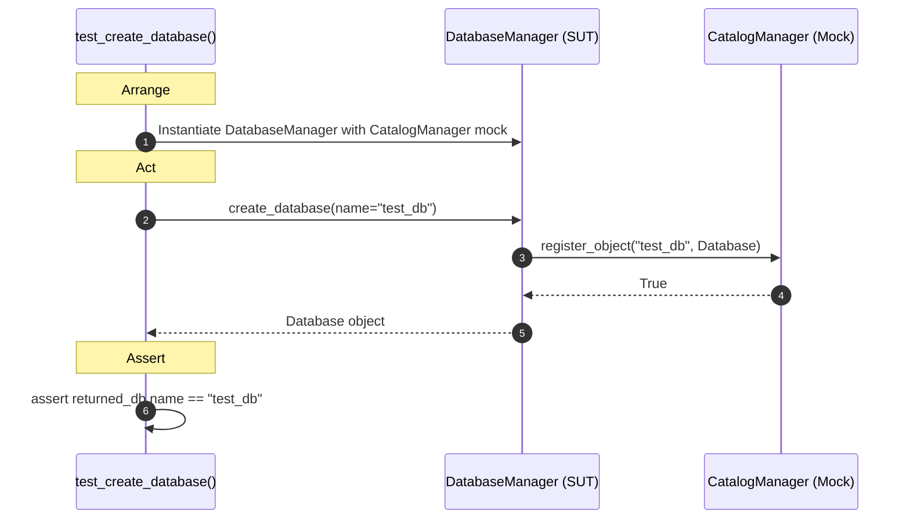
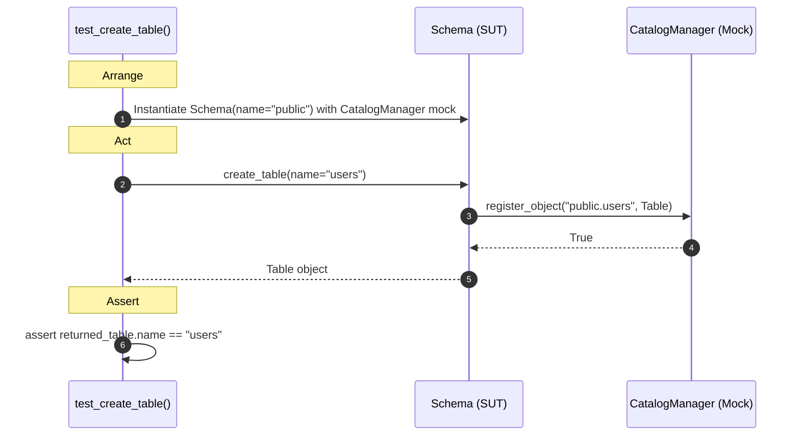
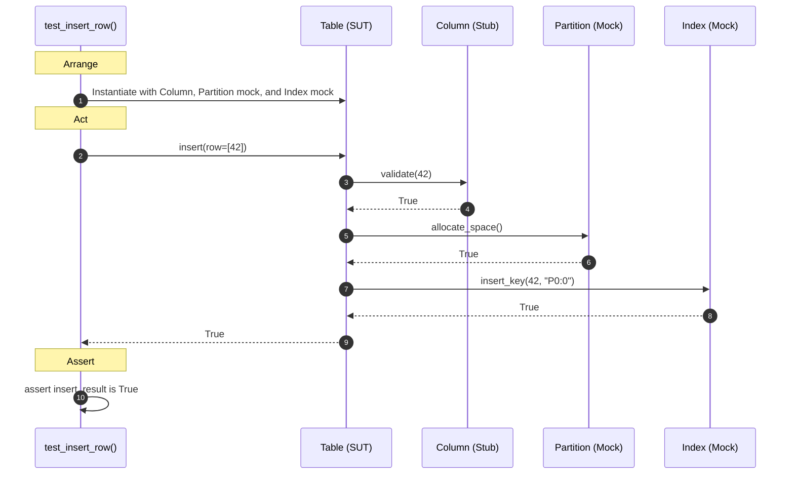
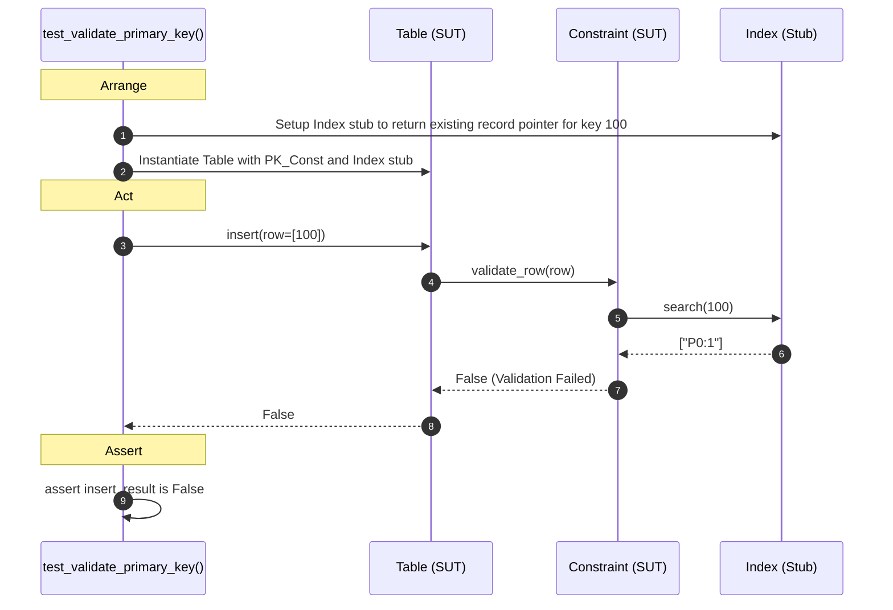

# Database Object Subsystem Unit Test Sequence Diagrams

This document outlines the simplified unit test flows for the **Database Object** subsystem, focusing strictly on the test assertions, SUT calls, and mock expectations.

---

## 1. test_create_database()
Verifies `DatabaseManager` creates and registers a database successfully.

---

## 2. test_create_table()
Tests that a `Schema` initializes a table and registers it with the catalog.

---

## 3. test_insert_row()
Verifies that inserting a valid row invokes column validation, partition allocation, and index updates.

---

## 4. test_validate_primary_key()
Tests constraint validation failure when trying to insert a duplicate primary key.

