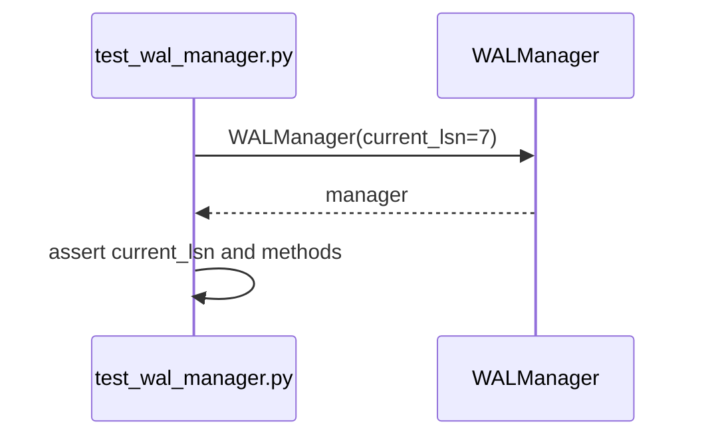
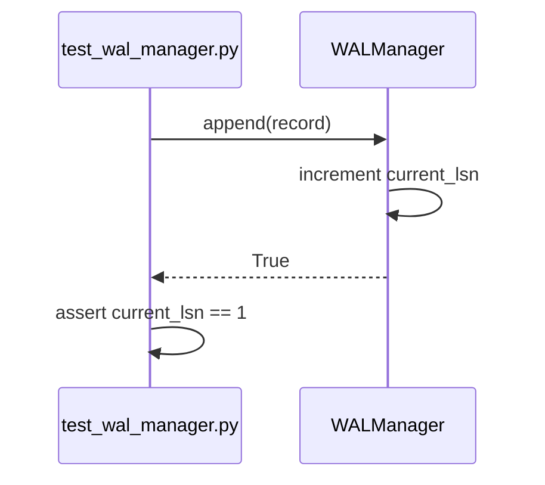
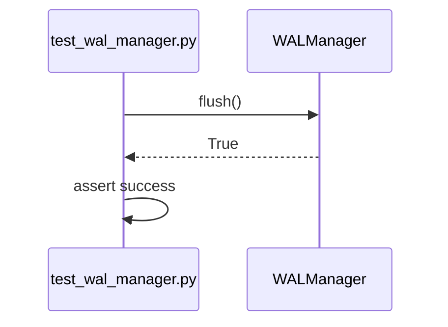

# Durability Unit Test Sequences

## 1. test_wal_manager.py

### 1.1 test_wal_manager_can_be_created()

```mermaid
sequenceDiagram
    participant Test as test_wal_manager.py
    participant SUT as WALManager
    Test->>SUT: WALManager(current_lsn=7)
    SUT-->>Test: manager
    Test->>Test: assert current_lsn and methods
```

### 1.2 test_append()

```mermaid
sequenceDiagram
    participant Test as test_wal_manager.py
    participant SUT as WALManager
    Test->>SUT: append(record)
    SUT->>SUT: increment current_lsn
    SUT-->>Test: True
    Test->>Test: assert current_lsn == 1
```

### 1.3 test_flush()

```mermaid
sequenceDiagram
    participant Test as test_wal_manager.py
    participant SUT as WALManager
    Test->>SUT: flush()
    SUT-->>Test: True
    Test->>Test: assert success
```
