# Query Processing Unit Test Sequences

This document outlines the detailed sequence diagrams for the unit tests in the `Query Processing` subsystem.

---

## 1. test_ast.py

### 1.1 test_ast_can_be_created()

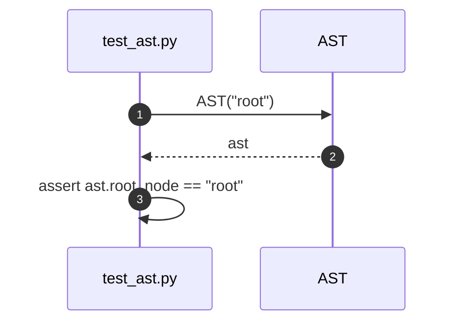
```mermaid
sequenceDiagram
    autonumber
    participant Test as test_ast.py
    participant SUT as AST

    Test->>SUT: AST("root")
    SUT-->>Test: ast
    Test->>Test: assert ast.root_node == "root"
```

### 1.2 test_traverse()

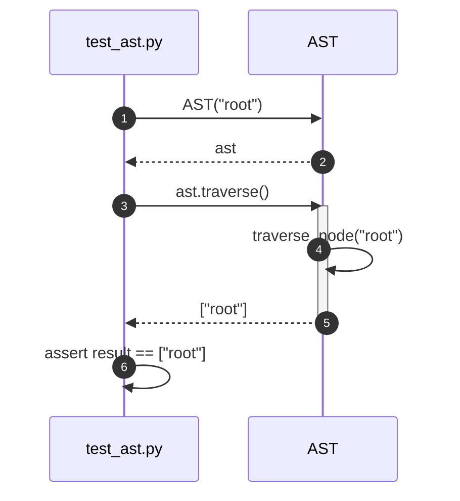
```mermaid
sequenceDiagram
    autonumber
    participant Test as test_ast.py
    participant SUT as AST

    Test->>SUT: AST("root")
    SUT-->>Test: ast
    Test->>SUT: ast.traverse()
    activate SUT
    SUT->>SUT: traverse_node("root")
    SUT-->>Test: ["root"]
    deactivate SUT
    Test->>Test: assert result == ["root"]
```

---

## 2. test_execution_planner.py

### 2.1 test_create_logical_plan()

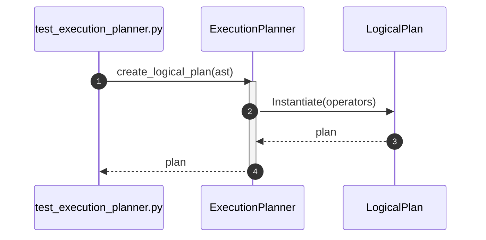
```mermaid
sequenceDiagram
    autonumber
    participant Test as test_execution_planner.py
    participant SUT as ExecutionPlanner
    participant LP as LogicalPlan

    Test->>SUT: create_logical_plan(ast)
    activate SUT
    SUT->>LP: Instantiate(operators)
    LP-->>SUT: plan
    SUT-->>Test: plan
    deactivate SUT
```

### 2.2 test_create_physical_plan()

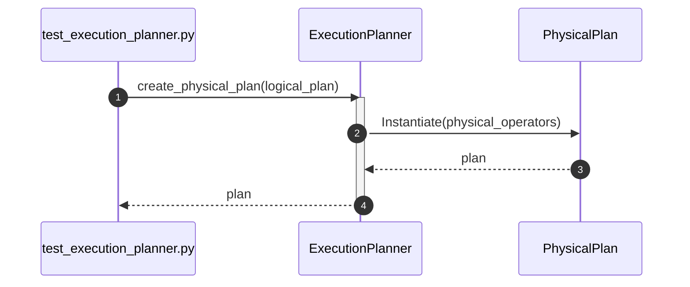
```mermaid
sequenceDiagram
    autonumber
    participant Test as test_execution_planner.py
    participant SUT as ExecutionPlanner
    participant PP as PhysicalPlan

    Test->>SUT: create_physical_plan(logical_plan)
    activate SUT
    SUT->>PP: Instantiate(physical_operators)
    PP-->>SUT: plan
    SUT-->>Test: plan
    deactivate SUT
```

### 2.3 test_plan_table_scan()

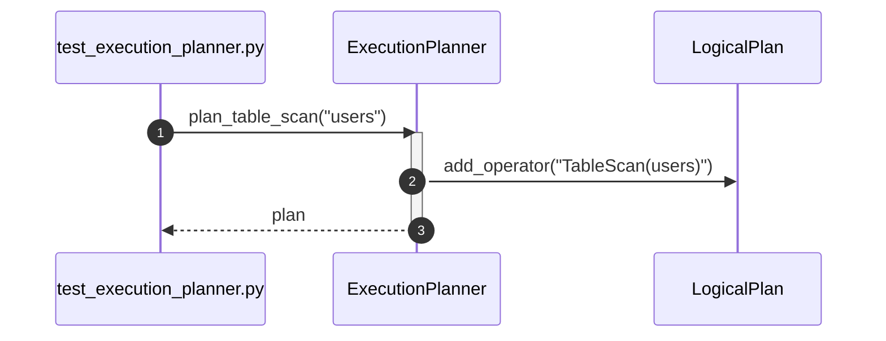
```mermaid
sequenceDiagram
    autonumber
    participant Test as test_execution_planner.py
    participant SUT as ExecutionPlanner
    participant LP as LogicalPlan

    Test->>SUT: plan_table_scan("users")
    activate SUT
    SUT->>LP: add_operator("TableScan(users)")
    SUT-->>Test: plan
    deactivate SUT
```

### 2.4 test_plan_index_scan()

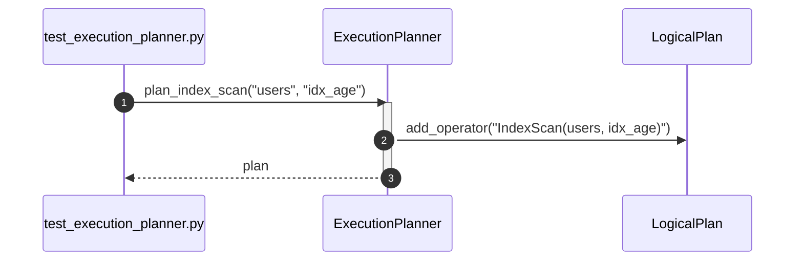
```mermaid
sequenceDiagram
    autonumber
    participant Test as test_execution_planner.py
    participant SUT as ExecutionPlanner
    participant LP as LogicalPlan

    Test->>SUT: plan_index_scan("users", "idx_age")
    activate SUT
    SUT->>LP: add_operator("IndexScan(users, idx_age)")
    SUT-->>Test: plan
    deactivate SUT
```

### 2.5 test_plan_join()

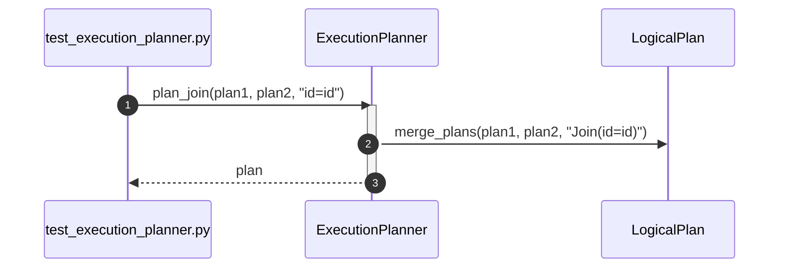
```mermaid
sequenceDiagram
    autonumber
    participant Test as test_execution_planner.py
    participant SUT as ExecutionPlanner
    participant LP as LogicalPlan

    Test->>SUT: plan_join(plan1, plan2, "id=id")
    activate SUT
    SUT->>LP: merge_plans(plan1, plan2, "Join(id=id)")
    SUT-->>Test: plan
    deactivate SUT
```

### 2.6 test_plan_aggregation()

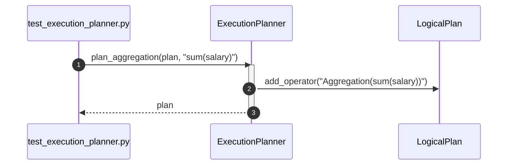
```mermaid
sequenceDiagram
    autonumber
    participant Test as test_execution_planner.py
    participant SUT as ExecutionPlanner
    participant LP as LogicalPlan

    Test->>SUT: plan_aggregation(plan, "sum(salary)")
    activate SUT
    SUT->>LP: add_operator("Aggregation(sum(salary))")
    SUT-->>Test: plan
    deactivate SUT
```

### 2.7 test_reject_invalid_plan()

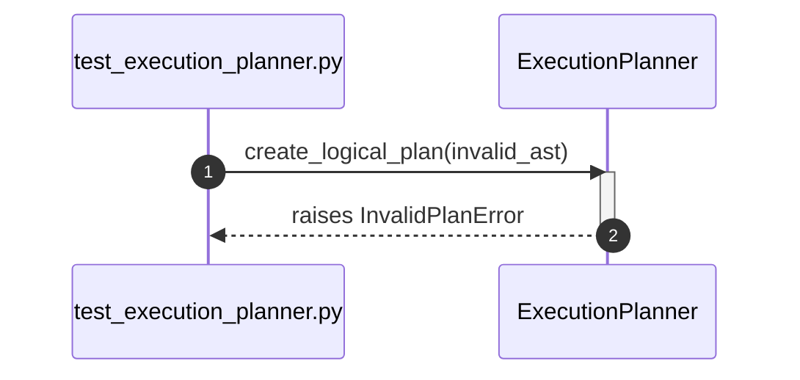
```mermaid
sequenceDiagram
    autonumber
    participant Test as test_execution_planner.py
    participant SUT as ExecutionPlanner

    Test->>SUT: create_logical_plan(invalid_ast)
    activate SUT
    SUT-->>Test: raises InvalidPlanError
    deactivate SUT
```

### 2.8 test_execution_planner_can_be_created()

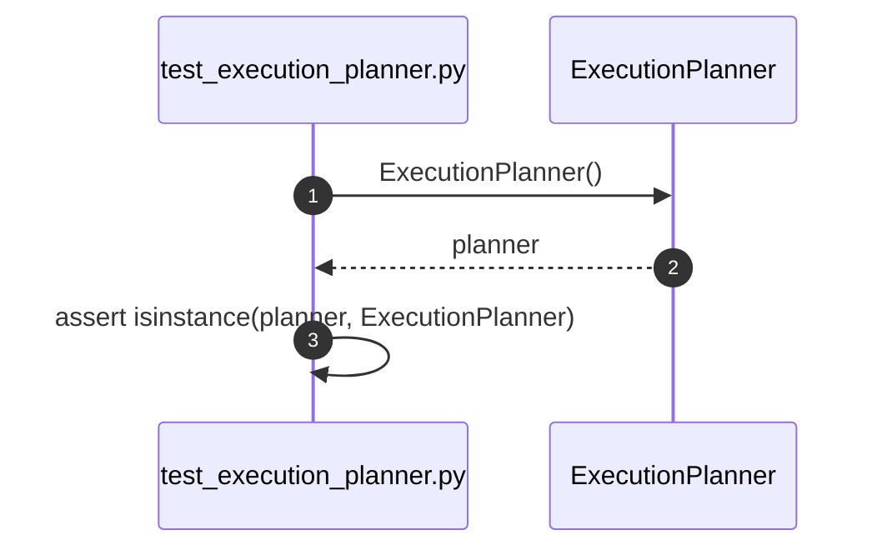
```mermaid
sequenceDiagram
    autonumber
    participant Test as test_execution_planner.py
    participant SUT as ExecutionPlanner

    Test->>SUT: ExecutionPlanner()
    SUT-->>Test: planner
    Test->>Test: assert isinstance(planner, ExecutionPlanner)
```

---

## 3. test_lexer.py

### 3.1 test_tokenize()

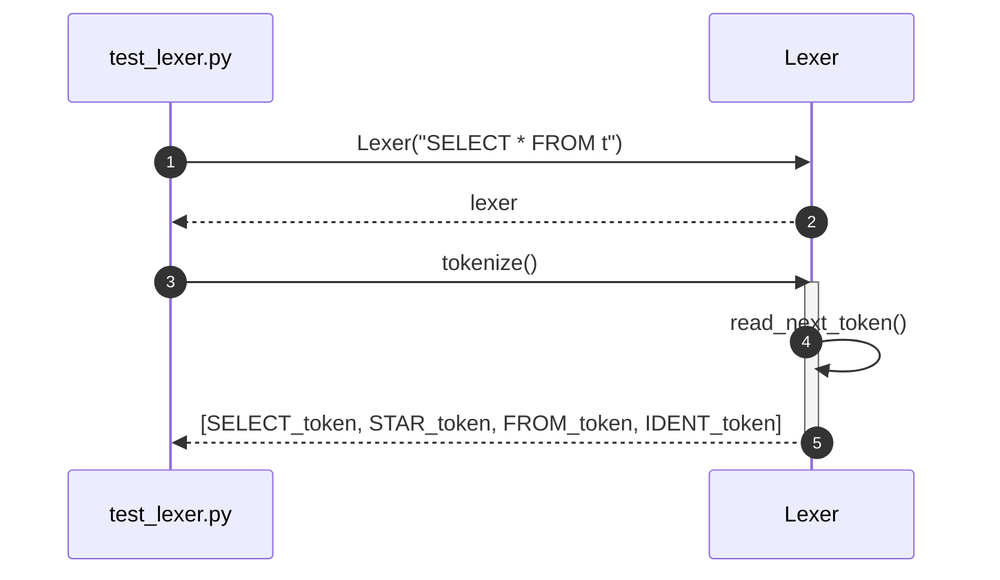
```mermaid
sequenceDiagram
    autonumber
    participant Test as test_lexer.py
    participant SUT as Lexer

    Test->>SUT: Lexer("SELECT * FROM t")
    SUT-->>Test: lexer
    Test->>SUT: tokenize()
    activate SUT
    SUT->>SUT: read_next_token()
    SUT-->>Test: [SELECT_token, STAR_token, FROM_token, IDENT_token]
    deactivate SUT
```

### 3.2 test_tokenize_keyword()

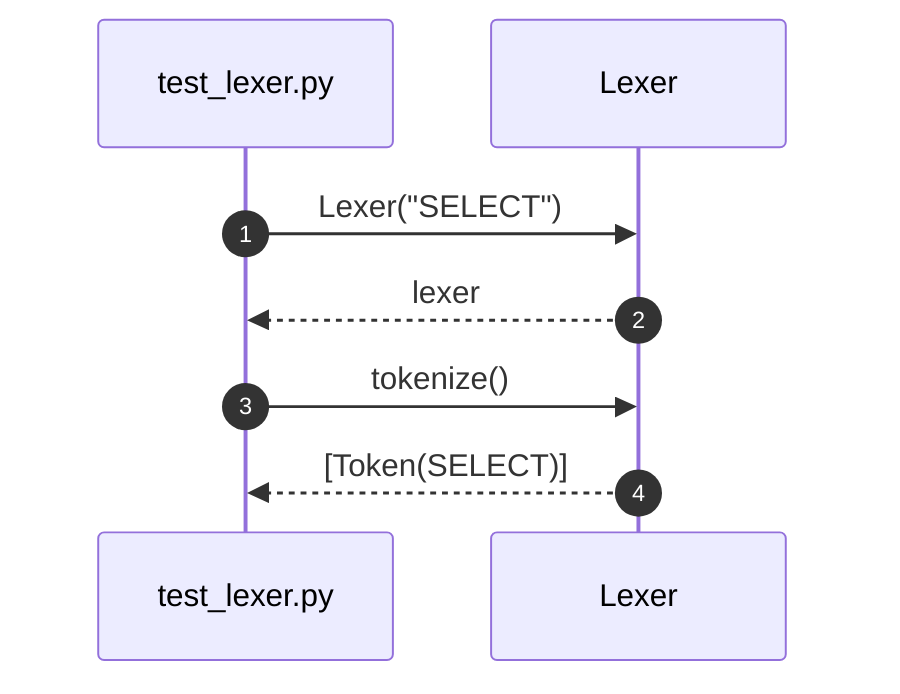
```mermaid
sequenceDiagram
    autonumber
    participant Test as test_lexer.py
    participant SUT as Lexer

    Test->>SUT: Lexer("SELECT")
    SUT-->>Test: lexer
    Test->>SUT: tokenize()
    SUT-->>Test: [Token(SELECT)]
```

### 3.3 test_tokenize_identifier()

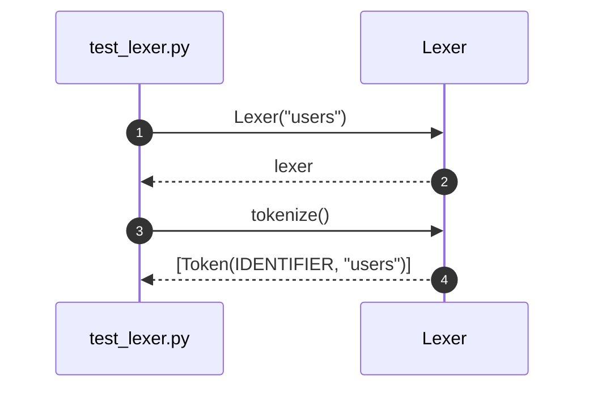
```mermaid
sequenceDiagram
    autonumber
    participant Test as test_lexer.py
    participant SUT as Lexer

    Test->>SUT: Lexer("users")
    SUT-->>Test: lexer
    Test->>SUT: tokenize()
    SUT-->>Test: [Token(IDENTIFIER, "users")]
```

### 3.4 test_tokenize_literal()

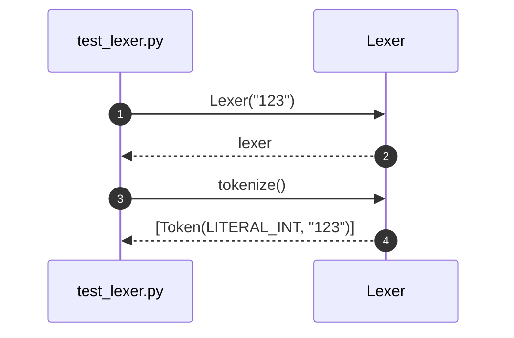
```mermaid
sequenceDiagram
    autonumber
    participant Test as test_lexer.py
    participant SUT as Lexer

    Test->>SUT: Lexer("123")
    SUT-->>Test: lexer
    Test->>SUT: tokenize()
    SUT-->>Test: [Token(LITERAL_INT, "123")]
```

### 3.5 test_tokenize_operator()

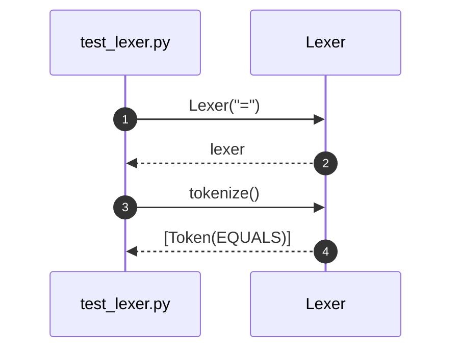
```mermaid
sequenceDiagram
    autonumber
    participant Test as test_lexer.py
    participant SUT as Lexer

    Test->>SUT: Lexer("=")
    SUT-->>Test: lexer
    Test->>SUT: tokenize()
    SUT-->>Test: [Token(EQUALS)]
```

### 3.6 test_track_token_position()

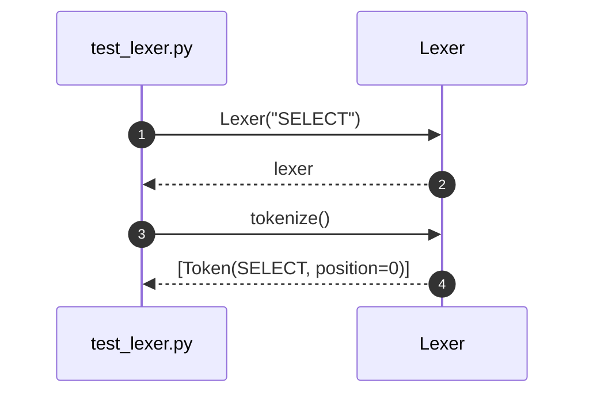
```mermaid
sequenceDiagram
    autonumber
    participant Test as test_lexer.py
    participant SUT as Lexer

    Test->>SUT: Lexer("SELECT")
    SUT-->>Test: lexer
    Test->>SUT: tokenize()
    SUT-->>Test: [Token(SELECT, position=0)]
```

### 3.7 test_ignore_whitespace()

```mermaid
sequenceDiagram
    autonumber
    participant Test as test_lexer.py
    participant SUT as Lexer

    Test->>SUT: Lexer("  SELECT  ")
    SUT-->>Test: lexer
    Test->>SUT: tokenize()
    SUT-->>Test: [Token(SELECT)]
```

### 3.8 test_reject_unknown_character()

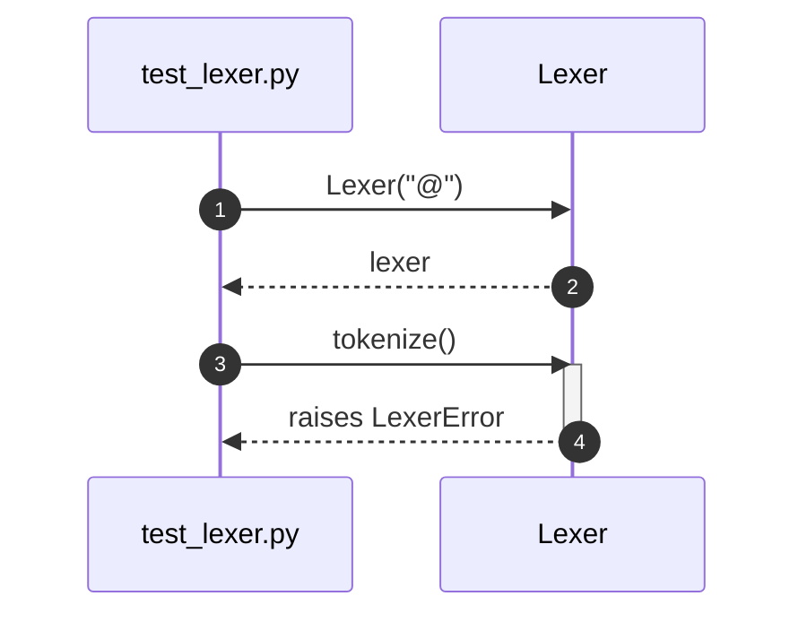
```mermaid
sequenceDiagram
    autonumber
    participant Test as test_lexer.py
    participant SUT as Lexer

    Test->>SUT: Lexer("@")
    SUT-->>Test: lexer
    Test->>SUT: tokenize()
    activate SUT
    SUT-->>Test: raises LexerError
    deactivate SUT
```

### 3.9 test_lexer_can_be_created()

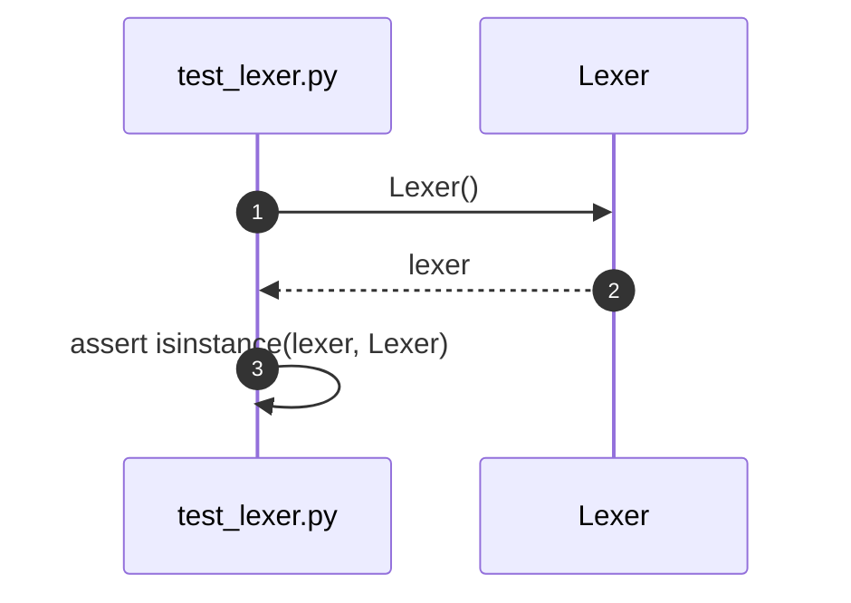
```mermaid
sequenceDiagram
    autonumber
    participant Test as test_lexer.py
    participant SUT as Lexer

    Test->>SUT: Lexer()
    SUT-->>Test: lexer
    Test->>Test: assert isinstance(lexer, Lexer)
```

---

## 4. test_logical_plan.py

### 4.1 test_logical_plan_can_be_created()

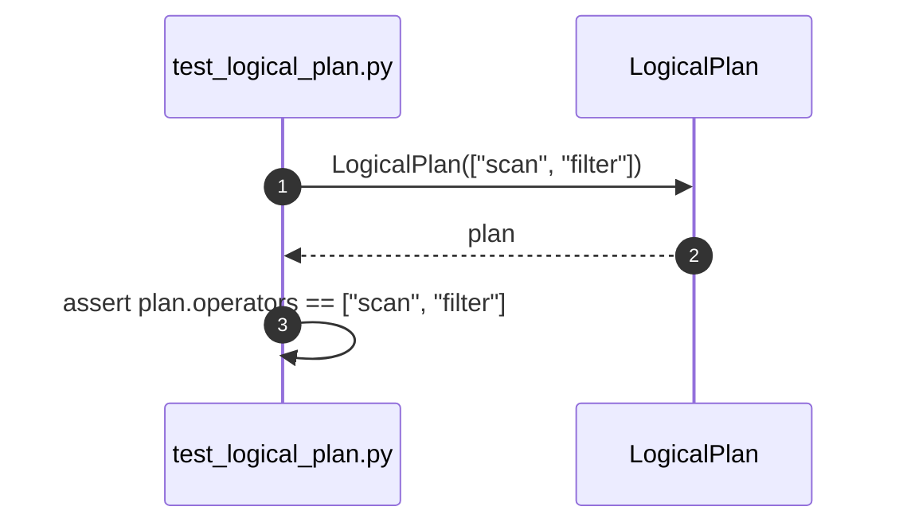
```mermaid
sequenceDiagram
    autonumber
    participant Test as test_logical_plan.py
    participant SUT as LogicalPlan

    Test->>SUT: LogicalPlan(["scan", "filter"])
    SUT-->>Test: plan
    Test->>Test: assert plan.operators == ["scan", "filter"]
```

### 4.2 test_build()

```mermaid
sequenceDiagram
    autonumber
    participant Test as test_logical_plan.py
    participant SUT as LogicalPlan

    Test->>SUT: LogicalPlan(["scan", "filter"])
    SUT-->>Test: plan
    Test->>SUT: plan.build()
    activate SUT
    SUT->>SUT: validate_operator_tree()
    SUT-->>Test: True
    deactivate SUT
    Test->>Test: assert result is True
```

---

## 5. test_physical_plan.py

### 5.1 test_physical_plan_can_be_created()

```mermaid
sequenceDiagram
    autonumber
    participant Test as test_physical_plan.py
    participant SUT as PhysicalPlan

    Test->>SUT: PhysicalPlan(["seq_scan", "filter_op"])
    SUT-->>Test: plan
    Test->>Test: assert plan.operators == ["seq_scan", "filter_op"]
```

### 5.2 test_generate()

```mermaid
sequenceDiagram
    autonumber
    participant Test as test_physical_plan.py
    participant SUT as PhysicalPlan

    Test->>SUT: PhysicalPlan(["seq_scan", "filter_op"])
    SUT-->>Test: plan
    Test->>SUT: plan.generate()
    activate SUT
    SUT->>SUT: compile_execution_blocks()
    SUT-->>Test: True
    deactivate SUT
    Test->>Test: assert result is True
```

---

## 6. test_query_executor.py

### 6.1 test_execute_query_plan()

```mermaid
sequenceDiagram
    autonumber
    participant Test as test_query_executor.py
    participant SUT as QueryExecutor
    participant Plan as PhysicalPlan

    Test->>SUT: execute(Plan)
    activate SUT
    SUT->>Plan: get_iterator()
    Plan-->>SUT: iter
    SUT-->>Test: results
    deactivate SUT
```

### 6.2 test_fetch()

```mermaid
sequenceDiagram
    autonumber
    participant Test as test_query_executor.py
    participant SUT as QueryExecutor

    Test->>SUT: fetch()
    activate SUT
    SUT->>SUT: get_next_result_block()
    SUT-->>Test: rows
    deactivate SUT
```

### 6.3 test_execute_select()

```mermaid
sequenceDiagram
    autonumber
    participant Test as test_query_executor.py
    participant SUT as QueryExecutor

    Test->>SUT: execute_select(Plan)
    SUT-->>Test: rows
```

### 6.4 test_execute_insert()

```mermaid
sequenceDiagram
    autonumber
    participant Test as test_query_executor.py
    participant SUT as QueryExecutor

    Test->>SUT: execute_insert(Plan)
    SUT-->>Test: affected_rows
```

### 6.5 test_execute_update()

```mermaid
sequenceDiagram
    autonumber
    participant Test as test_query_executor.py
    participant SUT as QueryExecutor

    Test->>SUT: execute_update(Plan)
    SUT-->>Test: affected_rows
```

### 6.6 test_execute_delete()

```mermaid
sequenceDiagram
    autonumber
    participant Test as test_query_executor.py
    participant SUT as QueryExecutor

    Test->>SUT: execute_delete(Plan)
    SUT-->>Test: affected_rows
```

### 6.7 test_execute_filter()

```mermaid
sequenceDiagram
    autonumber
    participant Test as test_query_executor.py
    participant SUT as QueryExecutor

    Test->>SUT: execute_filter(Plan)
    SUT-->>Test: rows
```

### 6.8 test_execute_join()

```mermaid
sequenceDiagram
    autonumber
    participant Test as test_query_executor.py
    participant SUT as QueryExecutor

    Test->>SUT: execute_join(Plan)
    SUT-->>Test: rows
```

### 6.9 test_execute_aggregation()

```mermaid
sequenceDiagram
    autonumber
    participant Test as test_query_executor.py
    participant SUT as QueryExecutor

    Test->>SUT: execute_aggregation(Plan)
    SUT-->>Test: rows
```

### 6.10 test_return_empty_result()

```mermaid
sequenceDiagram
    autonumber
    participant Test as test_query_executor.py
    participant SUT as QueryExecutor

    Test->>SUT: execute_select(empty_Plan)
    SUT-->>Test: []
```

### 6.11 test_rollback_on_failure()

```mermaid
sequenceDiagram
    autonumber
    participant Test as test_query_executor.py
    participant SUT as QueryExecutor

    Test->>SUT: execute_insert(failing_Plan)
    activate SUT
    SUT->>SUT: trigger_rollback()
    SUT-->>Test: raises ExecutionError
    deactivate SUT
```

### 6.12 test_query_executor_can_be_created()

```mermaid
sequenceDiagram
    autonumber
    participant Test as test_query_executor.py
    participant SUT as QueryExecutor

    Test->>SUT: QueryExecutor()
    SUT-->>Test: executor
    Test->>Test: assert isinstance(executor, QueryExecutor)
```

---

## 7. test_query_optimizer.py

### 7.1 test_optimize()

```mermaid
sequenceDiagram
    autonumber
    participant Test as test_query_optimizer.py
    participant SUT as QueryOptimizer

    Test->>SUT: optimize(LP)
    activate SUT
    SUT->>SUT: apply_rules(LP)
    SUT->>SUT: choose_physical_operators()
    SUT-->>Test: PP
    deactivate SUT
```

### 7.2 test_estimate_cost()

```mermaid
sequenceDiagram
    autonumber
    participant Test as test_query_optimizer.py
    participant SUT as QueryOptimizer

    Test->>SUT: estimate_cost(LP)
    activate SUT
    SUT->>SUT: calculate_io_cost(LP)
    SUT-->>Test: 15.5
    deactivate SUT
```

### 7.3 test_select_lowest_cost_plan()

```mermaid
sequenceDiagram
    autonumber
    participant Test as test_query_optimizer.py
    participant SUT as QueryOptimizer

    Test->>SUT: select_lowest_cost_plan([Plan1, Plan2])
    activate SUT
    SUT->>SUT: estimate_cost(Plan1)
    SUT->>SUT: estimate_cost(Plan2)
    SUT-->>Test: Plan1
    deactivate SUT
```

### 7.4 test_reorder_join()

```mermaid
sequenceDiagram
    autonumber
    participant Test as test_query_optimizer.py
    participant SUT as QueryOptimizer

    Test->>SUT: optimize(join_LP)
    activate SUT
    SUT->>SUT: apply_join_reordering_rules(join_LP)
    SUT-->>Test: reordered_LP
    deactivate SUT
```

### 7.5 test_select_index()

```mermaid
sequenceDiagram
    autonumber
    participant Test as test_query_optimizer.py
    participant SUT as QueryOptimizer

    Test->>SUT: optimize(LP)
    activate SUT
    SUT->>SUT: check_index_applicability()
    SUT-->>Test: index_scan_PP
    deactivate SUT
```

### 7.6 test_push_predicate()

```mermaid
sequenceDiagram
    autonumber
    participant Test as test_query_optimizer.py
    participant SUT as QueryOptimizer

    Test->>SUT: optimize(LP)
    activate SUT
    SUT->>SUT: push_filters_below_joins()
    SUT-->>Test: optimized_LP
    deactivate SUT
```

### 7.7 test_use_safe_estimate_without_statistics()

```mermaid
sequenceDiagram
    autonumber
    participant Test as test_query_optimizer.py
    participant SUT as QueryOptimizer

    Test->>SUT: estimate_cost(LP)
    activate SUT
    SUT->>SUT: has_statistics()
    SUT-->>SUT: False
    SUT->>SUT: apply_fallback_costing()
    SUT-->>Test: default_cost
    deactivate SUT
```

### 7.8 test_preserve_query_result()

```mermaid
sequenceDiagram
    autonumber
    participant Test as test_query_optimizer.py
    participant SUT as QueryOptimizer

    Test->>SUT: optimize(LP)
    activate SUT
    SUT->>SUT: verify_semantic_equivalence()
    SUT-->>Test: PP
    deactivate SUT
```

### 7.9 test_query_optimizer_can_be_created()

```mermaid
sequenceDiagram
    autonumber
    participant Test as test_query_optimizer.py
    participant SUT as QueryOptimizer

    Test->>SUT: QueryOptimizer()
    SUT-->>Test: optimizer
    Test->>Test: assert isinstance(optimizer, QueryOptimizer)
```

---

## 8. test_query_processor.py

### 8.1 test_query_processor_can_be_created()

```mermaid
sequenceDiagram
    autonumber
    participant Test as test_query_processor.py
    participant SUT as QueryProcessor

    Test->>SUT: QueryProcessor(Parser, Validator, Executor)
    SUT-->>Test: qp
    Test->>Test: assert isinstance(qp, QueryProcessor)
```

### 8.2 test_query_processor_stores_dependencies()

```mermaid
sequenceDiagram
    autonumber
    participant Test as test_query_processor.py
    participant SUT as QueryProcessor

    Test->>SUT: QueryProcessor(Parser, Validator, Executor)
    SUT-->>Test: qp
    Test->>Test: assert qp.parser is Parser
    Test->>Test: assert qp.validator is Validator
    Test->>Test: assert qp.executor is Executor
```

---

## 9. test_query_validator.py

### 9.1 test_validate_table()

```mermaid
sequenceDiagram
    autonumber
    participant Test as test_query_validator.py
    participant SUT as QueryValidator
    participant Catalog as CatalogManager

    Test->>SUT: validate_table("users")
    activate SUT
    SUT->>Catalog: lookup_object("users")
    Catalog-->>SUT: table
    SUT-->>Test: True
    deactivate SUT
```

### 9.2 test_validate_column()

```mermaid
sequenceDiagram
    autonumber
    participant Test as test_query_validator.py
    participant SUT as QueryValidator
    participant Catalog as CatalogManager
    participant table as table

    Test->>SUT: validate_column("users", "age")
    activate SUT
    SUT->>Catalog: lookup_object("users")
    Catalog-->>SUT: table
    SUT->>table: has_column("age")
    table-->>SUT: True
    SUT-->>Test: True
    deactivate SUT
```

### 9.3 test_validate_data_type()

```mermaid
sequenceDiagram
    autonumber
    participant Test as test_query_validator.py
    participant SUT as QueryValidator
    participant Catalog as CatalogManager

    Test->>SUT: validate_data_type("age", 25)
    activate SUT
    SUT->>Catalog: lookup_column_type("age")
    Catalog-->>SUT: INT
    SUT->>SUT: check_compatibility(INT, 25)
    SUT-->>Test: True
    deactivate SUT
```

### 9.4 test_validate_permission()

```mermaid
sequenceDiagram
    autonumber
    participant Test as test_query_validator.py
    participant SUT as QueryValidator

    Test->>SUT: validate_permission(user, "users", "SELECT")
    activate SUT
    SUT->>SUT: check_acl(user, "users", "SELECT")
    SUT-->>Test: True
    deactivate SUT
```

### 9.5 test_reject_unknown_table()

```mermaid
sequenceDiagram
    autonumber
    participant Test as test_query_validator.py
    participant SUT as QueryValidator
    participant Catalog as CatalogManager

    Test->>SUT: validate_table("ghost")
    activate SUT
    SUT->>Catalog: lookup_object("ghost")
    Catalog-->>SUT: None
    SUT-->>Test: raises UnknownTableError
    deactivate SUT
```

### 9.6 test_reject_unknown_column()

```mermaid
sequenceDiagram
    autonumber
    participant Test as test_query_validator.py
    participant SUT as QueryValidator
    participant Catalog as CatalogManager
    participant table as table

    Test->>SUT: validate_column("users", "ghost_col")
    activate SUT
    SUT->>Catalog: lookup_object("users")
    Catalog-->>SUT: table
    SUT->>table: has_column("ghost_col")
    table-->>SUT: False
    SUT-->>Test: raises UnknownColumnError
    deactivate SUT
```

### 9.7 test_reject_type_mismatch()

```mermaid
sequenceDiagram
    autonumber
    participant Test as test_query_validator.py
    participant SUT as QueryValidator

    Test->>SUT: validate_data_type("age", "invalid_string")
    activate SUT
    SUT-->>Test: raises TypeMismatchError
    deactivate SUT
```

### 9.8 test_reject_unauthorized_query()

```mermaid
sequenceDiagram
    autonumber
    participant Test as test_query_validator.py
    participant SUT as QueryValidator

    Test->>SUT: validate_permission(guest, "users", "DELETE")
    activate SUT
    SUT-->>Test: raises UnauthorizedQueryError
    deactivate SUT
```

### 9.9 test_query_validator_can_be_created()

```mermaid
sequenceDiagram
    autonumber
    participant Test as test_query_validator.py
    participant SUT as QueryValidator

    Test->>SUT: QueryValidator()
    SUT-->>Test: validator
    Test->>Test: assert isinstance(validator, QueryValidator)
```

---

## 10. test_select_statement.py

### 10.1 test_select_statement_stores_basic_select_attributes()

```mermaid
sequenceDiagram
    autonumber
    participant Test as test_select_statement.py
    participant SUT as SelectStatement

    Test->>SUT: SelectStatement(fields=["id", "name"], table="users", where="id > 10")
    SUT-->>Test: stmt
    Test->>Test: assert stmt.fields == ["id", "name"]
    Test->>Test: assert stmt.table == "users"
    Test->>Test: assert stmt.where == "id > 10"
```

---

## 11. test_sql_parser.py

### 11.1 test_parse()

```mermaid
sequenceDiagram
    autonumber
    participant Test as test_sql_parser.py
    participant SUT as SQLParser
    participant Lexer as Lexer
    participant AST as AST

    Test->>SUT: parse("SELECT * FROM users")
    activate SUT
    SUT->>Lexer: tokenize("SELECT * FROM users")
    Lexer-->>SUT: tokens
    SUT->>SUT: parse_statement(tokens)
    SUT->>AST: Instantiate(root_node)
    AST-->>SUT: ast
    SUT-->>Test: ast
    deactivate SUT
```

### 11.2 test_parse_select()

```mermaid
sequenceDiagram
    autonumber
    participant Test as test_sql_parser.py
    participant SUT as SQLParser

    Test->>SUT: parse("SELECT id, name FROM users")
    SUT-->>Test: SelectStatementAST
```

### 11.3 test_parse_insert()

```mermaid
sequenceDiagram
    autonumber
    participant Test as test_sql_parser.py
    participant SUT as SQLParser

    Test->>SUT: parse("INSERT INTO users VALUES (1, 'Alice')")
    SUT-->>Test: InsertStatementAST
```

### 11.4 test_parse_update()

```mermaid
sequenceDiagram
    autonumber
    participant Test as test_sql_parser.py
    participant SUT as SQLParser

    Test->>SUT: parse("UPDATE users SET name = 'Bob' WHERE id = 1")
    SUT-->>Test: UpdateStatementAST
```

### 11.5 test_parse_delete()

```mermaid
sequenceDiagram
    autonumber
    participant Test as test_sql_parser.py
    participant SUT as SQLParser

    Test->>SUT: parse("DELETE FROM users WHERE id = 1")
    SUT-->>Test: DeleteStatementAST
```

### 11.6 test_parse_expression()

```mermaid
sequenceDiagram
    autonumber
    participant Test as test_sql_parser.py
    participant SUT as SQLParser

    Test->>SUT: parse_expression("id = 1")
    SUT-->>Test: ExpressionAST
```

### 11.7 test_parse_where_clause()

```mermaid
sequenceDiagram
    autonumber
    participant Test as test_sql_parser.py
    participant SUT as SQLParser

    Test->>SUT: parse_where_clause("WHERE id = 1 AND age > 20")
    SUT-->>Test: WhereClauseAST
```

### 11.8 test_reject_incomplete_statement()

```mermaid
sequenceDiagram
    autonumber
    participant Test as test_sql_parser.py
    participant SUT as SQLParser

    Test->>SUT: parse("SELECT * FROM")
    activate SUT
    SUT-->>Test: raises ParserError
    deactivate SUT
```

### 11.9 test_reject_unexpected_token()

```mermaid
sequenceDiagram
    autonumber
    participant Test as test_sql_parser.py
    participant SUT as SQLParser

    Test->>SUT: parse("SELECT SELECT FROM users")
    activate SUT
    SUT-->>Test: raises ParserError
    deactivate SUT
```

### 11.10 test_sql_parser_can_be_created()

```mermaid
sequenceDiagram
    autonumber
    participant Test as test_sql_parser.py
    participant SUT as SQLParser

    Test->>SUT: SQLParser(Lexer)
    SUT-->>Test: parser
    Test->>Test: assert isinstance(parser, SQLParser)
```

---

## 12. test_statement.py

### 12.1 test_statement_stores_statement_type()

```mermaid
sequenceDiagram
    autonumber
    participant Test as test_statement.py
    participant SUT as Statement

    Test->>SUT: Statement("SELECT")
    SUT-->>Test: stmt
    Test->>Test: assert stmt.statement_type == "SELECT"
```

---

## 13. test_token.py

### 13.1 test_token_stores_type_value_and_position()

```mermaid
sequenceDiagram
    autonumber
    participant Test as test_token.py
    participant SUT as Token

    Test->>SUT: Token("IDENTIFIER", "users", position=15)
    SUT-->>Test: tok
    Test->>Test: assert tok.token_type == "IDENTIFIER"
    Test->>Test: assert tok.value == "users"
    Test->>Test: assert tok.position == 15
```

---

## 14. test_token_type.py

### 14.1 test_token_type_defines_core_sql_token_categories()

```mermaid
sequenceDiagram
    autonumber
    participant Test as test_token_type.py
    participant SUT as TokenType

    Test->>Test: assert TokenType.SELECT.name == "SELECT"
    Test->>Test: assert TokenType.IDENTIFIER.name == "IDENTIFIER"
```

---
