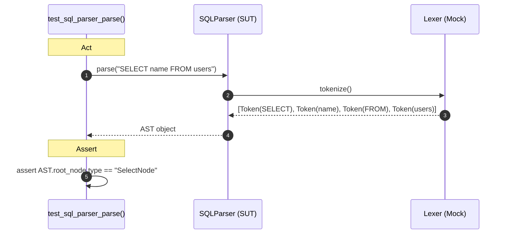
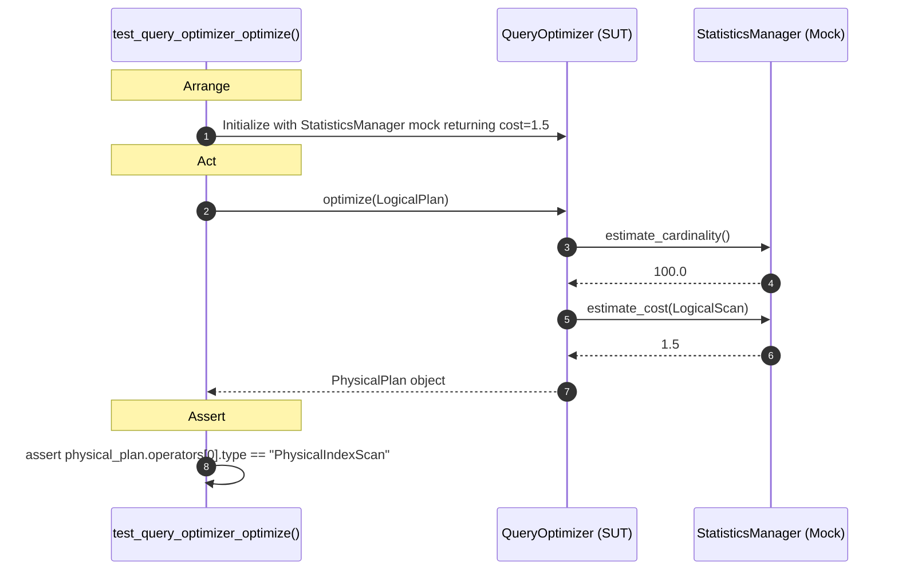
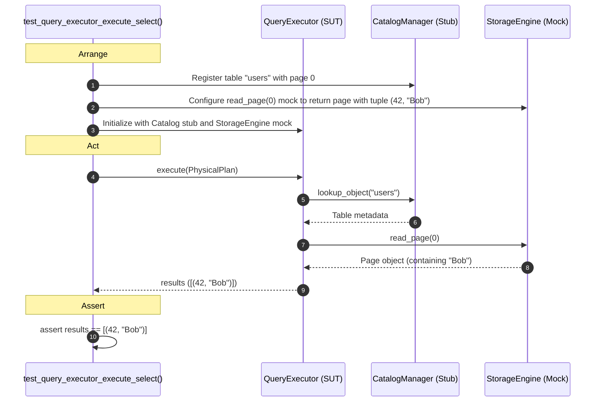
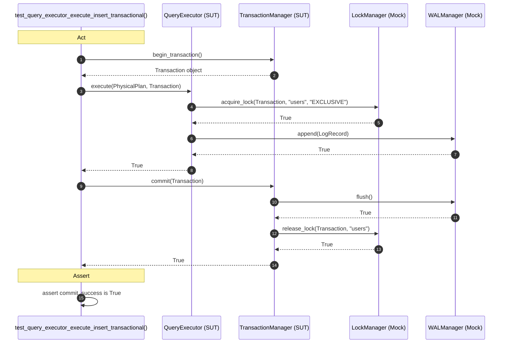

# Query Processing Subsystem Unit Test Sequence Diagrams

This document outlines the simplified unit test flows for the **Query Processing** subsystem, focusing strictly on the test assertions, SUT calls, and mock expectations.

---

## 1. test_sql_parser_parse()
Verifies that `SQLParser` utilizes the `Lexer` and returns the expected AST.

---

## 2. test_query_optimizer_optimize()
Tests that `QueryOptimizer` transforms logical operators and queries statistics to produce a physical plan.

---

## 3. test_query_executor_execute_select()
Verifies that `QueryExecutor` executes a SELECT plan by looking up table metadata and reading tuples from storage.

---

## 4. test_query_executor_execute_insert_transactional()
Tests that writing data via `QueryExecutor` correctly coordinates lock acquisition, WAL writing, page modification, and transaction commit.

