# Storage Engine Unit Test Sequences

This document outlines the detailed sequence diagrams for the unit tests in the `Storage Engine` subsystem.

---

## 1. test_buffer_pool.py

### 1.1 test_buffer_pool_can_be_created()

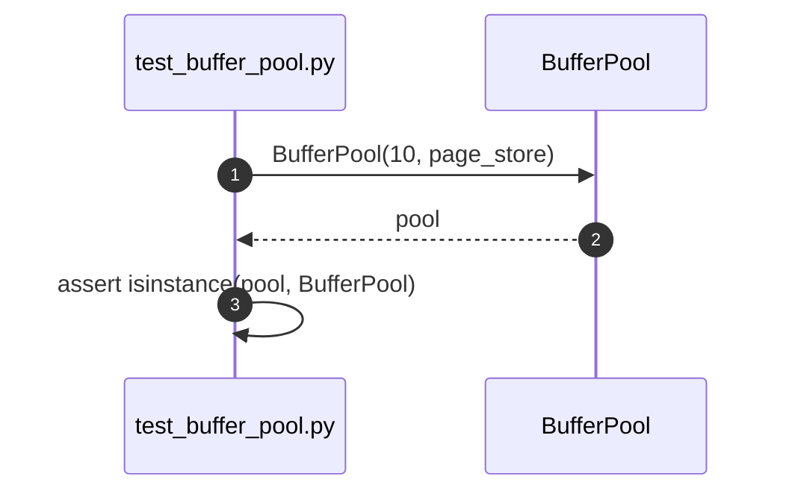
```mermaid
sequenceDiagram
    autonumber
    participant Test as test_buffer_pool.py
    participant SUT as BufferPool

    Test->>SUT: BufferPool(10, page_store)
    SUT-->>Test: pool
    Test->>Test: assert isinstance(pool, BufferPool)
```

### 1.2 test_pin_page()

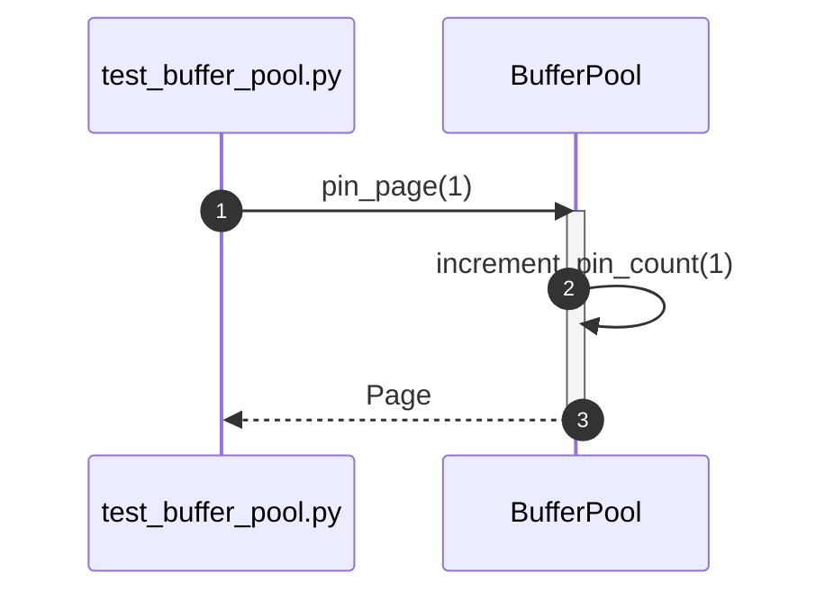
```mermaid
sequenceDiagram
    autonumber
    participant Test as test_buffer_pool.py
    participant SUT as BufferPool

    Test->>SUT: pin_page(1)
    activate SUT
    SUT->>SUT: increment_pin_count(1)
    SUT-->>Test: Page
    deactivate SUT
```

### 1.3 test_cache_page()

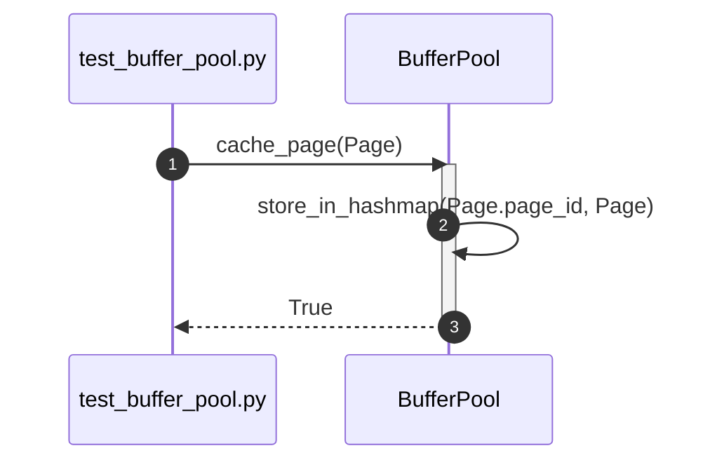
```mermaid
sequenceDiagram
    autonumber
    participant Test as test_buffer_pool.py
    participant SUT as BufferPool

    Test->>SUT: cache_page(Page)
    activate SUT
    SUT->>SUT: store_in_hashmap(Page.page_id, Page)
    SUT-->>Test: True
    deactivate SUT
```

### 1.4 test_get_cached_page()

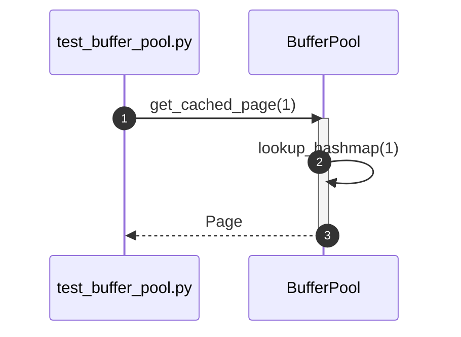
```mermaid
sequenceDiagram
    autonumber
    participant Test as test_buffer_pool.py
    participant SUT as BufferPool

    Test->>SUT: get_cached_page(1)
    activate SUT
    SUT->>SUT: lookup_hashmap(1)
    SUT-->>Test: Page
    deactivate SUT
```

### 1.5 test_load_missing_page()

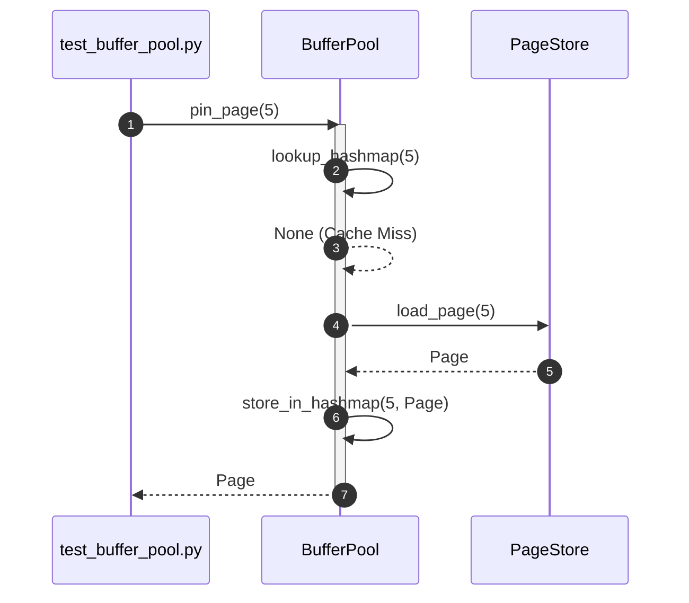
```mermaid
sequenceDiagram
    autonumber
    participant Test as test_buffer_pool.py
    participant SUT as BufferPool
    participant PageStore as PageStore

    Test->>SUT: pin_page(5)
    activate SUT
    SUT->>SUT: lookup_hashmap(5)
    SUT-->>SUT: None (Cache Miss)
    SUT->>PageStore: load_page(5)
    PageStore-->>SUT: Page
    SUT->>SUT: store_in_hashmap(5, Page)
    SUT-->>Test: Page
    deactivate SUT
```

### 1.6 test_enforce_capacity()

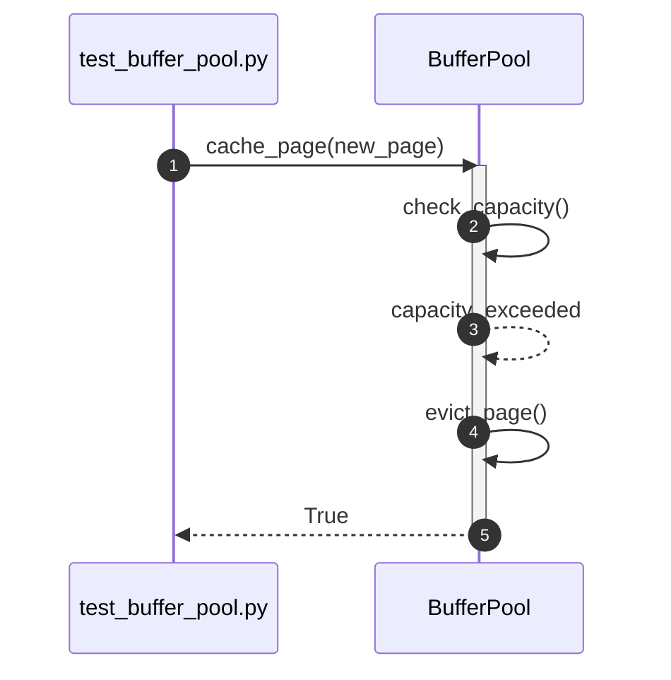
```mermaid
sequenceDiagram
    autonumber
    participant Test as test_buffer_pool.py
    participant SUT as BufferPool

    Test->>SUT: cache_page(new_page)
    activate SUT
    SUT->>SUT: check_capacity()
    SUT-->>SUT: capacity_exceeded
    SUT->>SUT: evict_page()
    SUT-->>Test: True
    deactivate SUT
```

### 1.7 test_evict_page()

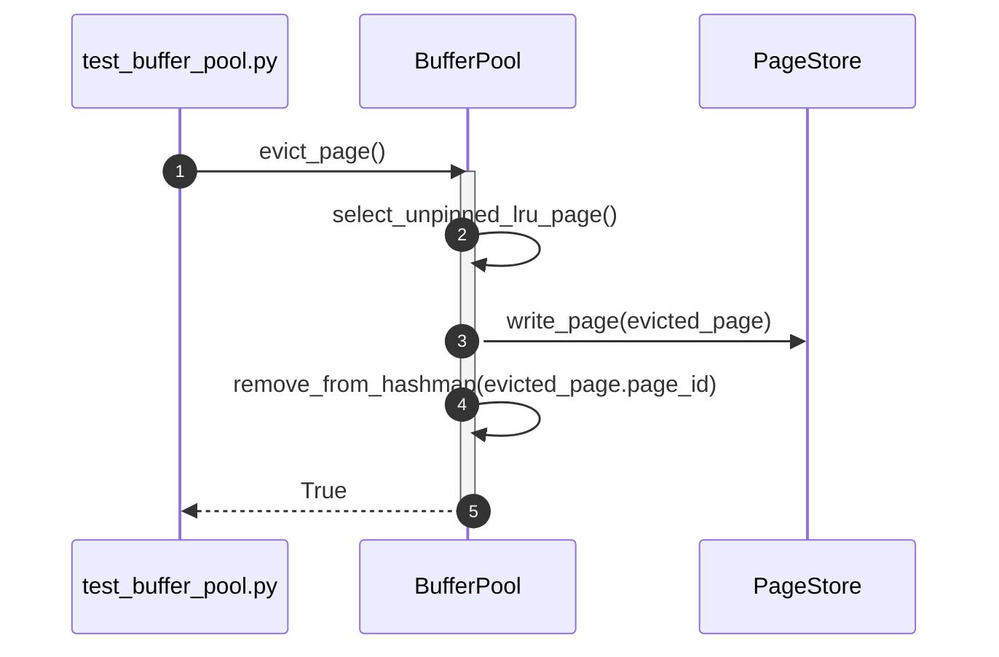
```mermaid
sequenceDiagram
    autonumber
    participant Test as test_buffer_pool.py
    participant SUT as BufferPool
    participant PageStore as PageStore

    Test->>SUT: evict_page()
    activate SUT
    SUT->>SUT: select_unpinned_lru_page()
    SUT->>PageStore: write_page(evicted_page)
    SUT->>SUT: remove_from_hashmap(evicted_page.page_id)
    SUT-->>Test: True
    deactivate SUT
```

### 1.8 test_preserve_pinned_page()

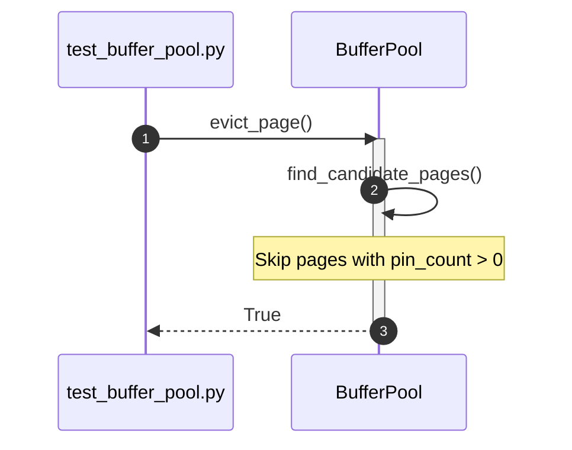
```mermaid
sequenceDiagram
    autonumber
    participant Test as test_buffer_pool.py
    participant SUT as BufferPool

    Test->>SUT: evict_page()
    activate SUT
    SUT->>SUT: find_candidate_pages()
    Note over SUT: Skip pages with pin_count > 0
    SUT-->>Test: True
    deactivate SUT
```

### 1.9 test_mark_dirty()

```mermaid
sequenceDiagram
    autonumber
    participant Test as test_buffer_pool.py
    participant SUT as BufferPool

    Test->>SUT: mark_dirty(1)
    activate SUT
    SUT->>SUT: set_dirty_flag(1, True)
    SUT-->>Test: True
    deactivate SUT
```

### 1.10 test_flush_page()

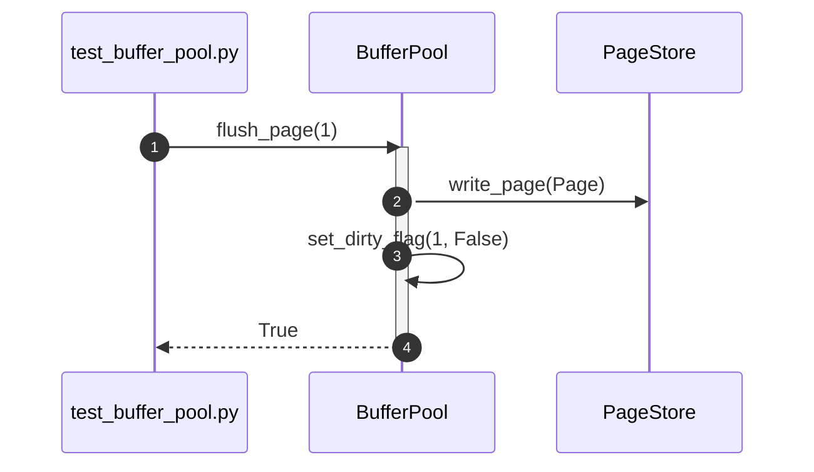
```mermaid
sequenceDiagram
    autonumber
    participant Test as test_buffer_pool.py
    participant SUT as BufferPool
    participant PageStore as PageStore

    Test->>SUT: flush_page(1)
    activate SUT
    SUT->>PageStore: write_page(Page)
    SUT->>SUT: set_dirty_flag(1, False)
    SUT-->>Test: True
    deactivate SUT
```

### 1.11 test_flush_all_pages()

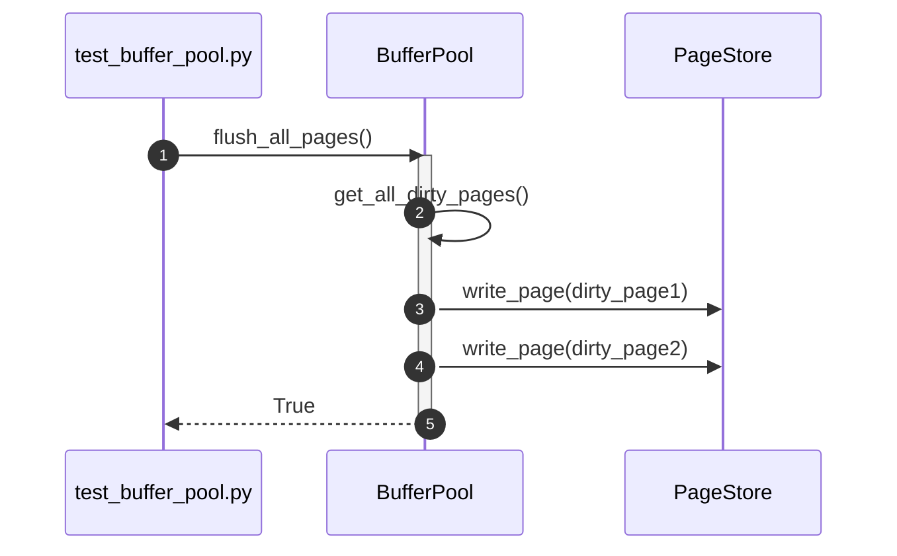
```mermaid
sequenceDiagram
    autonumber
    participant Test as test_buffer_pool.py
    participant SUT as BufferPool
    participant PageStore as PageStore

    Test->>SUT: flush_all_pages()
    activate SUT
    SUT->>SUT: get_all_dirty_pages()
    SUT->>PageStore: write_page(dirty_page1)
    SUT->>PageStore: write_page(dirty_page2)
    SUT-->>Test: True
    deactivate SUT
```

### 1.12 test_buffer_pool_stores_capacity()

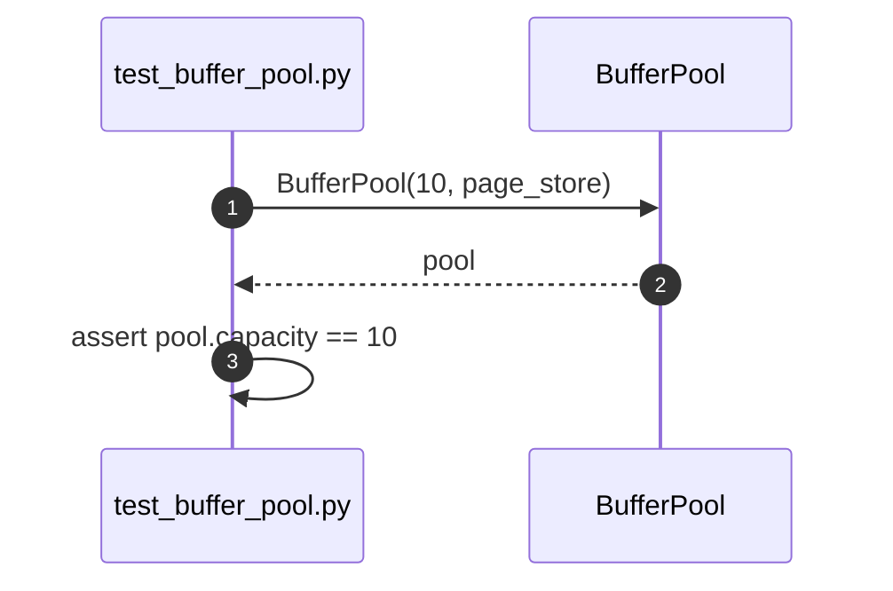
```mermaid
sequenceDiagram
    autonumber
    participant Test as test_buffer_pool.py
    participant SUT as BufferPool

    Test->>SUT: BufferPool(10, page_store)
    SUT-->>Test: pool
    Test->>Test: assert pool.capacity == 10
```

---

## 2. test_file_manager.py

### 2.1 test_file_manager_can_be_created()

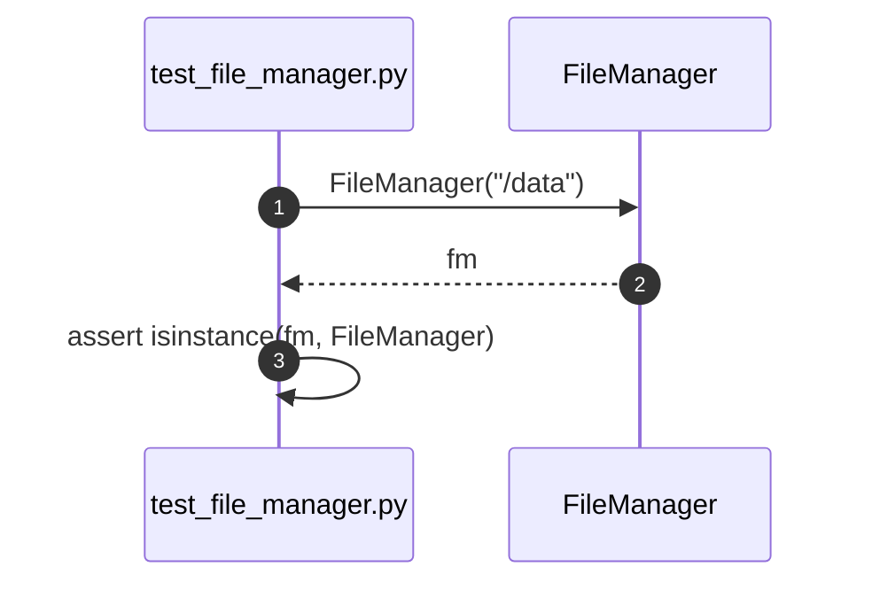
```mermaid
sequenceDiagram
    autonumber
    participant Test as test_file_manager.py
    participant SUT as FileManager

    Test->>SUT: FileManager("/data")
    SUT-->>Test: fm
    Test->>Test: assert isinstance(fm, FileManager)
```

### 2.2 test_create_file()

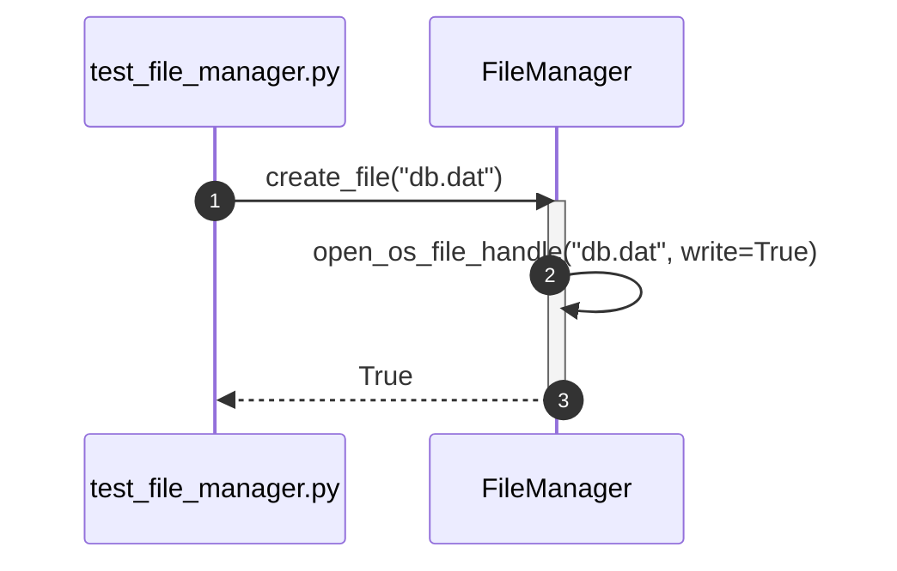
```mermaid
sequenceDiagram
    autonumber
    participant Test as test_file_manager.py
    participant SUT as FileManager

    Test->>SUT: create_file("db.dat")
    activate SUT
    SUT->>SUT: open_os_file_handle("db.dat", write=True)
    SUT-->>Test: True
    deactivate SUT
```

### 2.3 test_read_file_bytes()

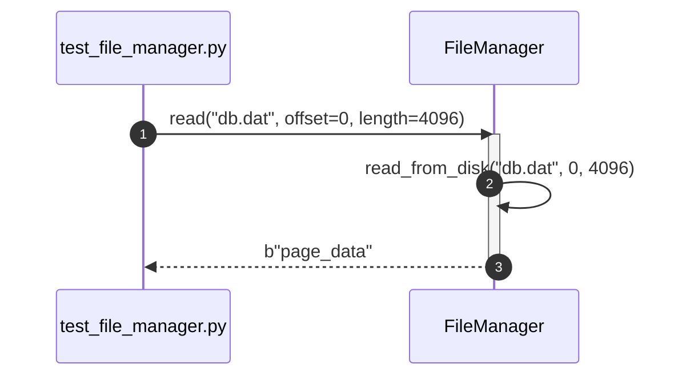
```mermaid
sequenceDiagram
    autonumber
    participant Test as test_file_manager.py
    participant SUT as FileManager

    Test->>SUT: read("db.dat", offset=0, length=4096)
    activate SUT
    SUT->>SUT: read_from_disk("db.dat", 0, 4096)
    SUT-->>Test: b"page_data"
    deactivate SUT
```

### 2.4 test_write()

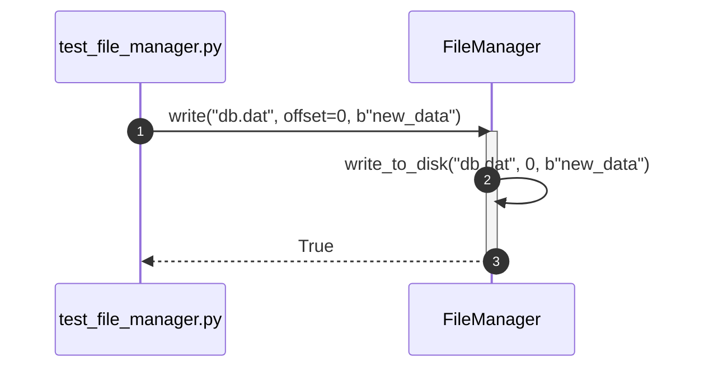
```mermaid
sequenceDiagram
    autonumber
    participant Test as test_file_manager.py
    participant SUT as FileManager

    Test->>SUT: write("db.dat", offset=0, b"new_data")
    activate SUT
    SUT->>SUT: write_to_disk("db.dat", 0, b"new_data")
    SUT-->>Test: True
    deactivate SUT
```

---

## 3. test_log_file_manager.py

### 3.1 test_append_log_entry()

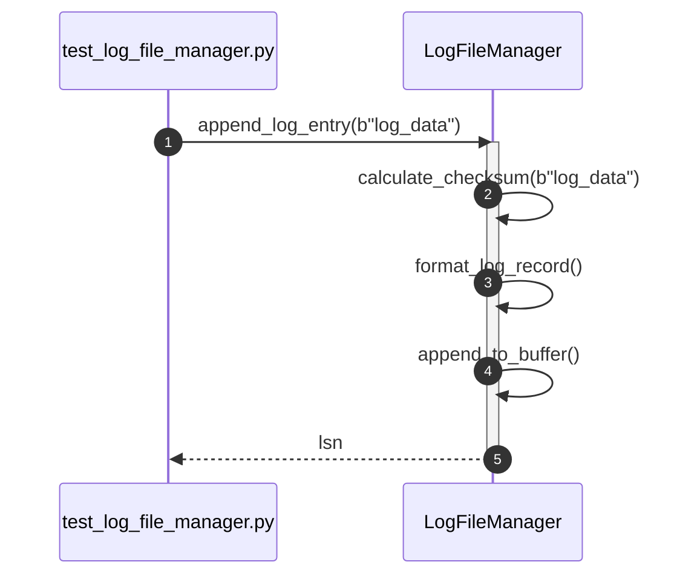
```mermaid
sequenceDiagram
    autonumber
    participant Test as test_log_file_manager.py
    participant SUT as LogFileManager

    Test->>SUT: append_log_entry(b"log_data")
    activate SUT
    SUT->>SUT: calculate_checksum(b"log_data")
    SUT->>SUT: format_log_record()
    SUT->>SUT: append_to_buffer()
    SUT-->>Test: lsn
    deactivate SUT
```

### 3.2 test_read_log_entry()

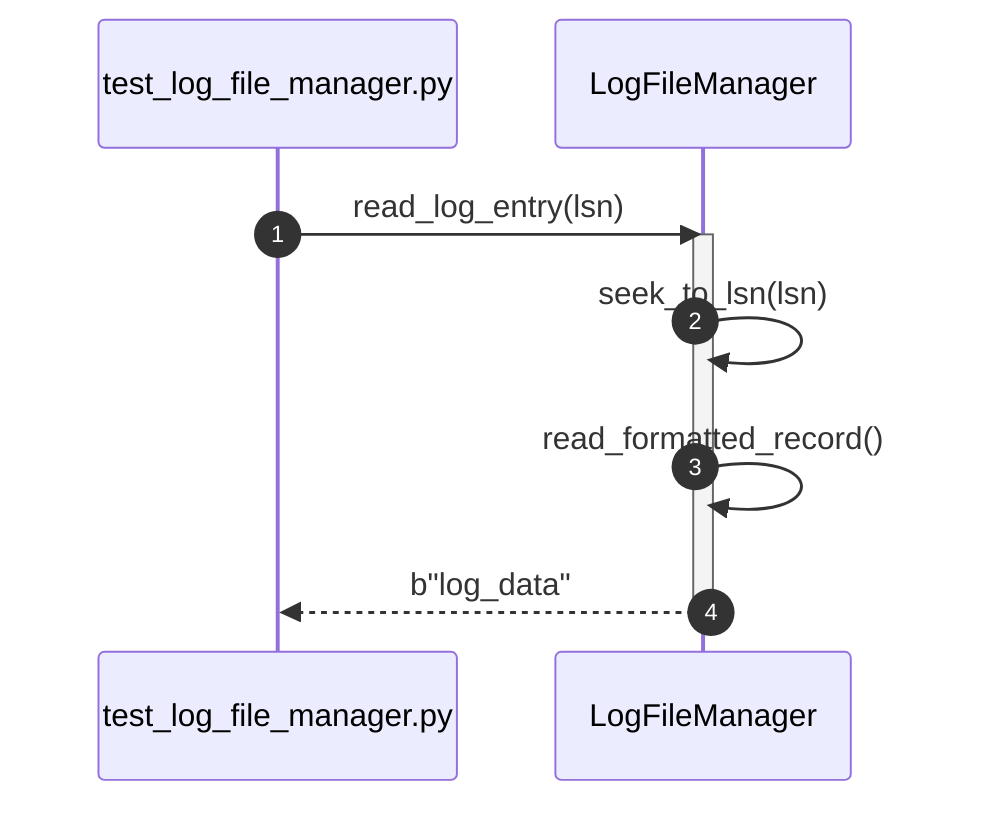
```mermaid
sequenceDiagram
    autonumber
    participant Test as test_log_file_manager.py
    participant SUT as LogFileManager

    Test->>SUT: read_log_entry(lsn)
    activate SUT
    SUT->>SUT: seek_to_lsn(lsn)
    SUT->>SUT: read_formatted_record()
    SUT-->>Test: b"log_data"
    deactivate SUT
```

### 3.3 test_read_log_range()

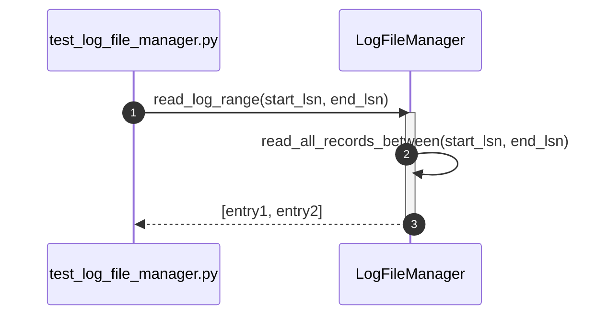
```mermaid
sequenceDiagram
    autonumber
    participant Test as test_log_file_manager.py
    participant SUT as LogFileManager

    Test->>SUT: read_log_range(start_lsn, end_lsn)
    activate SUT
    SUT->>SUT: read_all_records_between(start_lsn, end_lsn)
    SUT-->>Test: [entry1, entry2]
    deactivate SUT
```

### 3.4 test_detect_corrupted_entry()

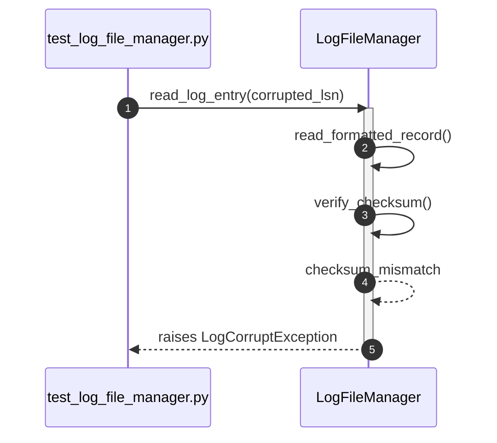
```mermaid
sequenceDiagram
    autonumber
    participant Test as test_log_file_manager.py
    participant SUT as LogFileManager

    Test->>SUT: read_log_entry(corrupted_lsn)
    activate SUT
    SUT->>SUT: read_formatted_record()
    SUT->>SUT: verify_checksum()
    SUT-->>SUT: checksum_mismatch
    SUT-->>Test: raises LogCorruptException
    deactivate SUT
```

### 3.5 test_flush_log()

```mermaid
sequenceDiagram
    autonumber
    participant Test as test_log_file_manager.py
    participant SUT as LogFileManager

    Test->>SUT: flush_log()
    activate SUT
    SUT->>SUT: write_buffer_to_disk()
    SUT->>SUT: fsync()
    SUT-->>Test: True
    deactivate SUT
```

### 3.6 test_truncate_log()

```mermaid
sequenceDiagram
    autonumber
    participant Test as test_log_file_manager.py
    participant SUT as LogFileManager

    Test->>SUT: truncate_log(lsn)
    activate SUT
    SUT->>SUT: discard_logs_before(lsn)
    SUT-->>Test: True
    deactivate SUT
```

### 3.7 test_assign_sequence_number()

```mermaid
sequenceDiagram
    autonumber
    participant Test as test_log_file_manager.py
    participant SUT as LogFileManager

    Test->>SUT: append_log_entry(b"log")
    activate SUT
    SUT->>SUT: get_next_lsn()
    SUT-->>Test: lsn
    deactivate SUT
```

### 3.8 test_log_file_manager_can_be_created()

```mermaid
sequenceDiagram
    autonumber
    participant Test as test_log_file_manager.py
    participant SUT as LogFileManager

    Test->>SUT: LogFileManager()
    SUT-->>Test: manager
    Test->>Test: assert isinstance(manager, LogFileManager)
```

---

## 4. test_page.py

### 4.1 test_page_can_be_created()

```mermaid
sequenceDiagram
    autonumber
    participant Test as test_page.py
    participant SUT as Page

    Test->>SUT: Page(1, b"initial_data")
    SUT-->>Test: page
    Test->>Test: assert page.page_id == 1
    Test->>Test: assert page.data == b"initial_data"
```

### 4.2 test_read_tuple()

```mermaid
sequenceDiagram
    autonumber
    participant Test as test_page.py
    participant SUT as Page

    Test->>SUT: page.read_tuple(slot_offset=10)
    activate SUT
    SUT->>SUT: parse_slot_header(10)
    SUT-->>Test: tuple_bytes
    deactivate SUT
```

### 4.3 test_write_tuple()

```mermaid
sequenceDiagram
    autonumber
    participant Test as test_page.py
    participant SUT as Page

    Test->>SUT: page.write_tuple(slot_offset=10, b"tuple_data")
    activate SUT
    SUT->>SUT: write_slot_header(10)
    SUT->>SUT: write_bytes(b"tuple_data")
    SUT-->>Test: True
    deactivate SUT
```

---

## 5. test_page_manager.py

### 5.1 test_allocate_page()

```mermaid
sequenceDiagram
    autonumber
    participant Test as test_page_manager.py
    participant SUT as PageManager

    Test->>SUT: allocate_page()
    activate SUT
    SUT->>SUT: pop_free_list()
    SUT-->>SUT: None (No Free Pages)
    SUT->>SUT: extend_database_file()
    SUT-->>Test: new_page_id
    deactivate SUT
```

### 5.2 test_get_page()

```mermaid
sequenceDiagram
    autonumber
    participant Test as test_page_manager.py
    participant SUT as PageManager
    participant BufferPool as BufferPool

    Test->>SUT: get_page(2)
    activate SUT
    SUT->>BufferPool: pin_page(2)
    BufferPool-->>SUT: Page
    SUT-->>Test: Page
    deactivate SUT
```

### 5.3 test_release_page()

```mermaid
sequenceDiagram
    autonumber
    participant Test as test_page_manager.py
    participant SUT as PageManager
    participant BufferPool as BufferPool

    Test->>SUT: release_page(2)
    activate SUT
    SUT->>BufferPool: unpin_page(2)
    BufferPool-->>SUT: True
    SUT-->>Test: True
    deactivate SUT
```

### 5.4 test_reuse_page()

```mermaid
sequenceDiagram
    autonumber
    participant Test as test_page_manager.py
    participant SUT as PageManager

    Test->>SUT: release_page(2, deallocate=True)
    activate SUT
    SUT->>SUT: push_free_list(2)
    SUT-->>Test: True
    deactivate SUT
    Test->>SUT: allocate_page()
    activate SUT
    SUT->>SUT: pop_free_list()
    SUT-->>Test: 2
    deactivate SUT
```

### 5.5 test_track_page_free_space()

```mermaid
sequenceDiagram
    autonumber
    participant Test as test_page_manager.py
    participant SUT as PageManager

    Test->>SUT: track_page_free_space(2)
    activate SUT
    SUT->>SUT: read_page_header_free_space(2)
    SUT-->>Test: free_space_bytes
    deactivate SUT
```

### 5.6 test_reject_full_page()

```mermaid
sequenceDiagram
    autonumber
    participant Test as test_page_manager.py
    participant SUT as PageManager

    Test->>SUT: get_page_with_free_space(required_bytes=2048)
    activate SUT
    SUT->>SUT: scan_page_space_directory(required_bytes=2048)
    SUT-->>Test: raises StorageFullException
    deactivate SUT
```

### 5.7 test_page_manager_can_be_created()

```mermaid
sequenceDiagram
    autonumber
    participant Test as test_page_manager.py
    participant SUT as PageManager

    Test->>SUT: PageManager()
    SUT-->>Test: manager
    Test->>Test: assert isinstance(manager, PageManager)
```

---

## 6. test_record.py

### 6.1 test_serialize_record()

```mermaid
sequenceDiagram
    autonumber
    participant Test as test_record.py
    participant SUT as Record

    Test->>SUT: Record(1, {"name": "Ada"}).serialize()
    activate SUT
    SUT->>SUT: convert_values_to_bytes()
    SUT-->>Test: b"serialized_bytes"
    deactivate SUT
```

### 6.2 test_deserialize_record()

```mermaid
sequenceDiagram
    autonumber
    participant Test as test_record.py
    participant SUT as Record

    Test->>SUT: Record.deserialize(b"serialized_bytes")
    activate SUT
    SUT->>SUT: parse_bytes_to_values()
    SUT-->>Test: Record(1, {"name": "Ada"})
    deactivate SUT
```

### 6.3 test_record_stores_identifier_and_values()

```mermaid
sequenceDiagram
    autonumber
    participant Test as test_record.py
    participant SUT as Record

    Test->>SUT: Record(1, {"name": "Ada"})
    SUT-->>Test: record
    Test->>Test: assert record.record_id == 1
    Test->>Test: assert record.values == {"name": "Ada"}
```

---

## 7. test_record_manager.py

### 7.1 test_read_record()

```mermaid
sequenceDiagram
    autonumber
    participant Test as test_record_manager.py
    participant SUT as RecordManager
    participant Page as Page
    participant PageManager as PageManager
    participant Record as Record

    Test->>SUT: read_record("rid1")
    activate SUT
    SUT->>SUT: parse_rid("rid1")
    SUT->>PageManager: get_page(page_id)
    PageManager-->>SUT: Page
    SUT->>Page: read_tuple(slot_id)
    Page-->>SUT: record_bytes
    SUT->>Record: deserialize(record_bytes)
    Record-->>SUT: record
    SUT-->>Test: record
    deactivate SUT
```

### 7.2 test_move_record()

```mermaid
sequenceDiagram
    autonumber
    participant Test as test_record_manager.py
    participant SUT as RecordManager

    Test->>SUT: move_record("rid1", "rid2")
    activate SUT
    SUT->>SUT: delete_record("rid1")
    SUT->>SUT: insert_record_at_specific_id("rid2", record)
    SUT-->>Test: True
    deactivate SUT
```

### 7.3 test_insert_record()

```mermaid
sequenceDiagram
    autonumber
    participant Test as test_record_manager.py
    participant SUT as RecordManager
    participant Page as Page
    participant PageManager as PageManager
    participant Record as Record

    Test->>SUT: insert_record(record)
    activate SUT
    SUT->>PageManager: get_page_with_free_space(record.size)
    PageManager-->>SUT: Page
    SUT->>Record: serialize()
    Record-->>SUT: record_bytes
    SUT->>Page: write_tuple(record_bytes)
    Page-->>SUT: slot_id
    SUT-->>Test: rid(page_id, slot_id)
    deactivate SUT
```

### 7.4 test_update_record()

```mermaid
sequenceDiagram
    autonumber
    participant Test as test_record_manager.py
    participant SUT as RecordManager
    participant Page as Page
    participant PageManager as PageManager

    Test->>SUT: update_record("rid1", updated_record)
    activate SUT
    SUT->>PageManager: get_page(page_id)
    PageManager-->>SUT: Page
    SUT->>Page: write_tuple(slot_id, updated_record.serialize())
    Page-->>SUT: True
    SUT-->>Test: True
    deactivate SUT
```

### 7.5 test_delete_record()

```mermaid
sequenceDiagram
    autonumber
    participant Test as test_record_manager.py
    participant SUT as RecordManager
    participant Page as Page
    participant PageManager as PageManager

    Test->>SUT: delete_record("rid1")
    activate SUT
    SUT->>PageManager: get_page(page_id)
    PageManager-->>SUT: Page
    SUT->>Page: delete_tuple(slot_id)
    Page-->>SUT: True
    SUT-->>Test: True
    deactivate SUT
```

### 7.6 test_reject_oversized_record()

```mermaid
sequenceDiagram
    autonumber
    participant Test as test_record_manager.py
    participant SUT as RecordManager

    Test->>SUT: insert_record(oversized_record)
    activate SUT
    SUT-->>Test: raises RecordOversizedException
    deactivate SUT
```

### 7.7 test_record_manager_can_be_created()

```mermaid
sequenceDiagram
    autonumber
    participant Test as test_record_manager.py
    participant SUT as RecordManager

    Test->>SUT: RecordManager()
    SUT-->>Test: manager
    Test->>Test: assert isinstance(manager, RecordManager)
```

---

## 8. test_storage_allocator.py

### 8.1 test_allocate_storage_space()

```mermaid
sequenceDiagram
    autonumber
    participant Test as test_storage_allocator.py
    participant SUT as StorageAllocator

    Test->>SUT: allocate_space(1024)
    activate SUT
    SUT->>SUT: find_free_extent(1024)
    SUT->>SUT: mark_extent_allocated(extent)
    SUT-->>Test: extent_address
    deactivate SUT
```

### 8.2 test_release_storage_space()

```mermaid
sequenceDiagram
    autonumber
    participant Test as test_storage_allocator.py
    participant SUT as StorageAllocator

    Test->>SUT: release_space(extent_address)
    activate SUT
    SUT->>SUT: mark_extent_free(extent_address)
    SUT-->>Test: True
    deactivate SUT
```

### 8.3 test_reallocate_space()

```mermaid
sequenceDiagram
    autonumber
    participant Test as test_storage_allocator.py
    participant SUT as StorageAllocator

    Test->>SUT: reallocate_space(extent_address, 2048)
    activate SUT
    SUT->>SUT: release_space(extent_address)
    SUT->>SUT: allocate_space(2048)
    SUT-->>Test: new_extent_address
    deactivate SUT
```

### 8.4 test_track_allocator_free_space()

```mermaid
sequenceDiagram
    autonumber
    participant Test as test_storage_allocator.py
    participant SUT as StorageAllocator

    Test->>SUT: get_free_space()
    activate SUT
    SUT->>SUT: sum_free_extents()
    SUT-->>Test: free_bytes
    deactivate SUT
```

### 8.5 test_reject_exhausted_storage()

```mermaid
sequenceDiagram
    autonumber
    participant Test as test_storage_allocator.py
    participant SUT as StorageAllocator

    Test->>SUT: allocate_space(large_size)
    activate SUT
    SUT->>SUT: find_free_extent(large_size)
    SUT-->>SUT: None
    SUT-->>Test: raises OutOfStorageException
    deactivate SUT
```

### 8.6 test_reject_double_release()

```mermaid
sequenceDiagram
    autonumber
    participant Test as test_storage_allocator.py
    participant SUT as StorageAllocator

    Test->>SUT: release_space(extent_address)
    activate SUT
    SUT->>SUT: is_already_free(extent_address)
    SUT-->>SUT: True
    SUT-->>Test: raises DoubleReleaseException
    deactivate SUT
```

### 8.7 test_storage_allocator_can_be_created()

```mermaid
sequenceDiagram
    autonumber
    participant Test as test_storage_allocator.py
    participant SUT as StorageAllocator

    Test->>SUT: StorageAllocator()
    SUT-->>Test: allocator
    Test->>Test: assert isinstance(allocator, StorageAllocator)
```

---

## 9. test_storage_engine.py

### 9.1 test_storage_engine_can_be_created()

```mermaid
sequenceDiagram
    autonumber
    participant Test as test_storage_engine.py
    participant SUT as StorageEngine

    Test->>SUT: StorageEngine(buffer_pool)
    SUT-->>Test: engine
    Test->>Test: assert dependency and public methods
```

### 9.2 test_initialize()

```mermaid
sequenceDiagram
    autonumber
    participant Test as test_storage_engine.py
    participant SUT as StorageEngine

    Test->>SUT: initialize()
    SUT->>SUT: self.is_initialized = True
    SUT-->>Test: True
```

### 9.3 test_read_page()

```mermaid
sequenceDiagram
    autonumber
    participant Test as test_storage_engine.py
    participant Pool as BufferPool
    participant SUT as StorageEngine

    Test->>SUT: read_page(1)
    SUT->>Pool: pin_page(1)
    Pool-->>SUT: page
    SUT-->>Test: page
    Test->>Test: assert result and BufferPool call
```

### 9.4 test_write_page()

```mermaid
sequenceDiagram
    autonumber
    participant Test as test_storage_engine.py
    participant Pool as BufferPool
    participant SUT as StorageEngine

    Test->>SUT: write_page(page)
    SUT->>Pool: cache_page(page)
    Pool-->>SUT: True
    SUT-->>Test: True
    Test->>Test: assert result and BufferPool call
```

---

## 10. test_dependencies.py

### 10.1 test_page_store_stub_matches_protocol()

```mermaid
sequenceDiagram
    autonumber
    participant Test as test_dependencies.py
    participant Stub as PageStoreStub
    participant Contract as PageStoreProtocol

    Test->>Stub: PageStoreStub()
    Stub-->>Test: page_store
    Test->>Contract: isinstance(page_store, PageStoreProtocol)
    Contract-->>Test: True
```

---
