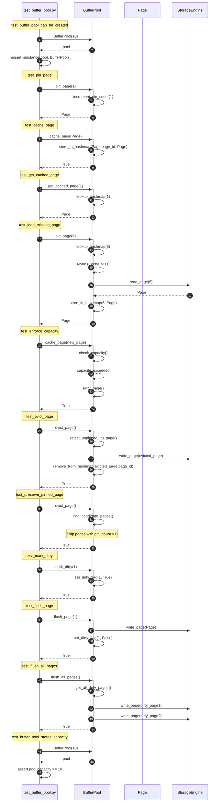
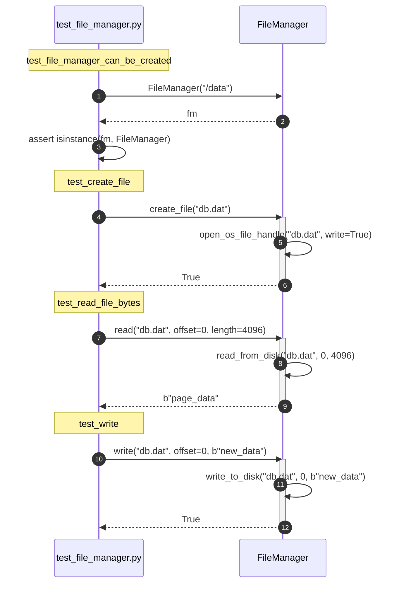
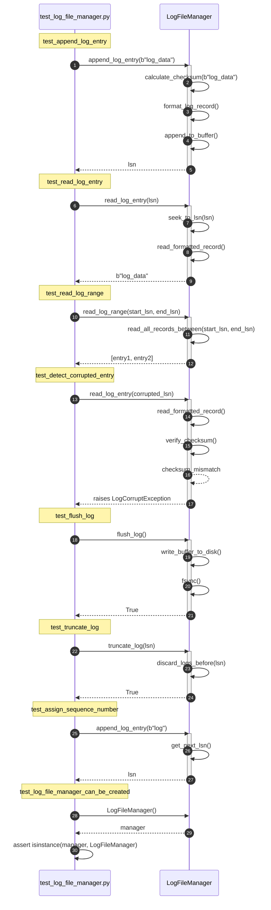
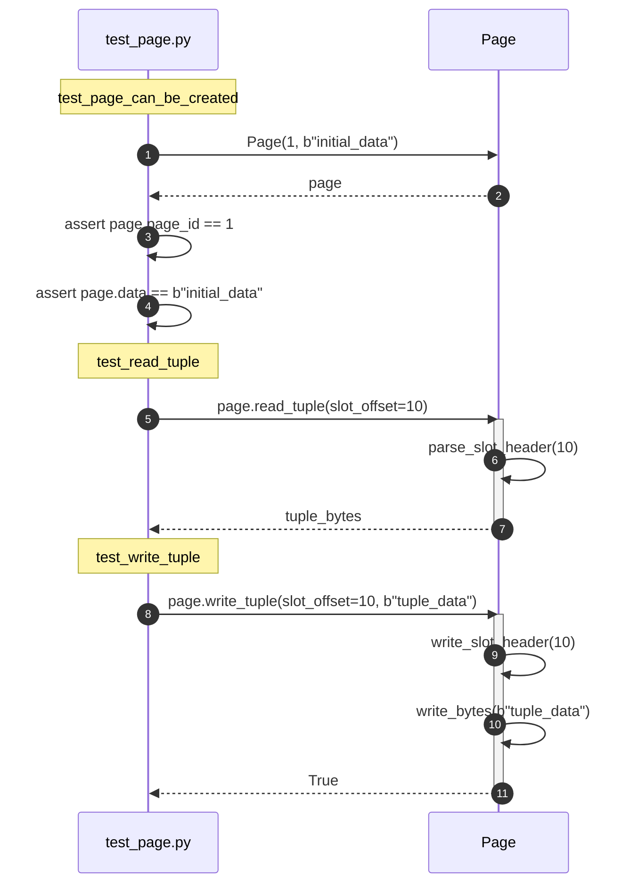
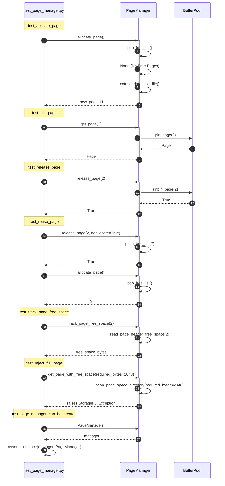
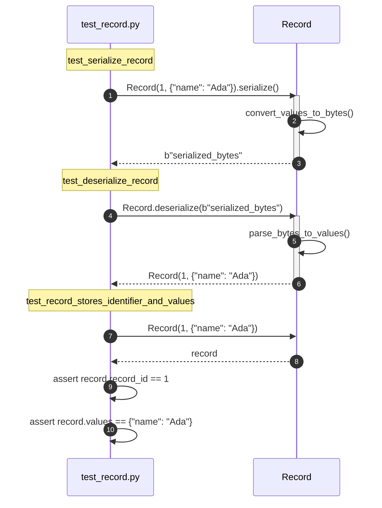
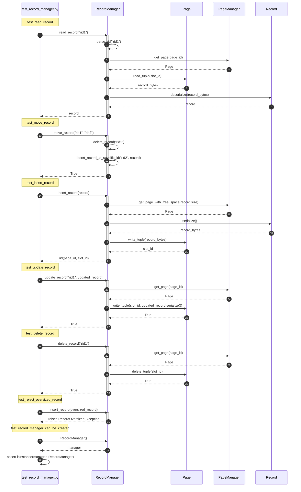
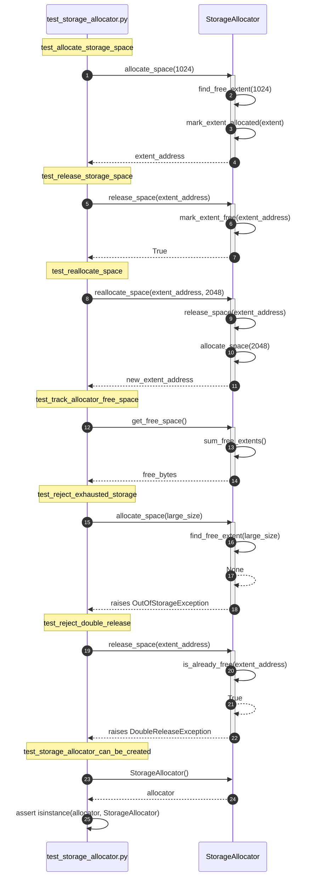
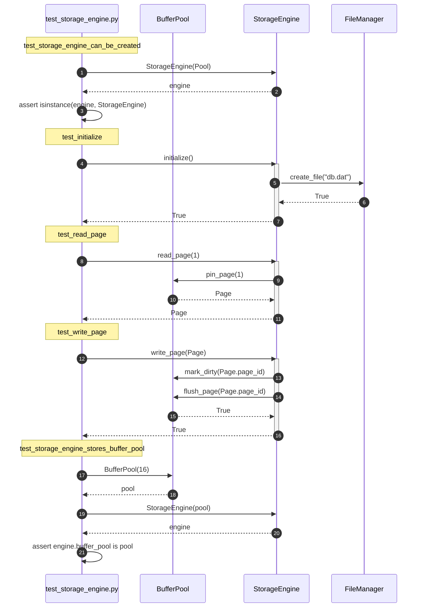

# Storage Engine Unit Test Sequences

This document outlines the detailed sequence diagrams for the unit tests in the `Storage Engine` subsystem.

---

## 1. test_buffer_pool.py

---

## 2. test_file_manager.py

---

## 3. test_log_file_manager.py

---

## 4. test_page.py

---

## 5. test_page_manager.py

---

## 6. test_record.py

---

## 7. test_record_manager.py

---

## 8. test_storage_allocator.py

---

## 9. test_storage_engine.py

