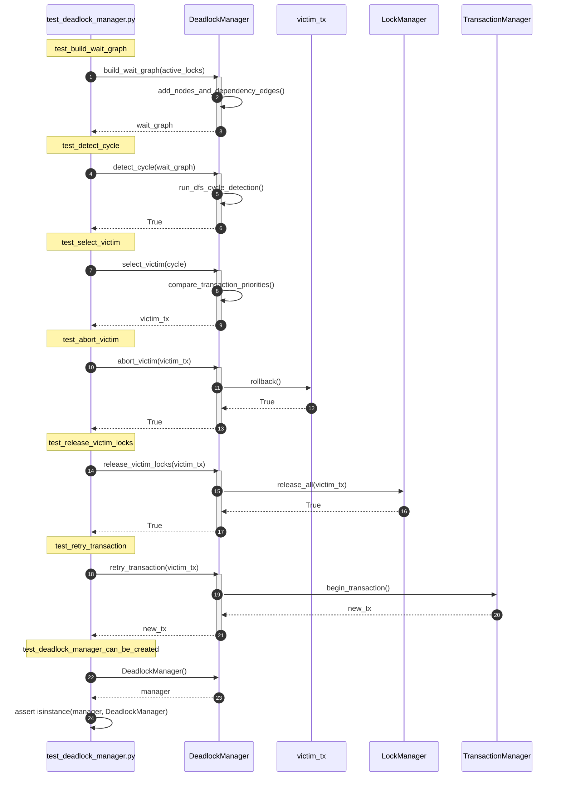
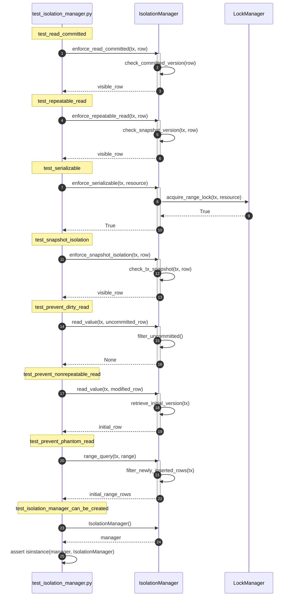
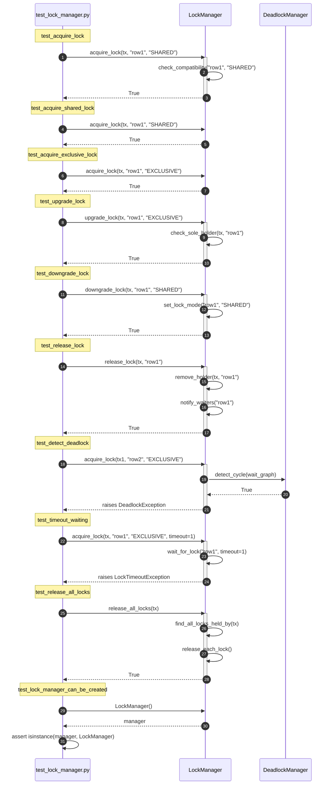
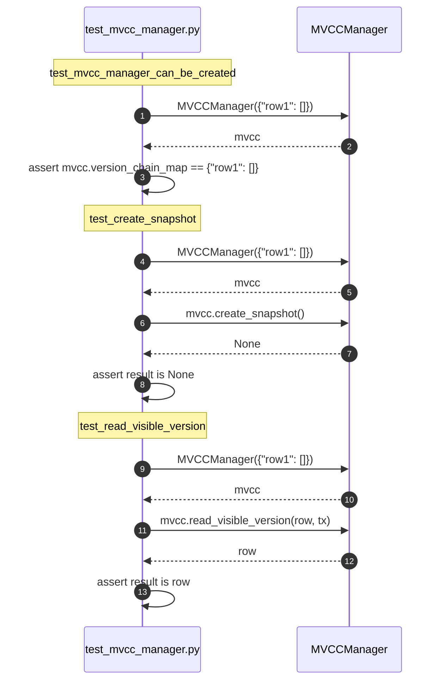
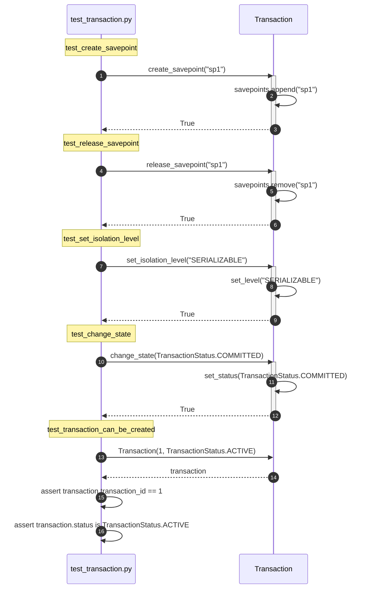
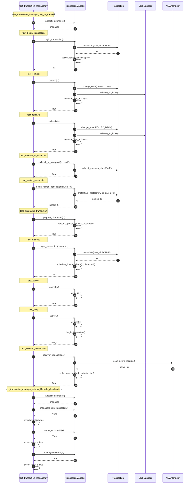
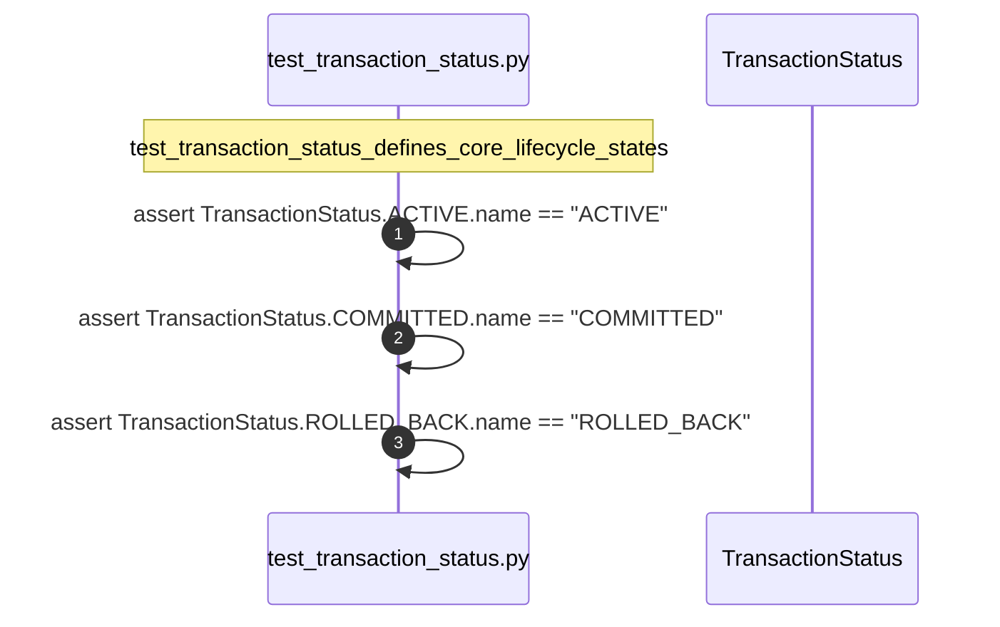

# Transaction Unit Test Sequences

This document outlines the detailed sequence diagrams for the unit tests in the `Transaction` subsystem.

---

## 1. test_deadlock_manager.py

---

## 2. test_isolation_manager.py

---

## 3. test_lock_manager.py

---

## 4. test_mvcc_manager.py

---

## 5. test_transaction.py

---

## 6. test_transaction_manager.py

---

## 7. test_transaction_status.py

