# Transaction Unit Test Sequences

This document outlines the detailed sequence diagrams for the unit tests in the `Transaction` subsystem.

---

## 1. test_deadlock_manager.py

### 1.1 test_build_wait_graph()

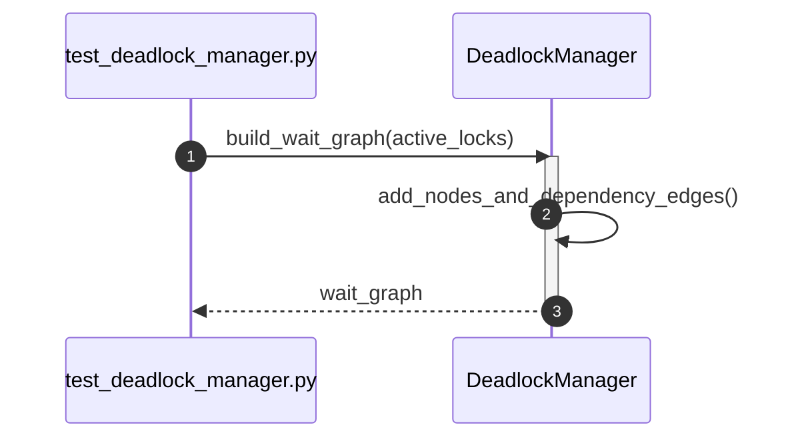
```mermaid
sequenceDiagram
    autonumber
    participant Test as test_deadlock_manager.py
    participant SUT as DeadlockManager

    Test->>SUT: build_wait_graph(active_locks)
    activate SUT
    SUT->>SUT: add_nodes_and_dependency_edges()
    SUT-->>Test: wait_graph
    deactivate SUT
```

### 1.2 test_detect_cycle()

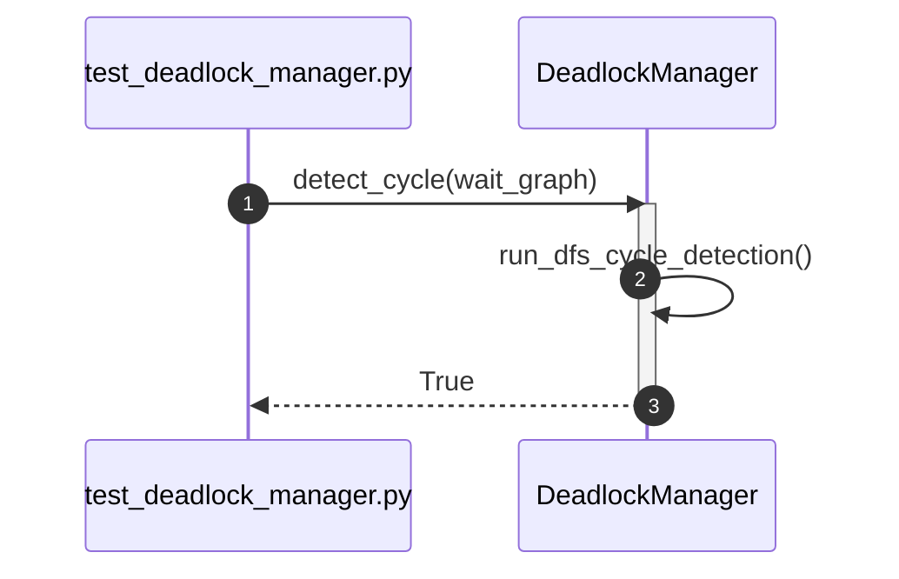
```mermaid
sequenceDiagram
    autonumber
    participant Test as test_deadlock_manager.py
    participant SUT as DeadlockManager

    Test->>SUT: detect_cycle(wait_graph)
    activate SUT
    SUT->>SUT: run_dfs_cycle_detection()
    SUT-->>Test: True
    deactivate SUT
```

### 1.3 test_select_victim()

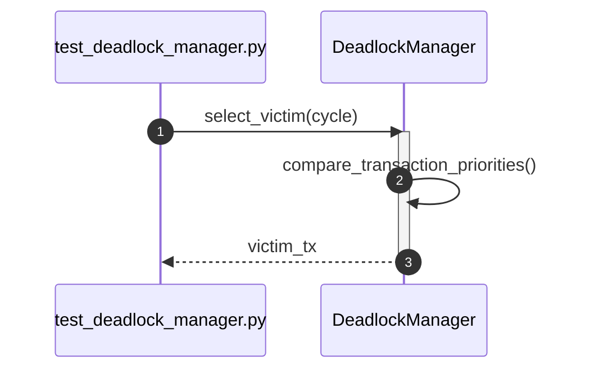
```mermaid
sequenceDiagram
    autonumber
    participant Test as test_deadlock_manager.py
    participant SUT as DeadlockManager

    Test->>SUT: select_victim(cycle)
    activate SUT
    SUT->>SUT: compare_transaction_priorities()
    SUT-->>Test: victim_tx
    deactivate SUT
```

### 1.4 test_abort_victim()

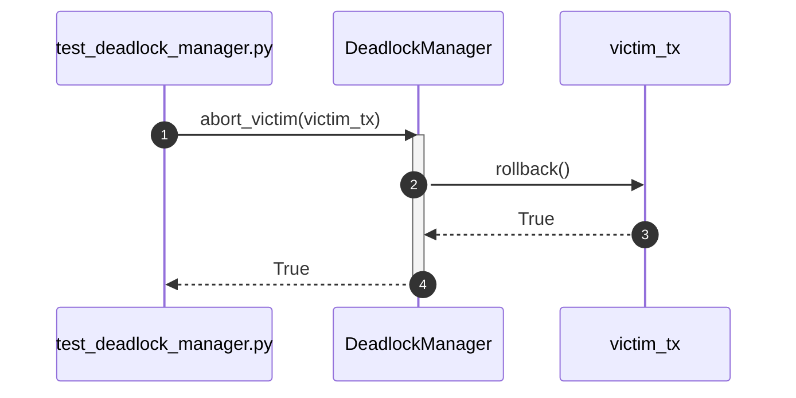
```mermaid
sequenceDiagram
    autonumber
    participant Test as test_deadlock_manager.py
    participant SUT as DeadlockManager
    participant victim_tx as victim_tx

    Test->>SUT: abort_victim(victim_tx)
    activate SUT
    SUT->>victim_tx: rollback()
    victim_tx-->>SUT: True
    SUT-->>Test: True
    deactivate SUT
```

### 1.5 test_release_victim_locks()

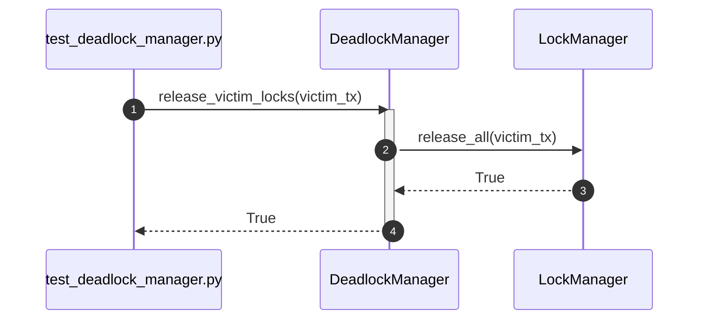
```mermaid
sequenceDiagram
    autonumber
    participant Test as test_deadlock_manager.py
    participant SUT as DeadlockManager
    participant LockManager as LockManager

    Test->>SUT: release_victim_locks(victim_tx)
    activate SUT
    SUT->>LockManager: release_all(victim_tx)
    LockManager-->>SUT: True
    SUT-->>Test: True
    deactivate SUT
```

### 1.6 test_retry_transaction()

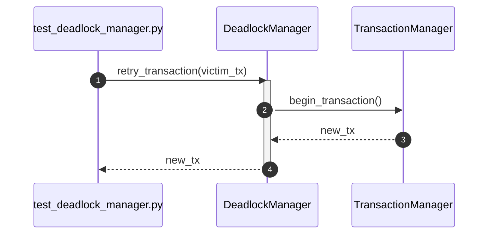
```mermaid
sequenceDiagram
    autonumber
    participant Test as test_deadlock_manager.py
    participant SUT as DeadlockManager
    participant TransactionManager as TransactionManager

    Test->>SUT: retry_transaction(victim_tx)
    activate SUT
    SUT->>TransactionManager: begin_transaction()
    TransactionManager-->>SUT: new_tx
    SUT-->>Test: new_tx
    deactivate SUT
```

### 1.7 test_deadlock_manager_can_be_created()

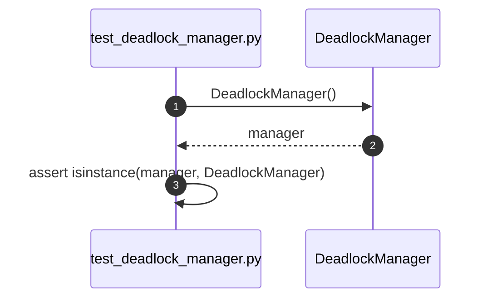
```mermaid
sequenceDiagram
    autonumber
    participant Test as test_deadlock_manager.py
    participant SUT as DeadlockManager

    Test->>SUT: DeadlockManager()
    SUT-->>Test: manager
    Test->>Test: assert isinstance(manager, DeadlockManager)
```

---

## 2. test_isolation_manager.py

### 2.1 test_read_committed()

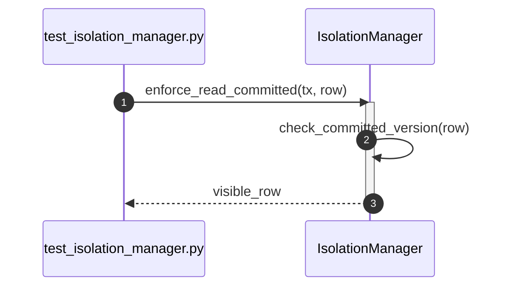
```mermaid
sequenceDiagram
    autonumber
    participant Test as test_isolation_manager.py
    participant SUT as IsolationManager

    Test->>SUT: enforce_read_committed(tx, row)
    activate SUT
    SUT->>SUT: check_committed_version(row)
    SUT-->>Test: visible_row
    deactivate SUT
```

### 2.2 test_repeatable_read()

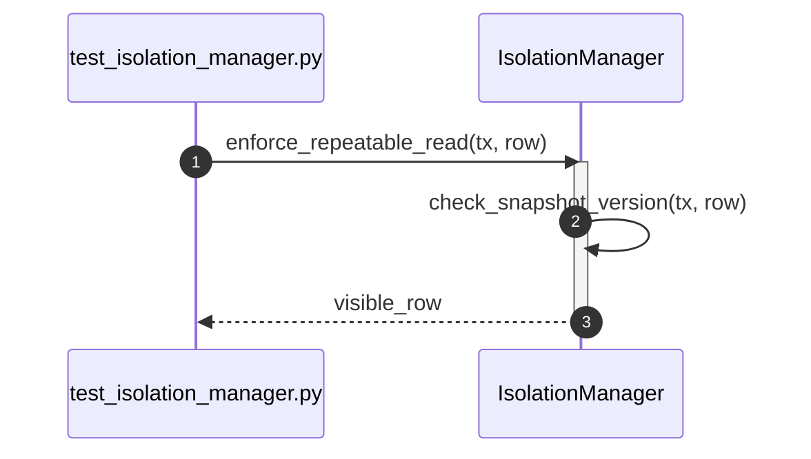
```mermaid
sequenceDiagram
    autonumber
    participant Test as test_isolation_manager.py
    participant SUT as IsolationManager

    Test->>SUT: enforce_repeatable_read(tx, row)
    activate SUT
    SUT->>SUT: check_snapshot_version(tx, row)
    SUT-->>Test: visible_row
    deactivate SUT
```

### 2.3 test_serializable()

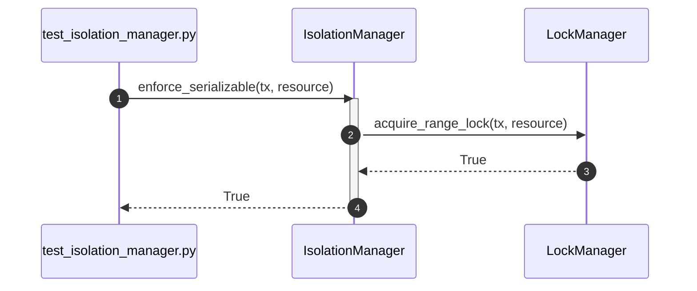
```mermaid
sequenceDiagram
    autonumber
    participant Test as test_isolation_manager.py
    participant SUT as IsolationManager
    participant LockManager as LockManager

    Test->>SUT: enforce_serializable(tx, resource)
    activate SUT
    SUT->>LockManager: acquire_range_lock(tx, resource)
    LockManager-->>SUT: True
    SUT-->>Test: True
    deactivate SUT
```

### 2.4 test_snapshot_isolation()

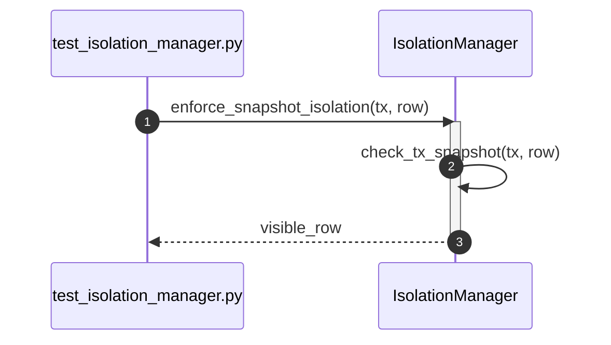
```mermaid
sequenceDiagram
    autonumber
    participant Test as test_isolation_manager.py
    participant SUT as IsolationManager

    Test->>SUT: enforce_snapshot_isolation(tx, row)
    activate SUT
    SUT->>SUT: check_tx_snapshot(tx, row)
    SUT-->>Test: visible_row
    deactivate SUT
```

### 2.5 test_prevent_dirty_read()

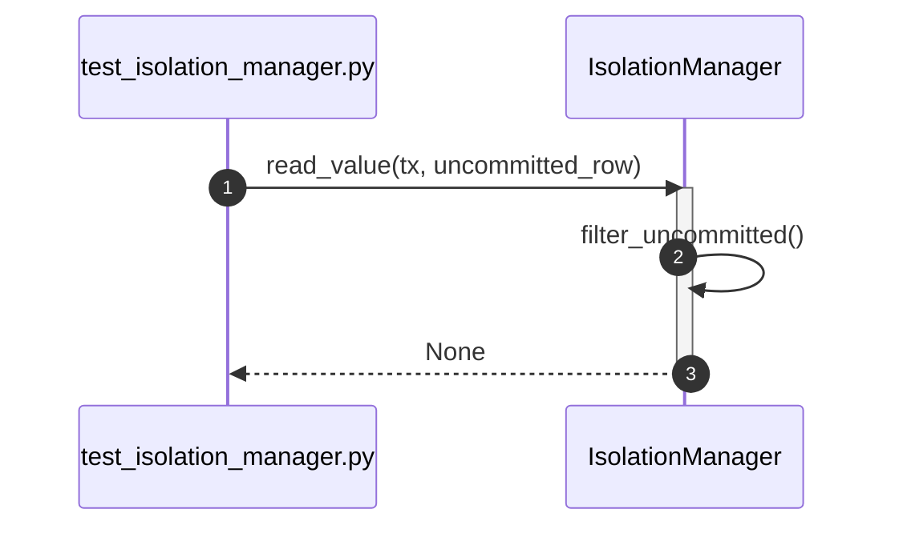
```mermaid
sequenceDiagram
    autonumber
    participant Test as test_isolation_manager.py
    participant SUT as IsolationManager

    Test->>SUT: read_value(tx, uncommitted_row)
    activate SUT
    SUT->>SUT: filter_uncommitted()
    SUT-->>Test: None
    deactivate SUT
```

### 2.6 test_prevent_nonrepeatable_read()

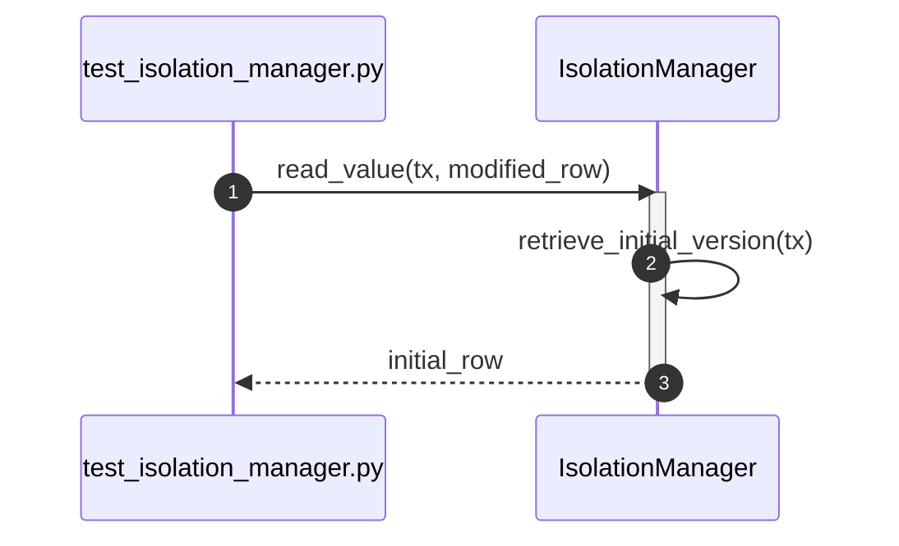
```mermaid
sequenceDiagram
    autonumber
    participant Test as test_isolation_manager.py
    participant SUT as IsolationManager

    Test->>SUT: read_value(tx, modified_row)
    activate SUT
    SUT->>SUT: retrieve_initial_version(tx)
    SUT-->>Test: initial_row
    deactivate SUT
```

### 2.7 test_prevent_phantom_read()

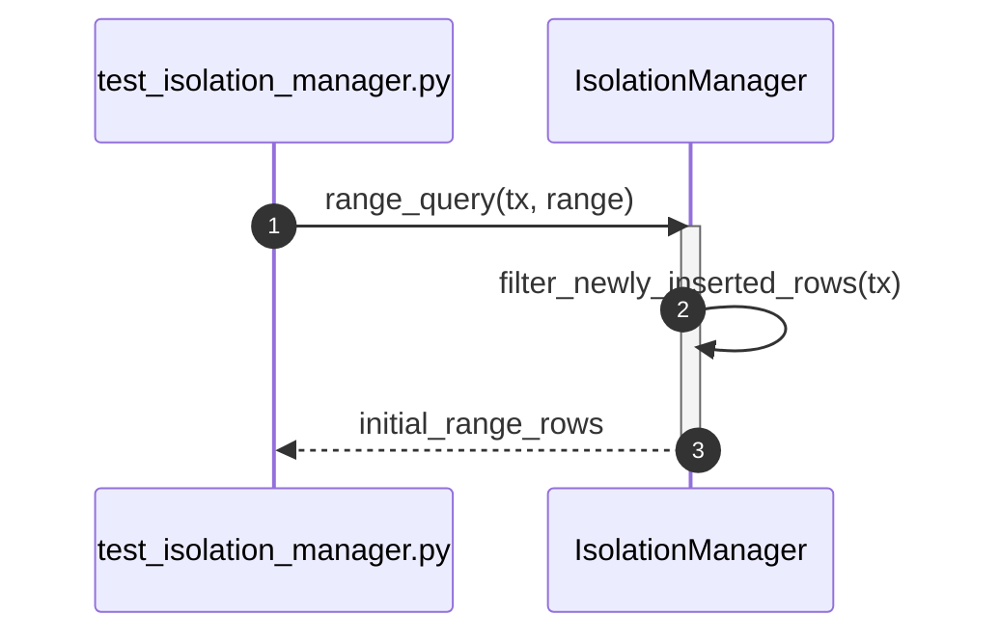
```mermaid
sequenceDiagram
    autonumber
    participant Test as test_isolation_manager.py
    participant SUT as IsolationManager

    Test->>SUT: range_query(tx, range)
    activate SUT
    SUT->>SUT: filter_newly_inserted_rows(tx)
    SUT-->>Test: initial_range_rows
    deactivate SUT
```

### 2.8 test_isolation_manager_can_be_created()

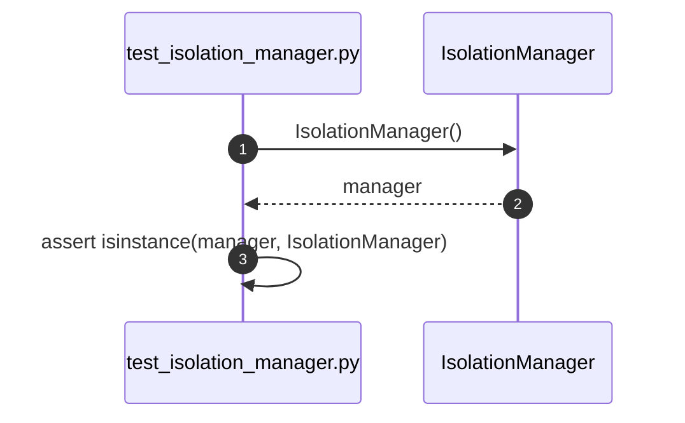
```mermaid
sequenceDiagram
    autonumber
    participant Test as test_isolation_manager.py
    participant SUT as IsolationManager

    Test->>SUT: IsolationManager()
    SUT-->>Test: manager
    Test->>Test: assert isinstance(manager, IsolationManager)
```

---

## 3. test_lock_manager.py

### 3.1 test_acquire_lock()

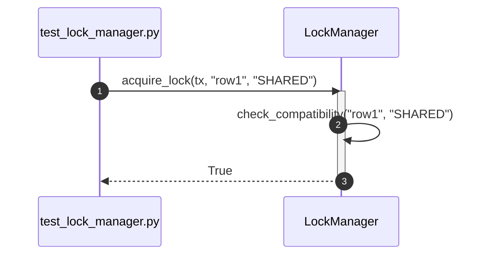
```mermaid
sequenceDiagram
    autonumber
    participant Test as test_lock_manager.py
    participant SUT as LockManager

    Test->>SUT: acquire_lock(tx, "row1", "SHARED")
    activate SUT
    SUT->>SUT: check_compatibility("row1", "SHARED")
    SUT-->>Test: True
    deactivate SUT
```

### 3.2 test_acquire_shared_lock()

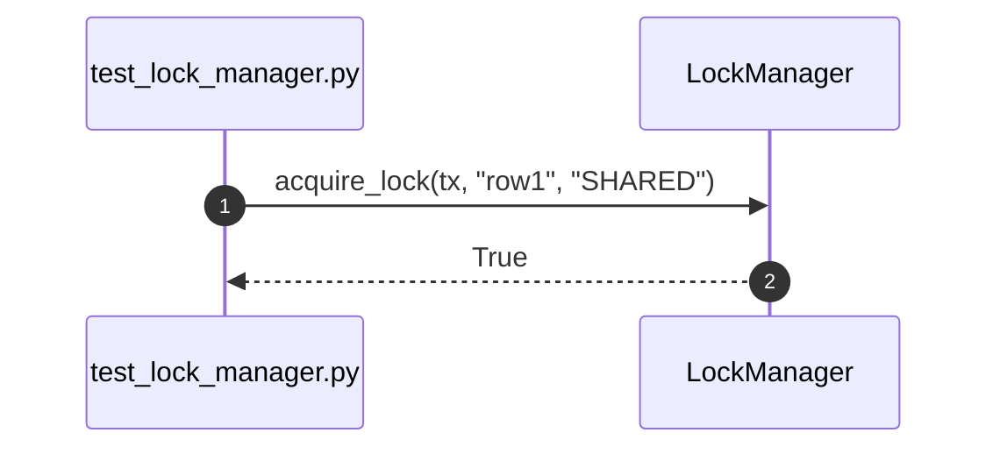
```mermaid
sequenceDiagram
    autonumber
    participant Test as test_lock_manager.py
    participant SUT as LockManager

    Test->>SUT: acquire_lock(tx, "row1", "SHARED")
    SUT-->>Test: True
```

### 3.3 test_acquire_exclusive_lock()

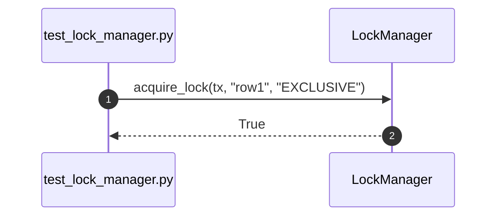
```mermaid
sequenceDiagram
    autonumber
    participant Test as test_lock_manager.py
    participant SUT as LockManager

    Test->>SUT: acquire_lock(tx, "row1", "EXCLUSIVE")
    SUT-->>Test: True
```

### 3.4 test_upgrade_lock()

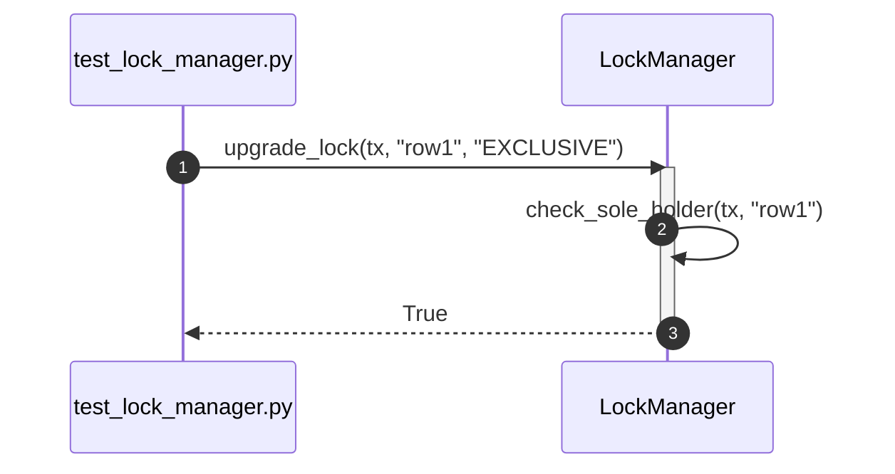
```mermaid
sequenceDiagram
    autonumber
    participant Test as test_lock_manager.py
    participant SUT as LockManager

    Test->>SUT: upgrade_lock(tx, "row1", "EXCLUSIVE")
    activate SUT
    SUT->>SUT: check_sole_holder(tx, "row1")
    SUT-->>Test: True
    deactivate SUT
```

### 3.5 test_downgrade_lock()

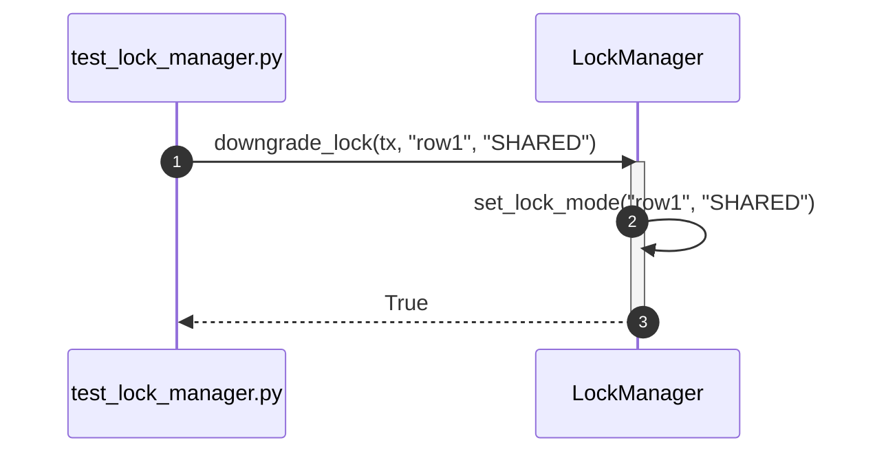
```mermaid
sequenceDiagram
    autonumber
    participant Test as test_lock_manager.py
    participant SUT as LockManager

    Test->>SUT: downgrade_lock(tx, "row1", "SHARED")
    activate SUT
    SUT->>SUT: set_lock_mode("row1", "SHARED")
    SUT-->>Test: True
    deactivate SUT
```

### 3.6 test_release_lock()

```mermaid
sequenceDiagram
    autonumber
    participant Test as test_lock_manager.py
    participant SUT as LockManager

    Test->>SUT: release_lock(tx, "row1")
    activate SUT
    SUT->>SUT: remove_holder(tx, "row1")
    SUT->>SUT: notify_waiters("row1")
    SUT-->>Test: True
    deactivate SUT
```

### 3.7 test_detect_deadlock()

```mermaid
sequenceDiagram
    autonumber
    participant Test as test_lock_manager.py
    participant SUT as LockManager
    participant DeadlockManager as DeadlockManager

    Test->>SUT: acquire_lock(tx1, "row2", "EXCLUSIVE")
    activate SUT
    SUT->>DeadlockManager: detect_cycle(wait_graph)
    DeadlockManager-->>SUT: True
    SUT-->>Test: raises DeadlockException
    deactivate SUT
```

### 3.8 test_timeout_waiting()

```mermaid
sequenceDiagram
    autonumber
    participant Test as test_lock_manager.py
    participant SUT as LockManager

    Test->>SUT: acquire_lock(tx, "row1", "EXCLUSIVE", timeout=1)
    activate SUT
    SUT->>SUT: wait_for_lock("row1", timeout=1)
    SUT-->>Test: raises LockTimeoutException
    deactivate SUT
```

### 3.9 test_release_all_locks()

```mermaid
sequenceDiagram
    autonumber
    participant Test as test_lock_manager.py
    participant SUT as LockManager

    Test->>SUT: release_all_locks(tx)
    activate SUT
    SUT->>SUT: find_all_locks_held_by(tx)
    SUT->>SUT: release_each_lock()
    SUT-->>Test: True
    deactivate SUT
```

### 3.10 test_lock_manager_can_be_created()

```mermaid
sequenceDiagram
    autonumber
    participant Test as test_lock_manager.py
    participant SUT as LockManager

    Test->>SUT: LockManager()
    SUT-->>Test: manager
    Test->>Test: assert isinstance(manager, LockManager)
```

---

## 4. test_mvcc_manager.py

### 4.1 test_mvcc_manager_can_be_created()

```mermaid
sequenceDiagram
    autonumber
    participant Test as test_mvcc_manager.py
    participant SUT as MVCCManager

    Test->>SUT: MVCCManager({"row1": []})
    SUT-->>Test: mvcc
    Test->>Test: assert mvcc.version_chain_map == {"row1": []}
```

### 4.2 test_create_snapshot()

```mermaid
sequenceDiagram
    autonumber
    participant Test as test_mvcc_manager.py
    participant SUT as MVCCManager

    Test->>SUT: MVCCManager({"row1": []})
    SUT-->>Test: mvcc
    Test->>SUT: mvcc.create_snapshot()
    SUT-->>Test: None
    Test->>Test: assert result is None
```

### 4.3 test_read_visible_version()

```mermaid
sequenceDiagram
    autonumber
    participant Test as test_mvcc_manager.py
    participant SUT as MVCCManager

    Test->>SUT: MVCCManager({"row1": []})
    SUT-->>Test: mvcc
    Test->>SUT: mvcc.read_visible_version(row, tx)
    SUT-->>Test: row
    Test->>Test: assert result is row
```

---

## 5. test_transaction.py

### 5.1 test_create_savepoint()

```mermaid
sequenceDiagram
    autonumber
    participant Test as test_transaction.py
    participant SUT as Transaction

    Test->>SUT: create_savepoint("sp1")
    activate SUT
    SUT->>SUT: savepoints.append("sp1")
    SUT-->>Test: True
    deactivate SUT
```

### 5.2 test_release_savepoint()

```mermaid
sequenceDiagram
    autonumber
    participant Test as test_transaction.py
    participant SUT as Transaction

    Test->>SUT: release_savepoint("sp1")
    activate SUT
    SUT->>SUT: savepoints.remove("sp1")
    SUT-->>Test: True
    deactivate SUT
```

### 5.3 test_set_isolation_level()

```mermaid
sequenceDiagram
    autonumber
    participant Test as test_transaction.py
    participant SUT as Transaction

    Test->>SUT: set_isolation_level("SERIALIZABLE")
    activate SUT
    SUT->>SUT: set_level("SERIALIZABLE")
    SUT-->>Test: True
    deactivate SUT
```

### 5.4 test_change_state()

```mermaid
sequenceDiagram
    autonumber
    participant Test as test_transaction.py
    participant SUT as Transaction

    Test->>SUT: change_state(TransactionStatus.COMMITTED)
    activate SUT
    SUT->>SUT: set_status(TransactionStatus.COMMITTED)
    SUT-->>Test: True
    deactivate SUT
```

### 5.5 test_transaction_can_be_created()

```mermaid
sequenceDiagram
    autonumber
    participant Test as test_transaction.py
    participant SUT as Transaction

    Test->>SUT: Transaction(1, TransactionStatus.ACTIVE)
    SUT-->>Test: transaction
    Test->>Test: assert transaction.transaction_id == 1
    Test->>Test: assert transaction.status is TransactionStatus.ACTIVE
```

---

## 6. test_transaction_manager.py

### 6.1 test_transaction_manager_can_be_created()

```mermaid
sequenceDiagram
    autonumber
    participant Test as test_transaction_manager.py
    participant SUT as TransactionManager

    Test->>SUT: TransactionManager()
    SUT-->>Test: manager
```

### 6.2 test_begin_transaction()

```mermaid
sequenceDiagram
    autonumber
    participant Test as test_transaction_manager.py
    participant SUT as TransactionManager
    participant TX as Transaction

    Test->>SUT: begin_transaction()
    activate SUT
    SUT->>TX: Instantiate(new_id, ACTIVE)
    TX-->>SUT: tx
    SUT->>SUT: active_transactions[tx.id] = tx
    SUT-->>Test: tx
    deactivate SUT
```

### 6.3 test_commit()

```mermaid
sequenceDiagram
    autonumber
    participant Test as test_transaction_manager.py
    participant SUT as TransactionManager
    participant TX as Transaction
    participant LockManager as LockManager

    Test->>SUT: commit(tx)
    activate SUT
    SUT->>TX: change_state(COMMITTED)
    SUT->>LockManager: release_all_locks(tx)
    SUT->>SUT: remove_from_active(tx)
    SUT-->>Test: True
    deactivate SUT
```

### 6.4 test_rollback()

```mermaid
sequenceDiagram
    autonumber
    participant Test as test_transaction_manager.py
    participant SUT as TransactionManager
    participant TX as Transaction
    participant LockManager as LockManager

    Test->>SUT: rollback(tx)
    activate SUT
    SUT->>TX: change_state(ROLLED_BACK)
    SUT->>LockManager: release_all_locks(tx)
    SUT->>SUT: remove_from_active(tx)
    SUT-->>Test: True
    deactivate SUT
```

### 6.5 test_rollback_to_savepoint()

```mermaid
sequenceDiagram
    autonumber
    participant Test as test_transaction_manager.py
    participant SUT as TransactionManager
    participant TX as Transaction

    Test->>SUT: rollback_to_savepoint(tx, "sp1")
    activate SUT
    SUT->>TX: rollback_changes_since("sp1")
    SUT-->>Test: True
    deactivate SUT
```

### 6.6 test_nested_transaction()

```mermaid
sequenceDiagram
    autonumber
    participant Test as test_transaction_manager.py
    participant SUT as TransactionManager
    participant TX as Transaction

    Test->>SUT: begin_nested_transaction(parent_tx)
    activate SUT
    SUT->>TX: Instantiate_nested(new_id, parent_tx)
    TX-->>SUT: nested_tx
    SUT-->>Test: nested_tx
    deactivate SUT
```

### 6.7 test_distributed_transaction()

```mermaid
sequenceDiagram
    autonumber
    participant Test as test_transaction_manager.py
    participant SUT as TransactionManager

    Test->>SUT: prepare_distributed(tx)
    activate SUT
    SUT->>SUT: run_two_phase_commit_prepare(tx)
    SUT-->>Test: True
    deactivate SUT
```

### 6.8 test_timeout()

```mermaid
sequenceDiagram
    autonumber
    participant Test as test_transaction_manager.py
    participant SUT as TransactionManager
    participant TX as Transaction

    Test->>SUT: begin_transaction(timeout=2)
    activate SUT
    SUT->>TX: Instantiate(new_id, ACTIVE)
    TX-->>SUT: tx
    SUT->>SUT: schedule_timeout_check(tx, timeout=2)
    SUT-->>Test: tx
    deactivate SUT
```

### 6.9 test_cancel()

```mermaid
sequenceDiagram
    autonumber
    participant Test as test_transaction_manager.py
    participant SUT as TransactionManager

    Test->>SUT: cancel(tx)
    activate SUT
    SUT->>SUT: rollback(tx)
    SUT-->>Test: True
    deactivate SUT
```

### 6.10 test_retry()

```mermaid
sequenceDiagram
    autonumber
    participant Test as test_transaction_manager.py
    participant SUT as TransactionManager

    Test->>SUT: retry(tx)
    activate SUT
    SUT->>SUT: rollback(tx)
    SUT->>SUT: begin_transaction()
    SUT-->>Test: new_tx
    deactivate SUT
```

### 6.11 test_recover_transaction()

```mermaid
sequenceDiagram
    autonumber
    participant Test as test_transaction_manager.py
    participant SUT as TransactionManager
    participant WALManager as WALManager

    Test->>SUT: recover_transactions()
    activate SUT
    SUT->>WALManager: scan_active_records()
    WALManager-->>SUT: active_txs
    SUT->>SUT: resolve_uncommitted_txs(active_txs)
    SUT-->>Test: True
    deactivate SUT
```

---

## 7. test_transaction_status.py

### 7.1 test_transaction_status_defines_core_lifecycle_states()

```mermaid
sequenceDiagram
    autonumber
    participant Test as test_transaction_status.py
    participant SUT as TransactionStatus

    Test->>Test: assert TransactionStatus.ACTIVE.name == "ACTIVE"
    Test->>Test: assert TransactionStatus.COMMITTED.name == "COMMITTED"
    Test->>Test: assert TransactionStatus.ROLLED_BACK.name == "ROLLED_BACK"
```

---
