# Transaction Unit Test Sequences

This document outlines the detailed sequence diagrams for the unit tests in the `Transaction` subsystem.

---

## 1. test_deadlock_manager.py

### 1.1 test_build_wait_graph()

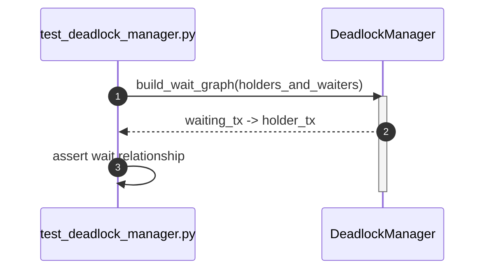

### 1.2 test_detect_cycle()

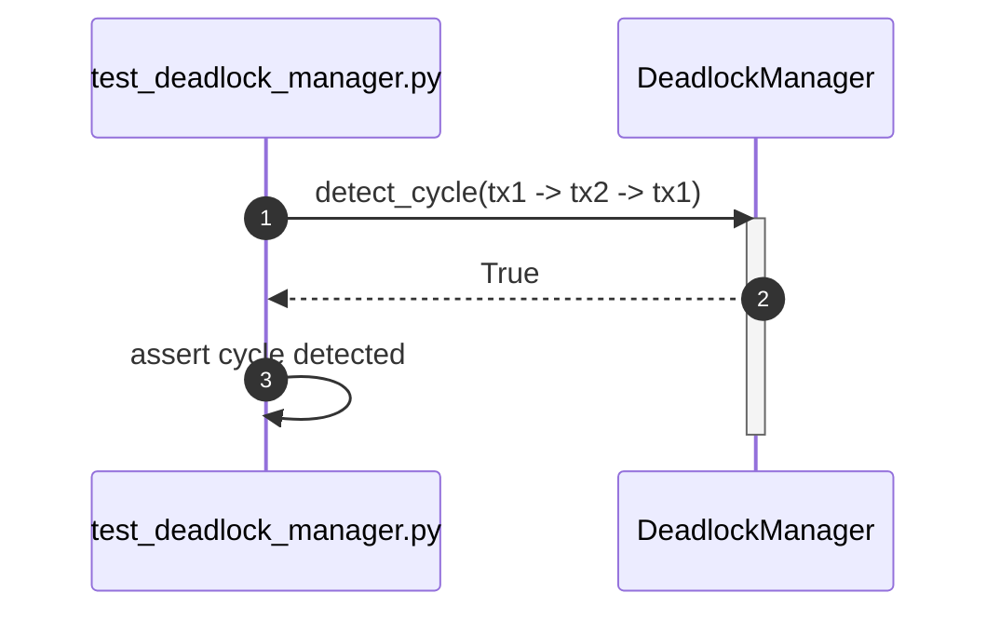

### 1.3 test_select_victim()

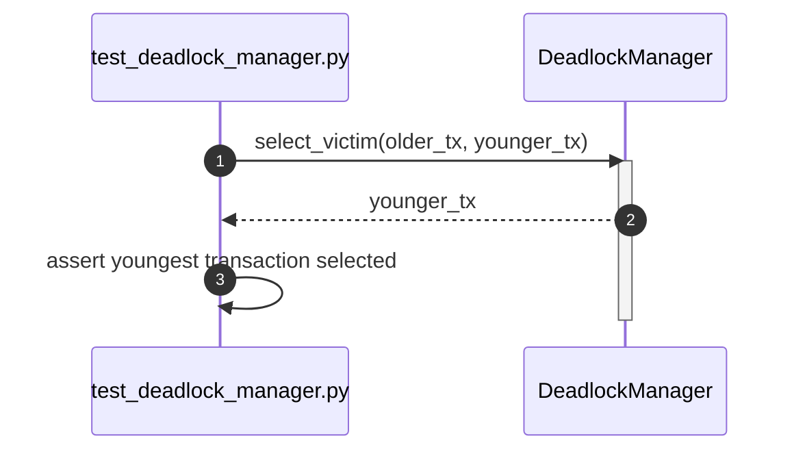

### 1.4 test_abort_victim()

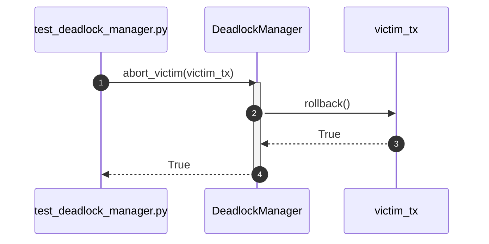

### 1.5 test_release_victim_locks()

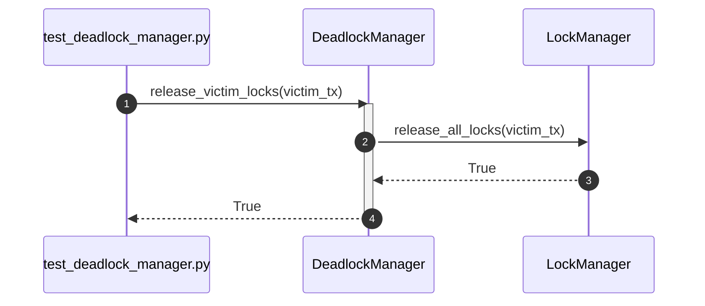

### 1.6 test_retry_transaction()

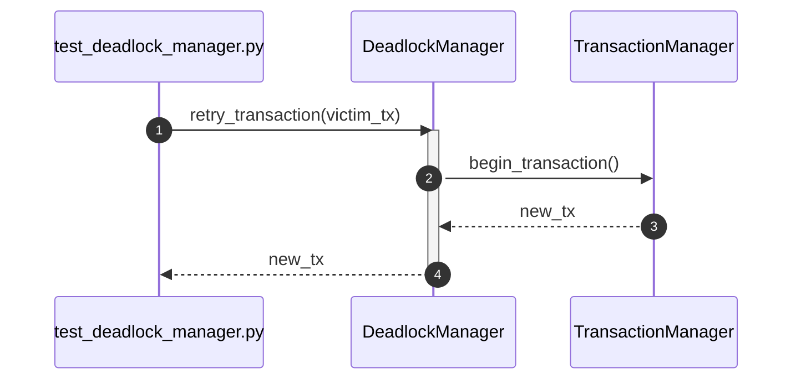

### 1.7 test_deadlock_manager_can_be_created()

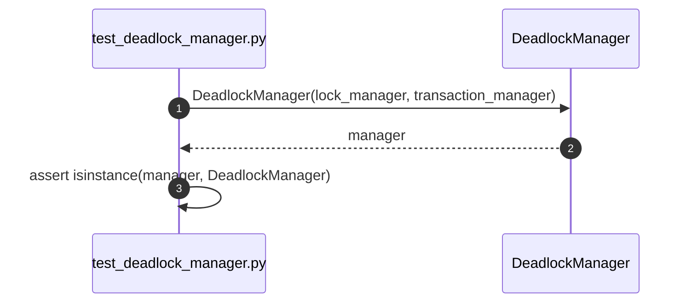

---

## 2. test_isolation_manager.py

### 2.1 test_read_committed()

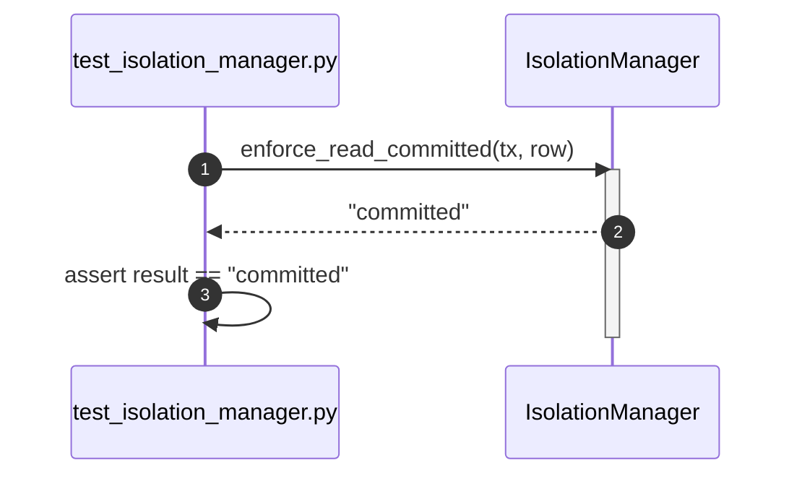

### 2.2 test_repeatable_read()

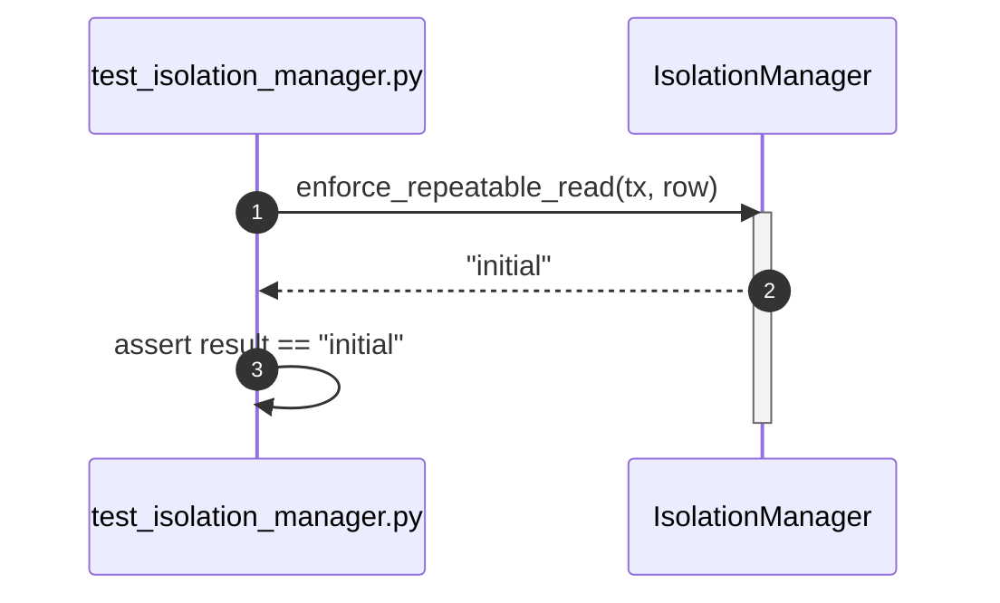

### 2.3 test_serializable()

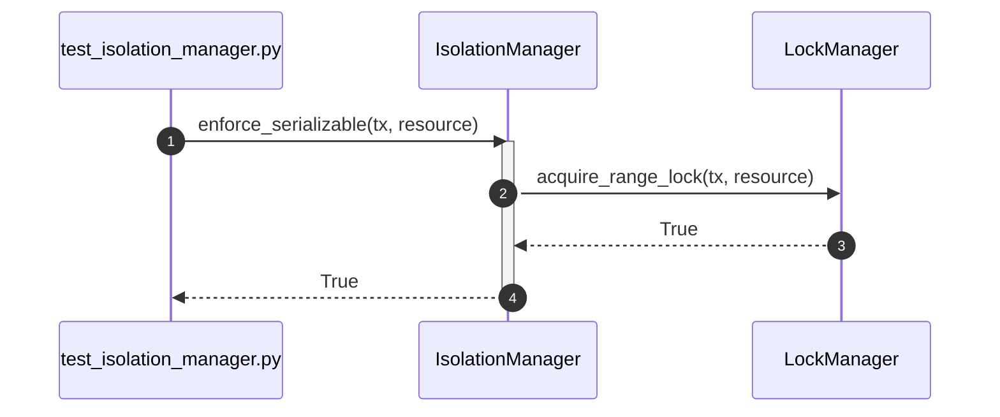

### 2.4 test_snapshot_isolation()

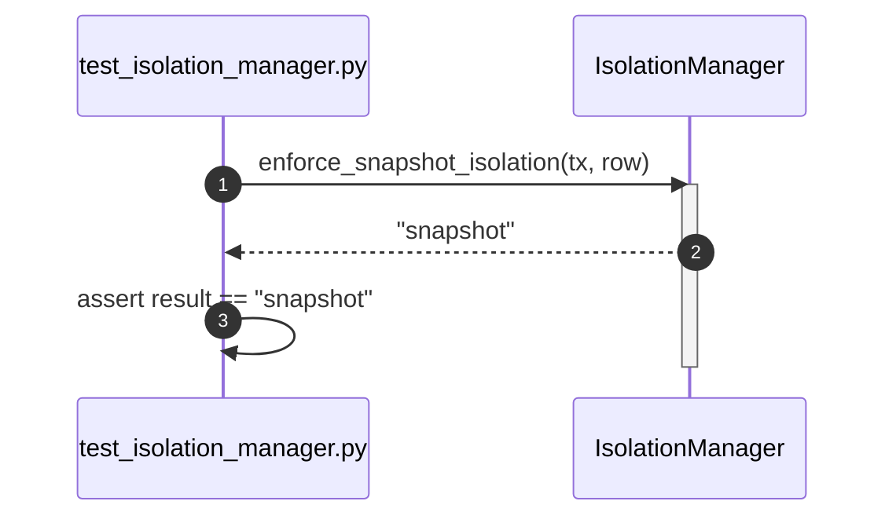

### 2.5 test_prevent_dirty_read()

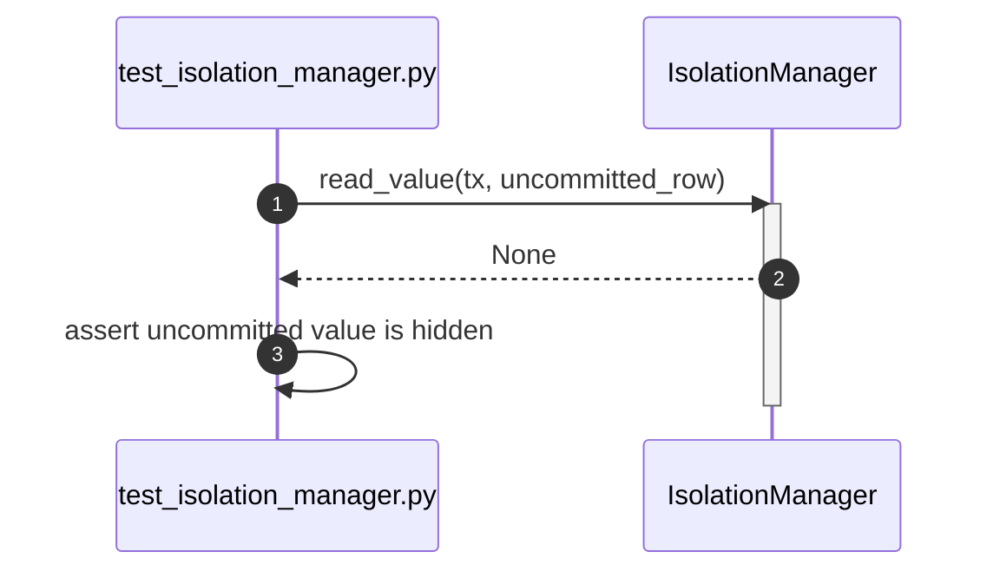

### 2.6 test_prevent_nonrepeatable_read()

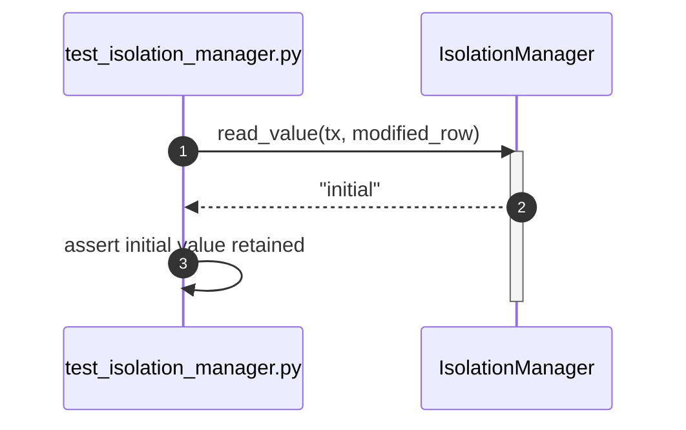

### 2.7 test_prevent_phantom_read()

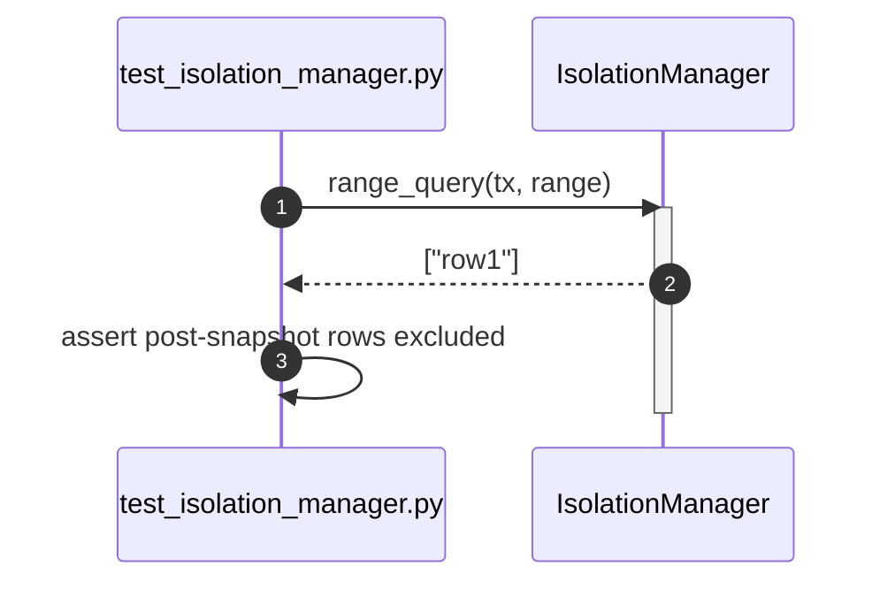

### 2.8 test_isolation_manager_can_be_created()

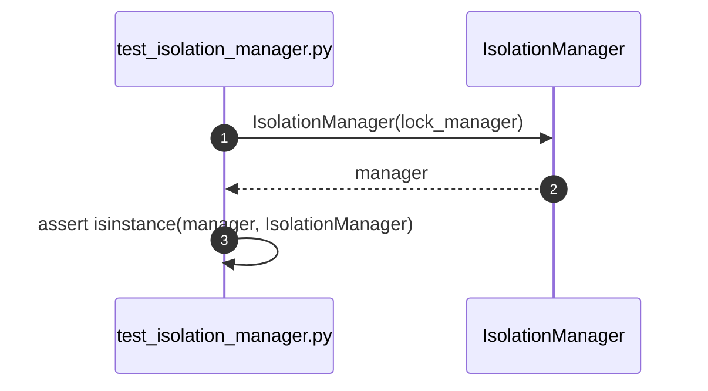

---

## 3. test_lock_manager.py

### 3.1 test_acquire_lock()

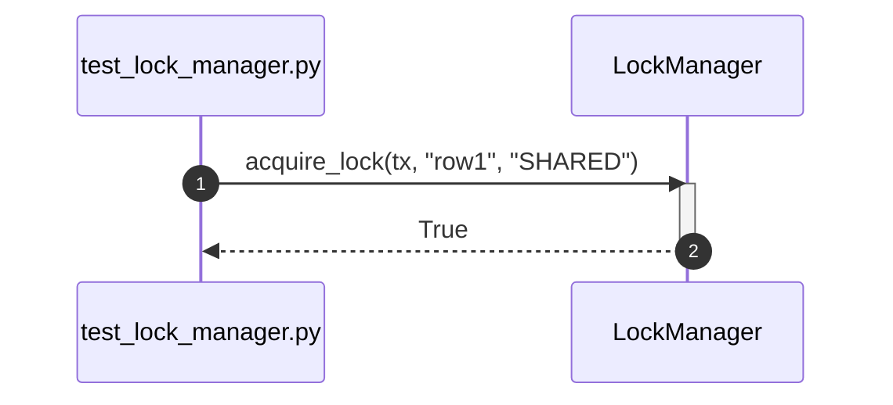

### 3.2 test_acquire_shared_lock()

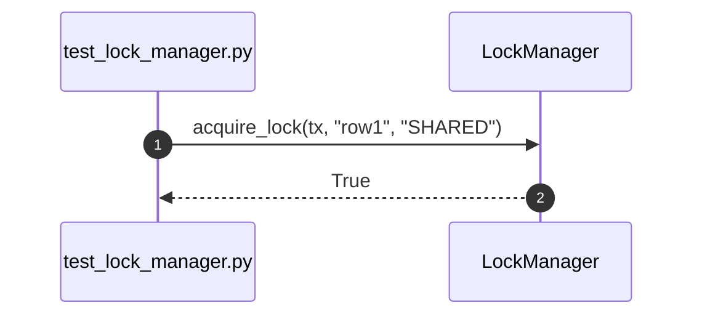

### 3.3 test_acquire_exclusive_lock()

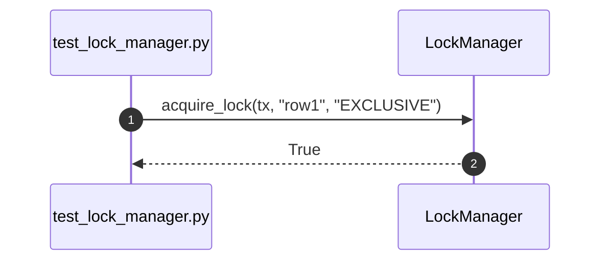

### 3.4 test_upgrade_lock()

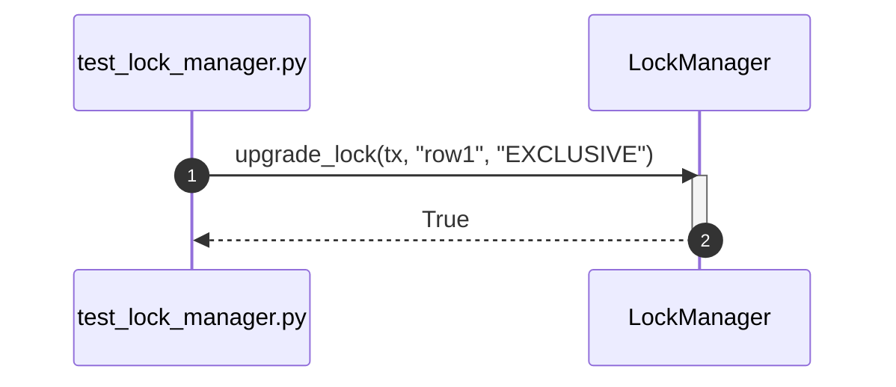

### 3.5 test_downgrade_lock()

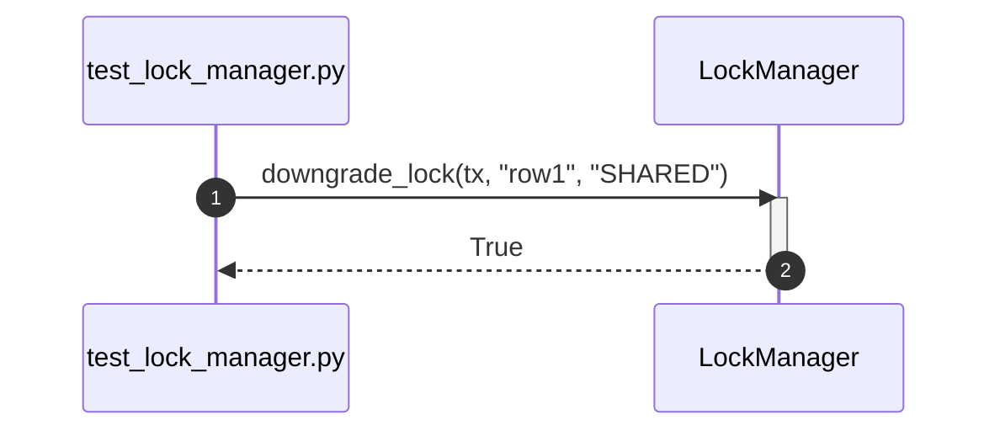

### 3.6 test_release_lock()

```mermaid
sequenceDiagram
    autonumber
    participant Test as test_lock_manager.py
    participant SUT as LockManager

    Test->>SUT: release_lock(tx, "row1")
    activate SUT
    SUT-->>Test: True
    deactivate SUT
```

### 3.7 test_detect_deadlock()

```mermaid
sequenceDiagram
    autonumber
    participant Test as test_lock_manager.py
    participant SUT as LockManager
    participant DeadlockManager as DeadlockManager

    Test->>SUT: acquire_lock(holder_tx, "orders:42", "EXCLUSIVE")
    Test->>SUT: acquire_lock(waiting_tx, "orders:42", "EXCLUSIVE")
    activate SUT
    SUT->>DeadlockManager: detect_cycle(wait_graph)
    DeadlockManager-->>SUT: True
    SUT-->>Test: raises DeadlockError
    deactivate SUT
```

### 3.8 test_timeout_waiting()

```mermaid
sequenceDiagram
    autonumber
    participant Test as test_lock_manager.py
    participant SUT as LockManager

    Test->>SUT: acquire_lock(holder_tx, "orders:42", "EXCLUSIVE")
    Test->>SUT: acquire_lock(waiting_tx, "orders:42", "EXCLUSIVE", timeout=1)
    activate SUT
    SUT-->>Test: raises LockTimeoutError
    deactivate SUT
```

### 3.9 test_release_all_locks()

```mermaid
sequenceDiagram
    autonumber
    participant Test as test_lock_manager.py
    participant SUT as LockManager

    Test->>SUT: release_all_locks(tx)
    activate SUT
    SUT-->>Test: True
    deactivate SUT
```

### 3.10 test_lock_manager_can_be_created()

```mermaid
sequenceDiagram
    autonumber
    participant Test as test_lock_manager.py
    participant SUT as LockManager

    Test->>SUT: LockManager(deadlock_detector)
    SUT-->>Test: manager
    Test->>Test: assert isinstance(manager, LockManager)
```

---

## 4. test_mvcc_manager.py

### 4.1 test_mvcc_manager_can_be_created()

```mermaid
sequenceDiagram
    autonumber
    participant Test as test_mvcc_manager.py
    participant SUT as MVCCManager

    Test->>SUT: MVCCManager({"row1": []})
    SUT-->>Test: mvcc
    Test->>Test: assert mvcc.version_chain_map == {"row1": []}
```

### 4.2 test_create_snapshot()

```mermaid
sequenceDiagram
    autonumber
    participant Test as test_mvcc_manager.py
    participant SUT as MVCCManager

    Test->>SUT: MVCCManager({"row1": []})
    SUT-->>Test: mvcc
    Test->>SUT: mvcc.create_snapshot(transaction_id=1)
    SUT-->>Test: snapshot
    Test->>Test: assert snapshot content
```

### 4.3 test_read_visible_version()

```mermaid
sequenceDiagram
    autonumber
    participant Test as test_mvcc_manager.py
    participant SUT as MVCCManager

    Test->>SUT: MVCCManager({"row1": []})
    SUT-->>Test: mvcc
    Test->>SUT: mvcc.read_visible_version("row1", transaction_id=1)
    SUT-->>Test: visible_version
    Test->>Test: assert result == "old"
```

---

## 5. test_transaction.py

### 5.1 test_create_savepoint()

```mermaid
sequenceDiagram
    autonumber
    participant Test as test_transaction.py
    participant SUT as Transaction

    Test->>SUT: create_savepoint("sp1")
    activate SUT
    SUT-->>Test: True
    Test->>Test: assert "sp1" in savepoints
    deactivate SUT
```

### 5.2 test_release_savepoint()

```mermaid
sequenceDiagram
    autonumber
    participant Test as test_transaction.py
    participant SUT as Transaction

    Test->>SUT: release_savepoint("sp1")
    activate SUT
    SUT-->>Test: True
    Test->>Test: assert "sp1" not in savepoints
    deactivate SUT
```

### 5.3 test_set_isolation_level()

```mermaid
sequenceDiagram
    autonumber
    participant Test as test_transaction.py
    participant SUT as Transaction

    Test->>SUT: set_isolation_level("SERIALIZABLE")
    activate SUT
    SUT-->>Test: True
    Test->>Test: assert isolation_level == "SERIALIZABLE"
    deactivate SUT
```

### 5.4 test_change_state()

```mermaid
sequenceDiagram
    autonumber
    participant Test as test_transaction.py
    participant SUT as Transaction

    Test->>SUT: change_state(TransactionStatus.COMMITTED)
    activate SUT
    SUT-->>Test: True
    Test->>Test: assert status == COMMITTED
    deactivate SUT
```

### 5.5 test_transaction_can_be_created()

```mermaid
sequenceDiagram
    autonumber
    participant Test as test_transaction.py
    participant SUT as Transaction

    Test->>SUT: Transaction(1, TransactionStatus.ACTIVE)
    SUT-->>Test: transaction
    Test->>Test: assert transaction.transaction_id == 1
    Test->>Test: assert transaction.status is TransactionStatus.ACTIVE
```

---

## 6. test_transaction_manager.py

### 6.1 test_transaction_manager_can_be_created()

```mermaid
sequenceDiagram
    autonumber
    participant Test as test_transaction_manager.py
    participant SUT as TransactionManager

    Test->>SUT: TransactionManager(lock_manager, recovery_log)
    SUT-->>Test: manager
```

### 6.2 test_begin_transaction()

```mermaid
sequenceDiagram
    autonumber
    participant Test as test_transaction_manager.py
    participant SUT as TransactionManager

    Test->>SUT: begin_transaction()
    activate SUT
    SUT-->>Test: tx
    Test->>Test: assert active transaction state
    deactivate SUT
```

### 6.3 test_commit()

```mermaid
sequenceDiagram
    autonumber
    participant Test as test_transaction_manager.py
    participant SUT as TransactionManager
    participant LockManager as LockManager

    Test->>SUT: commit(tx)
    activate SUT
    SUT->>LockManager: release_all_locks(tx)
    SUT-->>Test: True
    Test->>Test: assert status == COMMITTED
    deactivate SUT
```

### 6.4 test_rollback()

```mermaid
sequenceDiagram
    autonumber
    participant Test as test_transaction_manager.py
    participant SUT as TransactionManager
    participant LockManager as LockManager

    Test->>SUT: rollback(tx)
    activate SUT
    SUT->>LockManager: release_all_locks(tx)
    SUT-->>Test: True
    Test->>Test: assert status == ROLLED_BACK
    deactivate SUT
```

### 6.5 test_rollback_to_savepoint()

```mermaid
sequenceDiagram
    autonumber
    participant Test as test_transaction_manager.py
    participant SUT as TransactionManager
    participant TX as Transaction

    Test->>SUT: rollback_to_savepoint(tx, "sp1")
    activate SUT
    SUT->>TX: rollback_changes_since("sp1")
    SUT-->>Test: True
    deactivate SUT
```

### 6.6 test_nested_transaction()

```mermaid
sequenceDiagram
    autonumber
    participant Test as test_transaction_manager.py
    participant SUT as TransactionManager

    Test->>SUT: begin_nested_transaction(parent_tx)
    activate SUT
    SUT-->>Test: nested_tx
    Test->>Test: assert parent relationship and active status
    deactivate SUT
```

### 6.7 test_distributed_transaction()

```mermaid
sequenceDiagram
    autonumber
    participant Test as test_transaction_manager.py
    participant SUT as TransactionManager

    Test->>SUT: prepare_distributed(tx)
    activate SUT
    SUT-->>Test: True
    deactivate SUT
```

### 6.8 test_timeout()

```mermaid
sequenceDiagram
    autonumber
    participant Test as test_transaction_manager.py
    participant SUT as TransactionManager

    Test->>SUT: begin_transaction(timeout=2)
    activate SUT
    SUT-->>Test: tx
    Test->>Test: assert tx.timeout == 2
    deactivate SUT
```

### 6.9 test_cancel()

```mermaid
sequenceDiagram
    autonumber
    participant Test as test_transaction_manager.py
    participant SUT as TransactionManager

    Test->>SUT: cancel(tx)
    activate SUT
    SUT-->>Test: True
    Test->>Test: assert rollback(tx) called
    deactivate SUT
```

### 6.10 test_retry()

```mermaid
sequenceDiagram
    autonumber
    participant Test as test_transaction_manager.py
    participant SUT as TransactionManager

    Test->>SUT: retry(tx)
    activate SUT
    SUT-->>Test: new_tx
    Test->>Test: assert rollback then begin_transaction called
    deactivate SUT
```

### 6.11 test_recover_transaction()

```mermaid
sequenceDiagram
    autonumber
    participant Test as test_transaction_manager.py
    participant SUT as TransactionManager
    participant WALManager as WALManager

    Test->>SUT: recover_transactions()
    activate SUT
    SUT->>WALManager: scan_active_records()
    WALManager-->>SUT: active_txs
    SUT-->>Test: True
    deactivate SUT
```

---

## 7. test_transaction_status.py

### 7.1 test_transaction_status_defines_core_lifecycle_states()

```mermaid
sequenceDiagram
    autonumber
    participant Test as test_transaction_status.py
    participant SUT as TransactionStatus

    Test->>Test: assert TransactionStatus.ACTIVE.name == "ACTIVE"
    Test->>Test: assert TransactionStatus.COMMITTED.name == "COMMITTED"
    Test->>Test: assert TransactionStatus.ROLLED_BACK.name == "ROLLED_BACK"
```

---

## 8. test_dependencies.py

### 8.1 test_lock_release_stub_matches_protocol()

```mermaid
sequenceDiagram
    participant Test as test_dependencies.py
    participant Stub as LockReleaseStub
    participant Contract as LockReleaseProtocol
    Test->>Stub: LockReleaseStub()
    Test->>Contract: isinstance(stub, LockReleaseProtocol)
    Contract-->>Test: True
```

### 8.2 test_transaction_starter_stub_matches_protocol()

```mermaid
sequenceDiagram
    participant Test as test_dependencies.py
    participant Stub as TransactionStarterStub
    participant Contract as TransactionStarterProtocol
    Test->>Stub: TransactionStarterStub()
    Test->>Contract: isinstance(stub, TransactionStarterProtocol)
    Contract-->>Test: True
```

### 8.3 test_range_lock_stub_matches_protocol()

```mermaid
sequenceDiagram
    participant Test as test_dependencies.py
    participant Stub as RangeLockStub
    participant Contract as RangeLockProtocol
    Test->>Stub: RangeLockStub()
    Test->>Contract: isinstance(stub, RangeLockProtocol)
    Contract-->>Test: True
```

### 8.4 test_deadlock_detector_stub_matches_protocol()

```mermaid
sequenceDiagram
    participant Test as test_dependencies.py
    participant Stub as DeadlockDetectorStub
    participant Contract as DeadlockDetectorProtocol
    Test->>Stub: DeadlockDetectorStub()
    Test->>Contract: isinstance(stub, DeadlockDetectorProtocol)
    Contract-->>Test: True
```

### 8.5 test_transaction_recovery_log_stub_matches_protocol()

```mermaid
sequenceDiagram
    participant Test as test_dependencies.py
    participant Stub as TransactionRecoveryLogStub
    participant Contract as TransactionRecoveryLogProtocol
    Test->>Stub: TransactionRecoveryLogStub()
    Test->>Contract: isinstance(stub, TransactionRecoveryLogProtocol)
    Contract-->>Test: True
```

---

## 9. test_errors.py

### 9.1 test_deadlock_error_inherits_exception()

```mermaid
sequenceDiagram
    participant Test as test_errors.py
    participant Error as DeadlockError
    Test->>Test: issubclass(Error, Exception)
```

### 9.2 test_lock_timeout_error_inherits_exception()

```mermaid
sequenceDiagram
    participant Test as test_errors.py
    participant Error as LockTimeoutError
    Test->>Test: issubclass(Error, Exception)
```

---
