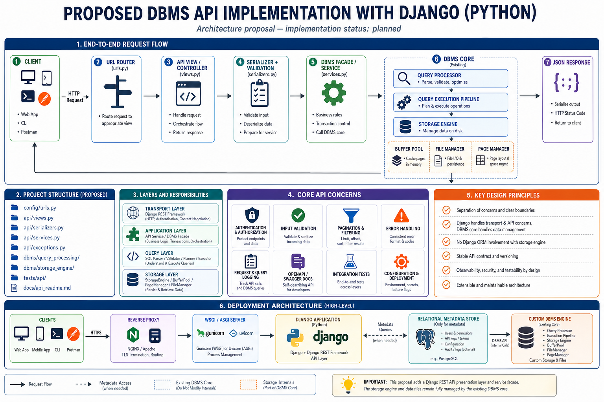

# DBMS API Architecture Proposal

This document describes a proposed Django REST API presentation layer for the
Python DBMS core. It is an architecture reference, not evidence that the
Django API has already been implemented.



## Request flow

The intended request path is:

```text
Client
  -> Django URL router
  -> API view/controller
  -> serializer and input validation
  -> API service / DBMS facade
  -> QueryProcessor
  -> query execution pipeline
  -> StorageEngine
  -> JSON response
```

The Django layer should own transport concerns such as HTTP methods, request
validation, authentication, response serialization, and API error formats. It
should not replace the DBMS query-processing or storage-engine contracts.

## Proposed project structure

```text
config/urls.py              # API route registration
api/views.py                # HTTP controllers or DRF ViewSets
api/serializers.py          # Request/response validation and serialization
api/services.py             # Application orchestration and DBMS facade calls
api/exceptions.py           # HTTP-facing exception mapping
tests/api/                  # API and integration tests
docs/api_readme.md          # This architecture reference
```

The existing DBMS core remains under:

```text
src/dbms/query_processing/
src/dbms/storage_engine/
```

## Existing versus planned components

| Component | Current status | Repository location or proposal |
| :--- | :--- | :--- |
| SQL parsing and validation | Existing | `src/dbms/query_processing/` |
| SELECT execution pipeline | Existing, scoped to current SELECT support | `src/dbms/query_processing/` |
| Storage Engine, Buffer Pool, Page and Record components | Existing | `src/dbms/storage_engine/` |
| Django URL router | Planned | `config/urls.py` |
| Django API views/controllers | Planned | `api/views.py` |
| Django REST serializers | Planned | `api/serializers.py` |
| API service/facade adapter | Planned | `api/services.py` |
| OpenAPI/Swagger documentation | Planned | API documentation layer |
| API integration tests | Planned | `tests/api/` |

## Boundary rules

1. Django receives and validates HTTP requests.
2. API services translate validated requests into DBMS-native calls.
3. Query processing owns SQL parsing, validation, planning, and execution.
4. Storage Engine owns pages, records, buffering, and persistence.
5. The API serializes DBMS results into stable JSON responses.

The diagram intentionally labels the API as a proposal so that documentation
does not overstate the current implementation status.
