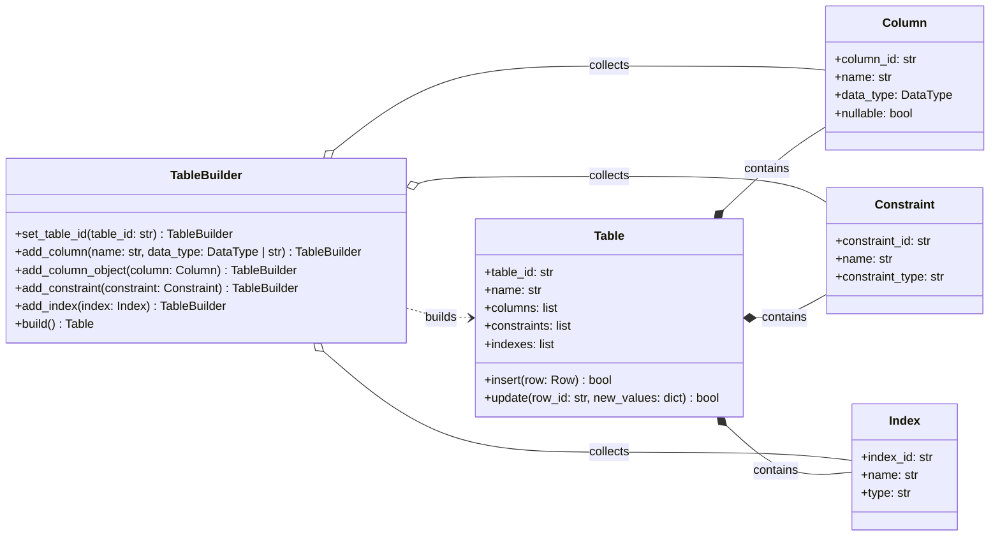
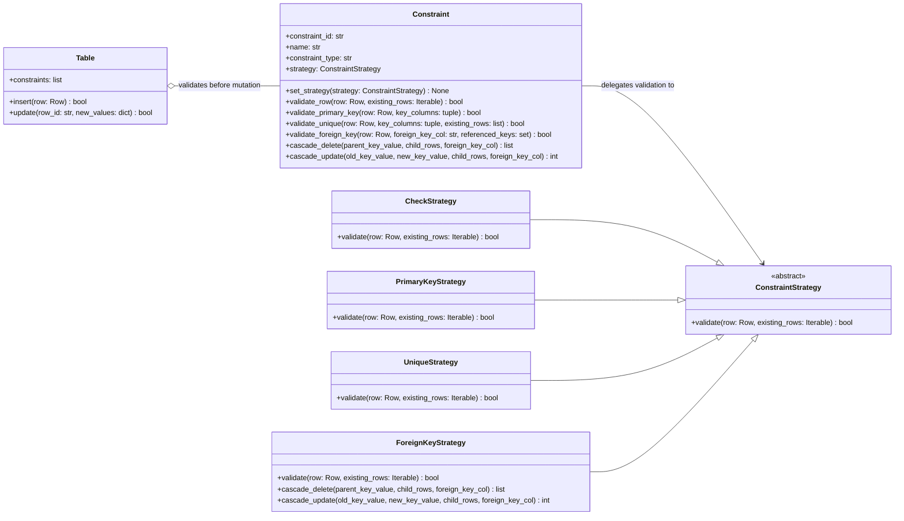
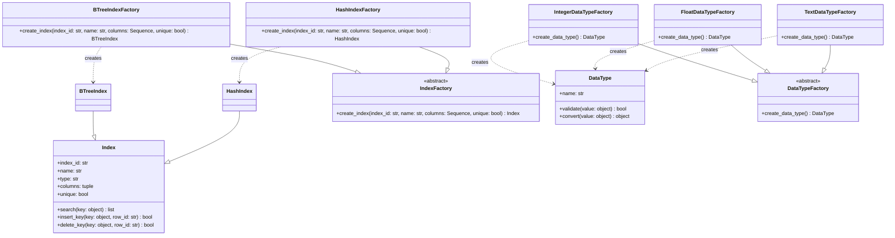
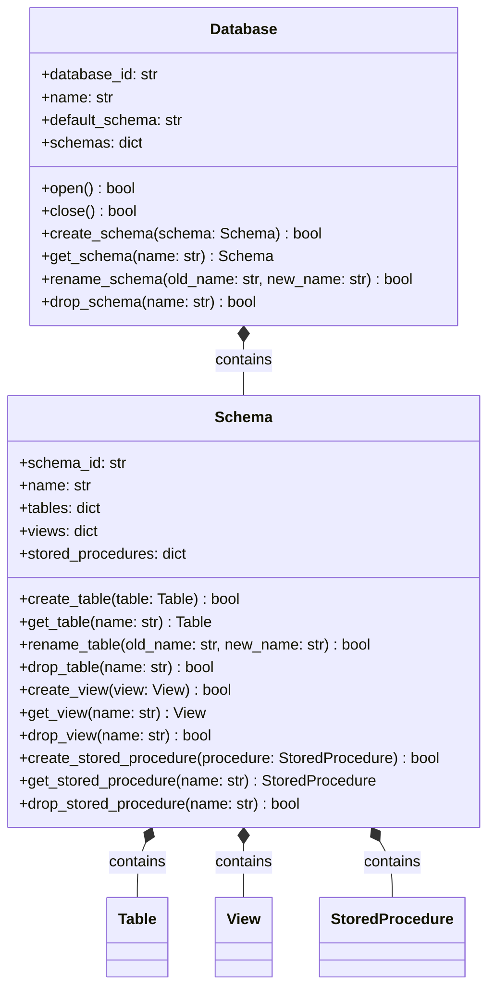
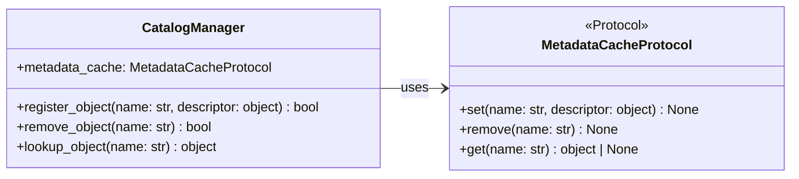
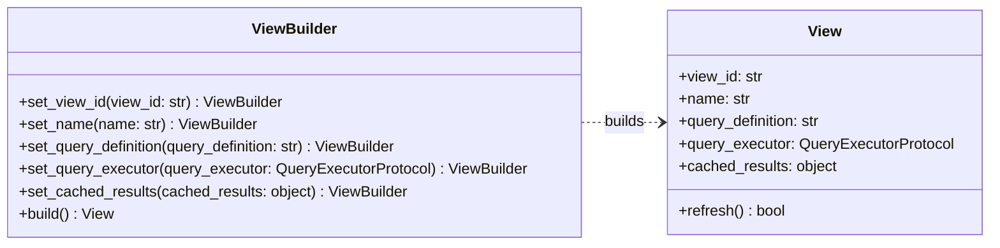

# Database Objects — Class Diagrams

Class diagrams for the design patterns currently implemented in the **Database Objects** core module:

- Builder Pattern for creating `Table` and `View` objects.
- Strategy Pattern for validating constraints.
- Factory Method for creating `Index` and `DataType` objects.
- Composite Pattern for managing the `Database` and `Schema` hierarchy.
- Repository Pattern for catalog metadata management.

---

## 1. Builder Pattern (Table Creation)

Constructs a `Table` object step by step, separating the build process from the final `Table` object.

`TableBuilder` copies its internal component collections during `build()`, ensuring built `Table` instances remain independent from the builder.

---

## 2. Strategy Pattern (Constraint Validation)

Allows swapping constraint validation logic dynamically using interchangeable strategy classes (`PrimaryKeyStrategy`, `UniqueStrategy`, `ForeignKeyStrategy`, `CheckStrategy`).

`Table` decides when row validation runs. `Constraint` delegates the rule to its selected `ConstraintStrategy`, and `set_strategy()` can replace that rule without changing `Table`.

---

## 3. Factory Method (Index & Data Type Creation)

Uses concrete factory methods to create an `Index` product or a configured `DataType` product.

Each concrete factory chooses the product it creates: `BTreeIndexFactory` creates `BTreeIndex`, `HashIndexFactory` creates `HashIndex`, and each data-type factory creates one configured `DataType`.

---

## 4. Composite Pattern (Database Hierarchy)

Organizes `Database`, `Schema`, `Table`, `View`, and `StoredProcedure` into a composite structure for hierarchical catalog management.

`Database` manages its `Schema` collection, and each `Schema` manages its `Table`, `View`, and `StoredProcedure` collections.

---

## 5. Repository Pattern (Metadata Management)

`CatalogManager` exposes one repository API while `MetadataCacheProtocol` supplies the storage implementation.

`lookup_object()` turns a missing cache value into `KeyError`; duplicate registration and missing-removal errors continue to come from the configured cache.

---

## 6. Builder Pattern (View Creation)

Constructs a `View` object step by step, validating query parameters before object instantiation.

`ViewBuilder` validates that both `name` and `query_definition` are provided and non-empty during `build()`.
