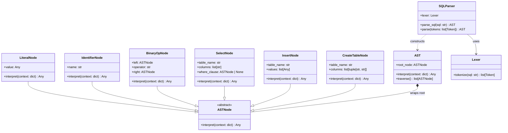

# Query Processing - Class Diagrams

This document contains class diagrams for the applied Design Patterns in the **Query Processing** module.

---

## 1. Interpreter Pattern (SQL Parsing)

`Lexer` tokenizes raw SQL text into `Token` streams, which `SQLParser` parses into an `AST`. Every AST node implements `ASTNode.interpret(context)` to evaluate expressions against row data contexts.

`SelectNode`, `BinaryOpNode`, `IdentifierNode`, and `LiteralNode` form the expression tree evaluated via `interpret()`.
