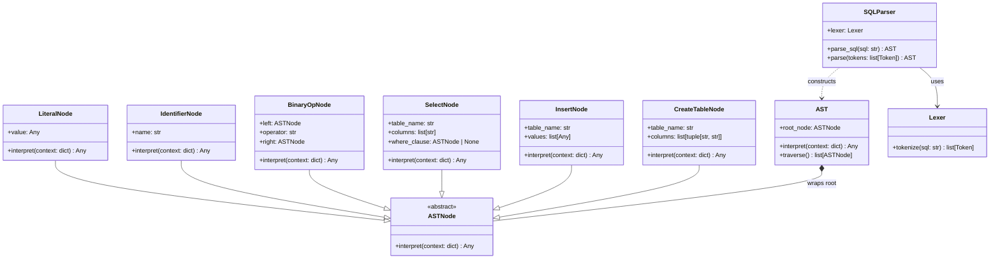
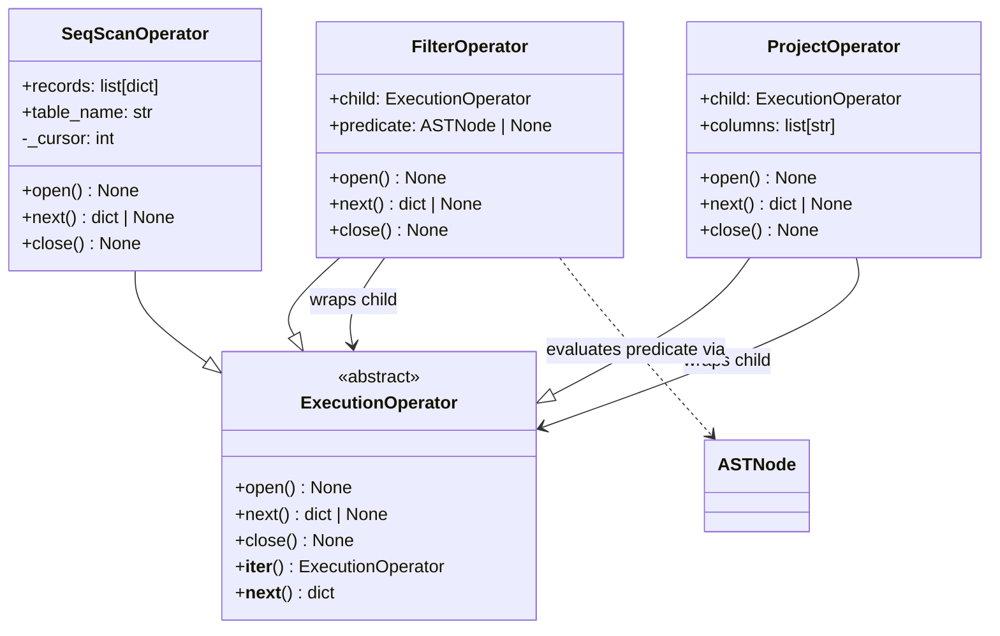
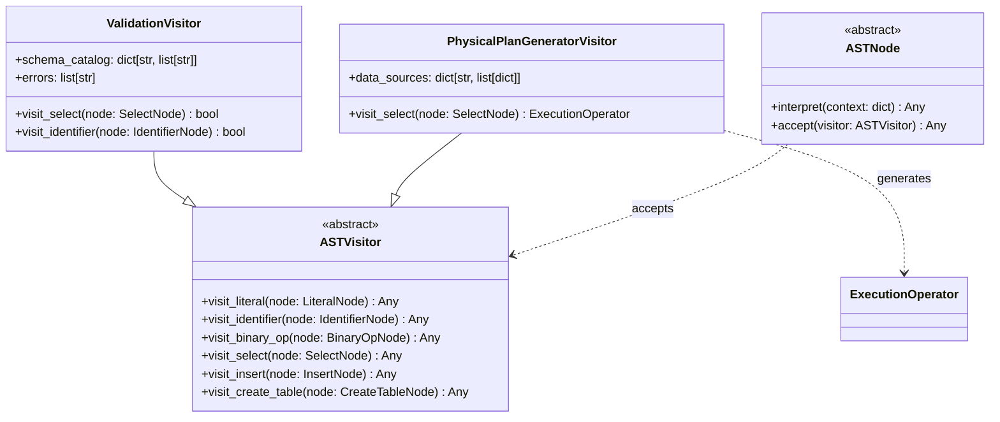

# Query Processing - Class Diagrams

This document contains class diagrams for the applied Design Patterns in the **Query Processing** module.

---

## 1. Interpreter Pattern (SQL Parsing)

`Lexer` tokenizes raw SQL text into `Token` streams, which `SQLParser` parses into an `AST`. Every AST node implements `ASTNode.interpret(context)` to evaluate expressions against row data contexts.

```mermaid
classDiagram
    direction TB

    class ASTNode {
        <<abstract>>
        +interpret(context: dict) Any
    }

    class LiteralNode {
        +value: Any
        +interpret(context: dict) Any
    }

    class IdentifierNode {
        +name: str
        +interpret(context: dict) Any
    }

    class BinaryOpNode {
        +left: ASTNode
        +operator: str
        +right: ASTNode
        +interpret(context: dict) Any
    }

    class SelectNode {
        +table_name: str
        +columns: list[str]
        +where_clause: ASTNode | None
        +interpret(context: dict) Any
    }

    class InsertNode {
        +table_name: str
        +values: list[Any]
        +interpret(context: dict) Any
    }

    class CreateTableNode {
        +table_name: str
        +columns: list[tuple[str, str]]
        +interpret(context: dict) Any
    }

    class AST {
        +root_node: ASTNode
        +interpret(context: dict) Any
        +traverse() list[ASTNode]
    }

    class Lexer {
        +tokenize(sql: str) list[Token]
    }

    class SQLParser {
        +lexer: Lexer
        +parse_sql(sql: str) AST
        +parse(tokens: list[Token]) AST
    }

    LiteralNode --|> ASTNode
    IdentifierNode --|> ASTNode
    BinaryOpNode --|> ASTNode
    SelectNode --|> ASTNode
    InsertNode --|> ASTNode
    CreateTableNode --|> ASTNode
    AST *-- ASTNode : wraps root
    SQLParser --> Lexer : uses
    SQLParser ..> AST : constructs
```

`SelectNode`, `BinaryOpNode`, `IdentifierNode`, and `LiteralNode` form the expression tree evaluated via `interpret()`.

---

## 2. Iterator Pattern (Execution Operators)

`ExecutionOperator` implements the Volcano Iterator interface (`open()`, `next()`, `close()`) allowing physical operators (`SeqScanOperator`, `FilterOperator`, `ProjectOperator`) to be chained together into a streaming query execution pipeline.

```mermaid
classDiagram
    direction TB

    class ExecutionOperator {
        <<abstract>>
        +open() None
        +next() dict | None
        +close() None
        +__iter__() ExecutionOperator
        +__next__() dict
    }

    class SeqScanOperator {
        +records: list[dict]
        +table_name: str
        -_cursor: int
        +open() None
        +next() dict | None
        +close() None
    }

    class FilterOperator {
        +child: ExecutionOperator
        +predicate: ASTNode | None
        +open() None
        +next() dict | None
        +close() None
    }

    class ProjectOperator {
        +child: ExecutionOperator
        +columns: list[str]
        +open() None
        +next() dict | None
        +close() None
    }

    SeqScanOperator --|> ExecutionOperator
    FilterOperator --|> ExecutionOperator
    ProjectOperator --|> ExecutionOperator
    FilterOperator --> ExecutionOperator : wraps child
    ProjectOperator --> ExecutionOperator : wraps child
    FilterOperator ..> ASTNode : evaluates predicate via
```

`FilterOperator` uses `ASTNode.interpret(row)` to filter incoming tuple streams, while `ProjectOperator` extracts the requested target attributes.

---

## 3. Visitor Pattern (AST Traversal)

`ASTVisitor` defines double-dispatch visit operations across `ASTNode` hierarchies. `ValidationVisitor` validates schema names, and `PhysicalPlanGeneratorVisitor` constructs physical `ExecutionOperator` pipelines from `SelectNode` AST roots.

```mermaid
classDiagram
    direction TB

    class ASTVisitor {
        <<abstract>>
        +visit_literal(node: LiteralNode) Any
        +visit_identifier(node: IdentifierNode) Any
        +visit_binary_op(node: BinaryOpNode) Any
        +visit_select(node: SelectNode) Any
        +visit_insert(node: InsertNode) Any
        +visit_create_table(node: CreateTableNode) Any
    }

    class ValidationVisitor {
        +schema_catalog: dict[str, list[str]]
        +errors: list[str]
        +visit_select(node: SelectNode) bool
        +visit_identifier(node: IdentifierNode) bool
    }

    class PhysicalPlanGeneratorVisitor {
        +data_sources: dict[str, list[dict]]
        +visit_select(node: SelectNode) ExecutionOperator
    }

    class ASTNode {
        <<abstract>>
        +interpret(context: dict) Any
        +accept(visitor: ASTVisitor) Any
    }

    ValidationVisitor --|> ASTVisitor
    PhysicalPlanGeneratorVisitor --|> ASTVisitor
    ASTNode ..> ASTVisitor : accepts
    PhysicalPlanGeneratorVisitor ..> ExecutionOperator : generates
```

Callers pass concrete visitors (`ValidationVisitor`, `PhysicalPlanGeneratorVisitor`) to `ASTNode.accept(visitor)` without altering the AST node hierarchy.
