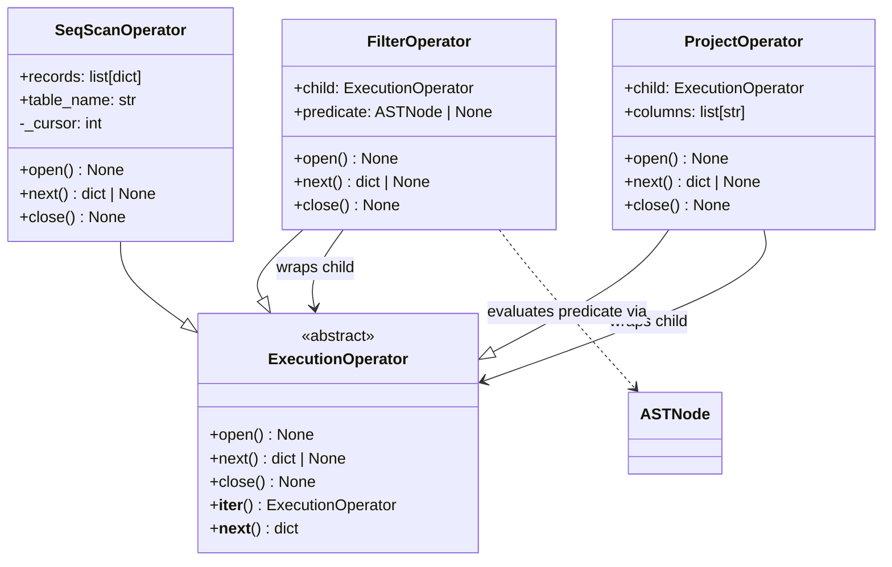
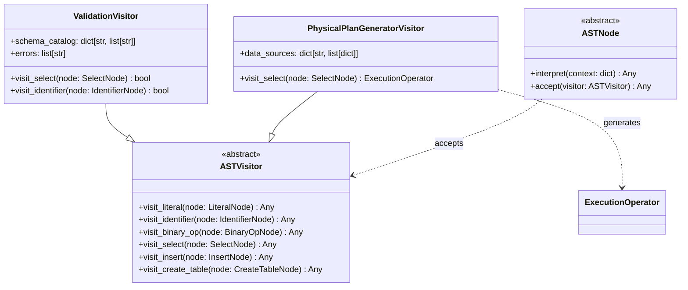
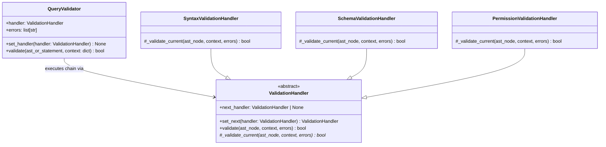
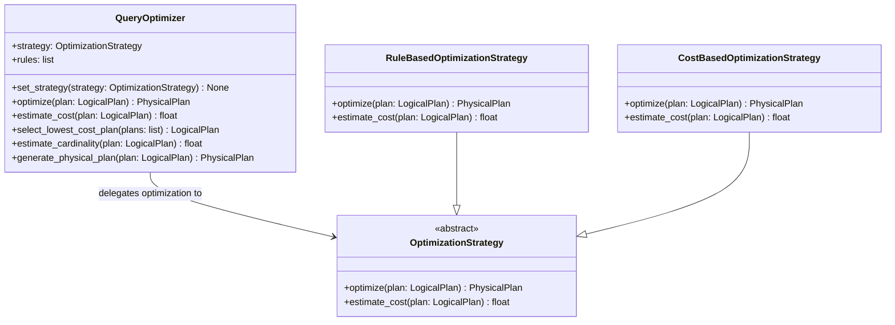
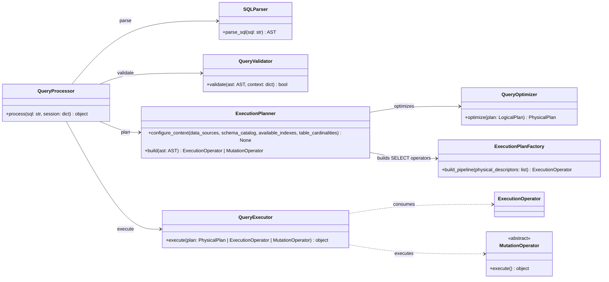

# Query Processing - Class Diagrams

This document contains class diagrams for the applied Design Patterns in the **Query Processing** module.

---

## 1. Interpreter Pattern (SQL Parsing)

`Lexer` tokenizes raw SQL text into `Token` streams, which `SQLParser` parses into an `AST`. Every AST node implements `ASTNode.interpret(context)` to evaluate expressions against row data contexts.

```mermaid
classDiagram
    direction TB

    class ASTNode {
        <<abstract>>
        +interpret(context: dict) Any
    }

    class LiteralNode {
        +value: Any
        +interpret(context: dict) Any
    }

    class IdentifierNode {
        +name: str
        +interpret(context: dict) Any
    }

    class BinaryOpNode {
        +left: ASTNode
        +operator: str
        +right: ASTNode
        +interpret(context: dict) Any
    }

    class SelectNode {
        +table_name: str
        +columns: list[str]
        +where_clause: ASTNode | None
        +interpret(context: dict) Any
    }

    class InsertNode {
        +table_name: str
        +values: list[Any]
        +interpret(context: dict) Any
    }

    class CreateTableNode {
        +table_name: str
        +columns: list[tuple[str, str]]
        +interpret(context: dict) Any
    }

    class AST {
        +root_node: ASTNode
        +interpret(context: dict) Any
        +traverse() list[ASTNode]
    }

    class Lexer {
        +tokenize(sql: str) list[Token]
    }

    class SQLParser {
        +lexer: Lexer
        +parse_sql(sql: str) AST
        +parse(tokens: list[Token]) AST
    }

    LiteralNode --|> ASTNode
    IdentifierNode --|> ASTNode
    BinaryOpNode --|> ASTNode
    SelectNode --|> ASTNode
    InsertNode --|> ASTNode
    CreateTableNode --|> ASTNode
    AST *-- ASTNode : wraps root
    SQLParser --> Lexer : uses
    SQLParser ..> AST : constructs
```

`SelectNode`, `BinaryOpNode`, `IdentifierNode`, and `LiteralNode` form the expression tree evaluated via `interpret()`.

---

## 2. Iterator Pattern (Execution Operators)

`ExecutionOperator` implements the Volcano Iterator interface (`open()`, `next()`, `close()`) allowing physical operators (`SeqScanOperator`, `FilterOperator`, `ProjectOperator`) to be chained together into a streaming query execution pipeline.

```mermaid
classDiagram
    direction TB

    class ExecutionOperator {
        <<abstract>>
        +open() None
        +next() dict | None
        +close() None
        +__iter__() ExecutionOperator
        +__next__() dict
    }

    class SeqScanOperator {
        +records: list[dict]
        +table_name: str
        -_cursor: int
        +open() None
        +next() dict | None
        +close() None
    }

    class FilterOperator {
        +child: ExecutionOperator
        +predicate: ASTNode | None
        +open() None
        +next() dict | None
        +close() None
    }

    class ProjectOperator {
        +child: ExecutionOperator
        +columns: list[str]
        +open() None
        +next() dict | None
        +close() None
    }

    SeqScanOperator --|> ExecutionOperator
    FilterOperator --|> ExecutionOperator
    ProjectOperator --|> ExecutionOperator
    FilterOperator --> ExecutionOperator : wraps child
    ProjectOperator --> ExecutionOperator : wraps child
    FilterOperator ..> ASTNode : evaluates predicate via
```

`FilterOperator` uses `ASTNode.interpret(row)` to filter incoming tuple streams, while `ProjectOperator` extracts the requested target attributes.

---

## 3. Visitor Pattern (AST Traversal)

`ASTVisitor` defines double-dispatch visit operations across `ASTNode` hierarchies. `ValidationVisitor` validates schema names, and `PhysicalPlanGeneratorVisitor` constructs physical `ExecutionOperator` pipelines from `SelectNode` AST roots.

```mermaid
classDiagram
    direction TB

    class ASTVisitor {
        <<abstract>>
        +visit_literal(node: LiteralNode) Any
        +visit_identifier(node: IdentifierNode) Any
        +visit_binary_op(node: BinaryOpNode) Any
        +visit_select(node: SelectNode) Any
        +visit_insert(node: InsertNode) Any
        +visit_create_table(node: CreateTableNode) Any
    }

    class ValidationVisitor {
        +schema_catalog: dict[str, list[str]]
        +errors: list[str]
        +visit_select(node: SelectNode) bool
        +visit_identifier(node: IdentifierNode) bool
    }

    class PhysicalPlanGeneratorVisitor {
        +data_sources: dict[str, list[dict]]
        +visit_select(node: SelectNode) ExecutionOperator
    }

    class ASTNode {
        <<abstract>>
        +interpret(context: dict) Any
        +accept(visitor: ASTVisitor) Any
    }

    ValidationVisitor --|> ASTVisitor
    PhysicalPlanGeneratorVisitor --|> ASTVisitor
    ASTNode ..> ASTVisitor : accepts
    PhysicalPlanGeneratorVisitor ..> ExecutionOperator : generates
```

Callers pass concrete visitors (`ValidationVisitor`, `PhysicalPlanGeneratorVisitor`) to `ASTNode.accept(visitor)` without altering the AST node hierarchy.

---

## 4. Chain of Responsibility Pattern (Query Validation)

`QueryValidator` executes a sequential validation chain composed of linked `ValidationHandler` objects (`SyntaxValidationHandler`, `SchemaValidationHandler`, `PermissionValidationHandler`).

```mermaid
classDiagram
    direction TB

    class QueryValidator {
        +handler: ValidationHandler
        +errors: list[str]
        +set_handler(handler: ValidationHandler) None
        +validate(ast_or_statement, context: dict) bool
    }

    class ValidationHandler {
        <<abstract>>
        +next_handler: ValidationHandler | None
        +set_next(handler: ValidationHandler) ValidationHandler
        +validate(ast_node, context, errors) bool
        #_validate_current(ast_node, context, errors)* bool
    }

    class SyntaxValidationHandler {
        #_validate_current(ast_node, context, errors) bool
    }

    class SchemaValidationHandler {
        #_validate_current(ast_node, context, errors) bool
    }

    class PermissionValidationHandler {
        #_validate_current(ast_node, context, errors) bool
    }

    QueryValidator --> ValidationHandler : executes chain via
    SyntaxValidationHandler --|> ValidationHandler
    SchemaValidationHandler --|> ValidationHandler
    PermissionValidationHandler --|> ValidationHandler
```

Each handler processes its own validation concerns and passes control to `next_handler` unless a validation check fails.

---

## 5. Strategy Pattern (Query Optimization)

`QueryOptimizer` delegates logical plan optimization, cost estimation, and physical plan generation to an injected `OptimizationStrategy` (`RuleBasedOptimizationStrategy` or `CostBasedOptimizationStrategy`).

```mermaid
classDiagram
    direction TB

    class QueryOptimizer {
        +strategy: OptimizationStrategy
        +rules: list
        +set_strategy(strategy: OptimizationStrategy) None
        +optimize(plan: LogicalPlan) PhysicalPlan
        +estimate_cost(plan: LogicalPlan) float
        +select_lowest_cost_plan(plans: list) LogicalPlan
        +estimate_cardinality(plan: LogicalPlan) float
        +generate_physical_plan(plan: LogicalPlan) PhysicalPlan
    }

    class OptimizationStrategy {
        <<abstract>>
        +optimize(plan: LogicalPlan) PhysicalPlan
        +estimate_cost(plan: LogicalPlan) float
    }

    class RuleBasedOptimizationStrategy {
        +optimize(plan: LogicalPlan) PhysicalPlan
        +estimate_cost(plan: LogicalPlan) float
    }

    class CostBasedOptimizationStrategy {
        +optimize(plan: LogicalPlan) PhysicalPlan
        +estimate_cost(plan: LogicalPlan) float
    }

    QueryOptimizer --> OptimizationStrategy : delegates optimization to
    RuleBasedOptimizationStrategy --|> OptimizationStrategy
    CostBasedOptimizationStrategy --|> OptimizationStrategy
```

`RuleBasedOptimizationStrategy` handles rule transformations (predicate pushdown, projection pruning, constant folding, index selection), while `CostBasedOptimizationStrategy` evaluates cost-based plan selections.

---

## 6. Factory Method (Execution Plan Creation)

`ExecutionOperatorFactory` defines the abstract Factory Method interface for constructing physical `ExecutionOperator` nodes from optimizer descriptors. `ExecutionPlanFactory` coordinates sequential, index-selected, parallel, filter, and project operators.

```mermaid
classDiagram
    direction TB

    class ExecutionOperatorFactory {
        <<abstract>>
        +create_operator(op_descriptor: str, data_sources: dict, child: ExecutionOperator) ExecutionOperator
    }

    class SeqScanOperatorFactory {
        +create_operator(op_descriptor: str, data_sources: dict, child: ExecutionOperator) SeqScanOperator
    }

    class FilterOperatorFactory {
        +create_operator(op_descriptor: str, data_sources: dict, child: ExecutionOperator) FilterOperator
    }

    class IndexScanOperatorFactory {
        +create_operator(op_descriptor: str, data_sources: dict, child: ExecutionOperator) IndexScanOperator
    }

    class ParallelTableScanOperatorFactory {
        +create_operator(op_descriptor: str, data_sources: dict, child: ExecutionOperator) ParallelTableScanOperator
    }

    class ProjectOperatorFactory {
        +create_operator(op_descriptor: str, data_sources: dict, child: ExecutionOperator) ProjectOperator
    }

    class ExecutionPlanFactory {
        +data_sources: dict
        +build_operator(op_descriptor: str, child: ExecutionOperator) ExecutionOperator
        +build_pipeline(physical_descriptors: list) ExecutionOperator
    }

    class ExecutionOperator {
        <<abstract>>
    }

    SeqScanOperatorFactory --|> ExecutionOperatorFactory
    FilterOperatorFactory --|> ExecutionOperatorFactory
    IndexScanOperatorFactory --|> ExecutionOperatorFactory
    ParallelTableScanOperatorFactory --|> ExecutionOperatorFactory
    ProjectOperatorFactory --|> ExecutionOperatorFactory
    SeqScanOperatorFactory ..> ExecutionOperator : creates
    FilterOperatorFactory ..> ExecutionOperator : creates
    IndexScanOperatorFactory ..> ExecutionOperator : creates
    ParallelTableScanOperatorFactory ..> ExecutionOperator : creates
    ProjectOperatorFactory ..> ExecutionOperator : creates
    ExecutionPlanFactory o-- ExecutionOperatorFactory : uses
```

`ExecutionPlanFactory` maps descriptor prefixes to concrete `ExecutionOperatorFactory` implementations, including optimizer-produced `IndexScan` and `ParallelTableScan`. The in-memory index scan preserves predicate semantics; persistent index lookup remains a Storage Engine concern.

---

## 7. Query Execution Pipeline (In-Memory Session)

`QueryProcessor` coordinates the fixed processing stages. This is a pipeline, not a second Chain of Responsibility: parsing, validation, planning, and execution all run in order when the previous stage succeeds.

```mermaid
classDiagram
    direction LR

    class QueryProcessor {
        +process(sql: str, session: dict) object
    }

    class SQLParser {
        +parse_sql(sql: str) AST
    }

    class QueryValidator {
        +validate(ast: AST, context: dict) bool
    }

    class ExecutionPlanner {
        +configure_context(data_sources, schema_catalog, available_indexes, table_cardinalities) None
        +build(ast: AST) ExecutionOperator | MutationOperator
    }

    class QueryOptimizer {
        +optimize(plan: LogicalPlan) PhysicalPlan
    }

    class ExecutionPlanFactory {
        +build_pipeline(physical_descriptors: list) ExecutionOperator
    }

    class QueryExecutor {
        +execute(plan: PhysicalPlan | ExecutionOperator | MutationOperator) object
    }

    class MutationOperator {
        <<abstract>>
        +execute() object
    }

    QueryProcessor --> SQLParser : parse
    QueryProcessor --> QueryValidator : validate
    QueryProcessor --> ExecutionPlanner : plan
    QueryProcessor --> QueryExecutor : execute
    ExecutionPlanner --> QueryOptimizer : optimizes
    ExecutionPlanner --> ExecutionPlanFactory : builds SELECT operators
    QueryExecutor ..> ExecutionOperator : consumes
    QueryExecutor ..> MutationOperator : executes
```

The pipeline supports `SELECT`, `INSERT`, and `CREATE TABLE` against request-session `data_sources` and `schema_catalog`. Storage-engine persistence and physical index lookup are explicitly outside this in-memory boundary.

