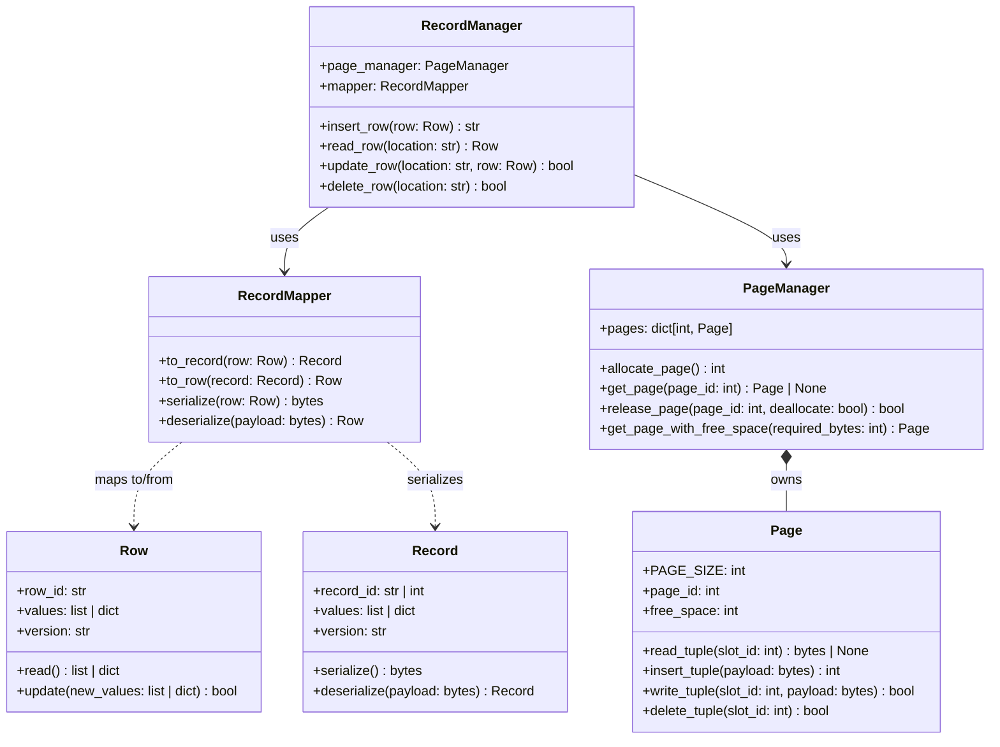
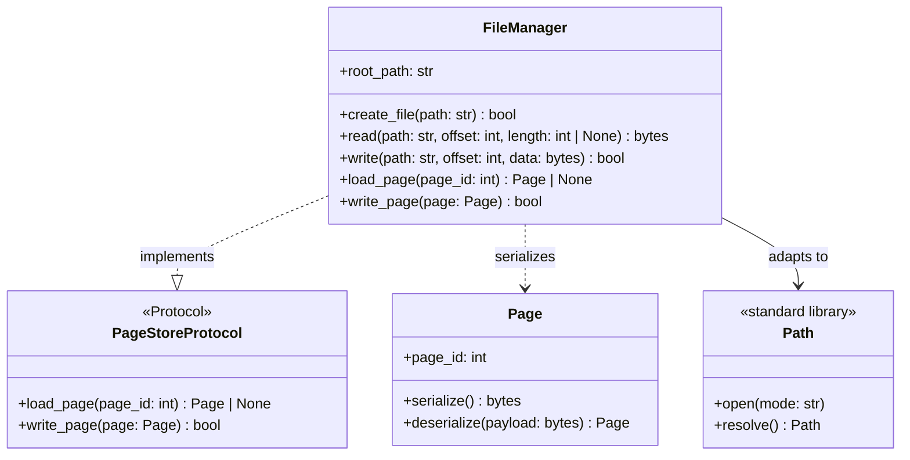
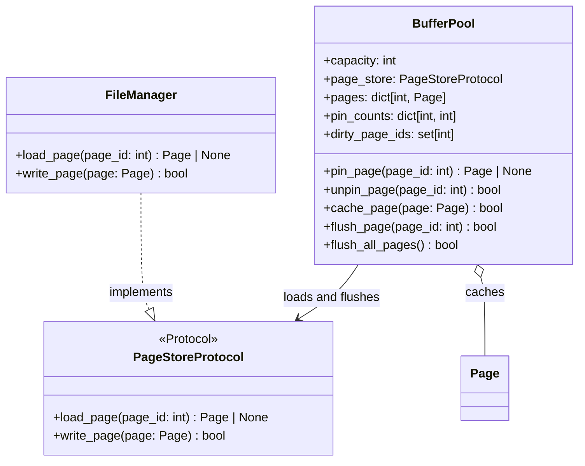
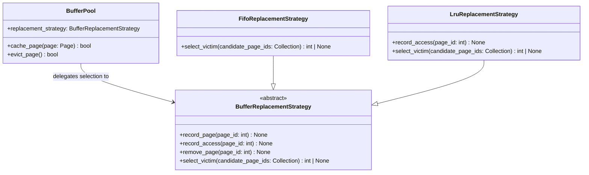

# Storage Engine - Class Diagrams

## 1. Data Mapper (Record Read/Write)

`RecordMapper` is the Data Mapper: it converts the database-object `Row` into a storage `Record` and bytes without adding storage details to `Row`. `RecordManager` uses that mapper to place bytes in a `Page` slot.

`PageManager` currently owns in-memory pages. File persistence and buffer-pool behavior are intentionally outside this pattern implementation.

---

## 2. Adapter (File Access)

`FileManager` adapts root-relative storage operations to the local filesystem. It also implements `PageStoreProtocol`, so a future buffer pool can load and flush `Page` objects without depending on filesystem details.

`FileManager` rejects paths outside `root_path`. It is used by `BufferPool` through `PageStoreProtocol`; `PageManager` and `StorageEngine` are not yet connected to it.

---

## 3. Proxy (Page Loading)

`BufferPool` is a cache proxy for `PageStoreProtocol`. It returns an in-memory page when one is cached; otherwise it loads the page through the store, caches it, and pins it for the caller.

`pin_page()` returns `None` when the store has no page with the requested id. Buffer-pool state remains in memory; `FileManager` owns persisted page bytes.

---

## 4. Strategy (Buffer Replacement)

`BufferPool` delegates victim selection to an injected `BufferReplacementStrategy`. It still decides which pages are eligible: only unpinned pages can be evicted.

FIFO is the default. LRU demonstrates that callers can replace the algorithm without changing `BufferPool`.
