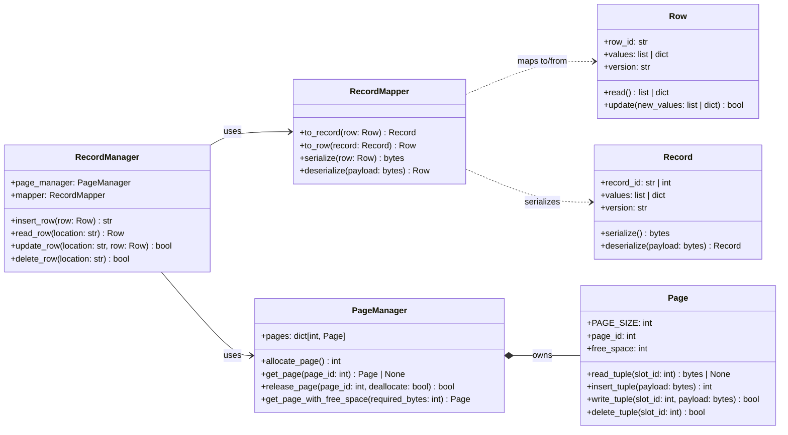
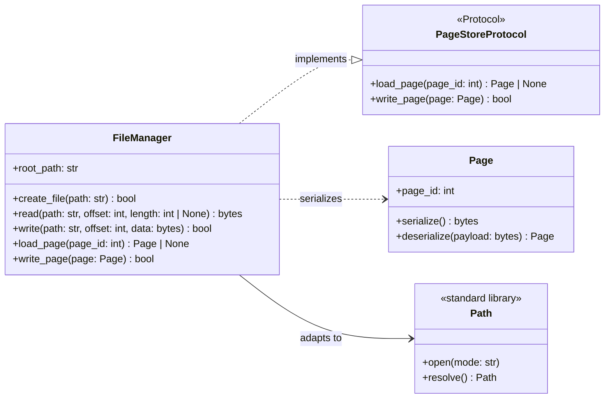

# Storage Engine - Class Diagrams

## 1. Data Mapper (Record Read/Write)

`RecordMapper` is the Data Mapper: it converts the database-object `Row` into a storage `Record` and bytes without adding storage details to `Row`. `RecordManager` uses that mapper to place bytes in a `Page` slot.

`PageManager` currently owns in-memory pages. File persistence and buffer-pool behavior are intentionally outside this pattern implementation.

---

## 2. Adapter (File Access)

`FileManager` adapts root-relative storage operations to the local filesystem. It also implements `PageStoreProtocol`, so a future buffer pool can load and flush `Page` objects without depending on filesystem details.

`FileManager` rejects paths outside `root_path`. It is not yet injected into `PageManager`, `BufferPool`, or `StorageEngine`.
