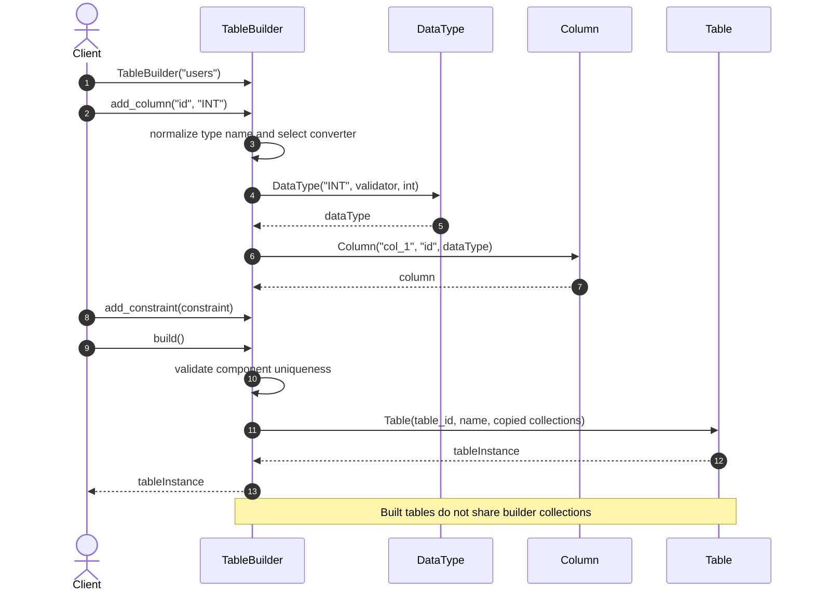
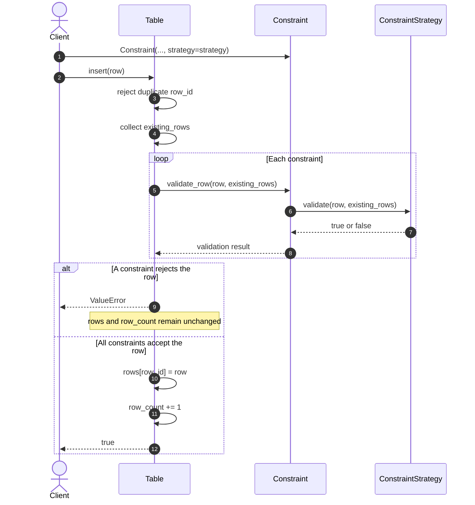
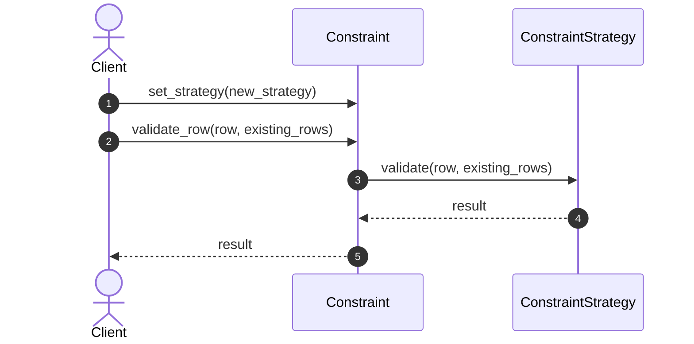
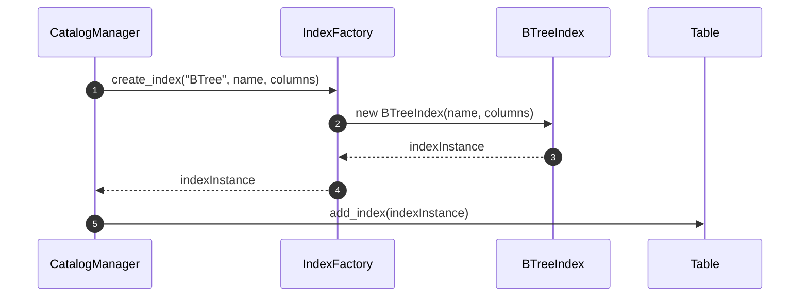
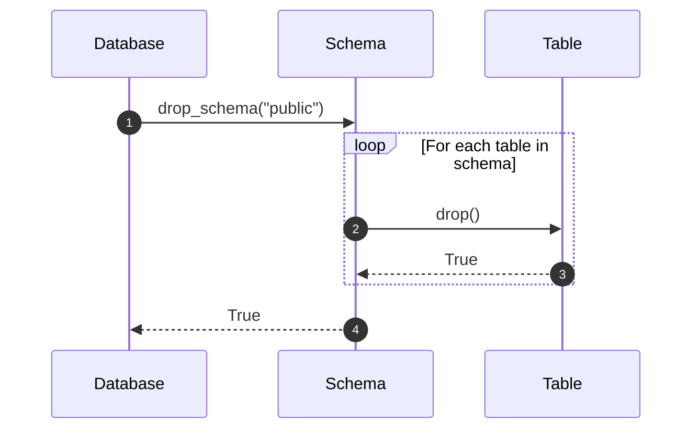
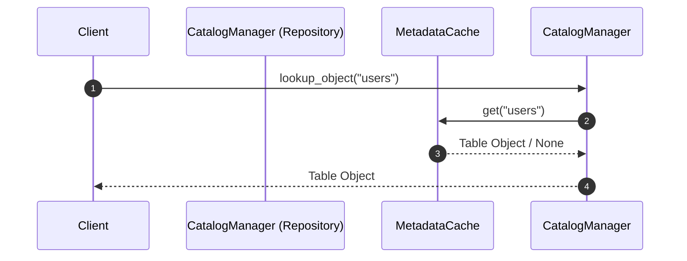
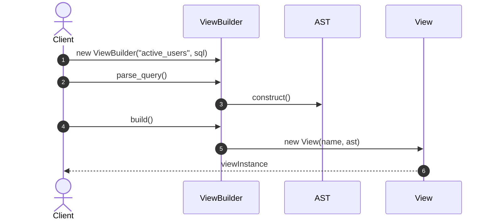

# Database Objects - Applied Design Patterns Sequence Diagrams

This document contains the sequence diagrams detailing the Design Patterns applied to the **Database Objects** core module.

---

## 1. Builder Pattern (Table Creation)

Separates the step-by-step construction of a complex `Table` object from its representation.

---

## 2. Strategy Pattern (Constraint Validation)

Encapsulates interchangeability for constraint validation rules (`PrimaryKeyStrategy`, `UniqueStrategy`, `ForeignKeyStrategy`, `CheckStrategy`).

The validation algorithm can also be replaced without changing `Table`:

`cascade_delete()` and `cascade_update()` remain separate foreign-key referential-action helpers. They are not part of the `Table.insert()` / `Table.update()` Strategy validation sequence above.

---

## 3. Factory Method (Index & Data Type Creation)

Encapsulates object instantiation for Index types (`BTreeIndex`, `HashIndex`) and Data Types (`DataType`).

---

## 4. Composite Pattern (Database Hierarchy)

Composes objects into tree structures to represent `Database` -> `Schema` -> `Table` part-whole hierarchies.

---

## 5. Repository Pattern (Metadata Management)

Mediates between the domain and data mapping layers for catalog metadata.

---

## 6. Builder Pattern (View Creation)

Constructs `View` objects from SQL AST queries and dependency checks.

