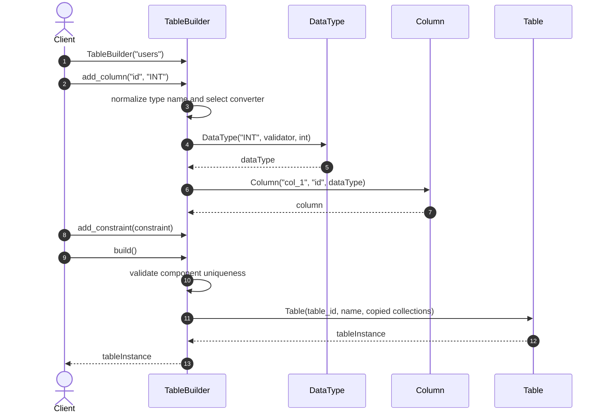
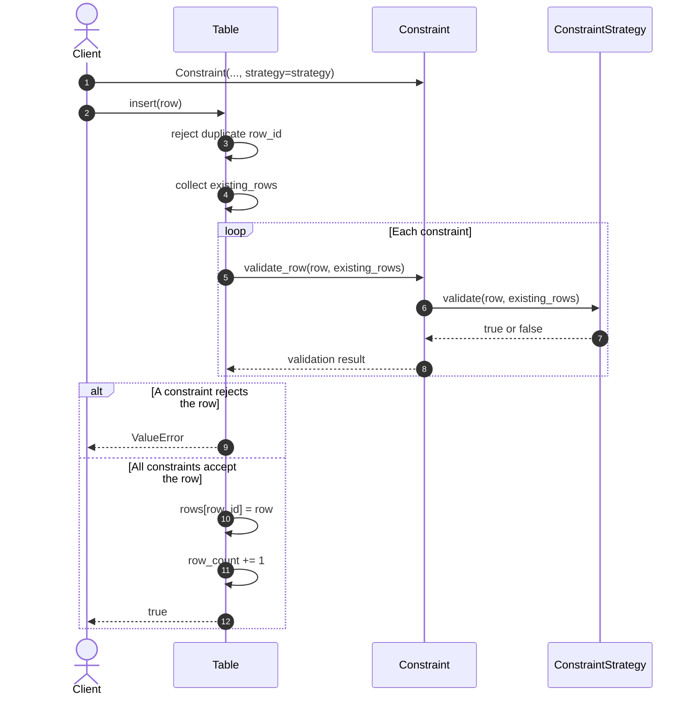
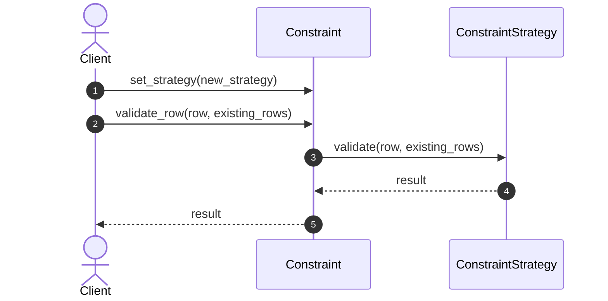
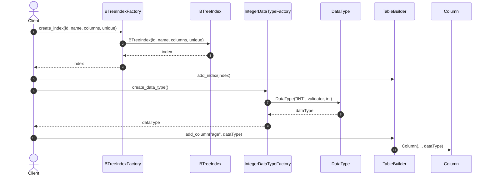
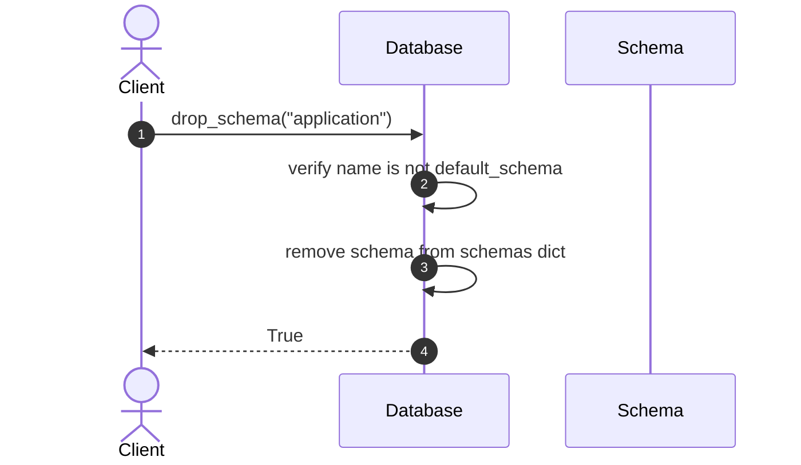
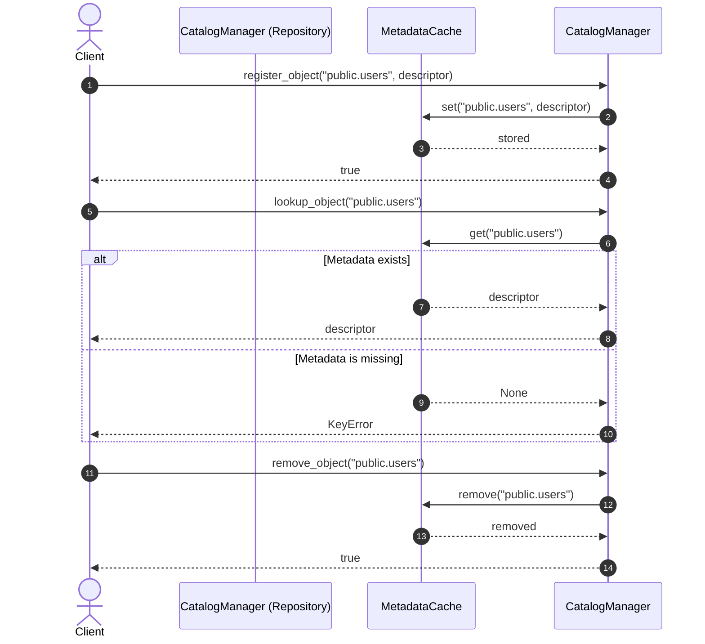

# Database Objects - Applied Design Patterns Sequence Diagrams

This document contains the sequence diagrams detailing the Design Patterns applied to the **Database Objects** core module.

---

## 1. Builder Pattern (Table Creation)

Constructs a `Table` object step by step, separating the build process from the final `Table` object.

---

## 2. Strategy Pattern (Constraint Validation)

Allows swapping constraint validation logic dynamically using interchangeable strategy classes (`PrimaryKeyStrategy`, `UniqueStrategy`, `ForeignKeyStrategy`, `CheckStrategy`).

The validation strategy can be dynamically replaced on a constraint without altering the `Table` implementation:

Foreign key referential actions (`cascade_delete` and `cascade_update`) run separately from the row validation sequence above.

---

## 3. Factory Method (Index & Data Type Creation)

Uses concrete factory methods to create an `Index` product or a configured `DataType` product.

---

## 4. Composite Pattern (Database Hierarchy)

Organizes `Database`, `Schema`, and child objects into a hierarchical structure for schema and component lookup and management.

---

## 5. Repository Pattern (Metadata Management)

Provides a single API for storing, retrieving, and removing catalog metadata through an injected cache abstraction.

