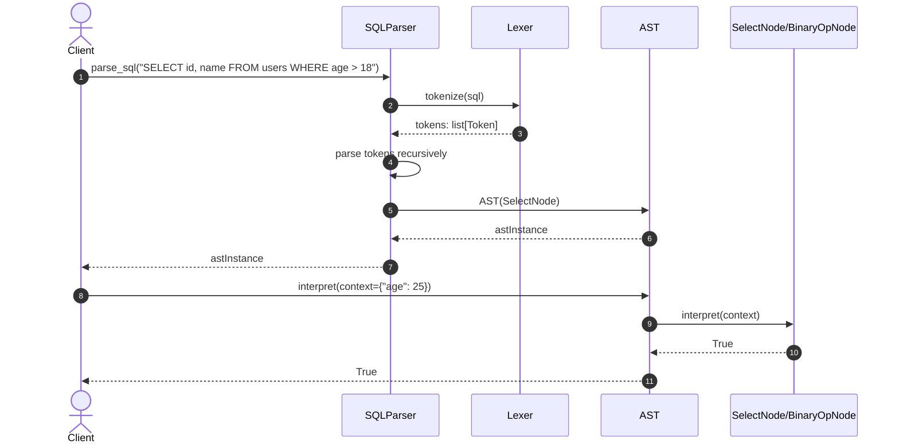

# Query Processing - Applied Design Patterns Sequence Diagrams

This document contains the sequence diagrams detailing the Design Patterns applied to the **Query Processing** core module.

---

## 1. Interpreter Pattern (SQL Parsing)

Converts a raw SQL string into tokens via `Lexer`, parses tokens into an `AST` via `SQLParser`, and evaluates expressions dynamically against row data using `interpret(context)`.

The Interpreter pattern separates syntax tokenization, AST construction, and context evaluation into distinct, testable layers.
