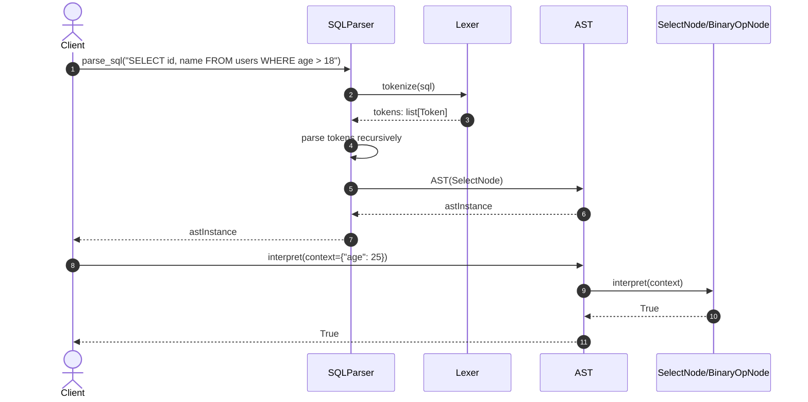
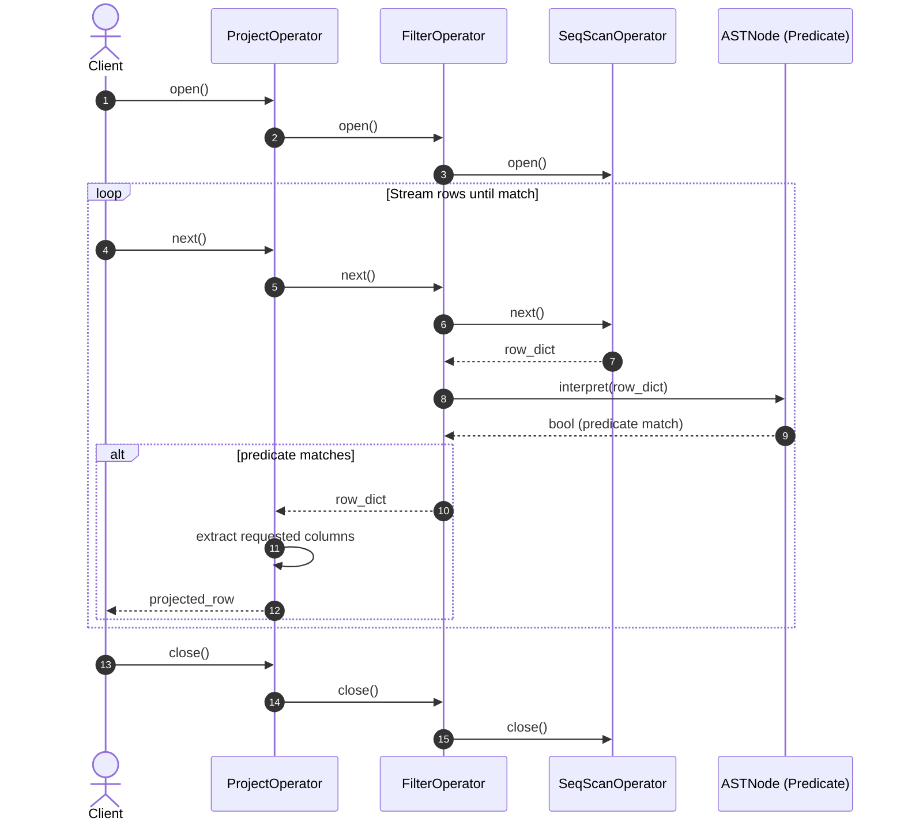
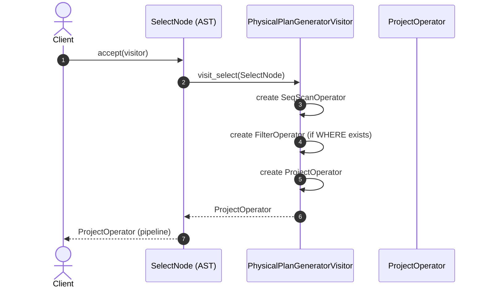

# Query Processing - Applied Design Patterns Sequence Diagrams

This document contains the sequence diagrams detailing the Design Patterns applied to the **Query Processing** core module.

---

## 1. Interpreter Pattern (SQL Parsing)

Converts a raw SQL string into tokens via `Lexer`, parses tokens into an `AST` via `SQLParser`, and evaluates expressions dynamically against row data using `interpret(context)`.

```mermaid
sequenceDiagram
    autonumber
    actor Client
    participant Parser as SQLParser
    participant Lexer
    participant AST
    participant Node as SelectNode/BinaryOpNode

    Client->>Parser: parse_sql("SELECT id, name FROM users WHERE age > 18")
    Parser->>Lexer: tokenize(sql)
    Lexer-->>Parser: tokens: list[Token]
    Parser->>Parser: parse tokens recursively
    Parser->>AST: AST(SelectNode)
    AST-->>Parser: astInstance
    Parser-->>Client: astInstance

    Client->>AST: interpret(context={"age": 25})
    AST->>Node: interpret(context)
    Node-->>AST: True
    AST-->>Client: True
```

The Interpreter pattern separates syntax tokenization, AST construction, and context evaluation into distinct, testable layers.

---

## 2. Iterator Pattern (Execution Operators)

Operators execute in a pull-based Volcano iterator chain (`ProjectOperator -> FilterOperator -> SeqScanOperator`).

```mermaid
sequenceDiagram
    autonumber
    actor Client
    participant Project as ProjectOperator
    participant Filter as FilterOperator
    participant Scan as SeqScanOperator
    participant AST as ASTNode (Predicate)

    Client->>Project: open()
    Project->>Filter: open()
    Filter->>Scan: open()
    
    loop Stream rows until match
        Client->>Project: next()
        Project->>Filter: next()
        Filter->>Scan: next()
        Scan-->>Filter: row_dict
        Filter->>AST: interpret(row_dict)
        AST-->>Filter: bool (predicate match)
        alt predicate matches
            Filter-->>Project: row_dict
            Project->>Project: extract requested columns
            Project-->>Client: projected_row
        end
    end

    Client->>Project: close()
    Project->>Filter: close()
    Filter->>Scan: close()
```

Each operator pulls tuples from its child on demand, avoiding buffering full result sets in memory.

---

## 3. Visitor Pattern (AST Traversal)

`ASTNode.accept(visitor)` dispatches to `ASTVisitor.visit_*()` methods to validate syntax nodes or construct physical execution operator trees.

```mermaid
sequenceDiagram
    autonumber
    actor Client
    participant AST as SelectNode (AST)
    participant Visitor as PhysicalPlanGeneratorVisitor
    participant Pipeline as ProjectOperator

    Client->>AST: accept(visitor)
    AST->>Visitor: visit_select(SelectNode)
    Visitor->>Visitor: create SeqScanOperator
    Visitor->>Visitor: create FilterOperator (if WHERE exists)
    Visitor->>Visitor: create ProjectOperator
    Visitor-->>AST: ProjectOperator
    AST-->>Client: ProjectOperator (pipeline)
```

The double-dispatch mechanism enables new compiler passes (validation, plan generation, optimization) to be added as independent Visitors without altering AST node classes.
