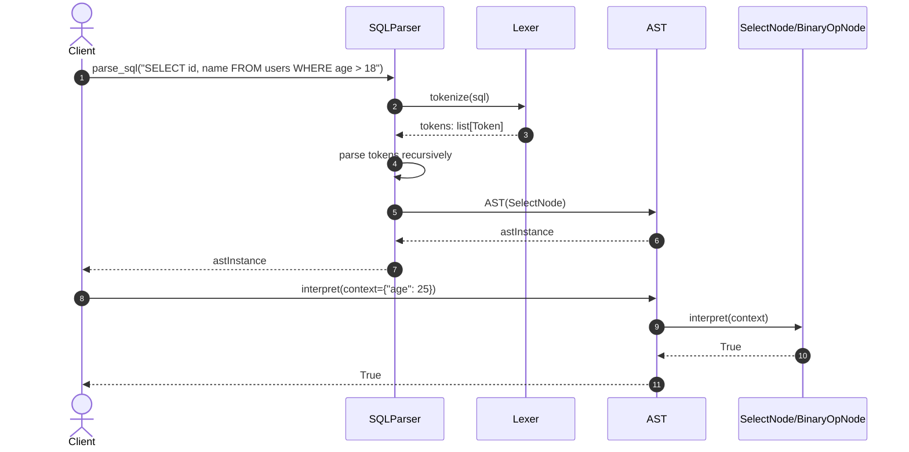
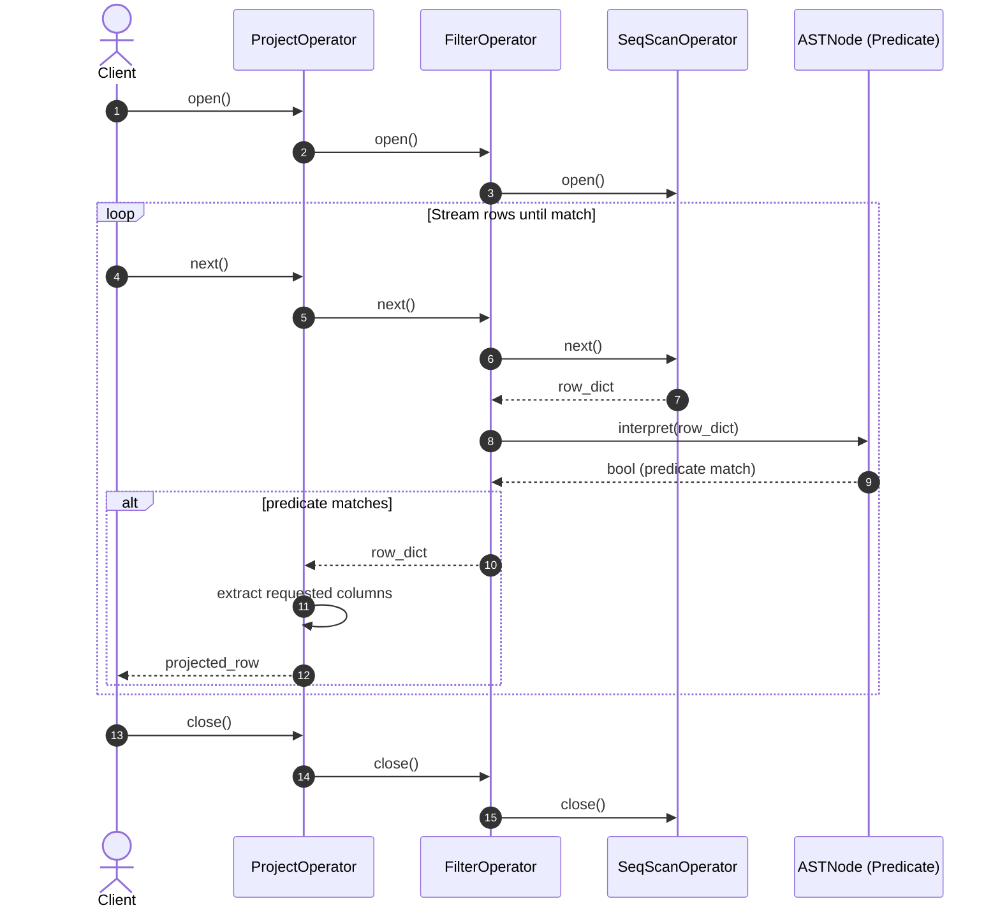
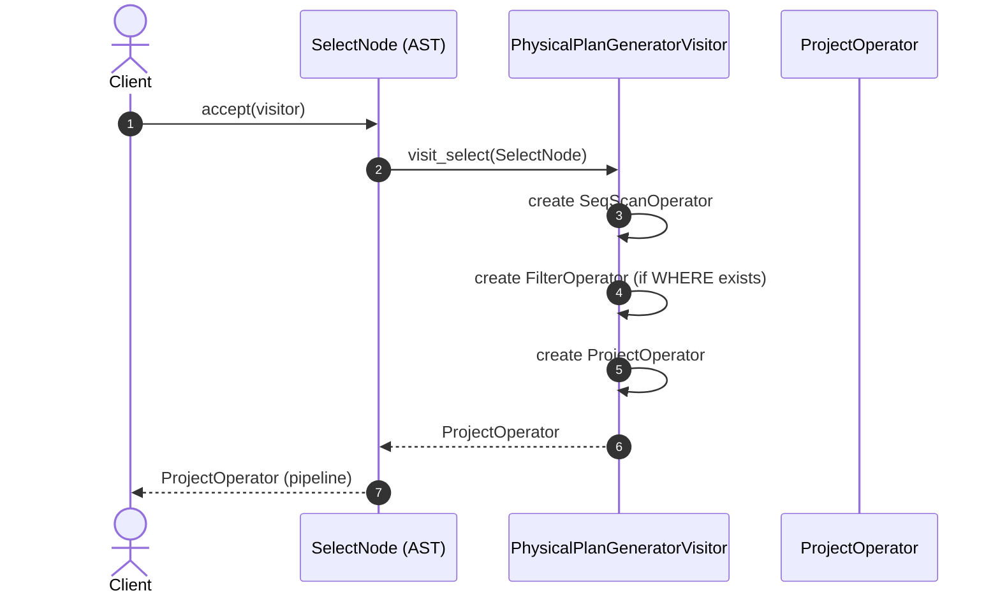
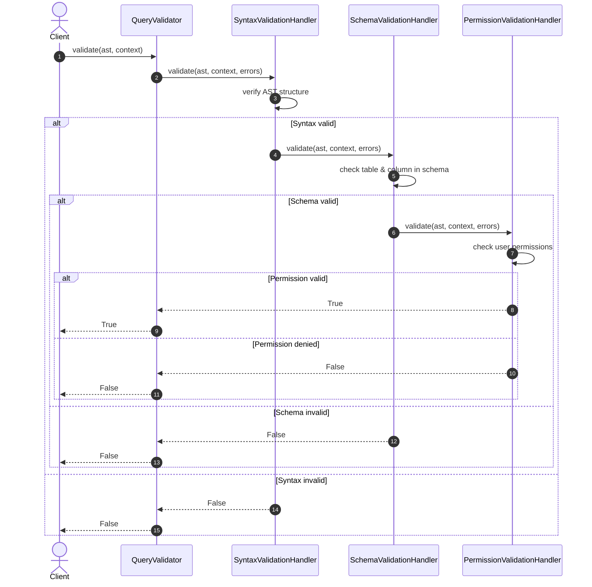
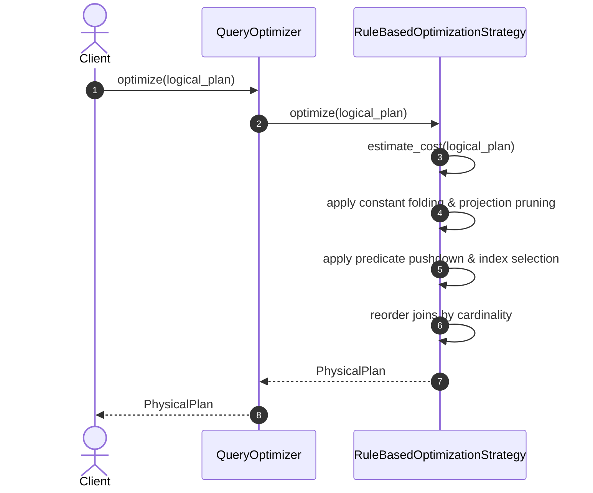
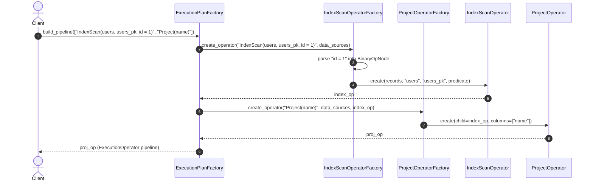
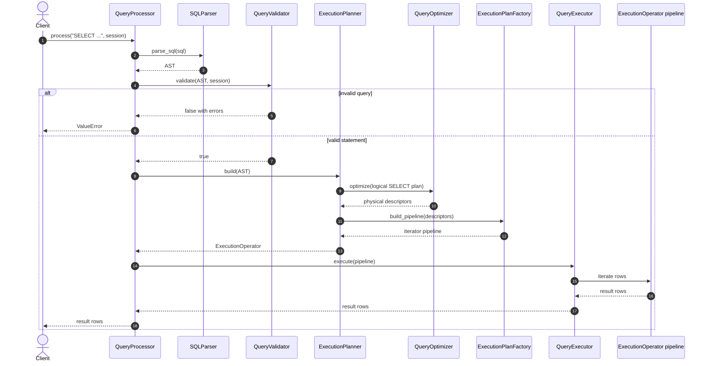

# Query Processing - Applied Design Patterns Sequence Diagrams

This document contains the sequence diagrams detailing the Design Patterns applied to the **Query Processing** core module.

---

## 1. Interpreter Pattern (SQL Parsing)

Converts a raw SQL string into tokens via `Lexer`, parses tokens into an `AST` via `SQLParser`, and evaluates expressions dynamically against row data using `interpret(context)`.

```mermaid
sequenceDiagram
    autonumber
    actor Client
    participant Parser as SQLParser
    participant Lexer
    participant AST
    participant Node as SelectNode/BinaryOpNode

    Client->>Parser: parse_sql("SELECT id, name FROM users WHERE age > 18")
    Parser->>Lexer: tokenize(sql)
    Lexer-->>Parser: tokens: list[Token]
    Parser->>Parser: parse tokens recursively
    Parser->>AST: AST(SelectNode)
    AST-->>Parser: astInstance
    Parser-->>Client: astInstance

    Client->>AST: interpret(context={"age": 25})
    AST->>Node: interpret(context)
    Node-->>AST: True
    AST-->>Client: True
```

The Interpreter pattern separates syntax tokenization, AST construction, and context evaluation into distinct, testable layers.

---

## 2. Iterator Pattern (Execution Operators)

Operators execute in a pull-based Volcano iterator chain (`ProjectOperator -> FilterOperator -> SeqScanOperator`).

```mermaid
sequenceDiagram
    autonumber
    actor Client
    participant Project as ProjectOperator
    participant Filter as FilterOperator
    participant Scan as SeqScanOperator
    participant AST as ASTNode (Predicate)

    Client->>Project: open()
    Project->>Filter: open()
    Filter->>Scan: open()
    
    loop Stream rows until match
        Client->>Project: next()
        Project->>Filter: next()
        Filter->>Scan: next()
        Scan-->>Filter: row_dict
        Filter->>AST: interpret(row_dict)
        AST-->>Filter: bool (predicate match)
        alt predicate matches
            Filter-->>Project: row_dict
            Project->>Project: extract requested columns
            Project-->>Client: projected_row
        end
    end

    Client->>Project: close()
    Project->>Filter: close()
    Filter->>Scan: close()
```

Each operator pulls tuples from its child on demand, avoiding buffering full result sets in memory.

---

## 3. Visitor Pattern (AST Traversal)

`ASTNode.accept(visitor)` dispatches to `ASTVisitor.visit_*()` methods to validate syntax nodes or construct physical execution operator trees.

```mermaid
sequenceDiagram
    autonumber
    actor Client
    participant AST as SelectNode (AST)
    participant Visitor as PhysicalPlanGeneratorVisitor
    participant Pipeline as ProjectOperator

    Client->>AST: accept(visitor)
    AST->>Visitor: visit_select(SelectNode)
    Visitor->>Visitor: create SeqScanOperator
    Visitor->>Visitor: create FilterOperator (if WHERE exists)
    Visitor->>Visitor: create ProjectOperator
    Visitor-->>AST: ProjectOperator
    AST-->>Client: ProjectOperator (pipeline)
```

The double-dispatch mechanism enables new compiler passes (validation, plan generation, optimization) to be added as independent Visitors without altering AST node classes.

---

## 4. Chain of Responsibility Pattern (Query Validation)

`QueryValidator` executes a sequential validation pipeline through linked `ValidationHandler` objects (`SyntaxValidationHandler -> SchemaValidationHandler -> PermissionValidationHandler`).

```mermaid
sequenceDiagram
    autonumber
    actor Client
    participant Validator as QueryValidator
    participant Syntax as SyntaxValidationHandler
    participant Schema as SchemaValidationHandler
    participant Perm as PermissionValidationHandler

    Client->>Validator: validate(ast, context)
    Validator->>Syntax: validate(ast, context, errors)
    Syntax->>Syntax: verify AST structure
    alt Syntax valid
        Syntax->>Schema: validate(ast, context, errors)
        Schema->>Schema: check table & column in schema
        alt Schema valid
            Schema->>Perm: validate(ast, context, errors)
            Perm->>Perm: check user permissions
            alt Permission valid
                Perm-->>Validator: True
                Validator-->>Client: True
            else Permission denied
                Perm-->>Validator: False
                Validator-->>Client: False
            end
        else Schema invalid
            Schema-->>Validator: False
            Validator-->>Client: False
        end
    else Syntax invalid
        Syntax-->>Validator: False
        Validator-->>Client: False
    end
```

The validation chain short-circuits early upon encountering any syntax, schema, or permission error.

---

## 5. Strategy Pattern (Query Optimization)

`QueryOptimizer` delegates plan transformation and cost estimation to an injected `OptimizationStrategy`.

```mermaid
sequenceDiagram
    autonumber
    actor Client
    participant Optimizer as QueryOptimizer
    participant Strategy as RuleBasedOptimizationStrategy

    Client->>Optimizer: optimize(logical_plan)
    Optimizer->>Strategy: optimize(logical_plan)
    Strategy->>Strategy: estimate_cost(logical_plan)
    Strategy->>Strategy: apply constant folding & projection pruning
    Strategy->>Strategy: apply predicate pushdown & index selection
    Strategy->>Strategy: reorder joins by cardinality
    Strategy-->>Optimizer: PhysicalPlan
    Optimizer-->>Client: PhysicalPlan
```

The strategy pattern decouples transformation heuristics from optimizer lifecycle management.

---

## 6. Factory Method (Execution Plan Creation)

`ExecutionPlanFactory` coordinates physical operator creation by dispatching optimizer descriptors to concrete `ExecutionOperatorFactory` subclasses, including `IndexScanOperatorFactory` and `ParallelTableScanOperatorFactory`.

```mermaid
sequenceDiagram
    autonumber
    actor Client
    participant Factory as ExecutionPlanFactory
    participant IndexFac as IndexScanOperatorFactory
    participant ProjFac as ProjectOperatorFactory
    participant IndexOp as IndexScanOperator
    participant ProjOp as ProjectOperator

    Client->>Factory: build_pipeline(["IndexScan(users, users_pk, id = 1)", "Project(name)"])

    Factory->>IndexFac: create_operator("IndexScan(users, users_pk, id = 1)", data_sources)
    IndexFac->>IndexFac: parse "id = 1" into BinaryOpNode
    IndexFac->>IndexOp: create(records, "users", "users_pk", predicate)
    IndexOp-->>Factory: index_op

    Factory->>ProjFac: create_operator("Project(name)", data_sources, index_op)
    ProjFac->>ProjOp: create(child=index_op, columns=["name"])
    ProjOp-->>Factory: proj_op

    Factory-->>Client: proj_op (ExecutionOperator pipeline)
```

The Factory Method pattern hides construction of sequential, index-selected, parallel, filter, and project iterators. The in-memory `IndexScanOperator` preserves index-selected predicate semantics; persistent index lookup remains a Storage Engine concern.

---

## 7. Query Execution Pipeline (In-Memory Session)

`QueryProcessor` runs a fixed parse → validate → optimize/plan → execute flow for `SELECT`, `INSERT`, and `CREATE TABLE` in an in-memory session. It is not another Chain of Responsibility because the stages do not choose whether to delegate to alternate handlers; each successful stage supplies the next stage's input.

```mermaid
sequenceDiagram
    autonumber
    actor Client
    participant Processor as QueryProcessor
    participant Parser as SQLParser
    participant Validator as QueryValidator
    participant Planner as ExecutionPlanner
    participant Optimizer as QueryOptimizer
    participant Factory as ExecutionPlanFactory
    participant Executor as QueryExecutor
    participant Pipeline as ExecutionOperator pipeline

    Client->>Processor: process("SELECT ...", session)
    Processor->>Parser: parse_sql(sql)
    Parser-->>Processor: AST
    Processor->>Validator: validate(AST, session)

    alt invalid query
        Validator-->>Processor: false with errors
        Processor-->>Client: ValueError
    else valid statement
        Validator-->>Processor: true
        Processor->>Planner: build(AST)
        Planner->>Optimizer: optimize(logical SELECT plan)
        Optimizer-->>Planner: physical descriptors
        Planner->>Factory: build_pipeline(descriptors)
        Factory-->>Planner: iterator pipeline
        Planner-->>Processor: ExecutionOperator
        Processor->>Executor: execute(pipeline)
        Executor->>Pipeline: iterate rows
        Pipeline-->>Executor: result rows
        Executor-->>Processor: result rows
        Processor-->>Client: result rows
    end
```

For `CREATE TABLE` and `INSERT`, `ExecutionPlanner` returns a `MutationOperator`; `QueryExecutor` applies it to session `schema_catalog` and `data_sources`. Persistence and physical storage/index work remain out of scope.

