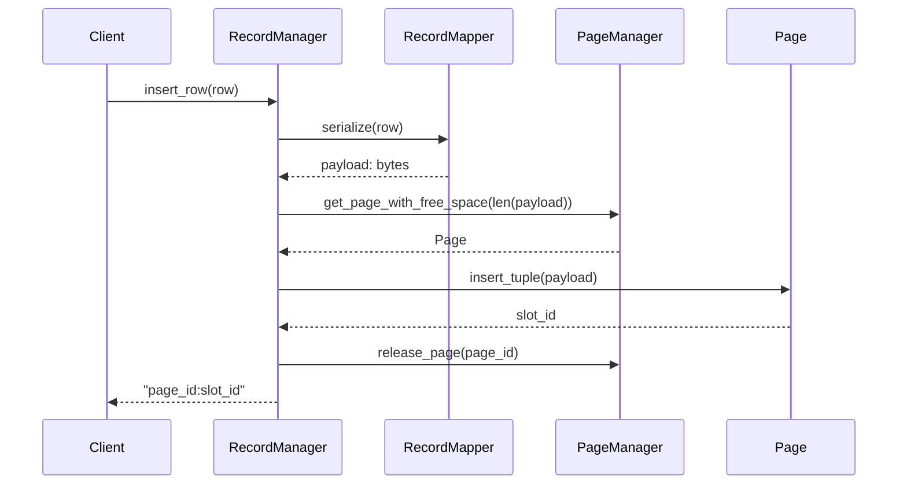
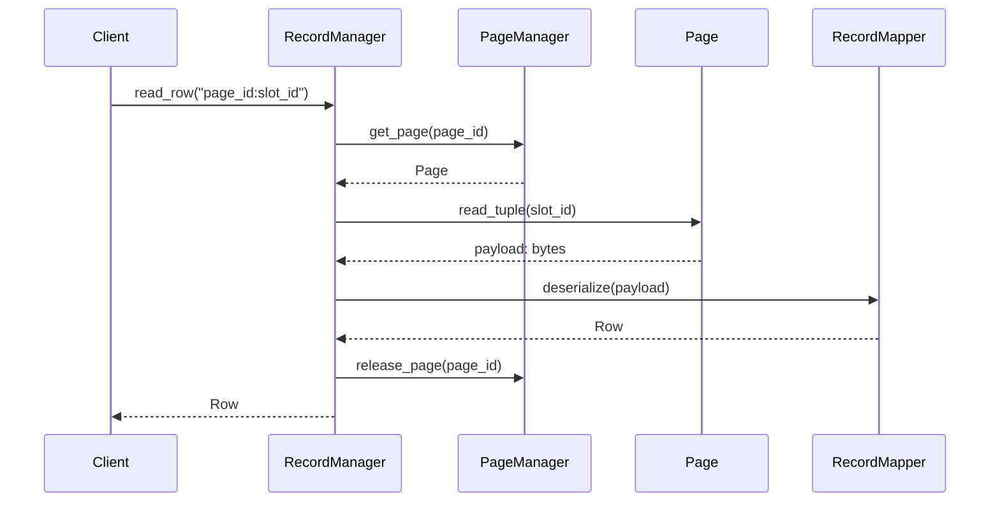

# Storage Engine - Design Pattern Sequences

## 1. Data Mapper (Record Read/Write)

`RecordMapper` converts between the database-object `Row` and a storage `Record` byte payload. `RecordManager` owns page-slot locations and releases the page after each operation.

### Insert a row

### Read a row

If a page or slot does not exist, `RecordManager` raises `RecordNotFoundError`. This implementation has no disk I/O yet; `FileManager` and `BufferPool` are separate planned work.
