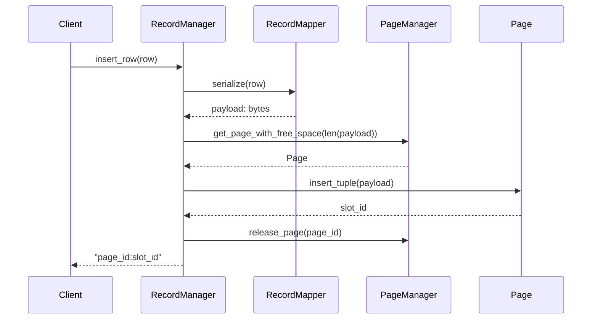
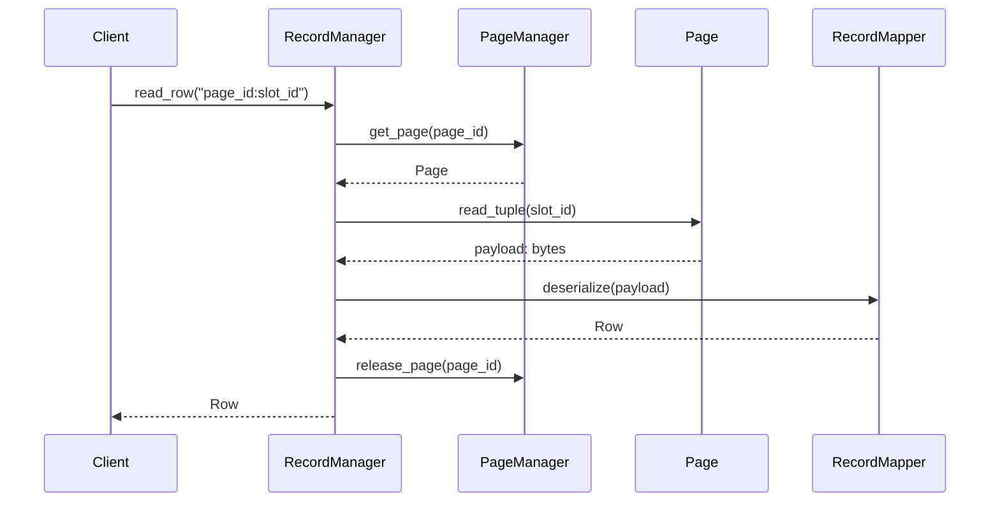
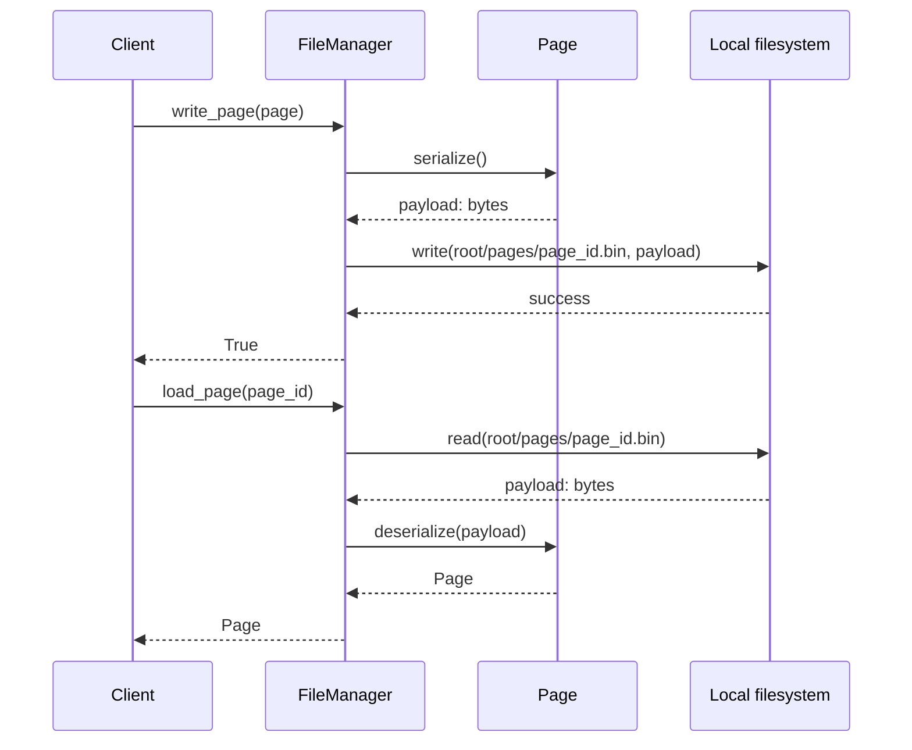
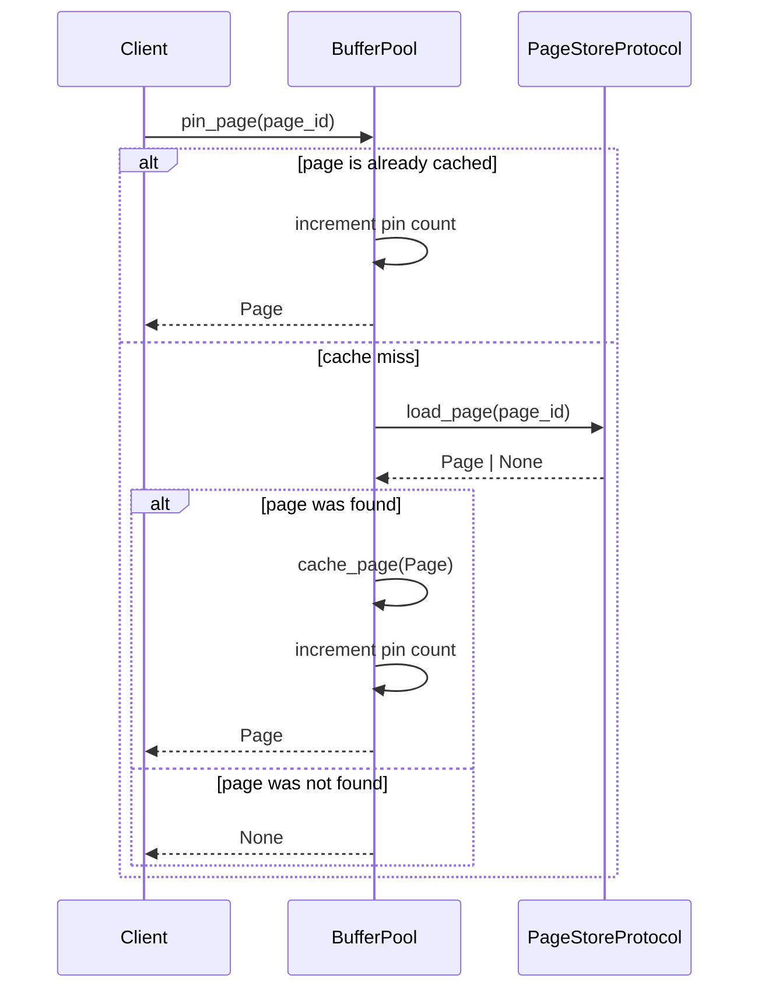
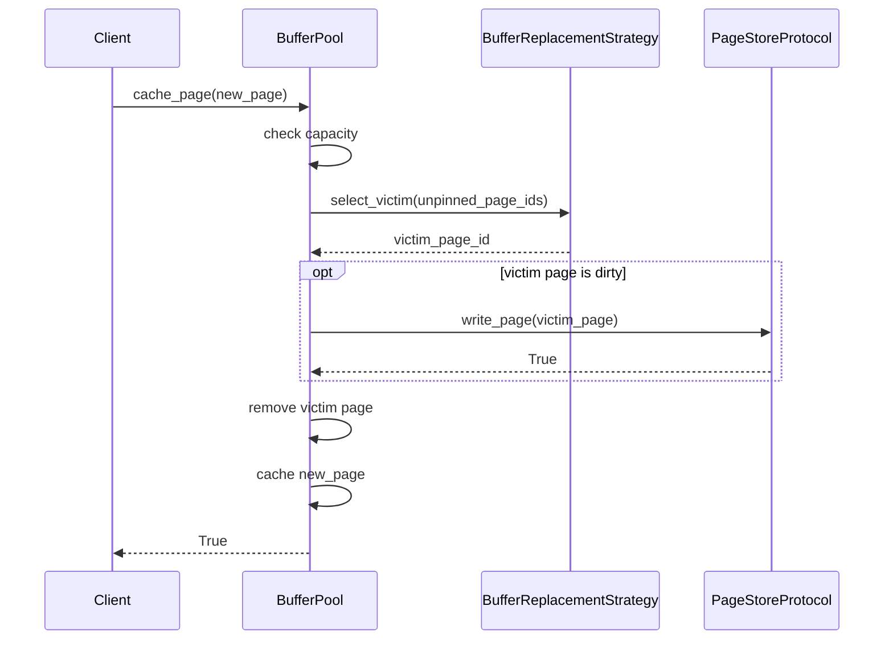

# Storage Engine - Design Pattern Sequences

## 1. Data Mapper (Record Read/Write)

`RecordMapper` converts between the database-object `Row` and a storage `Record` byte payload. `RecordManager` owns page-slot locations and releases the page after each operation.

### Insert a row

### Read a row

If a page or slot does not exist, `RecordManager` raises `RecordNotFoundError`. `PageManager` still owns in-memory pages; it is not yet connected to the File Access adapter.

---

## 2. Adapter (File Access)

`FileManager` wraps filesystem paths and binary file access behind root-relative DBMS methods. The same adapter implements `PageStoreProtocol` for storing complete serialized pages.

### Write and load a page

Paths that resolve outside `root_path` raise `StoragePathError`. Buffer Pool and Storage Engine will consume this `PageStoreProtocol` in later patterns.

---

## 3. Proxy (Page Loading)

`BufferPool` controls access to a `PageStoreProtocol`. A cached page is returned directly; a cache miss calls the store and adds the loaded page to the pool before returning it.

`FileManager` is one implementation of `PageStoreProtocol`. A page must be unpinned before the pool can select it for eviction.

---

## 4. Strategy (Buffer Replacement)

`BufferPool` supplies only unpinned page ids to `BufferReplacementStrategy`. FIFO is the default; LRU can be injected to use access order instead.

If every cached page is pinned, `cache_page()` raises `BufferPoolFullError`. If writing a dirty victim fails, the victim remains cached and the new page is not added.
